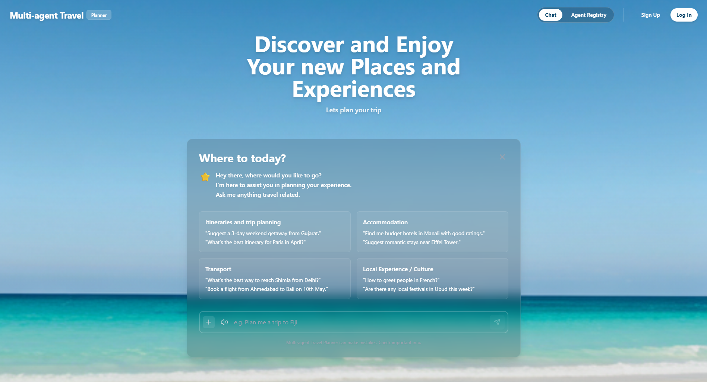
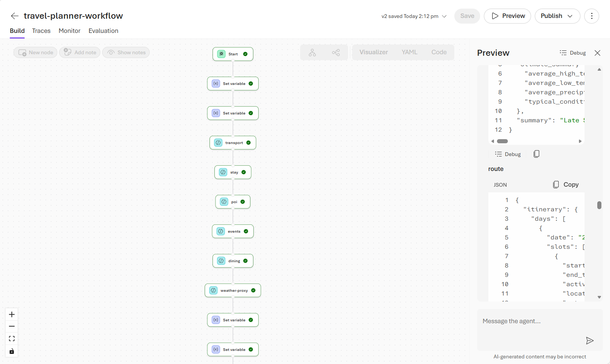
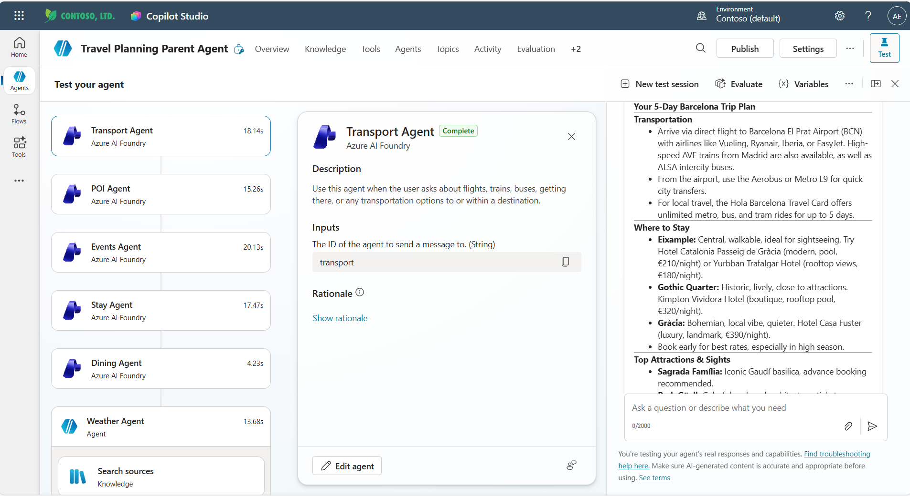

# Multi-Agent Travel Planner

A travel planning system built with multiple AI agents across the Microsoft ecosystem. The repo contains two tracks: an **A2A multi-agent system** (`src/`) and an **agent platform interoperability** layer (`interoperability/`) that adapts the same agents for cross-platform deployment.

## Agent Services & Frameworks

This project combines three agent technologies, each chosen for a specific role:

| Technology | What it is | Where it's used | Why |
|------------|-----------|-----------------|-----|
| **[Microsoft Agent Framework](https://github.com/microsoft/agents)** (open-source) | A code-first Python framework for building AI agents with tools, structured output, and session management | [`src/agents/`](src/agents) — 11 specialized **working agents** (transport, stay, dining, events, POI, route, budget, booking, aggregator, validator, intake clarifier) | Lightweight and portable — agent logic can be wrapped with any communication protocol (here, A2A) and redeployed to other platforms without rewriting |
| **[Microsoft Foundry Classic (Foundry v1) — Agent Service](https://learn.microsoft.com/en-us/azure/ai-foundry/agents/overview?view=foundry-classic)** (GA) | A fully managed Azure service for hosting pre-provisioned AI agents with server-side thread and tool-call management | [`infrastructure/azure_agent_setup.py`](infrastructure/azure_agent_setup.py) + [`src/orchestrator/`](src/orchestrator) — 4 **orchestrator agents** (router, classifier, planner, QA) | Provides managed state (threads, runs) and built-in tool orchestration, ideal for the stateful routing decisions that coordinate the working agents |
| **[Microsoft Foundry New (Foundry v2) — Agent Service](https://learn.microsoft.com/en-us/azure/ai-foundry/agents/overview?view=foundry)** (preview) | Next-generation Foundry platform supporting native and hosted agent deployments | [`interoperability/foundry/`](interoperability/foundry) — adaptors that convert the Agent Framework agents into **Foundry v2 native agents** | Enables cross-platform interoperability — the same agent logic deployed as Foundry-native agents can integrate with Copilot Studio and other Microsoft surfaces |

**How they connect:**

1. **Build** — Working agents are authored once in Microsoft Agent Framework and exposed via the [A2A protocol](https://github.com/google/A2A) (`src/`)
2. **Orchestrate** — A Foundry Classic (v1) Agent Service orchestrator routes user requests to these working agents
3. **Interoperate** — The interoperability layer (`interoperability/`) adapts the same Agent Framework agents into Foundry New (v2) native agents, enabling cross-platform scenarios with Copilot Studio and other Microsoft surfaces

## Track 1: A2A Multi-Agent System (`src/`)

A distributed multi-agent system using the Microsoft Agent Framework, A2A Protocol, and LLM-driven orchestration. 11 specialized microservices (transport, stay, dining, events, POI, route, budget, booking, aggregator, validator, intake clarifier) are coordinated by an orchestrator with parallel discovery, human-in-the-loop approval, and full session lifecycle support.

See [`src/README.md`](src/README.md) for architecture, setup, and usage.

Web UI Demo:

## Track 2: Agent Platform Interoperability (`interoperability/`)

Demonstrates cross-platform agent interoperability between **Microsoft Foundry**, **Copilot Studio**, and **Pro Code** — reusing agent logic from the A2A system in Track 1.

| Demo | Direction | Status |
|------|-----------|--------|
| Demo 1 | Foundry workflow → Copilot Studio (Weather Agent via proxy) | Stable |
| Demo 2 | Copilot Studio → Foundry agents (via Add Agents) | Stable |
| Demo 3 | Pro Code orchestrator → Copilot Studio | In Progress |

See [`interoperability/README.md`](interoperability/README.md) for demo flows and setup instructions.

Demo 1:

Demo 2:

## Repository Structure

| Directory | Description |
|-----------|-------------|
| `src/` | A2A agent implementations (Microsoft Agent Framework), orchestrator (Foundry Classic / v1 Agent Service), and shared utilities |
| `interoperability/` | Foundry New (v2) Agent Service adaptors, Copilot Studio config, deployment scripts |
| `tests/` | Unit and integration tests for both tracks |
| `scripts/` | Provisioning scripts (e.g. `provision_azure_agents.py`) |
| `infrastructure/` | Azure resource setup (Cosmos DB, Azure Agent Service) |
| `docs/` | Design documents and architecture references |
