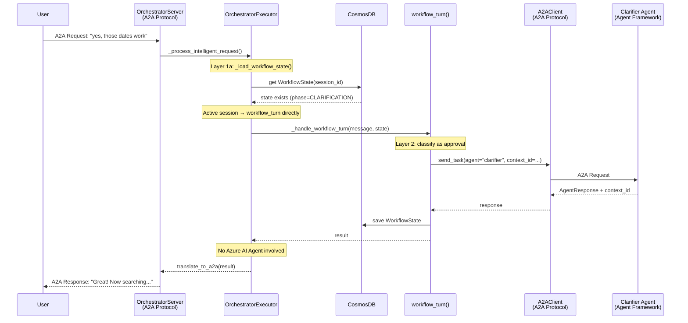
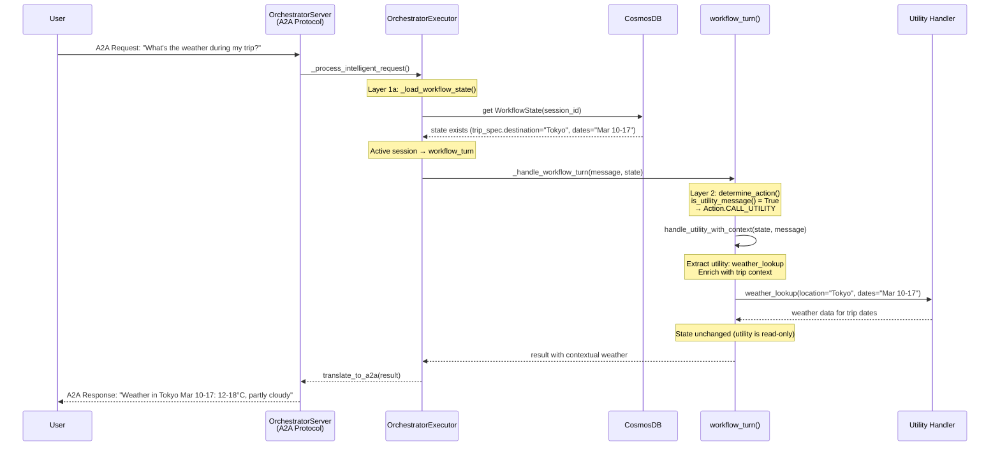
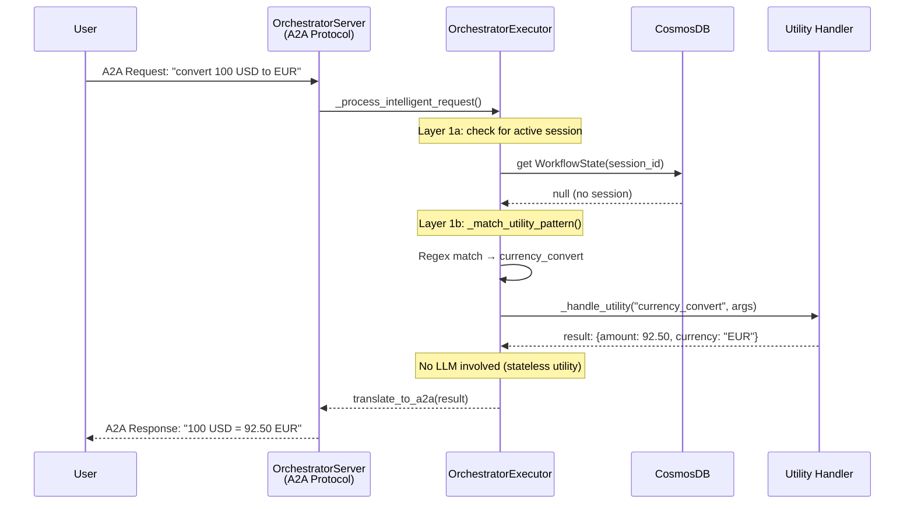
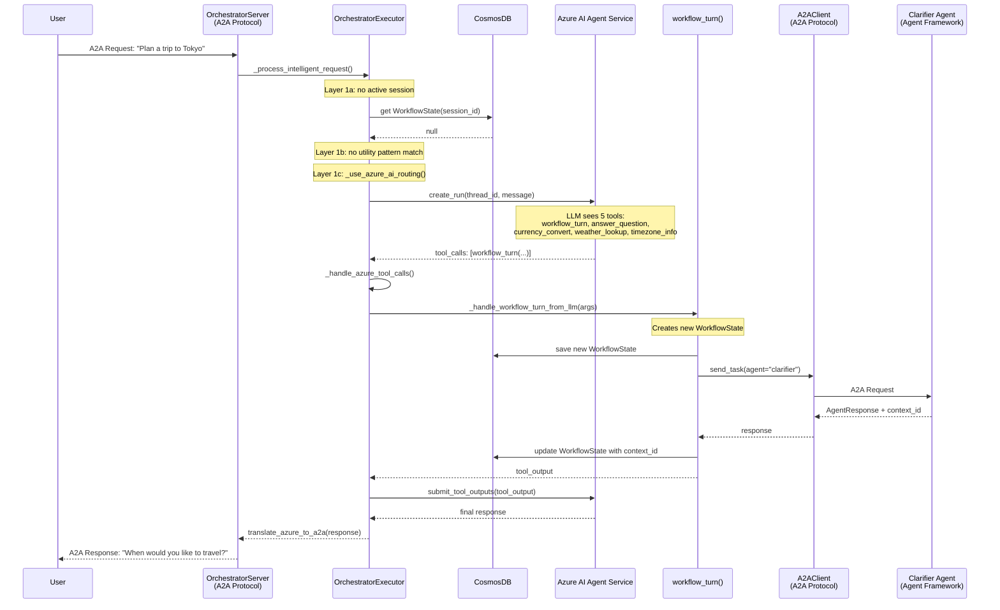
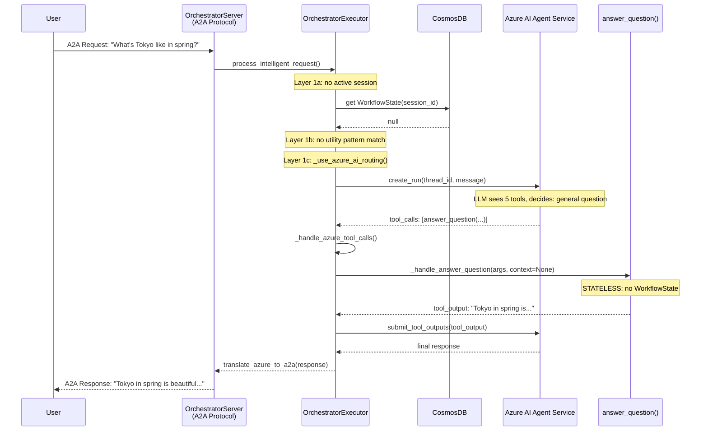
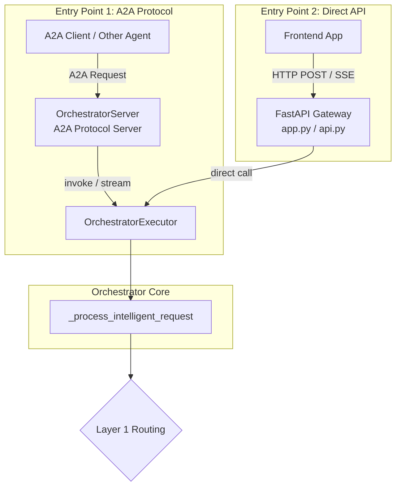
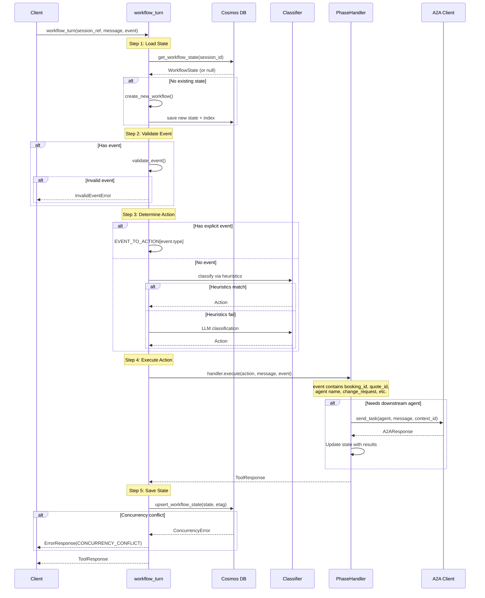

# Orchestrator Design

## Status: Implemented

This document captures the design for the Orchestrator agent in the multi-agent travel planner.

---

## Table of Contents

1. [Overview](#overview) - Architecture and core responsibilities
2. [Design Principles](#design-principles) - Guiding principles for the design
3. [Tool Definitions](#tool-definitions-7-tools) - The 7 tools available to the orchestrator
4. [Routing Flow](#routing-flow) - How requests are routed to tools
5. [workflow_turn Internal Implementation](#workflow_turn-internal-implementation) - Detailed implementation of the core workflow handler
6. [Data Stores](#data-stores) - All data structures and their relationships
7. [Three-Phase Workflow](#three-phase-workflow) - Clarification → Discovery+Planning → Booking
8. [State Gating at Checkpoints](#state-gating-at-checkpoints) - Valid events per checkpoint
9. [Booking Safety](#booking-safety-critical) - Independent bookings, quote-based confirmation (booking_id + quote_id)
10. [Modification Handling](#modification-handling) - Re-running agents, partial discovery, failure handling
11. [Long-Running Operations](#long-running-operations) - Background jobs, streaming progress, timeouts
12. [Examples](#examples) - Detailed walkthroughs with sequence diagrams
13. [Session Management](#session-management) - ID generation, resumption, storage (Cosmos DB)
14. [Agent Communication](#agent-communication) - A2A context handling and responses
15. [Response Formats](#response-formats) - Standard response envelope
16. [Integration Testing](#integration-testing) - Hybrid approach: Tier 1 mock tests (every ticket), Tier 2 live tests (phase milestones). Full details are included in this document.
17. [Ticket Template](#ticket-template) - Implementation ticket format with design doc references. Full details are included in this document.
18. [Critical Considerations](#critical-considerations) - Must implement vs acceptable trade-offs
19. [Next Steps](#next-steps) - Implementation roadmap

---

## Overview

The Orchestrator is the central brain of the multi-agent travel planner. It has two core responsibilities:

1. **A2A Client**: Establishes connections with downstream agents (extensible registry)
2. **LLM-Based Router**: Routes user requests to appropriate tools/workflows

### Architecture Pattern

**Three Distinct Layers**

The system uses three distinct technologies that must be clearly distinguished:

| Layer | What It Is | Role |
|-------|-----------|------|
| **A2A Protocol** | Communication standard | Transport layer - how agents talk to each other |
| **Agent Framework** | OSS SDK (`ChatAgent`, `get_new_thread()`) | LLM processing for domain agents |
| **Azure AI Agent Service** | Managed SDK (`AgentsClient`, `threads.create()`) | LLM processing for orchestrator |

**How each component uses these layers:**

| Component | A2A Protocol | LLM SDK |
|-----------|-------------|---------|
| **Orchestrator** | Server (receives from frontend) + Client (sends to downstream) | Azure AI Agent Service |
| **Domain Agents** | Server (receives from orchestrator) | Agent Framework |

```
┌─────────────────────────────────────────────────────────────────┐
│                    Orchestrator Agent                            │
│                                                                  │
│  ┌───────────────────────────────────────────────────────────┐  │
│  │  A2A Protocol Layer                                       │  │
│  │  - A2A Server: receives requests from frontend            │  │
│  │  - A2A Client: sends requests to downstream agents        │  │
│  │  - Extensible AgentRegistry for new agents                │  │
│  └───────────────────────────────────────────────────────────┘  │
│                              │                                   │
│  ┌───────────────────────────────────────────────────────────┐  │
│  │  Azure AI Agent Service (LLM Router)                      │  │
│  │  - LLM with 2 routing tools (7 tools total in system)     │  │
│  │  - Auto-persisted threads (managed storage)               │  │
│  │  - Centralized observability for all LLM calls            │  │
│  └───────────────────────────────────────────────────────────┘  │
└─────────────────────────────────────────────────────────────────┘
```

**Why Azure AI Agent Service for Orchestrator (not Agent Framework)?**

1. **Centralized LLM observability**: All orchestrator LLM calls go through Azure AI Agent Service, providing a single place to monitor, trace, and debug the routing decisions.

2. **Auto-persisted thread for debugging**: Threads are automatically persisted - developers can inspect routing decision history without manual logging.

3. **Demonstrates hybrid architecture**: Shows that Azure AI Agent Service and Agent Framework can coexist in the same system, each used where most appropriate.

**LLM SDK Comparison**

| Aspect | Agent Framework (Domain Agents) | Azure AI Agent Service (Orchestrator) |
|--------|--------------------------------|--------------------------------------|
| Thread creation | `agent.get_new_thread(thread_id=...)` | `agents_client.threads.create()` |
| Thread storage | Manual via `session_threads` dict | Auto-persisted (managed) |
| Invocation | `agent.run(messages=..., thread=...)` | `runs.create(thread_id=..., agent_id=...)` + poll |
| Message history | Manual management | Automatic in thread |
| Use case | Stateless domain operations | Routing with observability |

### Azure AI Thread Lifecycle (Observability, Not Accuracy)

**Key insight**: The Azure AI Agent thread is for **observability/debugging**, not for improving routing accuracy.

**Why thread history doesn't improve routing:**

| Routing Layer | Uses LLM? | Benefits from thread history? |
|---------------|-----------|------------------------------|
| Layer 1a (regex utilities) | No | N/A |
| Layer 1b (active session) | No | N/A |
| Layer 1c (LLM decides) | Yes | Minimal - only for cold-start, no active session |

When Layer 1c is invoked, there's **no active WorkflowState** by definition. The user is either starting fresh or asking a standalone question. Thread history of previous routing decisions adds minimal value.

**Business context lives in WorkflowState**, not in Azure thread. For session resumption, we inject WorkflowState summary into the routing prompt - not thread history.

**Thread handling strategy: Per-agent threads with graceful recovery**

```python
def _ensure_thread_exists(self, session_id: str, agent_type: str) -> str:
    """
    Get existing thread or create new one for this session/agent_type.
    Each agent type gets its own thread to avoid cross-contamination.
    Thread is for observability, not routing accuracy.
    Gracefully handles expired threads (Azure TTL).
    """
    if session_id not in self.session_threads:
        self.session_threads[session_id] = {}

    agent_threads = self.session_threads[session_id]

    if agent_type in agent_threads:
        try:
            # Verify thread still exists in Azure
            self.agents_client.threads.get(agent_threads[agent_type])
            return agent_threads[agent_type]
        except NotFoundError:
            # Thread expired - that's OK, create new one
            logger.info(f"Thread expired for {session_id}/{agent_type}, creating new")

    # Create new thread with metadata for debugging
    thread = self.agents_client.threads.create(
        metadata={"session_id": session_id, "agent_type": agent_type}
    )
    agent_threads[agent_type] = thread.id
    return thread.id
```

**Lifecycle comparison:**

| System | TTL | On Expiry | Impact |
|--------|-----|-----------|--------|
| **Azure AI Thread** | Azure-managed (may expire) | Create new thread | None - observability only |
| **WorkflowState** | 7 days (Cosmos DB) | Consultation lost | Read-only via utilities; new booking/modifications require new consultation |
| **A2A context_id** | Agent-managed | Downstream agent creates new | Minor - may re-ask questions |

**No TTL alignment needed**: Because the Azure thread is ephemeral and doesn't affect routing accuracy, we don't need to align TTLs. Thread expiry is gracefully handled by creating a new one.

> **Post-7-day behavior**: When WorkflowState expires (7 days of inactivity), the user loses active planning and booking capability. Read-only access to approved itineraries and completed bookings remains available via the `get_booking` and `get_consultation` utility tools. The `get_consultation` tool reads from the `consultation_summaries` container (TTL: trip_end + 30 days), which stores a durable snapshot of itinerary IDs, booking IDs, and trip spec summary—enabling O(1) lookup without needing the expired WorkflowState or consultation_index. To book remaining items or modify an expired consultation, the user must start a new planning session.
>
> **Implication for booking**: Users should complete all bookings within 7 days of their last interaction. This is acceptable for MVP since most users book shortly after planning. Future enhancement: implement "booking-only mode" that reconstructs minimal state from Booking records.

### Message Flow: A2A ↔ Azure AI Agent Boundaries

The orchestrator bridges A2A protocol and Azure AI Agent Service. The message flow depends on which Layer 1 path is taken.

#### Sequence Diagram: Layer 1a - Active Session (No LLM)



#### Sequence Diagram: Layer 1a → Layer 2 - Utility WITH Context



#### Sequence Diagram: Layer 1b - Utility Pattern (No LLM, No Session)



#### Sequence Diagram: Layer 1c - LLM Routing (New Session)



#### Sequence Diagram: Layer 1c - answer_question (No State)



**A2A ↔ Azure AI Bridge Points (4 boundaries):**

| # | Boundary | What it does | Owner |
|---|----------|--------------|-------|
| 1 | A2A Request → Azure AI | Extract message/session, format for `runs.create()` + poll | `a2a_azure_bridge/inbound.py` |
| 2 | Tool handler → A2A Client | Convert tool args to A2A request format | `a2a_azure_bridge/outbound.py` |
| 3 | A2A Response → Tool output | Convert downstream AgentResponse to string for Azure AI | `a2a_azure_bridge/outbound.py` |
| 4 | Azure AI response → A2A Response | Wrap final response in A2A envelope | `a2a_azure_bridge/inbound.py` |

### Two Entry Points to Orchestrator

The orchestrator can be accessed via two entry points, both converging to `_process_intelligent_request()`:



**Entry Point 1: A2A Protocol (agent-to-agent)**
- Used when another A2A-compliant agent/client sends requests
- Request/response follows A2A protocol specification
- Entry: `OrchestratorServer` → `OrchestratorExecutor.invoke()` or `.stream()`

```python
# Entry Point 1: A2A Protocol (src/orchestrator/server.py)
from src.shared.a2a.base_server import BaseA2AServer
from src.shared.a2a.types import AgentCard, AgentSkill

class OrchestratorServer(BaseA2AServer):
    """A2A server interface for the orchestrator."""

    def build_agent_executor(self) -> "OrchestratorExecutor":
        return OrchestratorExecutor()

    def build_agent_card(self) -> AgentCard:
        return AgentCard(
            name="Travel Planner Orchestrator",
            description="Central orchestrator for multi-agent travel planning",
            skills=[
                AgentSkill(
                    id="plan_trip",
                    name="Plan Trip",
                    description="Start or continue a trip planning workflow",
                ),
                AgentSkill(
                    id="answer_travel_question",
                    name="Answer Travel Question",
                    description="Answer travel-related questions with or without context",
                ),
                AgentSkill(
                    id="convert_currency",
                    name="Convert Currency",
                    description="Convert amounts between currencies",
                ),
                AgentSkill(
                    id="lookup_weather",
                    name="Lookup Weather",
                    description="Get weather forecast for a location",
                ),
                AgentSkill(
                    id="lookup_timezone",
                    name="Lookup Timezone",
                    description="Get timezone information for a location",
                ),
                AgentSkill(
                    id="get_booking",
                    name="Get Booking",
                    description="Retrieve booking details by booking_id",
                ),
                AgentSkill(
                    id="get_consultation",
                    name="Get Consultation",
                    description="Retrieve consultation details by consultation_id",
                ),
            ],
        )
```

```python
# Entry Point 1: A2A Executor (src/orchestrator/executor.py)
# Note: Imports shown as pseudocode; actual paths may vary by project structure
from shared.a2a.base_agent_executor import BaseA2AAgentExecutor
from shared.a2a.types import A2ARequest, A2AResponse

class OrchestratorExecutor(BaseA2AAgentExecutor):
    """Bridges A2A protocol with Azure AI Agent Service."""

    def __init__(self):
        # Azure AI Agent for intelligent routing
        self.llm = OrchestratorLLM()
        # A2A client for downstream agent calls
        self.a2a_client = A2AClient(registry=AgentRegistry.load())

    async def invoke(self, request: A2ARequest) -> A2AResponse:
        """Handle synchronous A2A requests."""
        result = await self._process_intelligent_request(
            message=request.message,
            session_id=request.session_id,
        )
        return self._to_a2a_response(result)

    async def stream(self, request: A2ARequest) -> AsyncIterable[A2AResponse]:
        """Handle streaming A2A requests."""
        async for chunk in self._process_intelligent_request_stream(
            message=request.message,
            session_id=request.session_id,
        ):
            yield self._to_a2a_response(chunk)

    async def _process_intelligent_request(self, message: str, session_id: str):
        """Core logic - shared by both A2A and Direct API entry points."""
        # Layer 1 routing logic (see Routing Flow section)
        ...
```

**Entry Point 2: Direct API (frontend)**
- Used when frontend calls orchestrator directly
- Simpler request/response format (not full A2A protocol)
- Entry: FastAPI route → `OrchestratorExecutor._process_intelligent_request()`
- Supports SSE streaming for real-time updates

```python
# Entry Point 2: Direct API (app.py or api.py)
from fastapi import FastAPI
from fastapi.responses import StreamingResponse

app = FastAPI()

# Shared executor instance
executor = OrchestratorExecutor()

@app.post("/chat")
async def chat(request: ChatRequest) -> ChatResponse:
    """Synchronous chat endpoint."""
    result = await executor._process_intelligent_request(
        message=request.message,
        session_id=request.session_id,
    )
    return ChatResponse(
        message=result.message,
        session_id=result.session_id,
        consultation_id=result.consultation_id,
    )

@app.get("/chat/stream")
async def chat_stream(message: str, session_id: str):
    """SSE streaming endpoint for real-time updates."""
    async def event_generator():
        async for chunk in executor._process_intelligent_request_stream(
            message=message,
            session_id=session_id,
        ):
            yield f"data: {chunk.model_dump_json()}\n\n"

    return StreamingResponse(
        event_generator(),
        media_type="text/event-stream",
    )
```

**Request/Response Format Comparison:**

| Aspect | A2A Protocol (Entry 1) | Direct API (Entry 2) |
|--------|----------------------|---------------------|
| Request format | Full A2A envelope | Simple `{message, session_id}` |
| Response format | A2A Response with context_id | Simple `{message, session_id, consultation_id}` |
| Streaming | A2A streaming protocol | SSE (Server-Sent Events) |
| Use case | Agent-to-agent | Frontend-to-orchestrator |

### Module Structure

**Canonical Paths** (maps to existing repo structure):

| Design Reference | Actual Repo Path | Status |
|------------------|------------------|--------|
| `a2a.server` / `a2a.types` | `src/shared/a2a/` | Existing |
| `BaseA2AServer` | `src/shared/a2a/base_server.py` | Existing |
| `BaseA2AAgentExecutor` | `src/shared/a2a/base_agent_executor.py` | Existing |
| `A2AClientWrapper` | `src/shared/a2a/client_wrapper.py` | Existing |
| Orchestrator module | `src/orchestrator/` | New (to be created) |

```
src/
├── orchestrator/                # NEW: Orchestrator agent (this design)
│   ├── server.py                # A2A Protocol - Server (Entry Point 1)
│   ├── api/
│   │   └── app.py               # FastAPI gateway (Entry Point 2)
│   ├── executor.py              # OrchestratorExecutor - orchestrates the flow
│   │
│   └── agent/
│       ├── llm.py               # Azure AI Agent Service wrapper
│       └── tools/               # Tool handlers (called by Azure AI Agent)
│           ├── workflow_turn.py
│           ├── answer_question.py
│           └── utilities.py     # currency, weather, timezone
│
├── shared/
│   ├── a2a/                     # A2A Protocol (EXISTING module)
│   │   ├── __init__.py
│   │   ├── client_wrapper.py    # A2AClientWrapper class
│   │   ├── base_agent_executor.py  # BaseA2AAgentExecutor
│   │   └── base_server.py       # BaseA2AServer
│   │
│   └── a2a_azure_bridge/        # NEW: Bridges A2A ↔ Azure AI Agent Service
│       ├── inbound.py           # A2A Request → Azure AI, Azure AI → A2A Response
│       └── outbound.py          # Tool args → A2A Request, AgentResponse → Tool output
│
└── agents/                      # EXISTING: Domain agents
    ├── intake_clarifier_agent/
    ├── stay_agent/
    ├── transport_agent/
    └── ...
```

**Module responsibilities:**
- `src/orchestrator/api/app.py` provides direct FastAPI access for frontend (Entry Point 2)
- `src/orchestrator/server.py` provides A2A protocol access (Entry Point 1)
- `src/shared/a2a_azure_bridge/` owns ALL format conversion between A2A and Azure AI Agent
- `src/shared/a2a/` is pure A2A protocol - knows nothing about Azure AI Agent (existing module)
- `src/orchestrator/agent/` is pure Azure AI Agent Service - knows nothing about A2A protocol

### A2A Client Implementation

The orchestrator uses `A2AClient` to communicate with downstream agents. Key features:
- **Context management**: Pass existing `context_id` for multi-turn, receive new `context_id` from response
- **Streaming support**: `stream_task()` for long-running operations
- **Registry-based routing**: Look up agent URLs from configuration

```python
# src/shared/a2a/registry.py (new file in existing module)
from pydantic import BaseModel

class AgentConfig(BaseModel):
    name: str
    url: str
    timeout: float = 120.0  # Default 2 minutes

class AgentRegistry:
    """Registry of downstream agents and their endpoints."""

    def __init__(self, agents: dict[str, AgentConfig]):
        self.agents = agents

    @classmethod
    def load(cls, config_path: str = "config/agents.yaml") -> "AgentRegistry":
        """Load registry from config file."""
        # In production, load from YAML/env vars
        # For now, return default development config
        # Discovery agents (Phase 2 - parallel search)
        # Planning agents (Phase 2 - sequential pipeline)
        return cls(agents={
            # Phase 1: Clarification
            "clarifier": AgentConfig(name="clarifier", url="http://localhost:8001"),

            # Phase 2a: Discovery (parallel)
            "transport": AgentConfig(name="transport", url="http://localhost:8002"),  # Flights, trains, etc.
            "stay": AgentConfig(name="stay", url="http://localhost:8003"),            # Hotels, Airbnb, etc.
            "poi": AgentConfig(name="poi", url="http://localhost:8004"),              # Points of interest
            "events": AgentConfig(name="events", url="http://localhost:8005"),        # Local events
            "dining": AgentConfig(name="dining", url="http://localhost:8006"),        # Restaurants

            # Phase 2b: Planning (sequential pipeline)
            "aggregator": AgentConfig(name="aggregator", url="http://localhost:8010"),
            "budget": AgentConfig(name="budget", url="http://localhost:8011"),
            "route": AgentConfig(name="route", url="http://localhost:8012"),
            "validator": AgentConfig(name="validator", url="http://localhost:8013"),
        })

    def get(self, agent_name: str) -> AgentConfig:
        if agent_name not in self.agents:
            raise ValueError(f"Unknown agent: {agent_name}")
        return self.agents[agent_name]

# Agent group constants (used throughout the codebase)
DISCOVERY_AGENTS = ["transport", "stay", "poi", "events", "dining"]
PLANNING_AGENTS = ["aggregator", "budget", "route", "validator"]
```

```python
# src/shared/a2a/client_wrapper.py (extend existing file)
# Note: This pseudocode illustrates the conceptual contract.
# The existing client_wrapper.py already handles most of this correctly.
import uuid
import httpx
from dataclasses import dataclass
from typing import AsyncIterable

@dataclass
class A2AResponse:
    """Response from a downstream agent."""
    status: str              # "in_progress" | "completed" | "failed" | "input_required"
    message: str             # Message content for user
    data: dict | None        # Structured data (e.g., flight options)
    context_id: str | None   # Context ID for multi-turn (MUST store this)
    task_id: str | None      # Task ID for continuing in-progress tasks (MUST store this)
    is_task_complete: bool   # True if agent has completed its task (no more turns needed)
    requires_input: bool = False  # True if agent needs more user input

class A2AClient:
    """
    Client for communicating with downstream A2A agents.
    Handles context_id and task_id for multi-turn conversations.

    Note: This pseudocode illustrates the conceptual contract. Actual implementation
    should follow the latest A2A SDK patterns and best practices (e.g., using
    A2AClient from the a2a package, proper streaming handlers, etc.).
    """

    def __init__(self, registry: AgentRegistry):
        self.registry = registry
        self.logger = logging.getLogger("A2AClient")

    async def send_task(
        self,
        agent: str,
        message: str,
        context_id: str | None = None,  # Pass existing for multi-turn
        task_id: str | None = None,     # Pass existing to continue in-progress task
        history: list[ConversationMessage] | None = None,  # Full conversation history
        history_seq: int = 0,  # For divergence detection (sequence number)
    ) -> A2AResponse:
        """
        Send a task to a downstream agent (synchronous request/response).

        Args:
            agent: Name of target agent (e.g., "clarifier", "transport")
            message: Message to send
            context_id: Existing context_id for multi-turn (None for first turn)
            task_id: Existing task_id to continue (None for new task)
            history: Full conversation history (always sent for reliability)
            history_seq: Sequence number for divergence detection (increments each message)

        Returns:
            A2AResponse with new context_id, task_id, and last_seen_seq (store all for next turn)

        Note:
            - History is always sent (not just on context_id miss) for reliability
            - Downstream agent uses sequence number-based divergence detection
            - We control the sequence numbers (not message IDs which differ across systems)
            - Agent echoes back last_seen_seq; if != history_seq, divergence detected
        """
        config = self.registry.get(agent)

        # Build A2A request payload (JSON-RPC 2.0)
        # IMPORTANT: contextId and taskId go on the MESSAGE object (camelCase)
        # History injection uses message.metadata (the SDK's extension point)
        request_id = f"a2a-{agent}-{uuid.uuid4()}"

        message_obj = {
            "messageId": f"msg-{uuid.uuid4()}",
            "role": "user",
            "parts": [{"kind": "text", "text": message}],
        }

        # contextId and taskId are placed on the message object (A2A SDK contract)
        if context_id:
            message_obj["contextId"] = context_id
        if task_id:
            message_obj["taskId"] = task_id

        # History injection via metadata (SDK extension point)
        if history:
            message_obj["metadata"] = {
                "history": [msg.to_dict() for msg in history],
                "historySeq": history_seq,  # Sequence number for divergence detection
            }

        payload = {
            "jsonrpc": "2.0",
            "id": request_id,
            "method": "message/send",
            "params": {
                "message": message_obj,
            },
        }

        self.logger.info(f"→ Sending to {agent}: {message[:50]}...")

        async with httpx.AsyncClient(timeout=config.timeout) as client:
            response = await client.post(
                config.url,
                json=payload,
                headers={"Content-Type": "application/json"},
            )

        if response.status_code != 200:
            return A2AResponse(
                status="failed",
                message=f"Agent {agent} returned {response.status_code}",
                data=None,
                context_id=context_id,  # Preserve existing context
                task_id=task_id,        # Preserve existing task
            )

        return self._parse_response(response.json())

    async def stream_task(
        self,
        agent: str,
        message: str,
        context_id: str | None = None,
        task_id: str | None = None,
    ) -> AsyncIterable[A2AResponse]:
        """
        Send a task and stream responses (for long-running operations).

        Yields partial responses as they arrive, final response has status="complete".
        """
        config = self.registry.get(agent)

        # Build message object with IDs on message (A2A SDK contract)
        message_obj = {
            "messageId": f"msg-{uuid.uuid4()}",
            "role": "user",
            "parts": [{"kind": "text", "text": message}],
        }
        if context_id:
            message_obj["contextId"] = context_id
        if task_id:
            message_obj["taskId"] = task_id

        payload = {
            "jsonrpc": "2.0",
            "id": f"a2a-{agent}-{uuid.uuid4()}",
            "method": "message/stream",  # Streaming method
            "params": {
                "message": message_obj,
            },
        }

        async with httpx.AsyncClient(timeout=config.timeout) as client:
            async with client.stream(
                "POST",
                config.url,
                json=payload,
                headers={"Content-Type": "application/json", "Accept": "text/event-stream"},
            ) as response:
                async for line in response.aiter_lines():
                    if line.startswith("data: "):
                        data = json.loads(line[6:])
                        yield self._parse_response(data)

    def _parse_response(self, raw: dict) -> A2AResponse:
        """
        Parse A2A JSON-RPC response into A2AResponse.

        A2A responses can return Task or Message objects. Key fields:
        - result.contextId: Context for multi-turn (camelCase per A2A SDK)
        - result.id: Task ID when result.kind == "task"
        - result.status: Object with state ("completed", "input_required", etc.)
        - result.status.message.parts: Status message parts
        - result.artifacts: List of artifact objects with parts
        """
        result = raw.get("result", {})

        # Extract IDs (camelCase per A2A SDK contract)
        new_context_id = result.get("contextId")
        new_task_id = None
        if result.get("kind") == "task":
            new_task_id = result.get("id")
        # Also check explicit taskId field
        if "taskId" in result:
            new_task_id = result["taskId"]

        # Extract status state
        status_obj = result.get("status", {})
        state = status_obj.get("state", "completed") if isinstance(status_obj, dict) else "completed"
        is_complete = state == "completed"
        requires_input = state == "input_required"

        # Extract message content (priority: status.message > artifacts > history)
        content = ""

        # 1. Try status message parts first
        if isinstance(status_obj, dict) and "message" in status_obj:
            msg = status_obj["message"]
            if "parts" in msg:
                content = " ".join(
                    p.get("text", "") for p in msg["parts"] if p.get("kind") == "text"
                )

        # 2. Try artifacts if no status message
        if not content and "artifacts" in result:
            for artifact in result["artifacts"]:
                if "parts" in artifact:
                    content += " ".join(
                        p.get("text", "") for p in artifact["parts"] if p.get("kind") == "text"
                    )

        # 3. Fall back to history (last assistant message)
        if not content and "history" in result:
            for msg in reversed(result["history"]):
                if msg.get("role") == "assistant" and "parts" in msg:
                    content = " ".join(
                        p.get("text", "") for p in msg["parts"] if p.get("kind") == "text"
                    )
                    break

        # Extract structured data if present
        data = result.get("data")

        return A2AResponse(
            status=state,
            message=content.strip(),
            data=data,
            context_id=new_context_id,  # Orchestrator MUST store this
            task_id=new_task_id,        # Orchestrator MUST store this for multi-turn
            is_task_complete=is_complete,
            requires_input=requires_input,
        )
```

**Usage in workflow_turn:**

```python
# In tool handler: workflow_turn()
async def _call_clarifier(self, message: str, state: WorkflowState) -> A2AResponse:
    """Call clarifier agent with context and task ID management."""

    # Get existing IDs (None for first turn)
    # agent_context_ids stores AgentA2AState per agent
    agent_state = state.agent_context_ids.get("clarifier", AgentA2AState())
    existing_context_id = agent_state.context_id
    existing_task_id = agent_state.task_id

    # Call agent with both IDs for multi-turn continuation
    response = await self.a2a_client.send_task(
        agent="clarifier",
        message=message,
        context_id=existing_context_id,
        task_id=existing_task_id,
    )

    # IMPORTANT: Store both IDs for next turn
    state.agent_context_ids["clarifier"] = AgentA2AState(
        context_id=response.context_id,
        task_id=response.task_id if not response.is_task_complete else None,
    )

    return response
```

### Orchestrator Initialization and Request Flow

When the orchestrator starts, it initializes two core components:

```python
class OrchestratorExecutor(BaseA2AAgentExecutor):
    """Bridges A2A protocol with Azure AI Agent Service."""

    def __init__(self):
        # 1. Azure AI Agent for LLM-based routing decisions (Layer 1c, Layer 2 fallback)
        #    Note: LLM only sees 2 tools for routing; utilities are handled deterministically
        self.llm = OrchestratorLLM()

        # 2. A2A client connections to all downstream agents
        self.a2a_client = A2AClient(registry=AgentRegistry.load())

    async def _process_intelligent_request(
        self,
        message: str,
        session_id: str,
    ) -> A2AResponse:
        """
        Entry point: A2A Request → processing → A2A Response.
        Implements Layer 1 routing logic (see Routing Flow section).

        Routing order (1a → 1b → 1c):
        - 1a: Session check first - active sessions get context-aware handling
        - 1b: Utility patterns (stateless, no session)
        - 1c: LLM decides (includes utility tools as fallback options)
        """
        # Layer 1a: Has active workflow session?
        # All messages with active session go to workflow_turn for context-aware handling
        # (including utilities, which get trip context at Layer 2)
        state = await self._load_workflow_state(session_id)
        if state:
            result = await self._handle_workflow_turn(message, state)
            return translate_to_a2a(result)

        # Layer 1b: Utility patterns (regex, no LLM, stateless)
        # Only reached when no active session - utilities here are context-free
        utility_match = self._match_utility_pattern(message)
        if utility_match:
            result = await self._handle_utility(utility_match.tool, utility_match.args)
            return translate_to_a2a(result)

        # Layer 1c: LLM decides (no session, no utility pattern match)
        # Azure AI Agent sees: workflow_turn, answer_question, AND utility tools
        # (utility tools included for LLM fallback when regex didn't match)
        azure_response = await self._use_azure_ai_routing(message, session_id)
        return translate_azure_to_a2a(azure_response)

    def _match_utility_pattern(self, message: str) -> UtilityMatch | None:
        """
        Layer 1b: Regex patterns for stateless utilities (no LLM needed).

        Note: These patterns are INTENTIONALLY SIMPLISTIC. They only match
        obvious, canonical phrasings like "convert 100 USD to EUR". The goal
        is to fast-path common requests, not to comprehensively understand
        all possible user phrasings.

        Fallback path: If a user asks "how much is 100 dollars in euros?"
        (which doesn't match these patterns), the request falls through to
        Layer 1c where the LLM-based router can recognize the intent and
        route to the appropriate utility tool directly.

        This two-tier approach optimizes for:
        - Speed: Exact matches skip LLM entirely (~10ms vs ~500ms)
        - Coverage: LLM handles natural language variations
        - Cost: Simple queries don't consume LLM tokens

        Note: Only reached when no active session. With active session,
        utilities go through workflow_turn for context-aware handling at Layer 2.
        """
        patterns = {
            r"convert\s+(\d+)\s+(\w+)\s+to\s+(\w+)": "currency_convert",
            r"weather\s+(?:in|for)\s+(.+)": "weather_lookup",
            r"what\s+time\s+(?:in|is\s+it\s+in)\s+(.+)": "timezone_info",
            r"show\s+booking\s+(\w+)": "get_booking",
            r"show\s+consultation\s+(\w+)": "get_consultation",
        }
        for pattern, tool in patterns.items():
            if match := re.search(pattern, message, re.IGNORECASE):
                return UtilityMatch(tool=tool, args=match.groups())
        return None

    async def _use_azure_ai_routing(
        self,
        message: str,
        session_id: str,
    ) -> AzureAgentResponse:
        """
        Layer 1c: LLM decides routing when no session and no utility pattern match.

        Available tools:
        - workflow_turn: Start new trip planning session
        - answer_question: General travel question (no context)
        - currency_convert: Currency conversion (LLM fallback for regex miss)
        - weather_lookup: Weather query (LLM fallback for regex miss)
        - timezone_info: Timezone query (LLM fallback for regex miss)
        """
        thread_id = self.llm.ensure_thread_exists(session_id)

        # Azure AI Agent sees 5 tools: workflow_turn, answer_question, + 3 utilities
        run = self.llm.create_run(thread_id=thread_id, message=message)

        # Process tool calls until completion
        while run.status == "requires_action":
            tool_outputs = await self._handle_azure_tool_calls(run.tool_calls)
            run = self.llm.submit_tool_outputs(run.id, tool_outputs)

        return run

    async def _handle_azure_tool_calls(
        self,
        tool_calls: list[ToolCall],
    ) -> list[ToolOutput]:
        """
        Handle tool calls from Azure AI Agent.

        At Layer 1c, possible tools:
        - workflow_turn: Start new trip planning
        - answer_question: General questions (no context)
        - currency_convert, weather_lookup, timezone_info: Stateless utilities (LLM fallback)
        """
        outputs = []
        for call in tool_calls:
            match call.function.name:
                case "workflow_turn":
                    # STATEFUL: creates/loads WorkflowState, enters Layer 2
                    result = await self._handle_workflow_turn_from_llm(call.function.arguments)
                case "answer_question":
                    # STATELESS: no context (called when no active session)
                    result = await self._handle_answer_question(call.function.arguments, context=None)
                case "currency_convert":
                    # STATELESS utility (LLM fallback when regex didn't match)
                    result = await self._handle_utility("currency_convert", call.function.arguments)
                case "weather_lookup":
                    # STATELESS utility (LLM fallback when regex didn't match)
                    result = await self._handle_utility("weather_lookup", call.function.arguments)
                case "timezone_info":
                    # STATELESS utility (LLM fallback when regex didn't match)
                    result = await self._handle_utility("timezone_info", call.function.arguments)

            outputs.append(ToolOutput(tool_call_id=call.id, output=result))
        return outputs
```

**Key design decisions:**
- **Layer 1a** (session check): Active session → always `workflow_turn` (context-aware handling)
- **Layer 1b** (regex): Stateless utilities without LLM - fast path for simple queries (no session)
- **Layer 1c** (LLM): 5 tools available: `workflow_turn`, `answer_question`, + 3 utility tools (fallback)
- **Layer 2** (inside `workflow_turn`): Questions/utilities mid-workflow get context injected (see Routing Flow)

**Tool Surface Clarification:**

| Tool Category | Tools | Invocation Method |
|--------------|-------|-------------------|
| **Routing tools** (LLM-based, Layer 1c) | `workflow_turn`, `answer_question`, `currency_convert`, `weather_lookup`, `timezone_info` | Azure AI Agent decides |
| **Utility tools** (deterministic, Layer 1b) | `currency_convert`, `weather_lookup`, `timezone_info`, `get_booking`, `get_consultation` | Regex pattern matching (no session) |
| **Context-aware utilities** (Layer 2) | `currency_convert`, `weather_lookup`, `timezone_info` | `Action.CALL_UTILITY` inside workflow_turn |

The orchestrator system uses 7 tools total. The Azure AI Agent for LLM-based routing sees 5 tools at Layer 1c (includes utility tools as fallback for cases where regex didn't match). When there's an active session, all messages go to `workflow_turn` where utilities get trip context at Layer 2.

---

## Design Principles

### 1. Comprehensive User Scenario Coverage

The system should cater for as many user scenarios as possible regarding travel planning:

- **Full workflow**: Plan → Discover → Book (complete trip planning)
- **Partial workflow**: User only wants discovery (no booking), or only wants to ask questions
- **Mid-workflow changes**: Modifications, cancellations, re-runs at any checkpoint
- **Cross-session continuity**: Resume via session_id, consultation_id, or booking_id
- **Ad-hoc queries**: Currency conversion, weather, timezone — with or without active workflow
- **Context-aware questions**: "Does my hotel have a gym?" while reviewing itinerary

### 2. MECE Tool/Agent Design

Tools and agents should be **Mutually Exclusive and Collectively Exhaustive (MECE)**:

- **Mutually Exclusive**: Each user intent maps to exactly one tool/agent — no ambiguity about which to call
- **Collectively Exhaustive**: The set of tools/agents covers all possible user intents — no gaps

| Tool | Covers | Does NOT Cover |
|------|--------|----------------|
| `workflow_turn` | All trip planning actions (create, approve, modify, book) | Standalone questions, utilities |
| `answer_question` | Travel questions (with or without context) | Workflow state changes |
| `currency_convert` | Currency conversion | Other calculations |
| `weather_lookup` | Weather forecasts | General destination info |
| `timezone_info` | Timezone queries | Date calculations |
| `get_booking` | Booking lookups | Consultation lookups |
| `get_consultation` | Consultation lookups | Booking lookups |

### 3. Stateful vs Stateless Separation

Clear boundary between tools that mutate workflow state and those that don't:

- **Stateful**: `workflow_turn` (only tool that mutates workflow state)
- **Stateless**: All other tools (answer questions, utilities, lookups)

### 4. Typed Utility Tools

Instead of a generic `call_mcp_tool(tool_name, params)`, each utility has explicit typed parameters. This improves LLM tool-calling accuracy.

### 5. Heuristics First, LLM Fallback

Most routing decisions use simple heuristics (regex patterns, state checks). LLM is only used for genuinely ambiguous cases.

### 6. Context-Aware Responses

When inside a workflow, questions and utilities receive workflow context for grounded, relevant answers.

---

## Tool Definitions (7 Tools)

### Tool 1: `workflow_turn` (Stateful)

The single entry point for all workflow operations. Creates/resumes workflows, advances phases, coordinates agents.

```python
{
    "name": "workflow_turn",
    "description": "Stateful trip-planning workflow handler. Creates/resumes a workflow, advances phases, and coordinates downstream agents. Use for any trip planning, approval, modification, or booking action.",
    "parameters": {
        "type": "object",
        "properties": {
            "session_ref": {
                "type": "object",
                "description": "Identifies which workflow to load/resume",
                "properties": {
                    "session_id": {"type": "string"},
                    "consultation_id": {"type": "string"},
                    "itinerary_id": {"type": "string"},
                    "booking_id": {"type": "string"}
                }
            },
            "message": {
                "type": "string",
                "description": "Raw user message (always set)"
            },
            "event": {
                "type": "object",
                "description": "Structured event from frontend (optional, preferred when available)",
                "properties": {
                    "type": {
                        "type": "string",
                        "enum": [
                            "free_text",
                            "approve_checkpoint",
                            "request_change",
                            "view_booking_options",
                            "book_item",
                            "retry_booking",
                            "cancel_booking",
                            "check_booking_status",
                            "cancel_unknown_booking",
                            "cancel_workflow",
                            "status",
                            "retry_agent",
                            "skip_agent",
                            "retry_discovery",
                            "start_new"
                        ]
                    },
                    "checkpoint_id": {"type": "string"},
                    "change_request": {"type": "string"},
                    "agent": {
                        "type": "string",
                        "description": "Target agent for retry_agent/skip_agent actions (e.g., 'transport', 'stay')"
                    },
                    "booking": {
                        "type": "object",
                        "description": "Booking action payload",
                        "properties": {
                            "booking_id": {"type": "string"},
                            "quote_id": {"type": "string", "description": "Server-issued quote ID for price/terms confirmation"}
                        }
                    }
                }
            }
        },
        "required": ["message"]
    }
}
```

**Parameter Definitions:**

- `session_ref` (optional): Identifies which workflow to load/resume. If omitted, the orchestrator may start a new workflow or attempt to infer/resume based on channel context.
  - `session_ref.session_id` (optional): Frontend conversation/session id (best for returning to the same chat window).
  - `session_ref.consultation_id` (optional): Business workflow id (returned to client for resuming planning, non-guessable).
  - `session_ref.itinerary_id` (optional): Approved itinerary id (user-facing, useful for sharing/resuming booking phase).
  - `session_ref.booking_id` (optional): Individual booking id (useful for checking booking status or retrying).
- `message` (required): Raw user text. Always stored for audit/tracing and used for classification when `event` is absent.
- `event` (optional, recommended): Normalized user action. Prefer the frontend to send this **verbatim** from `ui.actions[].event` to avoid LLM ambiguity.
  - `event.type` (required if `event` provided): The action kind — one of:
    - Workflow actions: `free_text`, `approve_checkpoint`, `request_change`, `cancel_workflow`, `status`
    - Booking actions: `book_item`, `retry_booking`, `cancel_booking`, `view_booking_options`
    - Booking reconciliation: `check_booking_status`, `cancel_unknown_booking`
    - Error recovery: `retry_agent`, `skip_agent`, `start_new`
  - `event.checkpoint_id` (required for `approve_checkpoint`, `request_change`, `retry_discovery`): Which checkpoint the action applies to (e.g., `trip_spec_approval`, `itinerary_approval`). **Validated against `state.checkpoint`** to prevent stale UI approvals from multi-tab use.
  - `event.change_request` (optional): Free-text change request (used when `type=request_change`).
  - `event.agent` (required when `type=retry_agent` or `skip_agent`): Target agent name (e.g., `transport`, `stay`, `poi`).
  - `event.booking` (required when `type=book_item`, `retry_booking`, `cancel_booking`, `check_booking_status`, or `cancel_unknown_booking`): Booking action payload.
    - `event.booking.booking_id` (required): The booking item to book/retry/cancel/check.
    - `event.booking.quote_id` (required for `book_item` and `retry_booking`): Server-issued quote ID confirming user saw exact price/terms. Required for any action that executes a booking.

**Navigation vs Action Events:**
- `view_booking_options`: Navigation intent - shows booking items with current quotes
  - No payload: returns all bookable items for the itinerary
  - Optional `event.booking.booking_id`: returns single item quote card (for drill-down)
- `book_item`: Action intent - executes booking (requires `booking.booking_id` + `booking.quote_id`)

**Booking Reconciliation Events:**
- `check_booking_status`: Query provider to resolve UNKNOWN/PENDING booking status
  - Required: `event.booking.booking_id`
  - Used when a previous booking attempt timed out and status is uncertain
  - Returns current booking status from provider (may transition to CONFIRMED or FAILED)
- `cancel_unknown_booking`: Attempt to cancel a booking stuck in UNKNOWN status before retrying
  - Required: `event.booking.booking_id`
  - Used when user wants to abandon an uncertain booking and start fresh
  - If provider confirms no booking exists, resets status to allow new attempt

**Key Behaviors:**
- If no session exists and trip intent detected → start new workflow
- If session exists → route based on current phase and checkpoint
- For non-action messages (questions, utilities) → call other tools WITH context
- State mutations only happen for workflow actions

---

### Tool 2: `answer_question` (Stateless)

Answers travel questions. Can receive optional context for grounded answers when called from within a workflow.

```python
{
    "name": "answer_question",
    "description": "Answers travel questions. Optionally receives workflow context for grounded answers.",
    "parameters": {
        "type": "object",
        "properties": {
            "question": {
                "type": "string",
                "description": "The user's question"
            },
            "domain": {
                "type": "string",
                "enum": ["general", "poi", "stay", "transport", "events", "dining", "budget"],
                "description": "Knowledge domain to ground the answer"
            },
            "context": {
                "type": "object",
                "description": "Optional workflow context for grounded answers",
                "properties": {
                    "destination": {"type": "string"},
                    "dates": {"type": "string"},
                    "trip_spec": {"type": "object"},
                    "itinerary": {"type": "object"}
                }
            }
        },
        "required": ["question"]
    }
}
```

**Parameter Definitions:**

- `question` (required): The user's question to answer.
- `domain` (optional): Knowledge domain to ground the answer. One of: `general`, `poi`, `stay`, `transport`, `events`, `dining`, `budget`. If omitted, defaults to `general`.
- `context` (optional): Workflow context for grounded answers. Provided by `workflow_turn` when called from within a workflow.
  - `context.destination` (optional): Trip destination (e.g., "Tokyo").
  - `context.dates` (optional): Trip dates (e.g., "March 10-17, 2026").
  - `context.trip_spec` (optional): Full TripSpec object with all requirements.
  - `context.itinerary` (optional): Current itinerary for context-aware answers.

**Usage:**
- Outside workflow: Called directly with no context
- Inside workflow: `workflow_turn` calls it WITH context for relevant answers

**Implementation (Hybrid with Q&A Mode):**

```python
DOMAIN_AGENTS = {"poi", "stay", "transport", "events", "dining"}

async def answer_question(question: str, domain: str | None, context: dict | None) -> ToolResponse:
    """
    Answer a question, optionally routing to specialized agents.

    Returns a standard ToolResponse envelope (not raw string) for consistency
    with other tools. The message field contains the answer text.
    """
    if domain in DOMAIN_AGENTS:
        # Route to specialized agent in Q&A mode
        # Agent uses its tools (web search, etc.) but returns text response, not structured output
        response = await a2a_client.send_task(
            agent_url=agent_registry[domain],
            message=build_qa_request(question, context),
            context_id=None,      # Stateless question
            history=[],           # No history needed
        )
        answer = response.message
    else:
        # General/budget questions → LLM call
        prompt = build_qa_prompt(question, context)
        answer = await llm.complete(prompt)

    # Wrap in standard ToolResponse envelope
    return ToolResponse(
        success=True,
        message=answer,
        data={"domain": domain} if domain else None,
    )


def build_qa_request(question: str, context: dict | None) -> str:
    """Build a Q&A mode request for domain agents."""
    return json.dumps({
        "mode": "qa",           # Signals Q&A mode (not planning mode)
        "question": question,
        "context": context,     # Optional: trip_spec, itinerary for grounded answers
    })
```

**Domain Agent Q&A Mode Contract:**

When a domain agent receives a request with `"mode": "qa"`, it should:

1. **Parse the mode** from the incoming message
2. **Answer the question** using its specialized tools (web search, etc.)
3. **Return a text response** via the `response` field (not structured `*_output`)
4. **Set `is_task_complete=True`** (Q&A is single-turn)

```python
# Example: Stay agent handling Q&A mode
def parse_response(self, message: str) -> dict:
    response = StayResponse.model_validate_json(message)

    # Q&A mode: return text response
    if response.response:
        return {
            'is_task_complete': True,   # Q&A is single-turn
            'require_user_input': False,
            'content': response.response
        }

    # Planning mode: return structured output
    if response.stay_output:
        return {
            'is_task_complete': True,
            'require_user_input': False,
            'content': response.stay_output.model_dump_json()
        }
```

**Why hybrid with Q&A mode?**
- Domain-specific questions ("Does hotel have gym?") benefit from specialized agent tools (web search)
- Agents can be extended with more tools in the future (APIs, databases, etc.)
- General questions ("Is March good for cherry blossoms?") use LLM directly
- Budget questions use LLM with itinerary context for calculations

**Versioning and Backward Compatibility:**

The request envelope uses implicit versioning via field presence:

```python
# Request envelope (current version)
{
    "mode": "qa" | "plan",  # Required for new clients
    "question": str,         # Required for Q&A mode
    "context": dict | None,  # Optional
    # ... other mode-specific fields
}
```

**Agent Compatibility Rules:**

1. **Missing `mode` field:** Treat as `"plan"` mode (backward compatible with pre-Q&A agents)
2. **Unknown `mode` value:** Return error with `is_task_complete=True` and message indicating unsupported mode
3. **Missing optional fields:** Use sensible defaults (e.g., `context=None`)
4. **Extra unknown fields:** Ignore (forward compatible)

```python
# Agent-side mode handling
def handle_request(self, message: str) -> dict:
    request = json.loads(message)
    mode = request.get("mode", "plan")  # Default to plan for backward compat

    if mode == "qa":
        return self.handle_qa_request(request)
    elif mode == "plan":
        return self.handle_plan_request(request)
    else:
        return {
            "is_task_complete": True,
            "require_user_input": False,
            "content": json.dumps({"error": f"Unsupported mode: {mode}"})
        }
```

**Contract Tests:** Add integration tests that validate both modes for each domain agent. Tests should verify:
- Q&A mode returns text `response` (not structured output)
- Plan mode returns structured `*_output`
- Missing mode defaults to plan behavior
- Unknown mode returns error gracefully

**Note:** Domain agent prompt updates required - see `developer-todos.md`.

---

### Tool 3: `currency_convert` (Stateless)

Deterministic currency conversion using current exchange rates.

```python
{
    "name": "currency_convert",
    "description": "Converts an amount from one currency to another using current exchange rates.",
    "parameters": {
        "type": "object",
        "properties": {
            "amount": {
                "type": "number",
                "description": "Amount to convert"
            },
            "from_currency": {
                "type": "string",
                "description": "Source currency code (ISO 4217, e.g., USD)"
            },
            "to_currency": {
                "type": "string",
                "description": "Target currency code (ISO 4217, e.g., JPY)"
            }
        },
        "required": ["amount", "from_currency", "to_currency"]
    }
}
```

**Parameter Definitions:**

- `amount` (required): Numeric amount to convert.
- `from_currency` (required): Source currency code (ISO 4217, e.g., `USD`, `EUR`, `GBP`).
- `to_currency` (required): Target currency code (ISO 4217, e.g., `JPY`, `AUD`, `THB`).

**Example:** `currency_convert(amount=100, from_currency="USD", to_currency="JPY")` → `"100 USD = 15,234 JPY"`

---

### Tool 4: `weather_lookup` (Stateless)

Weather forecast lookup for a location and date range.

```python
{
    "name": "weather_lookup",
    "description": "Looks up weather forecast for a location and date range.",
    "parameters": {
        "type": "object",
        "properties": {
            "location": {
                "type": "string",
                "description": "Location (city, region, or country)"
            },
            "date_range": {
                "type": "string",
                "description": "Date range (e.g., '2026-03-10..2026-03-17' or 'March 10-17')"
            }
        },
        "required": ["location", "date_range"]
    }
}
```

**Parameter Definitions:**

- `location` (required): Human-readable location string (e.g., "Tokyo", "Paris, France"). Backend may geocode/normalize.
- `date_range` (required): Date range for the forecast. Accepts ISO format (`2026-03-10..2026-03-17`) or natural language (`March 10-17`). Backend normalizes.

**Example:** `weather_lookup(location="Tokyo", date_range="2026-03-10..2026-03-17")` → `"Tokyo: 12-18°C, partly cloudy, 20% chance of rain"`

---

### Tool 5: `timezone_info` (Stateless)

Timezone and current time lookup for a location.

```python
{
    "name": "timezone_info",
    "description": "Gets timezone information for a location. Optionally provide a date for DST-aware results.",
    "parameters": {
        "type": "object",
        "properties": {
            "location": {
                "type": "string",
                "description": "Location (city, region, or country)"
            },
            "date": {
                "type": "string",
                "description": "Optional date for DST-aware result (e.g., '2026-03-15'). If omitted, uses current date."
            }
        },
        "required": ["location"]
    }
}
```

**Parameter Definitions:**

- `location` (required): Human-readable location string (e.g., "Tokyo", "New York"). Backend may geocode/normalize.
- `date` (optional): Date for DST-aware result (e.g., `2026-03-15`). If omitted, uses current date.

**Example:** `timezone_info(location="Tokyo", date="2026-03-15")` → `"Tokyo: JST (UTC+9), current time 14:30"`

---

### Tool 6: `get_booking` (Stateless)

Retrieves booking details by booking ID.

```python
{
    "name": "get_booking",
    "description": "Retrieves booking details by booking ID.",
    "parameters": {
        "type": "object",
        "properties": {
            "booking_id": {
                "type": "string",
                "description": "Booking identifier (e.g., book_abc123)"
            }
        },
        "required": ["booking_id"]
    }
}
```

**Parameter Definitions:**

- `booking_id` (required): Booking identifier (e.g., `book_abc123`). Must match the format `book_[alphanumeric]`.

**Example:** `get_booking(booking_id="book_abc123")` → Returns booking details including status, items, confirmation numbers.

---

### Tool 7: `get_consultation` (Stateless)

Retrieves consultation/trip plan details by consultation ID. Works both during active workflows (reads from WorkflowState) and after WorkflowState expiry (reads from `consultation_summaries` container with trip_end + 30 days TTL).

```python
{
    "name": "get_consultation",
    "description": "Retrieves consultation/trip plan details by consultation ID.",
    "parameters": {
        "type": "object",
        "properties": {
            "consultation_id": {
                "type": "string",
                "description": "Consultation identifier (e.g., cons_xyz789)"
            }
        },
        "required": ["consultation_id"]
    }
}
```

**Parameter Definitions:**

- `consultation_id` (required): Consultation identifier (e.g., `cons_xyz789`). Must match the format `cons_[alphanumeric]`.

**Lookup Strategy:**
1. First, try `consultation_summaries` container (O(1) by consultation_id partition key)
2. If summary exists and WorkflowState is still active, enrich with live workflow data
3. If summary exists but WorkflowState expired, return summary with itinerary/booking references
4. Returns: trip spec summary, itinerary IDs, booking IDs, consultation status

**Example:** `get_consultation(consultation_id="cons_xyz789")` → Returns consultation details including TripSpec, itinerary, current phase.

---

## Routing Flow

```
┌─────────────────────────────────────────────────────────────────────────┐
│                           User Message                                   │
└─────────────────────────────────────────────────────────────────────────┘
                                    │
                                    ▼
┌─────────────────────────────────────────────────────────────────────────┐
│  LAYER 1: Top-Level Routing (Session First)                             │
│                                                                          │
│  ┌────────────────────────────────────────────────────────────────────┐ │
│  │  1a. Has Active Workflow Session?                                  │ │
│  │                                                                     │ │
│  │  YES ──────────────────────────────────────→ workflow_turn         │ │
│  │  (All messages go to workflow_turn for context-aware handling,     │ │
│  │   including utilities which get trip context at Layer 2)           │ │
│  │                                                                     │ │
│  └────────────────────────────────────────────────────────────────────┘ │
│                         │ (no session)                                   │
│                         ▼                                                │
│  ┌────────────────────────────────────────────────────────────────────┐ │
│  │  1b. Utility Patterns (regex, no LLM, stateless)                   │ │
│  │                                                                     │ │
│  │  "convert X to Y"           → currency_convert (stateless)         │ │
│  │  "weather in/for X"         → weather_lookup (stateless)           │ │
│  │  "what time in X"           → timezone_info (stateless)            │ │
│  │  "show booking X"           → get_booking (lookup only)            │ │
│  │  "show consultation X"      → get_consultation (lookup only)       │ │
│  └────────────────────────────────────────────────────────────────────┘ │
│                         │ (no match)                                     │
│                         ▼                                                │
│  ┌────────────────────────────────────────────────────────────────────┐ │
│  │  1c. LLM Decides (no session, no utility match)                    │ │
│  │                                                                     │ │
│  │  "Plan a trip to Tokyo"     → workflow_turn (start new)            │ │
│  │  "What's Tokyo like?"       → answer_question (no context)         │ │
│  │  "exchange rate USD to EUR" → utility tool (LLM fallback)          │ │
│  │                                                                     │ │
│  │  Options: workflow_turn, answer_question, currency_convert,        │ │
│  │           weather_lookup, timezone_info                            │ │
│  └────────────────────────────────────────────────────────────────────┘ │
└─────────────────────────────────────────────────────────────────────────┘
                                    │
                    ┌───────────────┴───────────────┐
                    ▼                               ▼
┌─────────────────────────────────┐ ┌─────────────────────────────────────┐
│  Utility Tools / answer_question│ │          workflow_turn              │
│  (stateless, no context)        │ │  (context-aware, handles utilities) │
└─────────────────────────────────┘ └──────────────┬──────────────────────┘
                                                   │
                                                   ▼
┌─────────────────────────────────────────────────────────────────────────┐
│  LAYER 2: Inside workflow_turn                                          │
│                                                                          │
│  ┌────────────────────────────────────────────────────────────────────┐ │
│  │  2a. Is this a workflow action? (heuristics + LLM fallback)        │ │
│  │                                                                     │ │
│  │  Approvals:     "yes", "looks good", "approve"     → YES           │ │
│  │  Modifications: "change X", "different X"          → YES           │ │
│  │  Selections:    "book the X", "select X"           → YES           │ │
│  │  Cancellations: "cancel", "start over"             → YES           │ │
│  │  Questions:     "is this hotel...?", "what about?" → NO            │ │
│  │  Utilities:     "how much in dollars?"             → NO            │ │
│  │                                                                     │ │
│  └────────────────────────────────────────────────────────────────────┘ │
│                    │                              │                      │
│                   YES                            NO                      │
│                    │                              │                      │
│                    ▼                              ▼                      │
│  ┌─────────────────────────────┐  ┌────────────────────────────────────┐│
│  │  Handle State Transition    │  │  Call Tools WITH Context           ││
│  │                             │  │                                    ││
│  │  - Advance phase            │  │  answer_question(q, context={...}) ││
│  │  - Record approval          │  │  currency_convert(amt, from, to)   ││
│  │  - Trigger re-run           │  │  weather_lookup(loc, dates)        ││
│  │  - Update booking cart      │  │  timezone_info(loc, date)          ││
│  │                             │  │                                    ││
│  │  State mutates ✓            │  │  State unchanged ✗                 ││
│  └─────────────────────────────┘  └────────────────────────────────────┘│
└─────────────────────────────────────────────────────────────────────────┘
```

### Routing Code

```python
def route(request: str, state: WorkflowState | None) -> str:
    """
    Layer 1 routing: session check → utility patterns → LLM fallback.

    Order rationale:
    - 1a first: Active sessions get context-aware handling for everything
    - 1b second: Quick regex match for obvious utilities (no LLM cost)
    - 1c last: LLM decides ambiguous cases (includes utility fallback)
    """

    # 1a. Has active workflow → always workflow_turn
    # Utilities with session get context-aware handling at Layer 2
    if state is not None:
        return "workflow_turn"

    # 1b. Utility patterns (regex, no LLM) - stateless only
    if matches_currency_pattern(request):
        return "currency_convert"
    if matches_weather_pattern(request):
        return "weather_lookup"
    if matches_timezone_pattern(request):
        return "timezone_info"
    if matches_booking_lookup(request):
        return "get_booking"
    if matches_consultation_lookup(request):
        return "get_consultation"

    # 1c. No session, no utility match → LLM decides
    # Includes utility tools as options for cases where regex didn't match
    # (e.g., "exchange rate between dollars and yen" → currency_convert)
    return llm_decide([
        "workflow_turn",      # Start new trip planning
        "answer_question",    # General travel question
        "currency_convert",   # Currency conversion (LLM fallback)
        "weather_lookup",     # Weather query (LLM fallback)
        "timezone_info",      # Timezone query (LLM fallback)
    ], request)
```

### LLM Calls Summary

| Scenario | LLM Calls |
|----------|-----------|
| Has session (any message) | 0 at Layer 1 (routed to workflow_turn) |
| No session, utility pattern match | 0 |
| No session, ambiguous message | 1 (LLM decides: workflow/question/utility) |

### LLM Decision Points in Detail

The orchestrator uses LLM calls at specific decision points. Here's where exactly:

```
┌─────────────────────────────────────────────────────────────────────────────┐
│                         LLM DECISION POINTS                                  │
│                                                                              │
│  LAYER 1: Top-Level Routing                                                  │
│  ──────────────────────────────────────────────────────────────────────────  │
│                                                                              │
│  1a. Utility patterns (regex)                    → NO LLM                    │
│  1b. Has active workflow?                        → NO LLM (state check)      │
│  1c. No session, ambiguous intent                → LLM #1: route_decision    │
│      "Plan a trip" vs "What's Tokyo like?"                                   │
│                                                                              │
│  LAYER 2: Inside workflow_turn                                               │
│  ──────────────────────────────────────────────────────────────────────────  │
│                                                                              │
│  2a. Is this a workflow action?                                              │
│      - Heuristics first (approval/modification patterns)                     │
│      - If ambiguous                              → LLM #2: action_classifier │
│                                                                              │
│  2b. Modification analysis                                                   │
│      "Change the hotel to something near Shinjuku"                           │
│      Which agents to re-run?                     → LLM #3: modification_plan │
│                                                                              │
│  LAYER 3: Inside answer_question (hybrid)                                    │
│  ──────────────────────────────────────────────────────────────────────────  │
│                                                                              │
│  3a. Domain-specific (poi, stay, transport...)   → NO LLM (A2A to agent)     │
│  3b. General/budget questions                    → LLM #4: qa_completion     │
│                                                                              │
└─────────────────────────────────────────────────────────────────────────────┘
```

### LLM Decision Point Details

| ID | Decision Point | When Called | Input | Output |
|----|---------------|-------------|-------|--------|
| #1 | `route_decision` | No session, no utility pattern match | User message | `"workflow_turn"`, `"answer_question"`, or utility tool name |
| #2 | `action_classifier` | Inside workflow, heuristics inconclusive | User message + current state | `Action` enum value (includes `CALL_UTILITY`) |
| #3 | `modification_plan` | User requests change at checkpoint | Change request + current itinerary + discovery history | `{agents_to_rerun: [...], new_constraints: {...}}` |
| #4 | `qa_completion` | General/budget question in answer_question | Question + optional context | Natural language answer |

**Note on #1 (route_decision)**: Includes utility tools (`currency_convert`, `weather_lookup`, `timezone_info`) as fallback options when regex patterns at Layer 1b don't match. Example: "exchange rate between dollars and yen" → `currency_convert`.

**Note on #2 (action_classifier)**: Returns `Action.CALL_UTILITY` when user asks a utility question mid-workflow. The utility is then executed with trip context (e.g., "What's the weather during my trip?" uses `trip_spec.dates`).

### Are These the Same LLM? Threading Strategy

**Answer: 4 pre-provisioned agents (different instructions/tools), each with its own thread per session.**

**Key principle**: Each LLM decision must be **correct with zero thread history**. Business context is injected via WorkflowState summaries in the prompt, not retrieved from thread history. The threads exist for debugging and observability only.

**Why per-agent threads (not single thread)?** Azure AI Agent Service passes full thread history to each run. Mixing different agent instructions/tools in one thread causes cross-contamination and LLM confusion. See "Azure AI Agent Service Platform Behavior" section below for details.

```
┌─────────────────────────────────────────────────────────────────────────────┐
│                    THREADING STRATEGY (PER-AGENT THREADS)                    │
│                                                                              │
│  session_threads[session_id] = {agent_type → thread_id}                      │
│                                                                              │
│  Session: sess_abc123                                                        │
│  ├── router thread: thread_router_001                                        │
│  │   └── route_decision("Plan a trip to Tokyo") → workflow_turn              │
│  │   └── route_decision("Book hotel") → workflow_turn                        │
│  │                                                                           │
│  ├── classifier thread: thread_class_001                                     │
│  │   └── action_classifier("March 10-17") → PROVIDE_INFO                     │
│  │   └── action_classifier("Looks good") → APPROVE_TRIP_SPEC                 │
│  │                                                                           │
│  ├── planner thread: thread_plan_001                                         │
│  │   └── modification_plan("different hotel") → {agents: ["stay"]}           │
│  │                                                                           │
│  └── qa thread: thread_qa_001                                                │
│      └── qa_completion("budget breakdown") → "Your total is..."              │
│                                                                              │
│  Benefits of per-agent threads:                                              │
│  - No cross-contamination between different agent instructions/tools         │
│  - Each agent sees only relevant history for its decision type               │
│  - Thread expiry is graceful - just create new thread, no data loss          │
│                                                                              │
│  Observability: Query threads by session_id metadata prefix                  │
│  - For full session trace, join all 4 threads by session_id                  │
│                                                                              │
│  Why NOT rely on thread history for decisions:                               │
│  - WorkflowState is the authoritative source of truth (persisted in Cosmos)  │
│  - Thread may expire (Azure TTL) - decisions must work without it            │
│  - Explicit context injection is more reliable than implicit thread recall   │
│                                                                              │
└─────────────────────────────────────────────────────────────────────────────┘
```

### Implementation

Uses **Azure AI Agent Service** for auto-persisted threads and centralized observability:

```python
from azure.ai.agents import AgentsClient
from azure.identity import DefaultAzureCredential

# ═══════════════════════════════════════════════════════════════════════════════
# TOOL DEFINITIONS FOR ORCHESTRATOR LLM DECISIONS
# Design principle: Orchestrators DECIDE, they don't generate. Use tools for
# structured decisions (LLM #1/2/3), text response for generation (LLM #4).
# ═══════════════════════════════════════════════════════════════════════════════

# LLM #1: Routing tools (workflow_turn, answer_question, and utility tools)
# When regex heuristics don't match, LLM fallback can route to any of these 5 tools
ROUTING_TOOLS = [
    workflow_turn_tool,
    answer_question_tool,
    currency_convert_tool,
    weather_lookup_tool,
    timezone_info_tool,
]

# LLM #2: Classification tool - returns which action to take
CLASSIFICATION_TOOLS = [
    {
        "type": "function",
        "function": {
            "name": "classify_action",
            "description": "Classify the user message as a workflow action",
            "parameters": {
                "type": "object",
                "properties": {
                    "action": {
                        "type": "string",
                        "enum": [a.value for a in Action],
                        "description": "The classified action type"
                    },
                    "confidence": {
                        "type": "number",
                        "description": "Confidence score 0-1"
                    }
                },
                "required": ["action"]
            }
        }
    }
]

# LLM #3: Planning tool - returns which agents to re-run
PLANNING_TOOLS = [
    {
        "type": "function",
        "function": {
            "name": "plan_modification",
            "description": "Plan which agents need to re-run for a modification request",
            "parameters": {
                "type": "object",
                "properties": {
                    "agents": {
                        "type": "array",
                        "items": {"type": "string", "enum": ["transport", "stay", "poi", "events", "dining"]},
                        "description": "Agents that need to re-run"
                    },
                    "strategy": {
                        "type": "string",
                        "enum": ["replace", "add", "remove"],
                        "description": "How to handle existing results"
                    },
                    "reason": {
                        "type": "string",
                        "description": "Why these agents were selected"
                    }
                },
                "required": ["agents", "strategy"]
            }
        }
    }
]

# LLM #4: No tools - QA uses pure text generation


class OrchestratorLLM:
    """
    Azure AI Agent Service for all orchestrator LLM decisions.

    Uses pre-provisioned agent IDs (set during deployment) and
    per-agent threads to avoid cross-contamination.
    """

    # Agent types for thread management
    AGENT_TYPES = ["router", "classifier", "planner", "qa"]

    def __init__(self):
        # Initialize Azure AI Agent Service client
        self.agents_client = AgentsClient(
            endpoint=os.environ["PROJECT_ENDPOINT"],
            credential=DefaultAzureCredential(),
        )

        # Load pre-provisioned agent IDs from environment
        # These are created once during deployment via scripts/provision_azure_agents.py
        self.routing_agent_id = os.environ["ORCHESTRATOR_ROUTING_AGENT_ID"]
        self.classification_agent_id = os.environ["ORCHESTRATOR_CLASSIFIER_AGENT_ID"]
        self.planning_agent_id = os.environ["ORCHESTRATOR_PLANNER_AGENT_ID"]
        self.qa_agent_id = os.environ["ORCHESTRATOR_QA_AGENT_ID"]

        # Per-agent threads to avoid cross-contamination
        # Structure: session_id -> {agent_type -> thread_id}
        self.session_threads: dict[str, dict[str, str]] = {}

    def _ensure_thread_exists(self, session_id: str, agent_type: str) -> str:
        """
        Get existing thread_id or create new thread for this session/agent_type.
        Handles expired threads (Azure TTL) gracefully.

        Each agent type gets its own thread to avoid cross-contamination:
        - Router thread only sees routing decisions
        - Classifier thread only sees classification decisions
        - etc.
        """
        if session_id not in self.session_threads:
            self.session_threads[session_id] = {}

        agent_threads = self.session_threads[session_id]

        if agent_type in agent_threads:
            try:
                # Verify thread still exists in Azure
                self.agents_client.threads.get(agent_threads[agent_type])
                return agent_threads[agent_type]
            except NotFoundError:
                # Thread expired - create new one
                logger.info(f"Thread expired for {session_id}/{agent_type}, creating new")

        # Create thread with metadata for debugging/querying
        thread = self.agents_client.threads.create(
            metadata={
                "session_id": session_id,
                "agent_type": agent_type,
            }
        )
        agent_threads[agent_type] = thread.id
        return thread.id

    async def route_decision(self, session_id: str, message: str) -> str:
        """LLM #1: Decide workflow_turn vs answer_question (tool-based)."""
        thread_id = self._ensure_thread_exists(session_id, "router")
        self.agents_client.messages.create(
            thread_id=thread_id,
            role="user",
            content=f"Route this message: {message}",
        )
        run = self.agents_client.runs.create(
            thread_id=thread_id,
            agent_id=self.routing_agent_id,  # Pre-provisioned
        )
        run = self._poll_run_until_terminal(thread_id, run.id)
        # Returns tool call: workflow_turn(...) or answer_question(...)
        return self._parse_tool_call(run)

    async def action_classifier(self, session_id: str, message: str, state: WorkflowState) -> Action:
        """LLM #2: Classify as workflow action (tool-based)."""
        thread_id = self._ensure_thread_exists(session_id, "classifier")
        self.agents_client.messages.create(
            thread_id=thread_id,
            role="user",
            content=f"Classify: {message}\nCurrent phase: {state.phase}",
        )
        run = self.agents_client.runs.create(
            thread_id=thread_id,
            agent_id=self.classification_agent_id,  # Pre-provisioned
        )
        run = self._poll_run_until_terminal(thread_id, run.id)
        # Returns tool call: classify_action(action="APPROVE_TRIP_SPEC", ...)
        tool_call = self._parse_tool_call(run)
        return Action(tool_call.arguments["action"])

    async def modification_plan(self, session_id: str, request: str, state: WorkflowState) -> ModificationPlan:
        """LLM #3: Decide which agents to re-run (tool-based)."""
        thread_id = self._ensure_thread_exists(session_id, "planner")
        self.agents_client.messages.create(
            thread_id=thread_id,
            role="user",
            content=f"Plan modification: {request}\nCurrent state: {state.phase}",
        )
        run = self.agents_client.runs.create(
            thread_id=thread_id,
            agent_id=self.planning_agent_id,  # Pre-provisioned
        )
        run = self._poll_run_until_terminal(thread_id, run.id)
        # Returns tool call: plan_modification(agents=["stay"], strategy="...")
        tool_call = self._parse_tool_call(run)
        return ModificationPlan(**tool_call.arguments)

    async def qa_completion(self, session_id: str, question: str, context: dict | None) -> str:
        """LLM #4: Answer general/budget questions (text-based, no tools)."""
        thread_id = self._ensure_thread_exists(session_id, "qa")
        self.agents_client.messages.create(
            thread_id=thread_id,
            role="user",
            content=build_qa_prompt(question, context),
        )
        run = self.agents_client.runs.create(
            thread_id=thread_id,
            agent_id=self.qa_agent_id,  # Pre-provisioned, no tools
        )
        run = self._poll_run_until_terminal(thread_id, run.id)
        # Returns text response (no tool call)
        return self._extract_text_response(run)
```

**SDK Differences (Orchestrator vs Domain Agents):**

| Aspect | Domain Agents (Agent Framework) | Orchestrator (Azure AI Agent Service) |
|--------|--------------------------------|--------------------------------------|
| Thread creation | `agent.get_new_thread(thread_id=...)` | `agents_client.threads.create()` |
| Thread storage | Manual `session_threads` dict | Auto-persisted (managed storage) |
| Invocation | `agent.run(messages=..., thread=...)` | `runs.create(thread_id=..., agent_id=...)` + poll |
| Message history | Manual management | Automatic in thread |

### Azure AI Agent Service Platform Behavior

**Critical implementation detail**: Azure AI Agent Service passes **full thread history** to each run, regardless of which agent processes it. This has important implications:

```
┌─────────────────────────────────────────────────────────────────────────────┐
│  AZURE AI AGENT SERVICE: RUNS SEE THREAD HISTORY                            │
│                                                                             │
│  Thread: thread_abc123                                                      │
│  ├── Message 1: "Plan a trip to Tokyo"                                      │
│  │   └── Run 1 (routing_agent): sees [Message 1]                            │
│  ├── Response 1: workflow_turn(...)                                         │
│  ├── Message 2: "Is this action correct: APPROVE_TRIP_SPEC?"                │
│  │   └── Run 2 (classifier_agent): sees [Message 1, Response 1, Message 2]  │
│  ├── Response 2: classify_action(action="APPROVE_TRIP_SPEC")                │
│  └── ... history accumulates                                                │
│                                                                             │
│  If single thread with 4 different agents:                                  │
│  - classifier_agent sees routing prompts/responses (confusion)              │
│  - qa_agent sees classification tool outputs (irrelevant context)           │
│  - Instructions differ but history is shared (cross-contamination)          │
└─────────────────────────────────────────────────────────────────────────────┘
```

**Implications**:
1. **Cross-contamination risk**: Mixing different agent instructions/tools in one thread causes LLM to see irrelevant history
2. **Prompt bloat**: Thread history grows, adding tokens to every call
3. **Agent creation at boot**: Calling `create_agent()` on each process start creates duplicate remote agents in Azure

### Agent Provisioning Strategy

**Decision**: Use **pre-provisioned agent IDs** from environment configuration instead of creating agents at boot.

```python
# Environment configuration (set during deployment)
ORCHESTRATOR_ROUTING_AGENT_ID=asst_abc123routing
ORCHESTRATOR_CLASSIFIER_AGENT_ID=asst_def456classify
ORCHESTRATOR_PLANNER_AGENT_ID=asst_ghi789planner
ORCHESTRATOR_QA_AGENT_ID=asst_jkl012qa

# Provisioning script (run once during setup, not at boot)
# scripts/provision_azure_agents.py
def provision_agents():
    """Run once during environment setup."""
    client = AgentsClient(endpoint=..., credential=DefaultAzureCredential())

    routing = client.create_agent(
        model=DEPLOYMENT_NAME,
        name="orchestrator-router-v1",
        instructions=ROUTING_SYSTEM_PROMPT,
        tools=ROUTING_TOOLS,
    )
    print(f"ORCHESTRATOR_ROUTING_AGENT_ID={routing.id}")

    # ... create other agents, print their IDs for config
```

### Threading Strategy: Per-Agent Threads

**Decision**: Use **separate threads per agent type** per session to avoid cross-contamination.

| Approach | Pros | Cons |
|----------|------|------|
| Single thread (rejected) | Complete trace in one place | Cross-contamination, irrelevant history, LLM confusion |
| **Per-agent threads (chosen)** | Clean context per decision type, no cross-contamination | Multiple threads to manage, observability requires joining |
| Stateless (no threads) | No history issues | Lose observability trace entirely |

```
┌─────────────────────────────────────────────────────────────────────────────┐
│  PER-AGENT THREADING STRATEGY                                               │
│                                                                             │
│  session_id: sess_abc123                                                    │
│                                                                             │
│  session_threads[sess_abc123] = {                                           │
│      "router": "thread_router_001",     # Only routing decisions            │
│      "classifier": "thread_class_001",  # Only action classification        │
│      "planner": "thread_plan_001",      # Only modification planning        │
│      "qa": "thread_qa_001",             # Only QA completions               │
│  }                                                                          │
│                                                                             │
│  Each agent type sees only its own history:                                 │
│  - Router thread: "Plan trip" → workflow_turn, "Book hotel" → workflow_turn │
│  - Classifier thread: clean action classification history                   │
│  - Planner thread: modification planning history only                       │
│  - QA thread: question/answer pairs only                                    │
│                                                                             │
│  For debugging: query all 4 threads by session_id prefix                    │
└─────────────────────────────────────────────────────────────────────────────┘
```

**Observability tradeoff**: To debug a full session, developers query threads with session_id prefix. This is slightly more complex than single-thread inspection but avoids runtime issues.

---

## workflow_turn Internal Implementation

This section details how `workflow_turn` operates internally, addressing the full lifecycle from receiving a request to returning a response.

### Overview: The 5-Step Process

```python
async def workflow_turn(
    session_ref: SessionRef,
    message: str,
    event: WorkflowEvent | None = None
) -> ToolResponse:
    """
    The core workflow handler. All stateful workflow operations flow through here.

    Steps:
    1. Load state from Cosmos DB (or create new)
    2. Validate event against current checkpoint
    3. Classify the message (if no event provided)
    4. Execute the appropriate phase handler
    5. Save state and return response
    """

    # ═══════════════════════════════════════════════════════════════════════
    # STEP 1: LOAD STATE
    # ═══════════════════════════════════════════════════════════════════════
    state = await load_or_create_state(session_ref)

    # ═══════════════════════════════════════════════════════════════════════
    # STEP 2: VALIDATE EVENT (phase-appropriate events only)
    # ═══════════════════════════════════════════════════════════════════════
    if event:
        validate_event(state, event)

    # ═══════════════════════════════════════════════════════════════════════
    # STEP 3: DETERMINE ACTION (event-based or classify message)
    # ═══════════════════════════════════════════════════════════════════════
    action = await determine_action(event, message, state)

    # ═══════════════════════════════════════════════════════════════════════
    # STEP 4: EXECUTE PHASE HANDLER
    # ═══════════════════════════════════════════════════════════════════════
    result = await execute_action(action, state, message, event)

    # ═══════════════════════════════════════════════════════════════════════
    # STEP 5: SAVE STATE AND RETURN
    # ═══════════════════════════════════════════════════════════════════════
    await save_state(state)

    return result
```

### Step 1: Load State

```python
async def load_or_create_state(session_ref: SessionRef) -> WorkflowState:
    """
    Load existing state or create new workflow.

    Resolution priority:
    1. session_id → direct lookup
    2. consultation_id → lookup via index (with version validation)
    3. itinerary_id → lookup via itinerary.consultation_id → index (with version validation)
    4. booking_id → lookup via booking → itinerary → consultation → session (with version validation)
    5. None provided → create new workflow

    Version Validation:
    When resolving via consultation_index, we validate that the workflow_version
    in the index matches the loaded WorkflowState. This prevents stale consultation_id
    references from old workflows (before start_new) from being used.

    Raises:
        StateNotFoundError: When identifiers are provided but state not found
                           (indicates session expired or invalid reference).
                           Caller should convert to SESSION_EXPIRED response.
    """
    identifiers_provided = (
        session_ref.session_id or
        session_ref.consultation_id or
        session_ref.itinerary_id or
        session_ref.booking_id
    )

    # Try each reference type in priority order
    if session_ref.session_id:
        state = await cosmos.get_workflow_state(session_ref.session_id)
        if state:
            return state

    if session_ref.consultation_id:
        # Get full index entry (includes workflow_version for validation)
        index_entry = await cosmos.consultation_index.get(session_ref.consultation_id)
        if index_entry:
            state = await cosmos.get_workflow_state(index_entry["session_id"])
            if state:
                # CRITICAL: Validate workflow_version matches
                # This prevents stale consultation_ids from old workflows
                if state.workflow_version != index_entry.get("workflow_version", 1):
                    logger.warning(
                        f"Version mismatch for consultation_id={session_ref.consultation_id}: "
                        f"index={index_entry.get('workflow_version')}, state={state.workflow_version}"
                    )
                    # Treat as not found - stale reference
                else:
                    return state

    if session_ref.itinerary_id:
        itinerary = await cosmos.get_itinerary(session_ref.itinerary_id)
        if itinerary:
            # Itinerary stores consultation_id, not session_id directly
            # Use consultation_index to resolve session_id (with version validation)
            index_entry = await cosmos.consultation_index.get(itinerary.consultation_id)
            if index_entry:
                state = await cosmos.get_workflow_state(index_entry["session_id"])
                if state:
                    # Validate workflow_version
                    if state.workflow_version != index_entry.get("workflow_version", 1):
                        logger.warning(
                            f"Version mismatch for itinerary lookup: "
                            f"index={index_entry.get('workflow_version')}, state={state.workflow_version}"
                        )
                    else:
                        return state

    if session_ref.booking_id:
        booking = await cosmos.get_booking(session_ref.booking_id)
        if booking:
            itinerary = await cosmos.get_itinerary(booking.itinerary_id)
            if itinerary:
                # Use consultation_id → consultation_index → session_id (with version validation)
                index_entry = await cosmos.consultation_index.get(itinerary.consultation_id)
                if index_entry:
                    state = await cosmos.get_workflow_state(index_entry["session_id"])
                    if state:
                        # Validate workflow_version
                        if state.workflow_version != index_entry.get("workflow_version", 1):
                            logger.warning(
                                f"Version mismatch for booking lookup: "
                                f"index={index_entry.get('workflow_version')}, state={state.workflow_version}"
                            )
                        else:
                            return state

    # Distinguish "no identifiers" vs "identifiers provided but not found"
    if identifiers_provided:
        raise StateNotFoundError(
            "Session not found for provided reference. "
            "The session may have expired or the reference is invalid."
        )

    # No identifiers provided - create new workflow
    return await create_new_workflow(session_ref)
```

### Canonical WorkflowState Contract

This is the **single source of truth** for WorkflowState schema. All pseudocode and examples must conform to this contract.

```python
class Phase(str, Enum):
    """Workflow phases - mutually exclusive states."""
    CLARIFICATION = "clarification"           # Gathering trip requirements
    DISCOVERY_IN_PROGRESS = "discovery_in_progress"  # Agents running in parallel
    DISCOVERY_PLANNING = "discovery_planning"  # Agents complete, awaiting approval
    BOOKING = "booking"                        # Itinerary approved, booking items
    COMPLETED = "completed"                    # All bookings done or user finished
    FAILED = "failed"                          # Terminal error state (recoverable via start_new)
    CANCELLED = "cancelled"                    # User cancelled workflow (recoverable via start_new)

@dataclass
class AgentA2AState:
    """
    Per-agent A2A protocol state for multi-turn conversations.

    - context_id: Persistent across the entire session with this agent
    - task_id: Current task within the context (cleared when task completes)
    """
    context_id: str | None = None      # A2A context for multi-turn (persistent)
    task_id: str | None = None         # Current task within context (transient)

class WorkflowState:
    """
    Canonical workflow state schema.

    Checkpoint model: Single `checkpoint` field (str | None)
    - `checkpoint` indicates which approval gate we're waiting at (if any)
    - When checkpoint is set, only events valid for that checkpoint are allowed
    - When checkpoint is None, we're either in a non-gated phase or transitioning
    """
    # Identity
    session_id: str                    # Primary key, partition key
    consultation_id: str               # Business workflow ID (returned to client, non-guessable)
    workflow_version: int              # Increments on each start_new; used to invalidate old consultation_ids

    # Workflow position
    phase: Phase                       # Current phase (see enum above)
    checkpoint: str | None             # Current approval gate: "trip_spec_approval", "itinerary_approval", or None
    current_step: str                  # Sub-step within phase (for UI display)

    # Business data
    trip_spec: TripSpec | None         # Gathered requirements
    discovery_results: DiscoveryResults | None  # Typed results from discovery agents
    itinerary_draft: ItineraryDraft | None  # Draft plan (before approval)
    itinerary_id: str | None           # Approved itinerary ID (after approval)

    # Job coordination
    current_job_id: str | None         # Active discovery job ID (null when no job running)
    last_synced_job_id: str | None     # Last synced job ID (for idempotency in finalize_job)

    # Agent coordination (uses AgentA2AState for proper A2A multi-turn support)
    agent_context_ids: dict[str, AgentA2AState]  # agent_name -> A2A state
    clarifier_conversation: AgentConversation    # Last 50 messages + rolling summary (see Storage Sizing)
    discovery_requests: dict           # Pending discovery requests (last 5 per agent)

    # Sharding support (for large data - see Storage Sizing & Sharding Strategy)
    discovery_artifact_id: str | None  # Pointer to full results in discovery_artifacts container
    conversation_overflow_count: int   # Count of messages moved to chat_messages container

    # Metadata
    created_at: datetime
    updated_at: datetime
    cancelled_at: datetime | None      # Set when user cancels workflow (Phase.CANCELLED)
    _etag: str | None                  # Cosmos DB optimistic concurrency token
```

**Phase-Checkpoint Relationships:**

| Phase | Valid Checkpoints | Description |
|-------|-------------------|-------------|
| `CLARIFICATION` | `"trip_spec_approval"`, `None` | Gathering info → waiting for spec approval |
| `DISCOVERY_IN_PROGRESS` | `None` | Agents running, no user action needed |
| `DISCOVERY_PLANNING` | `"itinerary_approval"` | Results ready, waiting for approval |
| `BOOKING` | `None` | Free-form booking, no checkpoint gates |
| `COMPLETED` | `None` | Workflow finished |
| `FAILED` | `None` | Error state |
| `CANCELLED` | `None` | User cancelled workflow |

**Checkpoint Approval Flow:**
```
checkpoint="trip_spec_approval" + approve → checkpoint=None, phase=DISCOVERY_IN_PROGRESS
checkpoint="itinerary_approval" + approve → checkpoint=None, phase=BOOKING
```

```python
async def create_new_workflow(session_ref: SessionRef) -> WorkflowState:
    """Create a new workflow state."""
    session_id = session_ref.session_id or generate_id("sess")
    consultation_id = generate_id("cons")

    state = WorkflowState(
        session_id=session_id,
        consultation_id=consultation_id,
        workflow_version=1,           # First workflow for this session
        phase=Phase.CLARIFICATION,
        checkpoint=None,
        current_step="gathering",
        trip_spec=None,
        discovery_results=None,
        itinerary_draft=None,         # Draft plan (before approval)
        itinerary_id=None,            # Approved itinerary ID (after approval)
        agent_context_ids={},
        clarifier_conversation=AgentConversation(agent_name="clarifier", messages=[]),
        discovery_requests={},
        discovery_artifact_id=None,      # No sharded artifacts yet
        conversation_overflow_count=0,   # No overflow yet
        created_at=datetime.utcnow(),
        updated_at=datetime.utcnow(),
    )

    # Create index entry for cross-session resumption (with version for identity integrity)
    await cosmos.create_consultation_index(
        consultation_id=consultation_id,
        session_id=session_id,
        workflow_version=1
    )

    return state
```

### Step 2: Validate Event Against Checkpoint

```python
# Valid event types per checkpoint (approval gates only)
# Note: Booking phase uses BOOKING_PHASE_EVENTS instead (see State Gating section)
CHECKPOINT_VALID_EVENTS: dict[str, set[str]] = {
    "trip_spec_approval": {
        "approve_checkpoint",   # → Proceed to discovery
        "request_change",       # → Continue clarification
        "cancel_workflow",      # → Cancel
        "free_text",           # → Classify intent
    },
    "itinerary_approval": {
        "approve_checkpoint",   # → Proceed to booking (creates itinerary_id + booking_ids)
        "request_change",       # → Modify specific items
        "retry_discovery",      # → Re-run all discovery agents from scratch
        "cancel_workflow",      # → Cancel
        "free_text",           # → Classify intent
    },
}

# Valid events per phase when checkpoint=None (non-gated states)
# Prevents booking events from slipping into clarification/discovery phases
PHASE_VALID_EVENTS: dict[Phase, set[str]] = {
    Phase.CLARIFICATION: {
        "free_text",            # Continue conversation with clarifier
        "cancel_workflow",      # Abandon workflow
    },
    Phase.DISCOVERY_IN_PROGRESS: {
        "free_text",            # Questions while waiting (routed to Q&A)
        "status",               # Check job progress
        "cancel_workflow",      # Abandon workflow
        "request_change",       # Queued for when job completes (aligns with PHASE_VALID_ACTIONS)
    },
    # Note: DISCOVERY_PLANNING always has checkpoint="itinerary_approval"
    # Note: BOOKING uses BOOKING_PHASE_EVENTS (handled separately)
}

# Valid events during booking phase (not a checkpoint - free-form booking)
BOOKING_PHASE_EVENTS: set[str] = {
    "view_booking_options",   # Show booking items (all or single via optional booking_id)
    "book_item",              # Book single item (requires booking.booking_id + quote_id)
    "retry_booking",          # Retry failed booking (requires booking.booking_id + quote_id)
    "cancel_booking",         # Cancel a booked item (if policy allows)
    "check_booking_status",   # Check status of UNKNOWN/PENDING booking (reconciliation)
    "cancel_unknown_booking", # Cancel UNKNOWN booking attempt before retrying
    "status",                 # Get workflow status
    "cancel_workflow",        # Abandon trip
    "free_text",              # Classify intent
}

# Error recovery events (valid during DISCOVERY_IN_PROGRESS or DISCOVERY_PLANNING phases)
# Note: FAILED is terminal - only start_new/status allowed there (see validate_event)
ERROR_RECOVERY_EVENTS: set[str] = {
    "retry_agent",            # Retry a specific agent that failed/timed out
    "skip_agent",             # Skip a failed agent and continue
    "start_new",              # Abandon current workflow and start fresh
}


def validate_event(state: WorkflowState, event: WorkflowEvent) -> None:
    """
    Validate that the event is valid for the current state.

    This is the SINGLE SOURCE OF TRUTH for:
    - Phase-based event validation
    - Checkpoint-based event validation
    - checkpoint_id validation (prevents stale UI approvals)

    determine_action() relies on this validation having passed and does NOT
    re-validate checkpoint_id - it only resolves checkpoint type to action.

    Raises:
        InvalidEventError: If event type not allowed in current state
    """
    # ─────────────────────────────────────────────────────────────────────
    # TERMINAL PHASES: Check first to allow start_new in COMPLETED/FAILED/CANCELLED
    # ─────────────────────────────────────────────────────────────────────
    if state.phase in (Phase.COMPLETED, Phase.FAILED, Phase.CANCELLED):
        if event.type not in {"start_new", "status"}:
            raise InvalidEventError(
                f"Workflow is {state.phase.value}. Only 'start_new' or 'status' allowed."
            )
        return  # Valid - start_new allowed in COMPLETED, FAILED, and CANCELLED

    # Error recovery events (retry_agent, skip_agent) valid during discovery phases
    # Note: start_new is handled above for terminal phases, below for discovery phases
    if event.type in ERROR_RECOVERY_EVENTS:
        if state.phase in (Phase.DISCOVERY_IN_PROGRESS, Phase.DISCOVERY_PLANNING):
            return  # Valid
        # For non-terminal, non-discovery phases, error recovery not allowed
        raise InvalidEventError(
            f"Error recovery event '{event.type}' only valid during discovery or terminal phases"
        )

    # Booking phase: validate against BOOKING_PHASE_EVENTS (not a checkpoint)
    if state.phase == Phase.BOOKING:
        if event.type not in BOOKING_PHASE_EVENTS:
            raise InvalidEventError(
                f"Event '{event.type}' not valid in booking phase. "
                f"Valid events: {BOOKING_PHASE_EVENTS}"
            )
        return

    # Checkpoint validation (approval gates)
    if state.checkpoint and state.checkpoint in CHECKPOINT_VALID_EVENTS:
        valid_events = CHECKPOINT_VALID_EVENTS[state.checkpoint]
        if event.type not in valid_events:
            raise InvalidEventError(
                f"Event '{event.type}' not valid at checkpoint '{state.checkpoint}'. "
                f"Valid events: {valid_events}"
            )

        # ─────────────────────────────────────────────────────────────────────
        # CHECKPOINT_ID VALIDATION: Prevent stale UI actions
        # ─────────────────────────────────────────────────────────────────────
        # For checkpoint-mutating events, REQUIRE checkpoint_id to match current state.
        # This prevents multi-tab race conditions where stale buttons are clicked.
        CHECKPOINT_GATED_EVENTS = {"approve_checkpoint", "request_change", "retry_discovery"}
        if event.type in CHECKPOINT_GATED_EVENTS:
            event_checkpoint_id = getattr(event, 'checkpoint_id', None)

            # Require checkpoint_id for checkpoint-gated events
            if event_checkpoint_id is None:
                raise InvalidEventError(
                    f"Event '{event.type}' requires checkpoint_id. "
                    f"Current checkpoint: '{state.checkpoint}'.",
                    error_code="MISSING_CHECKPOINT_ID"
                )

            # Validate checkpoint_id matches current state
            if event_checkpoint_id != state.checkpoint:
                raise InvalidEventError(
                    f"Stale action: state is at checkpoint '{state.checkpoint}', "
                    f"but event targets '{event_checkpoint_id}'. Refresh to see current state.",
                    error_code="STALE_CHECKPOINT",
                    retry_action=UIAction(label="Refresh", event={"type": "status"})
                )
        return

    # Phase-based validation when checkpoint=None (non-gated states)
    # Prevents booking events from slipping into clarification/discovery phases
    # Note: COMPLETED/FAILED/CANCELLED already handled at top of function
    if state.phase in PHASE_VALID_EVENTS:
        valid_events = PHASE_VALID_EVENTS[state.phase]
        if event.type not in valid_events:
            raise InvalidEventError(
                f"Event '{event.type}' not valid in phase '{state.phase.value}'. "
                f"Valid events: {valid_events}"
            )
        return

    # ─────────────────────────────────────────────────────────────────────
    # EXPLICIT FALLBACK: Reject unhandled phase+checkpoint combinations
    # ─────────────────────────────────────────────────────────────────────
    # This catch-all ensures the validator is TOTAL - no silent fall-through.
    # If we reach here, we have an unexpected state (e.g., DISCOVERY_PLANNING
    # with checkpoint=None, which should never happen in normal operation).
    # Note: Terminal phases (COMPLETED/FAILED/CANCELLED) are handled at the top.
    raise InvalidEventError(
        f"Unexpected state: phase={state.phase.value}, checkpoint={state.checkpoint}. "
        f"Event '{event.type}' cannot be validated. This indicates a bug in state management."
    )
```

### Step 3: Determine Action

```python
class Action(Enum):
    """All possible actions within workflow_turn."""

    # Phase transitions
    START_CLARIFICATION = "start_clarification"
    CONTINUE_CLARIFICATION = "continue_clarification"
    APPROVE_TRIP_SPEC = "approve_trip_spec"
    START_DISCOVERY = "start_discovery"
    APPROVE_ITINERARY = "approve_itinerary"
    REQUEST_MODIFICATION = "request_modification"

    # Booking actions
    VIEW_BOOKING_OPTIONS = "view_booking_options"  # Navigation: show available items
    BOOK_SINGLE_ITEM = "book_single_item"          # Action: execute booking
    RETRY_BOOKING = "retry_booking"
    CANCEL_BOOKING = "cancel_booking"
    CHECK_BOOKING_STATUS = "check_booking_status"  # Reconcile UNKNOWN/PENDING booking
    CANCEL_UNKNOWN_BOOKING = "cancel_unknown_booking"  # Cancel UNKNOWN booking attempt

    # Recovery actions
    START_NEW_WORKFLOW = "start_new_workflow"      # Reset and start fresh (from FAILED/COMPLETED)

    # Meta actions
    ANSWER_QUESTION_IN_CONTEXT = "answer_question_in_context"
    CALL_UTILITY = "call_utility"                  # Context-aware utility call (Layer 2)
    CANCEL_WORKFLOW = "cancel_workflow"
    GET_STATUS = "get_status"


async def determine_action(
    event: WorkflowEvent | None,
    message: str,
    state: WorkflowState
) -> Action:
    """
    Determine what action to take based on validated event/message.

    PREREQUISITE: validate_event() must be called first for explicit events.

    Responsibilities:
    - Maps validated events to specific actions
    - Resolves generic events (approve_checkpoint → APPROVE_TRIP_SPEC/APPROVE_ITINERARY)
    - Classifies free-text messages when no explicit event
    - Guards booking actions against missing payloads
    - **Validates free-text actions against phase rules** (prevents bypassing state machine)

    Does NOT:
    - Validate event type against phase/checkpoint (done by validate_event)
    - Validate checkpoint_id (done by validate_event)

    Phase Validation (Path B/C only):
    - Explicit events (Path A) are validated by validate_event() before this function
    - Free-text classification (Path B/C) uses _validate_action_for_phase() to ensure
      the classified action is valid for the current phase
    - If invalid, falls back to ANSWER_QUESTION_IN_CONTEXT (safe default)

    Priority:
    1. Explicit event → direct mapping (except free_text/approve_checkpoint)
    2. No event or free_text → classify message → validate against phase
    3. Fallback to LLM classification → validate against phase
    """

    # ─────────────────────────────────────────────────────────────────────
    # Path A: Explicit event provided (preferred)
    # ─────────────────────────────────────────────────────────────────────
    if event:
        # Handle special cases that need state-aware resolution
        if event.type == "free_text":
            # free_text means "treat as if no event" - fall through to classification
            pass
        elif event.type == "approve_checkpoint":
            # ─────────────────────────────────────────────────────────────
            # CHECKPOINT RESOLUTION (validation done in validate_event)
            # ─────────────────────────────────────────────────────────────
            # NOTE: checkpoint_id validation is centralized in validate_event()
            # By this point, we know:
            # - event.checkpoint_id exists and matches state.checkpoint
            # - The event is valid for the current checkpoint
            # We just need to resolve the generic "approve_checkpoint" to a
            # specific action based on which checkpoint we're at.
            if state.checkpoint == "trip_spec_approval":
                return Action.APPROVE_TRIP_SPEC
            elif state.checkpoint == "itinerary_approval":
                return Action.APPROVE_ITINERARY
            else:
                # This shouldn't happen if validate_event() worked correctly
                raise InvalidEventError(f"No checkpoint to approve (current: {state.checkpoint})")
        elif event.type in EVENT_TO_ACTION:
            action = EVENT_TO_ACTION[event.type]

            # ─────────────────────────────────────────────────────────────
            # BOOKING PAYLOAD VALIDATION: Prevent booking without consent
            # ─────────────────────────────────────────────────────────────
            # Booking actions require explicit payload (booking_id, quote_id)
            # to ensure user has seen and confirmed the exact price/terms.
            if action in BOOKING_ACTIONS_REQUIRING_PAYLOAD:
                if not _has_valid_booking_payload(event, action):
                    raise InvalidEventError(
                        f"Action '{event.type}' requires booking payload. "
                        f"Use view_booking_options to see available items.",
                        error_code="MISSING_BOOKING_PAYLOAD",
                        retry_action=UIAction(
                            label="View Booking Options",
                            event={"type": "view_booking_options"}
                        )
                    )

            return action

    # ─────────────────────────────────────────────────────────────────────
    # Path B: No event - classify the message
    # ─────────────────────────────────────────────────────────────────────
    # IMPORTANT: All actions from Path B/C go through _validate_action_for_phase
    # to prevent free-text from bypassing phase gating.

    # Quick heuristics first
    if is_approval_message(message):
        if state.checkpoint == "trip_spec_approval":
            return _validate_action_for_phase(Action.APPROVE_TRIP_SPEC, state)
        elif state.checkpoint == "itinerary_approval":
            return _validate_action_for_phase(Action.APPROVE_ITINERARY, state)

    if is_modification_message(message):
        return _validate_action_for_phase(Action.REQUEST_MODIFICATION, state)

    if is_question_message(message):
        return Action.ANSWER_QUESTION_IN_CONTEXT  # Universal, no validation needed

    if is_status_request(message):
        return Action.GET_STATUS  # Universal, no validation needed

    if is_cancellation_message(message):
        return Action.CANCEL_WORKFLOW  # Universal, no validation needed

    # ─────────────────────────────────────────────────────────────────────
    # UTILITY DETECTION: Context-aware utility calls (Layer 2)
    # ─────────────────────────────────────────────────────────────────────
    # Check for utility patterns. When matched, CALL_UTILITY is returned
    # and the handler will execute the utility with trip context.
    # Example: "What's the weather during my trip?" → uses trip_spec.dates
    if is_utility_message(message):
        return Action.CALL_UTILITY  # Universal, no validation needed

    # ─────────────────────────────────────────────────────────────────────
    # BOOKING INTENT DETECTION: Redirect to view_booking_options
    # ─────────────────────────────────────────────────────────────────────
    # If user expresses booking intent via free text (no structured event),
    # redirect to view_booking_options. This ensures:
    # 1. User sees current quotes before booking
    # 2. User must click explicit book button with quote_id
    # 3. No LLM-inferred booking targets (safety)
    # Note: Phase validation happens here - only valid in BOOKING phase
    if is_booking_intent_message(message):
        if state.phase == Phase.BOOKING:
            return Action.VIEW_BOOKING_OPTIONS
        else:
            # Booking intent outside BOOKING phase - explain to user
            logger.info(f"Booking intent detected in {state.phase} - needs itinerary approval first")
            return Action.ANSWER_QUESTION_IN_CONTEXT

    # ─────────────────────────────────────────────────────────────────────
    # Path C: Fallback to LLM classification
    # ─────────────────────────────────────────────────────────────────────
    llm_action = await classify_message_with_llm(message, state)

    # Guard: LLM must not return booking actions requiring payload
    # If LLM infers booking intent, redirect to view_booking_options
    if llm_action in BOOKING_ACTIONS_REQUIRING_PAYLOAD:
        logger.warning(
            f"LLM returned {llm_action} without payload - redirecting to VIEW_BOOKING_OPTIONS"
        )
        llm_action = Action.VIEW_BOOKING_OPTIONS

    # CRITICAL: Validate LLM-classified action against phase rules
    # This prevents free-text from bypassing state machine guarantees
    return _validate_action_for_phase(llm_action, state)


# Direct event → action mapping
# Note: "free_text" and "approve_checkpoint" are handled explicitly above
EVENT_TO_ACTION: dict[str, Action] = {
    "request_change": Action.REQUEST_MODIFICATION,
    "view_booking_options": Action.VIEW_BOOKING_OPTIONS,  # Navigation (optional booking_id filter)
    "book_item": Action.BOOK_SINGLE_ITEM,                 # Action (requires booking payload)
    "retry_booking": Action.RETRY_BOOKING,
    "cancel_booking": Action.CANCEL_BOOKING,
    "check_booking_status": Action.CHECK_BOOKING_STATUS,  # Reconcile UNKNOWN/PENDING
    "cancel_unknown_booking": Action.CANCEL_UNKNOWN_BOOKING,  # Cancel UNKNOWN attempt
    "cancel_workflow": Action.CANCEL_WORKFLOW,
    "status": Action.GET_STATUS,
    "retry_agent": Action.REQUEST_MODIFICATION,  # Re-run specific agent
    "skip_agent": Action.REQUEST_MODIFICATION,   # Skip agent and continue
    "retry_discovery": Action.REQUEST_MODIFICATION,  # Re-run all discovery agents
    "start_new": Action.START_NEW_WORKFLOW,       # Reset and start fresh workflow
}


# ─────────────────────────────────────────────────────────────────────────
# Booking payload validation
# ─────────────────────────────────────────────────────────────────────────

# Actions that REQUIRE booking payload (booking_id, quote_id) for consent
BOOKING_ACTIONS_REQUIRING_PAYLOAD: set[Action] = {
    Action.BOOK_SINGLE_ITEM,        # Requires booking_id + quote_id
    Action.RETRY_BOOKING,           # Requires booking_id + quote_id
    Action.CANCEL_BOOKING,          # Requires booking_id
    Action.CHECK_BOOKING_STATUS,    # Requires booking_id
    Action.CANCEL_UNKNOWN_BOOKING,  # Requires booking_id
}


# ─────────────────────────────────────────────────────────────────────────
# Phase-Action Validation (prevents free-text from bypassing phase gating)
# ─────────────────────────────────────────────────────────────────────────
# This table defines which actions are valid for each phase.
# Used to guard free-text classification results, ensuring state machine
# integrity even when users type messages that might be misclassified.

# Meta actions valid in ALL phases (read-only, don't mutate workflow state)
UNIVERSAL_ACTIONS: set[Action] = {
    Action.ANSWER_QUESTION_IN_CONTEXT,
    Action.CALL_UTILITY,
    Action.GET_STATUS,
    Action.CANCEL_WORKFLOW,
}

# Phase-specific valid actions (in addition to UNIVERSAL_ACTIONS)
PHASE_VALID_ACTIONS: dict[Phase, set[Action]] = {
    Phase.CLARIFICATION: {
        Action.START_CLARIFICATION,
        Action.CONTINUE_CLARIFICATION,
        Action.APPROVE_TRIP_SPEC,        # Only at checkpoint
        Action.REQUEST_MODIFICATION,
    },
    Phase.DISCOVERY_IN_PROGRESS: {
        # Limited actions while job is running
        # No approvals, no modifications (job must complete first)
        Action.REQUEST_MODIFICATION,     # Queued for when job completes
    },
    Phase.DISCOVERY_PLANNING: {
        Action.APPROVE_ITINERARY,        # Only at checkpoint
        Action.REQUEST_MODIFICATION,
    },
    Phase.BOOKING: {
        Action.VIEW_BOOKING_OPTIONS,
        Action.BOOK_SINGLE_ITEM,         # Only valid HERE (not in discovery)
        Action.RETRY_BOOKING,
        Action.CANCEL_BOOKING,
        Action.CHECK_BOOKING_STATUS,
        Action.CANCEL_UNKNOWN_BOOKING,
    },
    Phase.COMPLETED: {
        Action.START_NEW_WORKFLOW,       # Can restart from completed
    },
    Phase.FAILED: {
        Action.START_NEW_WORKFLOW,       # Can restart from failed
    },
    Phase.CANCELLED: {
        Action.START_NEW_WORKFLOW,       # Can restart from cancelled
    },
}


def _validate_action_for_phase(action: Action, state: WorkflowState) -> Action:
    """
    Validate that action is allowed for current phase.

    For free-text classification (Path B/C), this prevents misclassified
    messages from bypassing phase gating. Returns a safe fallback if invalid.

    Note: This does NOT replace validate_event() for explicit events.
    validate_event() handles event-level validation with checkpoint_id checks.
    This function handles action-level validation for free-text paths.
    """
    # Universal actions are always allowed
    if action in UNIVERSAL_ACTIONS:
        return action

    # Check phase-specific valid actions
    phase_actions = PHASE_VALID_ACTIONS.get(state.phase, set())
    if action in phase_actions:
        # Additional checkpoint validation for approval actions
        if action == Action.APPROVE_TRIP_SPEC and state.checkpoint != "trip_spec_approval":
            logger.warning(f"APPROVE_TRIP_SPEC requested but checkpoint={state.checkpoint}")
            return Action.ANSWER_QUESTION_IN_CONTEXT
        if action == Action.APPROVE_ITINERARY and state.checkpoint != "itinerary_approval":
            logger.warning(f"APPROVE_ITINERARY requested but checkpoint={state.checkpoint}")
            return Action.ANSWER_QUESTION_IN_CONTEXT
        return action

    # Action not valid for this phase - return safe fallback
    logger.warning(
        f"Action {action} not valid in phase {state.phase}. "
        f"Falling back to ANSWER_QUESTION_IN_CONTEXT."
    )
    return Action.ANSWER_QUESTION_IN_CONTEXT

def _has_valid_booking_payload(event: WorkflowEvent, action: Action) -> bool:
    """
    Validate that event has required booking payload for the action.

    This prevents:
    - Booking without explicit user consent (quote_id proves price was seen)
    - LLM-inferred booking targets (must come from structured UI event)
    - Runtime errors from missing payload
    """
    if not hasattr(event, 'booking') or event.booking is None:
        return False

    booking = event.booking

    # Actions requiring booking_id only
    if action in {Action.CANCEL_BOOKING, Action.CHECK_BOOKING_STATUS, Action.CANCEL_UNKNOWN_BOOKING}:
        return hasattr(booking, 'booking_id') and booking.booking_id is not None

    # Actions requiring booking_id + quote_id (consent proof)
    if action in {Action.BOOK_SINGLE_ITEM, Action.RETRY_BOOKING}:
        return (
            hasattr(booking, 'booking_id') and booking.booking_id is not None and
            hasattr(booking, 'quote_id') and booking.quote_id is not None
        )

    return True  # Unknown action - allow (shouldn't happen)


# ─────────────────────────────────────────────────────────────────────────
# Heuristic classifiers
# ─────────────────────────────────────────────────────────────────────────

APPROVAL_PATTERNS = [
    r"^(yes|ok|okay|sure|looks? good|approve|confirm|go ahead|let'?s do it)$",
    r"^(that'?s? (good|great|perfect|fine))$",
    r"^(i'?m? happy|satisfied) with",
]

MODIFICATION_PATTERNS = [
    r"(change|modify|update|different|instead|rather|prefer)",
    r"(can you|could you|please) (change|find|look for)",
    r"(i'?d? (like|want|prefer))",
]

QUESTION_PATTERNS = [
    r"^(what|where|when|why|how|which|is|are|do|does|can|could|will|would)",
    r"\?$",
]

def is_approval_message(message: str) -> bool:
    return any(re.match(p, message.lower().strip()) for p in APPROVAL_PATTERNS)

def is_modification_message(message: str) -> bool:
    return any(re.search(p, message.lower()) for p in MODIFICATION_PATTERNS)

def is_question_message(message: str) -> bool:
    return any(re.search(p, message.lower()) for p in QUESTION_PATTERNS)

# Booking intent detection - used to redirect free-text booking intents
# to VIEW_BOOKING_OPTIONS instead of allowing LLM to route to booking actions
BOOKING_INTENT_PATTERNS = [
    r"(book|reserve|purchase|buy)\b",
    r"(confirm|finalize) (the |my )?(booking|reservation|itinerary)",
    r"(i'?m? ready to|let'?s?) book",
    r"(proceed with|go ahead with) (the )?(booking|reservation)",
    r"(make|complete) (the |my )?(booking|reservation)",
]

def is_booking_intent_message(message: str) -> bool:
    """
    Detect if free-text message expresses booking intent.

    Used to safely redirect such messages to VIEW_BOOKING_OPTIONS
    instead of allowing LLM classification to route directly to
    booking actions (which require explicit event payloads).
    """
    return any(re.search(p, message.lower()) for p in BOOKING_INTENT_PATTERNS)


# ─────────────────────────────────────────────────────────────────────────
# Utility detection - Layer 2 context-aware utility routing
# ─────────────────────────────────────────────────────────────────────────
# These patterns detect utility queries inside workflow_turn (Layer 2).
# Unlike Layer 1b (stateless), these get trip context from WorkflowState.

UTILITY_PATTERNS = [
    # Currency conversion
    r"convert\s+\d+\s+\w+\s+to\s+\w+",
    r"(how much|what).*(in|to)\s+(dollars|euros|yen|pounds|usd|eur|jpy|gbp)",
    r"exchange rate",
    r"currency",
    # Weather
    r"weather\s+(in|for|during)",
    r"(what'?s?|how'?s?)\s+(the\s+)?weather",
    r"temperature\s+(in|for|during)",
    r"(rain|sunny|cloudy|forecast)",
    # Timezone
    r"(what\s+)?time\s+(in|is\s+it\s+in)",
    r"timezone",
    r"time\s+difference",
]

@dataclass
class UtilityMatch:
    """Result of utility pattern matching with extracted tool and arguments."""
    tool: str          # currency_convert, weather_lookup, or timezone_info
    args: dict         # Extracted arguments (may need LLM refinement)
    raw_message: str   # Original message for context enrichment

def is_utility_message(message: str) -> bool:
    """Detect if message is a utility query (Layer 2)."""
    return any(re.search(p, message.lower()) for p in UTILITY_PATTERNS)

def extract_utility_intent(message: str) -> UtilityMatch | None:
    """
    Extract utility tool and arguments from message.
    Returns None if no utility pattern matches.

    Note: Arguments may be partial - the utility handler will enrich
    with context from WorkflowState (e.g., trip dates for weather).
    """
    lower = message.lower()

    # Currency patterns
    if re.search(r"convert|exchange|currency|(how much|what).*(in|to)", lower):
        return UtilityMatch(tool="currency_convert", args={}, raw_message=message)

    # Weather patterns
    if re.search(r"weather|temperature|rain|sunny|cloudy|forecast", lower):
        return UtilityMatch(tool="weather_lookup", args={}, raw_message=message)

    # Timezone patterns
    if re.search(r"time\s+(in|is)|timezone|time\s+difference", lower):
        return UtilityMatch(tool="timezone_info", args={}, raw_message=message)

    return None
```

### Step 4: Execute Action

```python
# Phase handlers - each handles a subset of actions
PHASE_HANDLERS: dict[Phase, type[PhaseHandler]] = {
    Phase.CLARIFICATION: ClarificationHandler,
    Phase.DISCOVERY_IN_PROGRESS: DiscoveryHandler,  # Job running - limited actions
    Phase.DISCOVERY_PLANNING: DiscoveryHandler,     # Planning/approval phase
    Phase.BOOKING: BookingHandler,
    Phase.COMPLETED: CompletedHandler,
    Phase.FAILED: FailedHandler,                    # Terminal error state - can start_new
    Phase.CANCELLED: CancelledHandler,              # User cancelled - can start_new
}


async def execute_action(
    action: Action,
    state: WorkflowState,
    message: str,
    event: WorkflowEvent | None = None
) -> ToolResponse:
    """
    Execute the action using the appropriate phase handler.

    The event is threaded through to handlers so they can access payload data:
    - event.booking.booking_id / quote_id for booking actions
    - event.agent for retry_agent / skip_agent actions
    - event.change_request for modification requests
    """

    # Meta actions work across all phases (state unchanged)
    if action == Action.CANCEL_WORKFLOW:
        return await handle_cancel_workflow(state)

    if action == Action.GET_STATUS:
        return await handle_get_status(state)

    if action == Action.ANSWER_QUESTION_IN_CONTEXT:
        return await handle_question_in_context(state, message)

    if action == Action.CALL_UTILITY:
        # Context-aware utility call (Layer 2)
        # Extracts utility intent and enriches with trip context
        return await handle_utility_with_context(state, message)

    # Phase-specific actions
    handler_class = PHASE_HANDLERS[state.phase]
    handler = handler_class(state)

    return await handler.execute(action, message, event)


class PhaseHandler(ABC):
    """Base class for phase-specific handlers."""

    def __init__(self, state: WorkflowState):
        self.state = state

    @abstractmethod
    async def execute(
        self, action: Action, message: str, event: WorkflowEvent | None = None
    ) -> ToolResponse:
        """
        Execute the action for this phase.

        Args:
            action: The determined action to execute
            message: The user's message text
            event: The original event with payload (booking_id, agent, etc.)
        """
        pass


class ClarificationHandler(PhaseHandler):
    """Handles Phase 1: Clarification."""

    async def execute(
        self, action: Action, message: str, event: WorkflowEvent | None = None
    ) -> ToolResponse:
        match action:
            case Action.START_CLARIFICATION | Action.CONTINUE_CLARIFICATION:
                return await self._continue_clarification(message)

            case Action.APPROVE_TRIP_SPEC:
                return await self._approve_trip_spec()

            case Action.REQUEST_MODIFICATION:
                return await self._handle_modification(message)

            case _:
                raise InvalidActionError(f"Action {action} not valid in CLARIFICATION phase")

    async def _continue_clarification(self, message: str) -> ToolResponse:
        """Send message to Clarifier agent."""

        # Get existing A2A state or start fresh
        agent_state = self.state.agent_context_ids.get("clarifier", AgentA2AState())

        response = await a2a_client.send_task(
            agent="clarifier",
            message=message,
            context_id=agent_state.context_id,
            task_id=agent_state.task_id,
            history=self.state.clarifier_conversation.messages,
        )

        # Store updated A2A state
        self.state.agent_context_ids["clarifier"] = AgentA2AState(
            context_id=response.context_id,
            task_id=response.task_id if not response.is_task_complete else None
        )

        # Append to conversation history (append_turn handles message_id and timestamp)
        self.state.clarifier_conversation.append_turn(
            user_content=message,
            assistant_content=response.message
        )

        # Check if clarification is complete
        if response.is_task_complete:
            self.state.trip_spec = response.data.get("trip_spec")
            self.state.checkpoint = "trip_spec_approval"
            self.state.current_step = "approval"

            return ToolResponse(
                success=True,
                message=response.message,
                data={
                    "trip_spec": self.state.trip_spec,
                    "checkpoint": "trip_spec_approval",  # Tool-specific field in data
                },
                ui=UIDirective(
                    actions=[
                        UIAction(label="Approve", event={"type": "approve_checkpoint", "checkpoint_id": "trip_spec_approval"}),
                        UIAction(label="Request Changes", event={"type": "request_change", "checkpoint_id": "trip_spec_approval"}),
                    ]
                )
            )

        return ToolResponse(
            success=True,
            message=response.message,
            data={"require_user_input": True},  # Tool-specific field in data
        )

    async def _approve_trip_spec(self) -> ToolResponse:
        """User approved TripSpec - transition to Discovery."""
        # Note: No trip_spec_approved flag needed - approval is derived from
        # having trip_spec + phase being past CLARIFICATION

        self.state.phase = Phase.DISCOVERY_IN_PROGRESS
        self.state.checkpoint = None
        self.state.current_step = "running"

        # Start discovery as background job
        job = await start_discovery_job(self.state, self.state.trip_spec)
        self.state.current_job_id = job.job_id

        return ToolResponse(
            success=True,
            message="Starting trip planning...",
            data={"job_id": job.job_id, "stream_url": f"/sessions/{self.state.session_id}/discovery/stream"}
        )


class DiscoveryHandler(PhaseHandler):
    """Handles Phase 2: Discovery & Planning (DISCOVERY_IN_PROGRESS and DISCOVERY_PLANNING)."""

    async def execute(
        self, action: Action, message: str, event: WorkflowEvent | None = None
    ) -> ToolResponse:
        match action:
            case Action.APPROVE_ITINERARY:
                # Only valid in DISCOVERY_PLANNING phase at itinerary_approval checkpoint
                return await self._approve_itinerary()

            case Action.REQUEST_MODIFICATION:
                # event.agent specifies which agent to retry (for retry_agent/skip_agent)
                # event.change_request has modification details (for request_change)
                return await self._handle_modification(message, event)

            # NOTE: BOOK_SINGLE_ITEM is NOT handled here.
            # Booking is only allowed after itinerary approval (in BOOKING phase).
            # The PHASE_VALID_ACTIONS table ensures BOOK_SINGLE_ITEM cannot reach
            # this handler - it will be rejected by _validate_action_for_phase().

            case _:
                raise InvalidActionError(f"Action {action} not valid in DISCOVERY phase")

    async def _approve_itinerary(self) -> ToolResponse:
        """User approved itinerary - convert draft to Itinerary, create Booking records."""

        # Generate IDs for itinerary and booking items
        itinerary_id = generate_id("itn")
        booking_ids = [
            generate_id("book") for _ in self.state.itinerary_draft.days
            # (In reality, generate one booking_id per bookable item)
        ]

        # Convert draft to approved Itinerary
        itinerary = self.state.itinerary_draft.to_itinerary(itinerary_id, booking_ids)
        await cosmos.save_itinerary(itinerary)

        # Create Booking records for each bookable item
        for booking_id in booking_ids:
            booking = Booking(
                booking_id=booking_id,
                itinerary_id=itinerary_id,
                status=BookingStatus.UNBOOKED,
                # ... item details from draft
            )
            await cosmos.save_booking(booking)

        # Update state: clear draft, set approved itinerary_id
        self.state.itinerary_draft = None  # Draft consumed
        self.state.itinerary_id = itinerary.itinerary_id
        self.state.phase = Phase.BOOKING
        self.state.checkpoint = None  # Booking phase has no checkpoint (free-form)
        self.state.current_step = "booking"

        # Create durable consultation summary for post-expiry access
        # This enables get_consultation to work after WorkflowState expires
        await cosmos.upsert_consultation_summary(
            consultation_id=self.state.consultation_id,
            session_id=self.state.session_id,
            itinerary_ids=[itinerary.itinerary_id],
            booking_ids=booking_ids,
            trip_spec_summary={
                "destination": self.state.trip_spec.destination,
                "dates": {
                    "start": self.state.trip_spec.start_date,
                    "end": self.state.trip_spec.end_date
                },
                "travelers": self.state.trip_spec.num_travelers
            },
            status="itinerary_approved",
            trip_end_date=self.state.trip_spec.end_date
        )

        return ToolResponse(
            success=True,
            message="Great! Your itinerary has been saved. Ready to book?",
            data={"itinerary_id": itinerary.itinerary_id, "booking_ids": booking_ids},
            ui=UIDirective(
                actions=[
                    UIAction(label="View Booking Options", event={"type": "view_booking_options"}),
                ]
            )
        )


class BookingHandler(PhaseHandler):
    """Handles Phase 3: Booking."""

    async def execute(
        self, action: Action, message: str, event: WorkflowEvent | None = None
    ) -> ToolResponse:
        match action:
            case Action.VIEW_BOOKING_OPTIONS:
                # event.booking.booking_id optional (filters to single item if provided)
                return await self._view_booking_options(event)

            case Action.BOOK_SINGLE_ITEM:
                # event.booking.booking_id and event.booking.quote_id required
                return await self._book_single(event)

            case Action.RETRY_BOOKING:
                # event.booking.booking_id required for retry
                return await self._retry_booking(event)

            case Action.CANCEL_BOOKING:
                # event.booking.booking_id required for cancel
                return await self._cancel_booking(event)

            case Action.CHECK_BOOKING_STATUS:
                # event.booking.booking_id required - reconcile UNKNOWN/PENDING
                return await self._check_booking_status(event)

            case Action.CANCEL_UNKNOWN_BOOKING:
                # event.booking.booking_id required - cancel UNKNOWN attempt
                return await self._cancel_unknown_booking(event)

            case _:
                raise InvalidActionError(f"Action {action} not valid in BOOKING phase")

    async def _view_booking_options(self, event: WorkflowEvent | None = None) -> ToolResponse:
        """Return bookings with current quotes for individual booking.

        Args:
            event: Optional event with booking.booking_id filter

        Returns:
            - If booking_id provided: single booking with quote (drill-down view)
            - If no booking_id: all bookings with quotes (overview)
            - UIAction per item with embedded quote_id
        """
        # Get all bookings for itinerary
        all_bookings = await get_bookings_for_itinerary(self.state.itinerary_id)

        # Filter to single booking if booking_id specified
        filter_booking_id = event.booking.booking_id if event and event.booking else None
        if filter_booking_id:
            bookings = [b for b in all_bookings if b.booking_id == filter_booking_id]
            if not bookings:
                return ToolResponse(
                    success=False,
                    message=f"Booking {filter_booking_id} not found",
                    error_code="BOOKING_NOT_FOUND"
                )
        else:
            bookings = all_bookings

        booking_items = []
        actions = []

        for booking in bookings:
            # Refresh quote if missing or expired
            # IMPORTANT: Do NOT refresh for UNKNOWN status - would change idempotency key
            if booking.status not in (BookingStatus.UNKNOWN, BookingStatus.PENDING):
                if booking.current_quote is None or booking.current_quote.is_expired():
                    booking.current_quote = await refresh_quote(booking)
                    await save_booking(booking)

            booking_item = {
                "booking_id": booking.booking_id,
                "item_type": booking.item_type,
                "details": booking.details,
                "status": booking.status.value,
                "quote": {
                    "quote_id": booking.current_quote.quote_id,
                    "price": booking.current_quote.quoted_price,
                    "expires_at": booking.current_quote.expires_at.isoformat(),
                    "terms_summary": booking.current_quote.terms_summary,
                }
            }
            booking_items.append(booking_item)

            # Add action button based on booking status
            if booking.status == BookingStatus.UNBOOKED:
                actions.append(UIAction(
                    label=f"Book {booking.item_type}",
                    event={"type": "book_item", "booking": {
                        "booking_id": booking.booking_id,
                        "quote_id": booking.current_quote.quote_id
                    }}
                ))
            elif booking.status == BookingStatus.FAILED:
                actions.append(UIAction(
                    label=f"Retry {booking.item_type}",
                    event={"type": "retry_booking", "booking": {
                        "booking_id": booking.booking_id,
                        "quote_id": booking.current_quote.quote_id
                    }}
                ))
            elif booking.status == BookingStatus.UNKNOWN:
                # UNKNOWN status - must reconcile before allowing new booking
                # Do NOT offer quote refresh or book_item (would change idempotency key)
                actions.append(UIAction(
                    label=f"Check Status ({booking.item_type})",
                    event={"type": "check_booking_status", "booking": {
                        "booking_id": booking.booking_id
                    }}
                ))
            elif booking.status == BookingStatus.PENDING:
                # PENDING status - booking in progress
                actions.append(UIAction(
                    label=f"Check Status ({booking.item_type})",
                    event={"type": "check_booking_status", "booking": {
                        "booking_id": booking.booking_id
                    }}
                ))

        return ToolResponse(
            success=True,
            message="Here are your booking options. Each price is guaranteed for the quote validity period.",
            data={"bookings": booking_items},
            ui=UIDirective(actions=actions)
        )

    async def _book_single(self, event: WorkflowEvent) -> ToolResponse:
        """Book a single item from the itinerary."""
        # Extract booking payload from event
        booking_id = event.booking.booking_id
        quote_id = event.booking.quote_id
        # Implementation handles booking flow with these IDs
        # See Booking Safety section for full validation logic
        ...

    async def _retry_booking(self, event: WorkflowEvent) -> ToolResponse:
        """
        Retry a failed booking with a fresh quote.

        **Retry Booking Flow:**
        - Allowed source status: FAILED only
        - Required payload: booking_id + quote_id (fresh quote)
        - Generates NEW idempotency key (different from failed attempt)
        - State transition: FAILED → PENDING → BOOKED/FAILED

        See "Retry Booking Flow" in Booking Safety section for full details.
        """
        booking_id = event.booking.booking_id
        quote_id = event.booking.quote_id

        booking = await get_booking(booking_id)
        if booking is None:
            return ToolResponse(
                success=False,
                message="Booking not found",
                error_code="BOOKING_NOT_FOUND"
            )

        # ═══════════════════════════════════════════════════════════════════
        # STATUS GUARD: Only FAILED bookings can be retried
        # ═══════════════════════════════════════════════════════════════════
        if booking.status != BookingStatus.FAILED:
            status_guidance = {
                BookingStatus.UNBOOKED: "Use 'book_item' to book this item.",
                BookingStatus.PENDING: "Booking is already in progress.",
                BookingStatus.BOOKED: "This item is already booked.",
                BookingStatus.UNKNOWN: "Please check status first to resolve the unknown state.",
                BookingStatus.CANCELLED: "This booking was cancelled. Use 'book_item' with a fresh quote.",
            }
            return ToolResponse(
                success=False,
                message=f"Cannot retry - booking status is {booking.status.value}. "
                        f"{status_guidance.get(booking.status, '')}",
                error_code="INVALID_BOOKING_STATUS",
                data={"current_status": booking.status.value}
            )

        # ═══════════════════════════════════════════════════════════════════
        # QUOTE VALIDATION: Same as book_item
        # ═══════════════════════════════════════════════════════════════════
        if booking.current_quote is None:
            return ToolResponse(
                success=False,
                message="No active quote. Please refresh booking options.",
                error_code="NO_ACTIVE_QUOTE",
                ui=UIDirective(actions=[
                    UIAction(label="Refresh Options", event={
                        "type": "view_booking_options",
                        "booking": {"booking_id": booking_id}
                    })
                ])
            )

        if booking.current_quote.quote_id != quote_id:
            return ToolResponse(
                success=False,
                message="Quote has changed. Please review the updated price.",
                error_code="BOOKING_QUOTE_MISMATCH",
                data={"new_quote": booking.current_quote.to_dict()},
                ui=UIDirective(actions=[
                    UIAction(label="Confirm New Price", event={
                        "type": "retry_booking",
                        "booking": {
                            "booking_id": booking_id,
                            "quote_id": booking.current_quote.quote_id
                        }
                    })
                ])
            )

        if booking.current_quote.is_expired():
            new_quote = await refresh_quote(booking)
            booking.current_quote = new_quote
            await save_booking(booking)

            return ToolResponse(
                success=False,
                message="Quote expired. Please confirm the current price.",
                error_code="BOOKING_QUOTE_EXPIRED",
                data={"new_quote": new_quote.to_dict()},
                ui=UIDirective(actions=[
                    UIAction(label="Confirm Price", event={
                        "type": "retry_booking",
                        "booking": {
                            "booking_id": booking_id,
                            "quote_id": new_quote.quote_id
                        }
                    })
                ])
            )

        # ═══════════════════════════════════════════════════════════════════
        # EXECUTE RETRY: New idempotency key for fresh attempt
        # ═══════════════════════════════════════════════════════════════════
        # IMPORTANT: Use NEW quote_id in idempotency key to differentiate from
        # the failed attempt. This ensures provider treats it as a new request.
        provider_request_id = f"{booking_id}:{quote_id}"
        booking.provider_request_id = provider_request_id
        booking.status = BookingStatus.PENDING
        booking.failure_reason = None  # Clear previous failure
        await save_booking(booking)

        try:
            result = await provider_client.book(
                item_type=booking.item_type,
                details=booking.details,
                idempotency_key=provider_request_id
            )

            booking.status = BookingStatus.BOOKED
            booking.booking_reference = result.confirmation_code
            booking.confirmed_quote_id = quote_id
            await save_booking(booking)

            return ToolResponse(
                success=True,
                message=f"Booking successful! Confirmation: {result.confirmation_code}",
                data={
                    "booking_id": booking_id,
                    "booking_reference": result.confirmation_code,
                    "confirmed_price": booking.current_quote.quoted_price
                }
            )

        except TimeoutError:
            booking.status = BookingStatus.UNKNOWN
            booking.status_reason = "Provider timeout on retry - booking may have succeeded"
            await save_booking(booking)

            return ToolResponse(
                success=False,
                message="Booking status uncertain due to timeout. Please check status.",
                error_code="BOOKING_UNKNOWN",
                ui=UIDirective(actions=[
                    UIAction(label="Check Status", event={
                        "type": "check_booking_status",
                        "booking": {"booking_id": booking_id}
                    })
                ])
            )

        except BookingError as e:
            booking.status = BookingStatus.FAILED
            booking.failure_reason = str(e)
            await save_booking(booking)

            return ToolResponse(
                success=False,
                message=f"Booking failed: {e}",
                error_code="BOOKING_FAILED",
                data={"failure_reason": str(e)},
                ui=UIDirective(actions=[
                    UIAction(label="Try Again", event={
                        "type": "view_booking_options",
                        "booking": {"booking_id": booking_id}
                    })
                ])
            )

    async def _cancel_booking(self, event: WorkflowEvent) -> ToolResponse:
        """
        Cancel a booked item (if cancellation policy allows).

        **Cancel Booking Flow:**
        - Allowed source status: BOOKED only
        - Required payload: booking_id
        - Checks cancellation policy before proceeding
        - Calls provider cancel API
        - State transition: BOOKED → CANCELLED

        See "Cancel Booking Flow" in Booking Safety section for full details.
        """
        booking_id = event.booking.booking_id

        booking = await get_booking(booking_id)
        if booking is None:
            return ToolResponse(
                success=False,
                message="Booking not found",
                error_code="BOOKING_NOT_FOUND"
            )

        # ═══════════════════════════════════════════════════════════════════
        # STATUS GUARD: Only BOOKED items can be cancelled
        # ═══════════════════════════════════════════════════════════════════
        if booking.status != BookingStatus.BOOKED:
            status_guidance = {
                BookingStatus.UNBOOKED: "This item hasn't been booked yet.",
                BookingStatus.PENDING: "Booking is in progress. Please wait for it to complete.",
                BookingStatus.FAILED: "This booking failed. Nothing to cancel.",
                BookingStatus.UNKNOWN: "Booking status is uncertain. Please check status first.",
                BookingStatus.CANCELLED: "This booking is already cancelled.",
            }
            return ToolResponse(
                success=False,
                message=f"Cannot cancel - booking status is {booking.status.value}. "
                        f"{status_guidance.get(booking.status, '')}",
                error_code="INVALID_BOOKING_STATUS",
                data={"current_status": booking.status.value}
            )

        # ═══════════════════════════════════════════════════════════════════
        # CANCELLATION POLICY CHECK
        # ═══════════════════════════════════════════════════════════════════
        policy = booking.cancellation_policy

        if not policy.is_cancellable:
            return ToolResponse(
                success=False,
                message="This booking is non-refundable and cannot be cancelled.",
                error_code="CANCELLATION_NOT_ALLOWED",
                data={
                    "policy": policy.to_dict(),
                    "booking_reference": booking.booking_reference
                }
            )

        # Check if we're past the free cancellation window
        from datetime import datetime, timezone
        now = datetime.now(timezone.utc)

        cancellation_fee = None
        if policy.free_cancellation_until and now > policy.free_cancellation_until:
            # Calculate cancellation fee
            cancellation_fee = policy.calculate_fee(booking.current_quote.quoted_price, now)

            # Return fee information and ask for confirmation if fee is non-zero
            if cancellation_fee > 0 and not event.booking.confirm_fee:
                return ToolResponse(
                    success=False,
                    message=f"Cancellation will incur a fee of ${cancellation_fee:.2f}. "
                            f"Free cancellation ended on {policy.free_cancellation_until.isoformat()}.",
                    error_code="CANCELLATION_FEE_REQUIRED",
                    data={
                        "cancellation_fee": cancellation_fee,
                        "original_price": booking.current_quote.quoted_price,
                        "refund_amount": booking.current_quote.quoted_price - cancellation_fee,
                        "policy": policy.to_dict()
                    },
                    ui=UIDirective(actions=[
                        UIAction(
                            label=f"Cancel (${cancellation_fee:.2f} fee)",
                            event={
                                "type": "cancel_booking",
                                "booking": {
                                    "booking_id": booking_id,
                                    "confirm_fee": True
                                }
                            }
                        ),
                        UIAction(label="Keep Booking", event={"type": "view_booking_options"})
                    ])
                )

        # ═══════════════════════════════════════════════════════════════════
        # EXECUTE CANCELLATION
        # ═══════════════════════════════════════════════════════════════════
        try:
            cancel_result = await provider_client.cancel(
                booking_reference=booking.booking_reference,
                item_type=booking.item_type
            )

            booking.status = BookingStatus.CANCELLED
            booking.cancelled_at = datetime.now(timezone.utc)
            booking.cancellation_reference = cancel_result.cancellation_id
            booking.refund_amount = cancel_result.refund_amount
            await save_booking(booking)

            refund_message = ""
            if cancel_result.refund_amount:
                refund_message = f" Refund of ${cancel_result.refund_amount:.2f} will be processed."

            return ToolResponse(
                success=True,
                message=f"Booking cancelled successfully.{refund_message}",
                data={
                    "booking_id": booking_id,
                    "cancellation_reference": cancel_result.cancellation_id,
                    "refund_amount": cancel_result.refund_amount
                }
            )

        except CancellationError as e:
            # Provider rejected cancellation (policy changed, already departed, etc.)
            return ToolResponse(
                success=False,
                message=f"Cancellation failed: {e}",
                error_code="CANCELLATION_FAILED",
                data={
                    "reason": str(e),
                    "booking_reference": booking.booking_reference
                }
            )

        except TimeoutError:
            # Cancellation status uncertain - need to check with provider
            return ToolResponse(
                success=False,
                message="Cancellation status uncertain due to timeout. Please check your email for confirmation.",
                error_code="CANCELLATION_UNKNOWN",
                data={"booking_reference": booking.booking_reference},
                ui=UIDirective(actions=[
                    UIAction(label="Check Status", event={
                        "type": "check_booking_status",
                        "booking": {"booking_id": booking_id}
                    })
                ])
            )


class CompletedHandler(PhaseHandler):
    """Handles Phase.COMPLETED - terminal success state."""

    async def execute(
        self, action: Action, message: str, event: WorkflowEvent | None = None
    ) -> ToolResponse:
        match action:
            case Action.START_NEW_WORKFLOW:
                return await self._start_new_workflow()

            case Action.GET_STATUS:
                return await self._get_completion_status()

            case _:
                raise InvalidActionError(
                    f"Action {action} not valid in COMPLETED phase. "
                    f"Use 'start_new' to begin a new trip plan."
                )

    async def _start_new_workflow(self) -> ToolResponse:
        """Reset workflow and start fresh. See start_new semantics below."""
        return await handle_start_new_workflow(self.state)

    async def _get_completion_status(self) -> ToolResponse:
        """Return summary of completed trip."""
        return ToolResponse(
            success=True,
            message="Trip planning complete.",
            data={"itinerary_id": self.state.itinerary_id},
            ui=UIDirective(
                actions=[UIAction(label="Start New Plan", event={"type": "start_new"})]
            ),
        )


class FailedHandler(PhaseHandler):
    """
    Handles Phase.FAILED - terminal error state.

    FAILED is reached when:
    - All discovery agents failed with no results
    - Critical system error occurred
    - Max retries exceeded

    From FAILED, users can:
    - start_new: Reset and begin fresh workflow
    - status: Get error details
    """

    async def execute(
        self, action: Action, message: str, event: WorkflowEvent | None = None
    ) -> ToolResponse:
        match action:
            case Action.START_NEW_WORKFLOW:
                return await self._start_new_workflow()

            case Action.GET_STATUS:
                return await self._get_failure_status()

            case _:
                raise InvalidActionError(
                    f"Action {action} not valid in FAILED phase. "
                    f"Use 'start_new' to begin a new trip plan."
                )

    async def _start_new_workflow(self) -> ToolResponse:
        """Reset workflow and start fresh. See start_new semantics below."""
        return await handle_start_new_workflow(self.state)

    async def _get_failure_status(self) -> ToolResponse:
        """Return error details for failed workflow."""
        return ToolResponse(
            success=False,
            message="Workflow failed. You can start a new trip plan.",
            data={
                "phase": self.state.phase.value,
                "last_step": self.state.current_step,
            },
            ui=UIDirective(
                actions=[UIAction(label="Start New Plan", event={"type": "start_new"})]
            ),
        )


class CancelledHandler(PhaseHandler):
    """
    Handles Phase.CANCELLED - user-initiated cancellation.

    CANCELLED is reached when:
    - User explicitly calls cancel_workflow from any non-terminal phase

    From CANCELLED, users can:
    - start_new: Reset and begin fresh workflow
    - status: Get cancellation details
    """

    async def execute(
        self, action: Action, message: str, event: WorkflowEvent | None = None
    ) -> ToolResponse:
        match action:
            case Action.START_NEW_WORKFLOW:
                return await self._start_new_workflow()

            case Action.GET_STATUS:
                return await self._get_cancellation_status()

            case _:
                raise InvalidActionError(
                    f"Action {action} not valid in CANCELLED phase. "
                    f"Use 'start_new' to begin a new trip plan."
                )

    async def _start_new_workflow(self) -> ToolResponse:
        """Reset workflow and start fresh. See start_new semantics below."""
        return await handle_start_new_workflow(self.state)

    async def _get_cancellation_status(self) -> ToolResponse:
        """Return details for cancelled workflow."""
        return ToolResponse(
            success=True,
            message="Trip planning was cancelled. You can start a new trip plan whenever you're ready.",
            data={
                "phase": self.state.phase.value,
                "cancelled_at": self.state.cancelled_at.isoformat() if self.state.cancelled_at else None,
            },
            ui=UIDirective(
                actions=[UIAction(label="Start New Plan", event={"type": "start_new"})]
            ),
        )


async def handle_start_new_workflow(old_state: WorkflowState) -> ToolResponse:
    """
    Reset workflow and start fresh - canonical start_new semantics.

    **start_new Semantics:**
    - CLEARS: trip_spec, discovery_results, itinerary_draft, current_job_id,
              last_synced_job_id, checkpoint, agent_context_ids, clarifier_conversation
    - GENERATES: New consultation_id (fresh business reference, non-guessable)
    - INCREMENTS: workflow_version (invalidates old consultation_id lookups)
    - RETAINS: session_id (user session continuity)
    - TRANSITIONS TO: Phase.CLARIFICATION with checkpoint=None
    - DELETES: Old consultation_index entry (prevents stale lookups)
    - CREATES: New consultation_index entry with new workflow_version

    **Identity Integrity:** The old consultation_id is explicitly invalidated by:
    1. Deleting its consultation_index entry
    2. Incrementing workflow_version in WorkflowState
    This ensures old consultation_ids return "not found" rather than new workflow state.

    **Job Orphaning:** If a discovery job is in progress when start_new is called:
    1. current_job_id is set to None in new state
    2. workflow_version is incremented
    3. When the old job completes, finalize_job() checks workflow_version
    4. Version mismatch → job is orphaned (results discarded, logged as warning)
    This prevents old job results from corrupting new workflow state.
    """
    import uuid

    # Generate new consultation_id with proper prefix format
    new_consultation_id = f"cons_{uuid.uuid4().hex[:12]}"
    new_version = old_state.workflow_version + 1

    # Delete old consultation_index entry to prevent stale lookups
    # This ensures the old consultation_id returns "not found" rather than new state
    await cosmos.delete_consultation_index(old_state.consultation_id)

    # Create fresh workflow state, retaining session_id but incrementing version
    new_state = WorkflowState(
        session_id=old_state.session_id,           # RETAIN: session continuity
        consultation_id=new_consultation_id,        # NEW: fresh business reference
        workflow_version=new_version,               # INCREMENT: invalidates old lookups

        phase=Phase.CLARIFICATION,                  # Reset to initial phase
        checkpoint=None,                            # No checkpoint
        current_step="gathering",                   # Initial step (gathering requirements)

        trip_spec=None,                             # CLEAR
        discovery_results=None,                     # CLEAR
        itinerary_draft=None,                       # CLEAR
        itinerary_id=None,                          # CLEAR

        current_job_id=None,                        # CLEAR
        last_synced_job_id=None,                    # CLEAR

        agent_context_ids={},                       # CLEAR (fresh agent contexts)
        clarifier_conversation=AgentConversation(   # CLEAR (fresh conversation)
            agent_name="clarifier",
            messages=[]
        ),
        discovery_requests={},                      # CLEAR
        discovery_artifact_id=None,                 # CLEAR (no sharded artifacts)
        conversation_overflow_count=0,              # CLEAR (no overflow)

        created_at=datetime.utcnow(),
        updated_at=datetime.utcnow(),
        _etag=None,
    )

    # Save new state (overwrites old state since keyed by session_id)
    await cosmos.upsert_workflow_state(new_state)

    # Create index entry for new consultation_id with new version
    await cosmos.create_consultation_index(
        consultation_id=new_consultation_id,
        session_id=old_state.session_id,
        workflow_version=new_version,
    )

    return ToolResponse(
        success=True,
        message="Started new trip plan. What kind of trip are you planning?",
        data={
            "consultation_id": new_consultation_id,
            "phase": Phase.CLARIFICATION.value,
        },
        ui=UIDirective(text_input=True),
    )


async def handle_cancel_workflow(state: WorkflowState) -> ToolResponse:
    """
    Cancel the current workflow - user-initiated abandonment.

    **cancel_workflow Semantics:**

    **State Transition:**
    - Any non-terminal phase → Phase.CANCELLED

    **Field Updates:**
    - CLEARS: checkpoint (no longer at a gate)
    - SETS: cancelled_at (timestamp), phase=CANCELLED
    - RETAINS: consultation_id, session_id, trip_spec, discovery_results,
               itinerary_draft (for analytics and potential future "undo")

    **Active Job Handling:**
    If a discovery job is in progress (current_job_id is set):
    1. Send cancel signal to job (best-effort, non-blocking)
    2. Clear current_job_id from state
    3. Job will be orphaned when it completes (version mismatch on finalize)

    **Resumability:**
    - Consultation remains in storage but is non-resumable
    - User can only start_new from CANCELLED state
    - consultation_id remains valid for analytics/audit purposes

    **Idempotency:**
    - Safe to call multiple times - already-cancelled workflow stays cancelled
    """
    from datetime import datetime

    # Idempotent: already cancelled
    if state.phase == Phase.CANCELLED:
        return ToolResponse(
            success=True,
            message="Trip planning was already cancelled.",
            data={"phase": Phase.CANCELLED.value},
            ui=UIDirective(
                actions=[UIAction(label="Start New Plan", event={"type": "start_new"})]
            ),
        )

    # Cannot cancel terminal states (COMPLETED, FAILED)
    if state.phase in (Phase.COMPLETED, Phase.FAILED):
        return ToolResponse(
            success=False,
            message=f"Cannot cancel - workflow is already {state.phase.value}.",
            error_code="INVALID_STATE_TRANSITION",
            data={"phase": state.phase.value},
            ui=UIDirective(
                actions=[UIAction(label="Start New Plan", event={"type": "start_new"})]
            ),
        )

    # Handle in-flight discovery job (best-effort cancel)
    if state.current_job_id:
        try:
            await cancel_discovery_job(state.current_job_id)
        except Exception as e:
            # Log but don't fail - job will be orphaned on finalize anyway
            logger.warning(f"Failed to cancel job {state.current_job_id}: {e}")

    # Update state to CANCELLED
    state.phase = Phase.CANCELLED
    state.checkpoint = None  # Clear checkpoint gate
    state.cancelled_at = datetime.utcnow()
    state.current_job_id = None  # Clear job reference
    state.updated_at = datetime.utcnow()

    # Save updated state
    await cosmos.upsert_workflow_state(state)

    return ToolResponse(
        success=True,
        message="Trip planning cancelled. You can start a new trip plan whenever you're ready.",
        data={
            "phase": Phase.CANCELLED.value,
            "consultation_id": state.consultation_id,
        },
        ui=UIDirective(
            actions=[UIAction(label="Start New Plan", event={"type": "start_new"})]
        ),
    )


async def cancel_discovery_job(job_id: str) -> None:
    """
    Send cancel signal to a running discovery job.

    Best-effort cancellation:
    - Updates job status to CANCELLED in storage
    - Running agents may continue briefly but results will be discarded
    - Job finalization will detect version mismatch and orphan results
    """
    job = await cosmos.get_discovery_job(job_id)
    if job and job.status == JobStatus.RUNNING:
        job.status = JobStatus.CANCELLED
        job.cancelled_at = datetime.utcnow()
        await cosmos.upsert_discovery_job(job)


async def handle_question_in_context(state: WorkflowState, message: str) -> ToolResponse:
    """
    Handle a question while in an active workflow.
    Calls answer_question WITH context for grounded answers.
    """

    # Build context from current state
    context = {
        "destination": state.trip_spec.destination if state.trip_spec else None,
        "dates": state.trip_spec.dates if state.trip_spec else None,
        "trip_spec": state.trip_spec.model_dump() if state.trip_spec else None,
        "itinerary": None,
    }

    # Add itinerary if available
    if state.itinerary_id:
        itinerary = await cosmos.get_itinerary(state.itinerary_id)
        if itinerary:
            context["itinerary"] = itinerary.to_summary_dict()

    # Call answer_question tool with context
    # answer_question returns ToolResponse, so we can return it directly
    return await answer_question(
        question=message,
        domain=None,  # Let it auto-detect
        context=context,
    )
    # No state changes for questions - answer_question handles the response


async def handle_utility_with_context(state: WorkflowState, message: str) -> ToolResponse:
    """
    Handle a utility call with trip context (Layer 2).

    Unlike Layer 1b stateless utilities, this enriches utility calls with
    context from WorkflowState. Examples:
    - "What's the weather during my trip?" → uses trip_spec.dates
    - "How much is 100 USD in local currency?" → uses trip_spec.destination
    """

    # Extract utility intent
    utility_match = extract_utility_intent(message)
    if not utility_match:
        # Shouldn't happen if is_utility_message() returned True, but handle gracefully
        return await handle_question_in_context(state, message)

    # Build context from trip state
    trip_context = {}
    if state.trip_spec:
        trip_context["destination"] = state.trip_spec.destination
        trip_context["dates"] = {
            "start": state.trip_spec.start_date,
            "end": state.trip_spec.end_date,
        }
        trip_context["travelers"] = state.trip_spec.num_travelers

    # Dispatch to appropriate utility tool with context
    match utility_match.tool:
        case "currency_convert":
            # Extract amounts from message, use destination for target currency
            return await currency_convert_with_context(
                message=message,
                destination=trip_context.get("destination"),
            )

        case "weather_lookup":
            # Use trip destination and dates if not specified in message
            return await weather_lookup(
                location=trip_context.get("destination"),  # Default to trip destination
                date_range=trip_context.get("dates"),       # Default to trip dates
                raw_query=message,                          # For LLM to extract overrides
            )

        case "timezone_info":
            # Use trip destination if not specified
            return await timezone_info(
                location=trip_context.get("destination"),
                raw_query=message,
            )

        case _:
            # Unknown utility - fall back to question handler
            return await handle_question_in_context(state, message)
```

### Step 5: Save State

```python
async def save_state(state: WorkflowState) -> None:
    """
    Save workflow state to Cosmos DB with optimistic locking.

    Raises ConcurrencyError if ETag mismatch - caller (workflow_turn) handles
    by returning CONCURRENCY_CONFLICT to client.

    **Concurrency Strategy**: No automatic merge. On conflict:
    1. ConcurrencyError bubbles up to workflow_turn()
    2. workflow_turn() returns CONCURRENCY_CONFLICT to client
    3. Client refreshes and retries

    This is simpler and safer than undefined merge logic. Most actions are
    naturally idempotent (e.g., approve_checkpoint checks if already approved).
    """
    state.updated_at = datetime.utcnow()

    await cosmos.upsert_workflow_state(
        state,
        etag=state._etag,  # Optimistic locking - raises ConcurrencyError on mismatch
    )
```

### Complete Flow Diagram



### Error Handling Within workflow_turn

```python
async def workflow_turn(...) -> ToolResponse:
    try:
        state = await load_or_create_state(session_ref)

        if event:
            validate_event(state, event)

        action = await determine_action(event, message, state)
        result = await execute_action(action, state, message, event)

        await save_state(state)
        return result

    except InvalidEventError as e:
        # User sent wrong event for current checkpoint
        return ErrorResponse(
            success=False,
            error_code="INVALID_EVENT",
            error_message=str(e),
            retryable=True,
            retry_action=UIAction(label="Try Again", event={"type": "free_text"}),
        )

    except StateNotFoundError as e:
        # Session expired or invalid reference
        return ErrorResponse(
            success=False,
            error_code="SESSION_EXPIRED",
            error_message="Session not found. Please start a new trip plan.",
            retryable=False,
        )

    except AgentTimeoutError as e:
        # Downstream agent didn't respond
        return ErrorResponse(
            success=False,
            error_code="AGENT_TIMEOUT",
            error_message=f"The {e.agent_name} service is taking too long. Please try again.",
            retryable=True,
            retry_action=UIAction(label="Retry", event={"type": "free_text"}),
        )

    except ConcurrencyError as e:
        # State was modified by another request
        return ErrorResponse(
            success=False,
            error_code="CONCURRENCY_CONFLICT",
            error_message="Your session was updated elsewhere. Please refresh.",
            retryable=True,
        )

    except CosmosDBError as e:
        # Database unavailable
        return ErrorResponse(
            success=False,
            error_code="STORAGE_ERROR",
            error_message="Service temporarily unavailable. Please try again.",
            retryable=True,
        )
```

---

## Data Stores

This section explains all the data stores used by the orchestrator, their purposes, and how they work together.

### Store Hierarchy

```
┌─────────────────────────────────────────────────────────────────────────────┐
│                           ORCHESTRATOR                                       │
│                                                                              │
│  ┌─────────────────────────────────────────────────────────────────────┐    │
│  │  chat_sessions: dict[session_id → list[ChatMessage]]                │    │
│  │  └─ Full conversation history for UI display                        │    │
│  └─────────────────────────────────────────────────────────────────────┘    │
│                                                                              │
│  ┌─────────────────────────────────────────────────────────────────────┐    │
│  │  session_threads: dict[session_id → {agent_type → thread_id}]       │    │
│  │  └─ Per-agent Azure AI threads (router, classifier, planner, qa)    │    │
│  └─────────────────────────────────────────────────────────────────────┘    │
│                                                                              │
│  ┌─────────────────────────────────────────────────────────────────────┐    │
│  │  session_state: dict[session_id → WorkflowState]                    │    │
│  │  └─ Workflow progress (phases, checkpoints, results)                │    │
│  └─────────────────────────────────────────────────────────────────────┘    │
│                                                                              │
│  ┌─────────────────────────────────────────────────────────────────────┐    │
│  │  consultation_index: dict[consultation_id → session_id]             │    │
│  │  └─ Reverse lookup for cross-session resumption                     │    │
│  └─────────────────────────────────────────────────────────────────────┘    │
│                                                                              │
│  ┌─────────────────────────────────────────────────────────────────────┐    │
│  │  itinerary_store: dict[itinerary_id → Itinerary]                    │    │
│  │  └─ Approved travel plans (user-facing, shareable)                  │    │
│  └─────────────────────────────────────────────────────────────────────┘    │
│                                                                              │
│  ┌─────────────────────────────────────────────────────────────────────┐    │
│  │  booking_store: dict[booking_id → Booking]                          │    │
│  │  └─ Individual bookable items within itineraries                    │    │
│  └─────────────────────────────────────────────────────────────────────┘    │
│                                                                              │
│  ┌─────────────────────────────────────────────────────────────────────┐    │
│  │  discovery_jobs: dict[job_id → DiscoveryJob]                        │    │
│  │  └─ Ephemeral jobs for long-running discovery (24h TTL)             │    │
│  └─────────────────────────────────────────────────────────────────────┘    │
│                                                                              │
└─────────────────────────────────────────────────────────────────────────────┘
                                      │
                                      │ session_state[session_id]
                                      ▼
┌─────────────────────────────────────────────────────────────────────────────┐
│                           WORKFLOW STATE                                     │
│                                                                              │
│  ┌─────────────────────────────────────────────────────────────────────┐    │
│  │  current_job_id: str | None                                         │    │
│  │  └─ Active discovery job (null when no job running)                 │    │
│  └─────────────────────────────────────────────────────────────────────┘    │
│                                                                              │
│  ┌─────────────────────────────────────────────────────────────────────┐    │
│  │  itinerary_id: str | None                                           │    │
│  │  └─ Approved itinerary (set at itinerary approval checkpoint)       │    │
│  └─────────────────────────────────────────────────────────────────────┘    │
│                                                                              │
│  ┌─────────────────────────────────────────────────────────────────────┐    │
│  │  agent_context_ids: dict[agent_name → AgentA2AState]                │    │
│  │  └─ A2A state (context_id + task_id) for multi-turn with agents     │    │
│  └─────────────────────────────────────────────────────────────────────┘    │
│                                                                              │
│  ┌─────────────────────────────────────────────────────────────────────┐    │
│  │  clarifier_conversation: AgentConversation                          │    │
│  │  └─ Full conversation history with Clarifier (Phase 1)              │    │
│  └─────────────────────────────────────────────────────────────────────┘    │
│                                                                              │
│  ┌─────────────────────────────────────────────────────────────────────┐    │
│  │  discovery_requests: dict[agent_name → list[DiscoveryRequest]]      │    │
│  │  └─ Request history with outcomes for discovery agents (Phase 2)    │    │
│  └─────────────────────────────────────────────────────────────────────┘    │
│                                                                              │
│  ┌─────────────────────────────────────────────────────────────────────┐    │
│  │  discovery_results: DiscoveryResults | None                         │    │
│  │  └─ Typed results from discovery agents (status embedded per agent) │    │
│  └─────────────────────────────────────────────────────────────────────┘    │
│                                                                              │
└─────────────────────────────────────────────────────────────────────────────┘
```

### Store Definitions

#### Orchestrator-Level Stores

| Store | Type | Purpose |
|-------|------|---------|
| `chat_sessions` | `dict[str, list[ChatMessage]]` | Full conversation history (user + assistant messages) for UI display and orchestrator context |
| `session_threads` | `dict[str, dict[str, str]]` | Maps session_id to {agent_type → thread_id} for per-agent Azure AI threads (avoids cross-contamination) |
| `session_state` | `dict[str, WorkflowState]` | Maps session_id to workflow state; contains all trip planning progress |
| `consultation_index` | `dict[str, ConsultationIndexEntry]` | Maps consultation_id to {session_id, workflow_version}; enables lookup with version validation |
| `itinerary_store` | `dict[str, Itinerary]` | Maps itinerary_id to approved travel plan; user-facing, shareable |
| `booking_store` | `dict[str, Booking]` | Maps booking_id to individual bookable item; tracks booking status |
| `discovery_jobs` | `dict[str, DiscoveryJob]` | Maps job_id to discovery job; ephemeral (24h TTL), tracks progress during long-running discovery |

#### WorkflowState-Level Stores

| Store | Type | Purpose |
|-------|------|---------|
| `current_job_id` | `str \| None` | Active discovery job ID; null when no job running. Links to DiscoveryJob for progress tracking. |
| `last_synced_job_id` | `str \| None` | Last job ID that was synced to WorkflowState; used for idempotency in `finalize_job()`. |
| `itinerary_draft` | `ItineraryDraft \| None` | Draft itinerary from discovery/planning pipeline; set when job completes, cleared after approval |
| `itinerary_id` | `str \| None` | Approved itinerary ID; set ONLY when user approves itinerary at checkpoint |
| `agent_context_ids` | `dict[str, AgentA2AState]` | Maps agent_name to A2A state (context_id + task_id); used for multi-turn with downstream agents |
| `clarifier_conversation` | `AgentConversation` | Full conversation history with Clarifier agent; used for multi-turn clarification in Phase 1 |
| `discovery_requests` | `dict[str, list[DiscoveryRequest]]` | Maps agent_name to request history; captures what was asked, what came back, and user feedback |
| `discovery_results` | `DiscoveryResults \| None` | Typed discovery results with status embedded per agent (access via `discovery_results.transport.status`, etc.) |

#### Conversation Data Models

These models define the structure of conversation history sent to downstream agents for multi-turn support and context recovery.

```python
@dataclass
class ConversationMessage:
    """
    A single message in agent conversation history.

    Used for:
    - Multi-turn conversations with downstream agents (especially Clarifier)
    - Context recovery when agent's cached thread is invalid/expired
    - Divergence detection (via message count comparison)
    """
    message_id: str                    # UUID, unique per message (for ordering/deduplication)
    role: Literal["user", "assistant"] # Who sent the message
    content: str                       # Message text content
    timestamp: datetime                # When message was created (ISO 8601)
    metadata: dict | None = None       # Optional: structured data, tool calls, etc.

    def to_dict(self) -> dict:
        """Serialize for A2A request payload."""
        return {
            "message_id": self.message_id,
            "role": self.role,
            "content": self.content,
            "timestamp": self.timestamp.isoformat(),
            "metadata": self.metadata,
        }

    @classmethod
    def from_dict(cls, data: dict) -> "ConversationMessage":
        """Deserialize from A2A request payload."""
        return cls(
            message_id=data["message_id"],
            role=data["role"],
            content=data["content"],
            timestamp=datetime.fromisoformat(data["timestamp"]),
            metadata=data.get("metadata"),
        )


@dataclass
class AgentConversation:
    """
    Full conversation history with a downstream agent.

    Stored in WorkflowState for each agent that requires multi-turn support.
    Sent with every A2A request for reliability (client history is authoritative).
    """
    agent_name: str                           # e.g., "clarifier"
    messages: list[ConversationMessage]       # Ordered conversation history
    current_seq: int = 0                      # Sequence number for divergence detection

    @property
    def next_seq(self) -> int:
        """Get next sequence number (increments with each message we send)."""
        return self.current_seq + 1

    def append_turn(self, user_content: str, assistant_content: str) -> None:
        """Append a user/assistant turn to the conversation and increment sequence."""
        now = datetime.utcnow()
        self.current_seq += 1  # Increment for the user message
        self.messages.append(ConversationMessage(
            message_id=f"msg_{uuid.uuid4().hex[:12]}",
            role="user",
            content=user_content,
            timestamp=now,
            metadata={"seq": self.current_seq},  # Embed sequence number
        ))
        self.current_seq += 1  # Increment for the assistant message
        self.messages.append(ConversationMessage(
            message_id=f"msg_{uuid.uuid4().hex[:12]}",
            role="assistant",
            content=assistant_content,
            timestamp=now,
            metadata={"seq": self.current_seq},  # Embed sequence number
        ))
```

**Architectural Decision: History Injection**

| Aspect | Decision | Rationale |
|--------|----------|-----------|
| **When to send history** | Always (every request) | Reliability over performance; client is authoritative |
| **Divergence detection** | Sequence number-based (`history_seq`) | We control sequence numbers (unlike message IDs which differ across systems) |
| **On divergence** | Client history wins | Orchestrator manages workflow state and is authoritative |
| **Message format** | Rich (`message_id`, `timestamp`, `metadata.seq`) | Supports debugging, auditing, and sequence tracking |

**Why sequence numbers instead of message counts or IDs?**
- Message IDs generated by orchestrator don't match IDs on the A2A agent side
- Sequence numbers are controlled entirely by the orchestrator
- Agent echoes back `last_seen_seq`; mismatch indicates divergence
- More robust than count-based (detects content drift, not just count mismatch)

#### Itinerary and Booking Data Models

**Itinerary Lifecycle:**
1. Discovery job completes → creates `ItineraryDraft` (temporary, modifiable)
2. User reviews draft at `itinerary_approval` checkpoint
3. User approves → creates `Itinerary` with `itinerary_id` + `booking_ids` (persisted, user-facing)
4. Transition to BOOKING phase

```python
@dataclass
class ItineraryDraft:
    """
    Proposed travel plan - NOT yet approved.

    Stored in DiscoveryJob and WorkflowState during planning.
    Can be modified via user feedback before approval.
    Does NOT have itinerary_id (created only at approval).
    """
    consultation_id: str              # Back-reference to planning session
    trip_summary: TripSummary         # Destination, dates, travelers
    days: list[ItineraryDay]          # Day-by-day plan
    total_estimated_cost: float       # Budget estimate
    gaps: list[ItineraryGap] | None   # Gaps from partial discovery (if any)
    created_at: datetime              # When draft was created

    def to_itinerary(self, itinerary_id: str, booking_ids: list[str]) -> "Itinerary":
        """Convert draft to approved Itinerary at approval time."""
        return Itinerary(
            itinerary_id=itinerary_id,
            consultation_id=self.consultation_id,
            approved_at=datetime.utcnow(),
            trip_summary=self.trip_summary,
            days=self.days,
            booking_ids=booking_ids,
            share_token=None,  # Generated on-demand
            total_estimated_cost=self.total_estimated_cost,
        )


@dataclass
class ItineraryGap:
    """A gap in the itinerary due to partial discovery failure."""
    category: str                     # "transport", "stay", "poi", etc.
    description: str                  # "No flights found for this route"
    severity: Literal["blocker", "warning"]  # blocker = can't proceed, warning = can proceed
    suggestions: list[str] | None     # Alternative suggestions


@dataclass
class Itinerary:
    """
    Approved travel plan - user-facing, shareable, immutable.

    Created ONLY when user approves the ItineraryDraft.
    Stored in itinerary_store with itinerary_id as key.
    """
    itinerary_id: str                 # "itn_m1n2o3..." - created at approval
    consultation_id: str              # Back-reference to planning session
    approved_at: datetime             # When user approved
    trip_summary: TripSummary         # Destination, dates, travelers
    days: list[ItineraryDay]          # Day-by-day plan
    booking_ids: list[str]            # List of booking_ids - created at approval
    share_token: str | None           # For shareable links (optional)
    total_estimated_cost: float       # Budget estimate

@dataclass
class TripSummary:
    destination: str
    start_date: date
    end_date: date
    travelers: int
    trip_type: str                    # "leisure", "business", etc.

@dataclass
class BookingQuote:
    """
    Server-issued quote for a specific price/terms.

    Must be echoed back when booking to prove user saw and agreed to exact terms.
    Prevents price drift, stale confirmations, and provides audit trail.
    """
    quote_id: str                     # "quote_abc123..." - unique per quote
    booking_id: str                   # Which booking item this quote is for
    quoted_price: float               # Exact price user saw
    currency: str                     # "USD", "JPY", etc.
    expires_at: datetime              # Quote validity (typically 15-30 minutes)
    terms_hash: str                   # SHA256 hash of cancellation terms (for change detection)
    terms_summary: str                # Human-readable: "Free cancellation until Mar 8"
    created_at: datetime              # When quote was generated

    def is_expired(self) -> bool:
        return datetime.utcnow() > self.expires_at

    def terms_match(self, current_policy: "CancellationPolicy") -> bool:
        """Check if terms have changed since quote was issued."""
        return self.terms_hash == current_policy.compute_hash()


@dataclass
class Booking:
    """Individual bookable item within an itinerary."""
    booking_id: str                   # "book_p4q5r6..."
    itinerary_id: str                 # Parent itinerary
    item_type: Literal["flight", "hotel", "activity"]
    details: BookingDetails           # Item-specific details
    status: BookingStatus
    current_quote: BookingQuote | None  # Latest valid quote (refreshed on price/terms change)
    booking_reference: str | None     # Provider confirmation code (after booking)
    confirmed_quote_id: str | None    # Which quote_id user confirmed (audit trail)
    failure_reason: str | None        # If status is FAILED
    cancellation_policy: CancellationPolicy
    price: float                      # Current price (may differ from quote if stale)
    # Persistence and idempotency fields (required for booking safety)
    _etag: str | None = None              # Cosmos ETag for optimistic locking
    provider_request_id: str | None = None # Idempotency key: "{booking_id}:{quote_id}"
    status_reason: str | None = None       # Context for current status (e.g., timeout details)
    updated_at: datetime | None = None     # Last modification timestamp
    # Cancellation fields (set when status=CANCELLED)
    cancelled_at: datetime | None = None       # When booking was cancelled
    cancellation_reference: str | None = None  # Provider cancellation confirmation ID
    refund_amount: float | None = None         # Actual refund amount (after fees)

class BookingStatus(Enum):
    UNBOOKED = "unbooked"             # User hasn't booked yet
    PENDING = "pending"               # Request sent to provider, awaiting response
    BOOKED = "booked"                 # Successfully booked (confirmed by provider)
    FAILED = "failed"                 # Provider rejected or error occurred (can retry)
    UNKNOWN = "unknown"               # Outcome uncertain (timeout) - needs reconciliation
    CANCELLED = "cancelled"           # User cancelled after booking

# State machine:
#   UNBOOKED → PENDING → BOOKED (success)
#                      → FAILED (provider error, can retry)
#                      → UNKNOWN (timeout, needs reconciliation)
#   UNKNOWN → BOOKED (reconciliation found it succeeded)
#           → FAILED (reconciliation found it failed)
#   BOOKED → CANCELLED (if cancellation policy allows)

@dataclass
class CancellationPolicy:
    is_cancellable: bool              # False for non-refundable bookings
    free_cancellation_until: datetime | None  # Free cancellation deadline
    fee_percentage: float             # Fee after free period (0.0-1.0, e.g., 0.20 = 20%)
    fee_fixed: float                  # Fixed fee amount (use whichever applies)
    notes: str | None                 # Additional policy details

    def compute_hash(self) -> str:
        """Compute hash for terms matching in BookingQuote."""
        import hashlib
        canonical = f"{self.is_cancellable}|{self.free_cancellation_until}|{self.fee_percentage}|{self.fee_fixed}"
        return hashlib.sha256(canonical.encode()).hexdigest()[:16]

    def calculate_fee(self, booking_amount: float, cancel_time: datetime) -> float:
        """Calculate cancellation fee based on timing and policy."""
        if not self.is_cancellable:
            return booking_amount  # Full amount as penalty
        if self.free_cancellation_until and cancel_time <= self.free_cancellation_until:
            return 0.0  # Free cancellation
        # Apply fee (fixed takes precedence if both specified)
        if self.fee_fixed > 0:
            return self.fee_fixed
        return booking_amount * self.fee_percentage
```

**Relationship Diagram**

```
consultation_id ─────────────────────────────────────────────────────┐
     │                                                               │
     │ 1:1 (via consultation_index)                                  │
     ▼                                                               │
session_id ──► WorkflowState                                         │
                    │                                                │
                    │ state.itinerary_id (set when approved)         │
                    ▼                                                │
            itinerary_id ──► Itinerary ◄─────────────────────────────┘
                    │            │
                    │            │ itinerary.booking_ids
                    │            ▼
                    │     ┌─── booking_id ──► Booking (flight)
                    │     ├─── booking_id ──► Booking (hotel)
                    │     └─── booking_id ──► Booking (activity)
                    │
                    └── (also stored in WorkflowState.itinerary_id)
```

### How Stores Work Together

#### Scenario: New user starts planning

```python
session_id = "sess_abc123"

# 1. User sends first message
chat_sessions[session_id] = [ChatMessage(role="user", content="Plan a trip to Tokyo")]

# 2. Create per-agent threads for orchestrator LLM (Azure AI Agent Service - auto-persisted)
#    Threads are created lazily on first use, but conceptually:
session_threads[session_id] = {
    "router": "thread_router_001",      # Created on route_decision()
    "classifier": "thread_class_001",   # Created on action_classifier()
    "planner": "thread_plan_001",       # Created on modification_plan()
    "qa": "thread_qa_001",              # Created on qa_completion()
}

# 3. LLM decides to start workflow → create WorkflowState
state = WorkflowState(session_id=session_id, consultation_id="cons_xyz789", workflow_version=1, ...)
session_state[session_id] = state
consultation_index["cons_xyz789"] = {"session_id": session_id, "workflow_version": 1}

# 4. Call Clarifier → store context (using AgentA2AState)
state.agent_context_ids["clarifier"] = AgentA2AState(context_id=response.context_id)
state.clarifier_conversation.messages.append(...)
```

#### Scenario: User resumes via consultation_id

```python
consultation_id = "cons_xyz789"

# 1. Look up index entry from consultation_index
index_entry = consultation_index[consultation_id]  # {"session_id": "sess_abc123", "workflow_version": 1}

# 2. Get workflow state
state = session_state[index_entry["session_id"]]

# 3. Validate version matches (defense in depth - index is deleted on start_new)
if state.workflow_version != index_entry["workflow_version"]:
    return None  # Stale consultation_id

# 4. Get conversation history
history = chat_sessions[index_entry["session_id"]]

# 5. User can continue where they left off
```

#### Scenario: User modifies hotel (re-run with context)

```python
# 1. Get previous request history for Stay agent
stay_history = state.discovery_requests["stay"]
# [DiscoveryRequest(request="Find hotels...", outcome="rejected", rejection_reason="...")]

# 2. Call Stay agent with history (using AgentA2AState)
stay_a2a = state.agent_context_ids.get("stay", AgentA2AState())
response = await a2a_client.send_task(
    agent_url=agent_registry["stay"],
    message="Find alternative hotels...",
    context_id=stay_a2a.context_id,  # A2A context
    task_id=stay_a2a.task_id,        # A2A task
    history=stay_history              # Request history
)

# 3. Update stores (using AgentA2AState)
state.agent_context_ids["stay"] = AgentA2AState(
    context_id=response.context_id,
    task_id=response.task_id if not response.is_task_complete else None
)
state.discovery_requests["stay"].append(DiscoveryRequest(...))
state.discovery_results.update_agent_result("stay", AgentDiscoveryResult(
    status=DiscoveryStatus.SUCCESS,
    data=response.data,
    message="Updated hotel options",
    timestamp=datetime.utcnow()
))
```

#### Scenario: User approves itinerary (creates Itinerary + Bookings)

```python
# User approves itinerary at checkpoint
async def approve_itinerary(state: WorkflowState, itinerary_data: ItineraryData):
    # 1. Generate itinerary_id
    itinerary_id = generate_id("itn")  # "itn_m1n2o3..."

    # 2. Create Booking records for each bookable item
    booking_ids = []
    for item in itinerary_data.bookable_items:
        booking_id = generate_id("book")  # "book_p4q5r6..."
        booking = Booking(
            booking_id=booking_id,
            itinerary_id=itinerary_id,
            item_type=item.type,
            details=item.details,
            status=BookingStatus.UNBOOKED,
            cancellation_policy=item.cancellation_policy,
            price=item.price
        )
        booking_store[booking_id] = booking
        booking_ids.append(booking_id)

    # 3. Create Itinerary record
    itinerary = Itinerary(
        itinerary_id=itinerary_id,
        consultation_id=state.consultation_id,
        approved_at=datetime.utcnow(),
        trip_summary=extract_summary(itinerary_data),
        days=itinerary_data.days,
        booking_ids=booking_ids,
        share_token=generate_share_token()
    )
    itinerary_store[itinerary_id] = itinerary

    # 4. Link WorkflowState to Itinerary and transition to booking phase
    state.itinerary_id = itinerary_id
    state.phase = Phase.BOOKING
    state.checkpoint = None  # Booking phase has no checkpoint (free-form)

    return itinerary
```

#### Scenario: User books individual item

```python
# User clicks "Book Now" on a single item
# Flow: view_booking_options → receive quote_id → book_item(booking_id, quote_id)
async def book_item(booking_id: str, quote_id: str) -> BookingResult:
    """
    Book a single item with quote validation.

    Requires quote_id to ensure user agreed to exact price/terms.
    See "Booking Safety (Critical)" section for full validation logic.
    """
    booking = await get_booking(booking_id)

    if booking is None:
        raise NotFoundError("Booking not found")

    # Idempotency check - already booked with this quote
    if booking.status == BookingStatus.BOOKED:
        if booking.confirmed_quote_id == quote_id:
            return BookingResult(success=True, message="Already booked",
                                booking_reference=booking.booking_reference)
        raise ValidationError("Booking already completed with different quote")

    # Quote validation (see Booking Safety section for details)
    validation_result = await validate_quote(booking, quote_id)
    if not validation_result.valid:
        return validation_result.error_response  # Includes new quote for re-confirmation

    try:
        # Call provider API
        result = await provider_client.book(booking.item_type, booking.details)

        # Update booking status with audit trail
        booking.status = BookingStatus.BOOKED
        booking.booking_reference = result.confirmation_code
        booking.confirmed_quote_id = quote_id  # Audit: which quote user agreed to
        await save_booking(booking)

        return BookingResult(success=True, booking_reference=result.confirmation_code)

    except BookingError as e:
        booking.status = BookingStatus.FAILED
        booking.failure_reason = str(e)
        await save_booking(booking)

        return BookingResult(success=False, error=str(e))
```

### Store Lifecycles

| Store | Created | Updated | Expires |
|-------|---------|---------|---------|
| `chat_sessions` | First message | Every turn | Session TTL (7 days) |
| `session_threads` | First message | Never (immutable) | Session TTL |
| `session_state` | `workflow_turn` starts workflow | Every workflow action | Session TTL |
| `consultation_index` | Phase 1 starts | Never (immutable) | Session TTL |
| `consultation_summaries` | Itinerary approved | When bookings complete | Trip end + 30 days |
| `itinerary_store` | Itinerary approved | Never (immutable)* | Trip end + 30 days |
| `booking_store` | Itinerary approved (one per item) | Each booking attempt | Trip end + 30 days |

*\*Itinerary Immutability: Once approved, an `Itinerary` record is never modified. If a user wants to change their plans after approval, they use `request_change` to return to the `ItineraryDraft` stage, make modifications, and approve again—creating a **new** `Itinerary` with a new `itinerary_id`. This preserves booking integrity since bookings are tied to a specific `itinerary_id`. Existing bookings under the old itinerary remain valid and can be cancelled individually if needed.*

**TTL Strategy Rationale:**

| Data Type | TTL | Rationale |
|-----------|-----|-----------|
| **WorkflowState** | 7 days from last activity | Active planning context; if untouched for 7 days, likely abandoned |
| **Itinerary/Booking** | Trip end date + 30 days | Users need booking info until trip completes; 30-day buffer for post-trip reference |
| **Discovery Jobs** | 24 hours | Ephemeral progress tracking; results transferred to WorkflowState |

**Post-WorkflowState Expiry Behavior:**
- **Days 1-7** (WorkflowState exists): Full planning, modification, and booking capability
- **After WorkflowState expires**: Itinerary/booking details accessible as **read-only** via `get_booking`/`get_consultation` utilities; new bookings or modifications require starting a new consultation

**How post-expiry `get_consultation` works:**
1. `get_consultation(consultation_id)` first checks `consultation_summaries` container (TTL: trip_end + 30 days)
2. If summary exists, returns trip spec, itinerary references, and booking IDs
3. Optionally enriches with live WorkflowState if still available (for active consultations)
4. This enables O(1) consultation lookup without needing the expired `consultation_index` or `workflow_states`

> **Note**: Users should complete all bookings within 7 days of last activity. The `get_booking` utility provides status checks for completed bookings indefinitely (until trip_end + 30 days).
| `agent_context_ids` | First call to each agent | Each subsequent call | With WorkflowState |
| `clarifier_conversation` | Phase 1 starts | Each Clarifier turn | With WorkflowState |
| `discovery_requests` | Phase 2 starts | Each discovery/re-run | With WorkflowState |
| `discovery_results` | Phase 2 completes | Re-runs | With WorkflowState |

### Store Persistence Requirements

**In-memory → Cosmos mapping:**

| In-Memory Store | Cosmos Container(s) | Persistence | Notes |
|-----------------|---------------------|-------------|-------|
| `chat_sessions` | `workflow_states` (inline) + `chat_messages` (overflow) | **Required** | Last 50 messages in WorkflowState; older messages sharded to chat_messages |
| `session_threads` | None (Azure-managed) | Optional | Can recreate thread; loses Azure observability history |
| `session_state` | `workflow_states` | **Required** | Core workflow state, partitioned by /session_id |
| `consultation_index` | `consultation_index` | **Required** | Enables cross-session resumption during active workflow |
| `consultation_summaries` | `consultation_summaries` | **Required** | Enables post-expiry read-only access via `get_consultation` |
| `itinerary_store` | `itineraries` | **Required** | User-facing trip reference, shareable links |
| `booking_store` | `bookings` + `booking_index` | **Required** | bookings: full data; booking_index: session lookup |
| `discovery_jobs` | `discovery_jobs` | **Required** | Ephemeral job tracking (24h TTL) |

**See "Authoritative Container List" in Storage Implementation section for complete container specifications.**

### Key Design Decisions

**Why separate `chat_sessions` from `session_state`?**
- User might chat without starting a workflow (just asking questions)
- `chat_sessions` is always used; `session_state` only exists if workflow started
- Keeps conversation history clean from workflow machinery

**Why `clarifier_conversation` separate from `discovery_requests`?**
- Clarifier has true multi-turn conversation (dialogue)
- Discovery agents have batch requests with outcomes (not dialogue)
- Different context models for different interaction patterns

**Why both `agent_context_ids` and conversation/request history?**
- `agent_context_ids`: Server-side caching hint (performance)
- History: Client-provided context (reliability)
- Hybrid approach ensures context isn't lost if agent restarts

**Why `consultation_index` and `consultation_summaries`?**

Two containers serve different purposes:
- **`consultation_index`** (7-day TTL): Enables "resume trip cons_xyz789" for active workflows; maps consultation_id → session_id for WorkflowState lookup
- **`consultation_summaries`** (trip_end + 30d TTL): Enables post-expiry read-only access via `get_consultation`; stores durable snapshot of trip spec, itinerary IDs, and booking IDs

This two-container approach ensures:
1. O(1) lookup by consultation_id in both active and expired states
2. No cross-partition queries needed
3. Appropriate TTL for each use case (active workflow vs. post-trip reference)

### Storage Sizing & Sharding Strategy

Cosmos DB has a **2MB maximum document size**. WorkflowState can grow large with conversation history, discovery results, and itinerary drafts. This section defines size budgets and sharding strategies to stay well under the limit.

#### Size Budgets

| Component | Target Size | Max Items | Rationale |
|-----------|-------------|-----------|-----------|
| **WorkflowState total** | < 500KB | - | Well under 2MB limit; leaves room for growth |
| **clarifier_conversation** | < 100KB | 50 messages | Rolling window; older messages summarized |
| **discovery_results** | < 200KB | Top-10 per category | Keep summaries; full results in artifacts |
| **itinerary_draft** | < 100KB | - | Reasonable for 7-14 day trips |
| **discovery_requests** | < 50KB | Last 5 per agent | History for re-runs |

#### Sharding Strategy for Large Data

When data exceeds WorkflowState budgets, shard to separate containers:

```
┌─────────────────────────────────────────────────────────────────┐
│  WorkflowState (< 500KB target)                                 │
│  - Keeps: summaries, IDs, pointers, recent history              │
│  - References: artifact IDs for full data                       │
└─────────────────────────────────────────────────────────────────┘
         │                    │                    │
         ▼                    ▼                    ▼
┌─────────────────┐  ┌─────────────────┐  ┌─────────────────┐
│ chat_messages   │  │ discovery_      │  │ itinerary_      │
│ (overflow)      │  │ artifacts       │  │ drafts          │
│                 │  │                 │  │ (if very large) │
│ Partition:      │  │ Partition:      │  │ Partition:      │
│ /session_id     │  │ /consultation_id│  │ /consultation_id│
└─────────────────┘  └─────────────────┘  └─────────────────┘
```

**Container: `chat_messages` (overflow)**
- Purpose: Store messages when `clarifier_conversation` exceeds 50 messages
- Partition key: `/session_id`
- Schema: `{id, session_id, message_id, role, content, timestamp}`
- WorkflowState keeps: last 50 messages + `overflow_message_count`

**Container: `discovery_artifacts` (full results)**
- Purpose: Store complete discovery results when top-10 summaries aren't enough
- Partition key: `/consultation_id`
- Schema: `{id, consultation_id, agent_name, job_id, full_results, created_at}`
- WorkflowState keeps: top-10 summaries + `artifact_id` pointer

#### Conversation History Management

```python
class ClarifierConversation:
    """Manages conversation with size limits."""

    MAX_MESSAGES_IN_STATE = 50
    SUMMARY_THRESHOLD = 40  # Summarize when reaching this count

    messages: list[ConversationMessage]  # Last N messages
    summary: str | None                   # Rolling summary of older messages
    overflow_message_count: int           # Count of messages in overflow container

    def append_message(self, message: ConversationMessage) -> None:
        self.messages.append(message)

        if len(self.messages) >= self.SUMMARY_THRESHOLD:
            self._summarize_and_trim()

    def _summarize_and_trim(self) -> None:
        """Summarize oldest messages and move to overflow if needed."""
        # Keep last 20 messages, summarize the rest
        to_summarize = self.messages[:-20]
        self.messages = self.messages[-20:]

        # Update rolling summary (LLM call to summarize)
        new_summary = summarize_messages(to_summarize, existing_summary=self.summary)
        self.summary = new_summary

        # Optionally persist to overflow container for audit
        self.overflow_message_count += len(to_summarize)
```

#### Prompt Truncation for Agent Calls

When calling agents, truncate history to fit token limits:

```python
def build_clarifier_prompt(conversation: ClarifierConversation, max_tokens: int = 4000) -> str:
    """Build prompt with history, respecting token limits."""
    prompt_parts = []

    # 1. Always include rolling summary if exists
    if conversation.summary:
        prompt_parts.append(f"Previous conversation summary:\n{conversation.summary}")

    # 2. Include recent messages (last N that fit)
    recent_messages = []
    token_count = estimate_tokens(prompt_parts)

    for msg in reversed(conversation.messages):
        msg_tokens = estimate_tokens(msg.content)
        if token_count + msg_tokens > max_tokens:
            break
        recent_messages.insert(0, msg)
        token_count += msg_tokens

    prompt_parts.append(format_messages(recent_messages))
    return "\n\n".join(prompt_parts)


def build_discovery_context(results: DiscoveryResults, max_items: int = 10) -> dict:
    """Build discovery context with top-K results per category."""
    return {
        "flights": results.flights[:max_items],
        "hotels": results.hotels[:max_items],
        "activities": results.activities[:max_items],
        "summary": results.summary,  # Always include summary
        "full_results_available": results.artifact_id is not None
    }
```

#### Size Monitoring

```python
async def save_workflow_state(state: WorkflowState) -> None:
    """Save state with size monitoring."""
    serialized = state.model_dump_json()
    size_kb = len(serialized.encode('utf-8')) / 1024

    if size_kb > 400:  # Warning threshold
        logger.warning(f"WorkflowState approaching size limit: {size_kb:.1f}KB")

        # Trigger sharding if needed
        if size_kb > 450:
            await shard_large_components(state)

    if size_kb > 1900:  # Hard limit (leaving buffer for Cosmos overhead)
        raise WorkflowStateTooLargeError(f"State size {size_kb:.1f}KB exceeds limit")

    await cosmos.upsert_workflow_state(state)
```

### Phase Enum

```python
class Phase(str, Enum):
    CLARIFICATION = "clarification"           # Phase 1: Gathering trip requirements
    DISCOVERY_IN_PROGRESS = "discovery_in_progress"  # Phase 2a: Agents searching (background job running)
    DISCOVERY_PLANNING = "discovery_planning" # Phase 2b: Results ready, awaiting itinerary approval
    BOOKING = "booking"                       # Phase 3: User booking items
    COMPLETED = "completed"                   # Workflow finished successfully
    FAILED = "failed"                         # Workflow failed (recoverable via start_new)
```

### Step Values Per Phase

| Phase | Possible `current_step` values |
|-------|-------------------------------|
| CLARIFICATION | `"gathering"`, `"approval"` |
| DISCOVERY_IN_PROGRESS | `"running"` |
| DISCOVERY_PLANNING | `"approval"` |
| BOOKING | `"booking"` |
| COMPLETED | `"done"` |
| FAILED | `"error"` |

> **Note on Discovery Pipeline:** The aggregation/budget/route/validation stages run **inside the discovery job** during `DISCOVERY_IN_PROGRESS`. These are tracked in `DiscoveryJob.pipeline_stage`, not in `WorkflowState.current_step`. When the job completes, the workflow transitions to `DISCOVERY_PLANNING` with `current_step="approval"` and `checkpoint="itinerary_approval"`.

---

## Three-Phase Workflow

### Phase 1: Clarification

```
User: "Plan a trip to Tokyo"
    │
    ▼
workflow_turn (start new workflow)
    │
    ├── Create consultation_id
    ├── Route to Clarifier agent
    │
    ▼ (multi-turn conversation)
TripSpec gathered
    │
    ▼
CHECKPOINT 1: "Approve TripSpec?"
    │
    ▼ (user approves)
Auto-chain to Phase 2
```

### Phase 2: Discovery + Planning

```
workflow_turn (TripSpec approved)
    │
    ▼
┌─────────────────────────────────────┐
│     DISCOVERY (parallel)            │
│  POI, Stay, Transport, Events,      │
│  Dining agents                      │
└─────────────────────────────────────┘
    │
    ▼
Aggregator → Budget → Route → Validator
    │
    ▼
CHECKPOINT 2: "Approve Itinerary?"
    │
    ├── User approves → Auto-chain to Phase 3
    │
    └── User requests modification
            │
            ▼
        LLM decides which agents to re-run
            │
            ▼
        Re-run affected agents + downstream
            │
            ▼
        Back to CHECKPOINT 2
```

### Phase 3: Booking

```
workflow_turn (Itinerary approved at CHECKPOINT 2)
    │
    ├── Generate itinerary_id (user-facing, shareable)
    ├── Generate booking_id for each bookable item
    │
    ▼
BOOKING PHASE: User books items independently
    │
    ├── [View All Bookings] (overview)
    │       │
    │       ▼
    │   view_booking_options()              ← No booking_id = all items
    │       │
    │       ▼
    │   Server returns all bookings with current quotes
    │       │
    │       ▼
    │   UI shows list with [Book] button per item
    │
    ├── [Book Item] on specific item (drill-down)
    │       │
    │       ▼
    │   view_booking_options(booking_id)    ← Optional filter for single item
    │       │
    │       ▼
    │   Server returns single booking quote (quote_id, price, terms)
    │       │
    │       ▼
    │   User confirms → book_item(booking_id, quote_id)
    │       │
    │       ▼
    │   Update booking.status → BOOKED/FAILED
    │
    └── User books items at their own pace (any order)
    │
    ▼
COMPLETE (all items booked or user accepts partial)
```

**Key changes from cart model:**
- No `cart_id` - each booking is independent
- `itinerary_id` created at approval (user-facing reference)
- `booking_id` per item (independent status tracking)
- User has full control over booking order and retry decisions

### Full Workflow Sequence Diagram

```
┌──────┐          ┌────────────┐        ┌─────────┐       ┌─────┐┌─────┐┌─────────┐┌──────┐┌──────┐
│ User │          │Orchestrator│        │Clarifier│       │ POI ││Stay ││Transport││Events││Dining│
└──┬───┘          └─────┬──────┘        └────┬────┘       └──┬──┘└──┬──┘└────┬────┘└──┬───┘└──┬───┘
   │                    │                    │               │      │        │        │       │
   │ "Plan trip Tokyo"  │                    │               │      │        │        │       │
   │───────────────────>│                    │               │      │        │        │       │
   │                    │                    │               │      │        │        │       │
   │                    │ ══════════════════════════════════════════════════════════════════════
   │                    │ ║            PHASE 1: CLARIFICATION                                  ║
   │                    │ ══════════════════════════════════════════════════════════════════════
   │                    │                    │               │      │        │        │       │
   │                    │  "Plan trip Tokyo" │               │      │        │        │       │
   │                    │───────────────────>│               │      │        │        │       │
   │                    │                    │               │      │        │        │       │
   │                    │   "When traveling?"│               │      │        │        │       │
   │    "When traveling?"<──────────────────│               │      │        │        │       │
   │<───────────────────│                    │               │      │        │        │       │
   │                    │                    │               │      │        │        │       │
   │  "March 10-17"     │                    │               │      │        │        │       │
   │───────────────────>│                    │               │      │        │        │       │
   │                    │  "March 10-17"     │               │      │        │        │       │
   │                    │───────────────────>│               │      │        │        │       │
   │                    │                    │               │      │        │        │       │
   │                    │   TripSpec ready   │               │      │        │        │       │
   │                    │<───────────────────│               │      │        │        │       │
   │                    │                    │               │      │        │        │       │
   │                    │ ─ ─ ─ ─ ─ ─ ─ ─ ─ ─ ─ ─ ─ ─ ─ ─ ─ ─ ─ ─ ─ ─ ─ ─ ─ ─ ─ ─ ─ ─ ─ ─ ─ ─
   │                    │ ┊        CHECKPOINT 1: Approve TripSpec?                            ┊
   │                    │ ─ ─ ─ ─ ─ ─ ─ ─ ─ ─ ─ ─ ─ ─ ─ ─ ─ ─ ─ ─ ─ ─ ─ ─ ─ ─ ─ ─ ─ ─ ─ ─ ─ ─
   │                    │                    │               │      │        │        │       │
   │  "Here's TripSpec" │                    │               │      │        │        │       │
   │<───────────────────│                    │               │      │        │        │       │
   │                    │                    │               │      │        │        │       │
   │  "Looks good"      │                    │               │      │        │        │       │
   │───────────────────>│                    │               │      │        │        │       │
   │                    │                    │               │      │        │        │       │
   │                    │ ══════════════════════════════════════════════════════════════════════
   │                    │ ║            PHASE 2: DISCOVERY + PLANNING                           ║
   │                    │ ══════════════════════════════════════════════════════════════════════
   │                    │                    │               │      │        │        │       │
   │                    │        ┌───────────────────────────┼──────┼────────┼────────┼───────┤
   │                    │        │      PARALLEL DISCOVERY   │      │        │        │       │
   │                    │        └───────────────────────────┼──────┼────────┼────────┼───────┤
   │                    │  Find POIs         │               │      │        │        │       │
   │                    │───────────────────────────────────>│      │        │        │       │
   │                    │  Find hotels       │               │      │        │        │       │
   │                    │─────────────────────────────────────────>│        │        │       │
   │                    │  Find transport    │               │      │        │        │       │
   │                    │───────────────────────────────────────────────────>│        │       │
   │                    │  Find events       │               │      │        │        │       │
   │                    │─────────────────────────────────────────────────────────────>│       │
   │                    │  Find restaurants  │               │      │        │        │       │
   │                    │───────────────────────────────────────────────────────────────────────>│
   │                    │                    │               │      │        │        │       │
   │                    │       POI results  │               │      │        │        │       │
   │                    │<───────────────────────────────────│      │        │        │       │
   │                    │       Hotel results│               │      │        │        │       │
   │                    │<─────────────────────────────────────────│        │        │       │
   │                    │       Transport    │               │      │        │        │       │
   │                    │<───────────────────────────────────────────────────│        │       │
   │                    │       Events       │               │      │        │        │       │
   │                    │<─────────────────────────────────────────────────────────────│       │
   │                    │       Restaurants  │               │      │        │        │       │
   │                    │<───────────────────────────────────────────────────────────────────────│
   │                    │                    │               │      │        │        │       │

┌──────┐          ┌────────────┐        ┌──────────┐┌──────┐┌─────┐┌─────────┐
│ User │          │Orchestrator│        │Aggregator││Budget││Route││Validator│
└──┬───┘          └─────┬──────┘        └────┬─────┘└──┬───┘└──┬──┘└────┬────┘
   │                    │                    │         │       │        │
   │                    │        ┌───────────────────────────────────────┤
   │                    │        │      SEQUENTIAL PLANNING              │
   │                    │        └───────────────────────────────────────┤
   │                    │  Aggregate results │         │       │        │
   │                    │───────────────────>│         │       │        │
   │                    │   Aggregated       │         │       │        │
   │                    │<───────────────────│         │       │        │
   │                    │                    │         │       │        │
   │                    │  Allocate budget   │         │       │        │
   │                    │────────────────────────────>│       │        │
   │                    │   Budget proposal  │         │       │        │
   │                    │<────────────────────────────│       │        │
   │                    │                    │         │       │        │
   │                    │  Plan route        │         │       │        │
   │                    │──────────────────────────────────>│        │
   │                    │   Itinerary        │         │       │        │
   │                    │<──────────────────────────────────│        │
   │                    │                    │         │       │        │
   │                    │  Validate          │         │       │        │
   │                    │────────────────────────────────────────────>│
   │                    │   Validation OK    │         │       │        │
   │                    │<────────────────────────────────────────────│
   │                    │                    │         │       │        │
   │                    │ ─ ─ ─ ─ ─ ─ ─ ─ ─ ─ ─ ─ ─ ─ ─ ─ ─ ─ ─ ─ ─ ─ ─
   │                    │ ┊     CHECKPOINT 2: Approve Itinerary?      ┊
   │                    │ ─ ─ ─ ─ ─ ─ ─ ─ ─ ─ ─ ─ ─ ─ ─ ─ ─ ─ ─ ─ ─ ─ ─
   │                    │                    │         │       │        │
   │  "Here's itinerary"│                    │         │       │        │
   │<───────────────────│                    │         │       │        │
   │                    │                    │         │       │        │
   │  "Approve"         │                    │         │       │        │
   │───────────────────>│                    │         │       │        │
   │                    │                    │         │       │        │
   │                    │ ══════════════════════════════════════════════
   │                    │ ║     PHASE 3: BOOKING (independent items)   ║
   │                    │ ══════════════════════════════════════════════
   │                    │                    │         │       │        │
   │                    │ Generate itinerary_id + booking_ids          │
   │                    │                    │         │       │        │

┌──────┐          ┌────────────┐        ┌───────────────┐
│ User │          │Orchestrator│        │Booking Providers│
└──┬───┘          └─────┬──────┘        └───────┬───────┘
   │                    │                       │
   │  "Your itinerary ITN-M1N2O3 is ready"     │
   │  "3 items to book:"                        │
   │  "- BOOK-001 Flight (non-refundable)"     │
   │  "- BOOK-002 Hotel (free cancel)"         │
   │  "- BOOK-003 Activity"                     │
   │  (Each shows current quote_id + price)    │
   │<───────────────────│                       │
   │                    │                       │
   │  [Book Hotel]      │                       │
   │  view_booking_options(booking_id=BOOK-002)│  ← Optional filter
   │───────────────────>│                       │
   │                    │  Get current price    │
   │                    │──────────────────────>│
   │  Quote QUOTE-H123  │  $2,100               │
   │  "$2,100, terms..."│<──────────────────────│
   │<───────────────────│                       │
   │                    │                       │
   │  [Confirm Booking] │                       │
   │  book_item(BOOK-002, QUOTE-H123)          │
   │───────────────────>│                       │
   │                    │  Book hotel           │
   │                    │──────────────────────>│
   │                    │  Confirmation: PHT-789│
   │                    │<──────────────────────│
   │  "Hotel booked!"   │                       │
   │<───────────────────│                       │
   │                    │                       │
   │  [Book Flight]     │                       │
   │  book_item(BOOK-001, QUOTE-F456)          │
   │  (quote from initial display)             │
   │───────────────────>│                       │
   │                    │  Book flight          │
   │                    │──────────────────────>│
   │                    │  Confirmation: JAL-456│
   │                    │<──────────────────────│
   │  "Flight booked!"  │                       │
   │<───────────────────│                       │
   │                    │                       │
   │  (User can book remaining items within 7 days)   │
   │                    │                       │
```

---

## State Gating at Checkpoints

> **Canonical Definition:** See `CHECKPOINT_VALID_EVENTS`, `PHASE_VALID_EVENTS`, `BOOKING_PHASE_EVENTS`, and `PHASE_VALID_ACTIONS` in the [workflow_turn Internal Implementation](#workflow_turn-internal-implementation) section.

### Two-Layer Gating

State gating is enforced at two levels:

1. **Event-Level Gating** (`validate_event()`): Validates that the event type is allowed for the current phase/checkpoint. Runs for all explicit events before `determine_action()`.

2. **Action-Level Gating** (`_validate_action_for_phase()`): Validates that the classified action is allowed for the current phase. Runs after free-text classification (Path B/C) to prevent misclassified messages from bypassing state machine rules.

**Why both?** Explicit events are validated by `validate_event()`. But free-text messages bypass event validation and go directly to classification. Without action-level gating, a user typing "book the hotel" during discovery could be classified as `BOOK_SINGLE_ITEM` and bypass the "no booking until itinerary approval" rule.

### Summary

| State | Valid Events | Notes |
|-------|--------------|-------|
| **Checkpoint: `trip_spec_approval`** | `approve_checkpoint`, `request_change`, `cancel_workflow`, `free_text` | Approval gate before discovery |
| **Checkpoint: `itinerary_approval`** | `approve_checkpoint`, `request_change`, `retry_discovery`, `cancel_workflow`, `free_text` | Approval gate before booking; creates `itinerary_id` + `booking_ids` |
| **Phase: `CLARIFICATION`** (no checkpoint) | `free_text`, `cancel_workflow` | Gathering trip requirements |
| **Phase: `DISCOVERY_IN_PROGRESS`** (no checkpoint) | `free_text`, `status`, `cancel_workflow`, `request_change` | Job running; `request_change` queued for when job completes |
| **Phase: `BOOKING`** (no checkpoint) | `view_booking_options`, `book_item`, `retry_booking`, `cancel_booking`, `check_booking_status`, `cancel_unknown_booking`, `status`, `cancel_workflow`, `free_text` | Free-form booking at user's pace |
| **Phase: `COMPLETED`/`FAILED`/`CANCELLED`** | `start_new`, `status` | Terminal states |

**Error Recovery Events** (valid during `DISCOVERY_IN_PROGRESS` or `DISCOVERY_PLANNING` only):
- `retry_agent` - Re-run a specific agent that failed/timed out
- `skip_agent` - Skip a failed agent and continue
- `start_new` - Abandon current workflow and start fresh (also valid in `COMPLETED`/`FAILED`/`CANCELLED` to plan a new trip)

> **Note:** `FAILED` is a terminal state. Recovery (`retry_agent`/`skip_agent`) should happen *before* reaching FAILED, while still in discovery phases. Once in FAILED, only `start_new` or `status` are valid.

### Design Decision: `start_new` vs `cancel_workflow`

**Question:** Should `start_new` be valid in CLARIFICATION/BOOKING phases, or should users use `cancel_workflow` first?

**Decision:** Require `cancel_workflow` in CLARIFICATION and BOOKING phases. `start_new` is only valid in:
- Terminal phases (COMPLETED, FAILED, CANCELLED)
- Discovery phases (as error recovery option)

**Rationale:**
1. **Explicit intent**: `cancel_workflow` → `start_new` makes the user's intent clear (abandon current work, then start fresh)
2. **Analytics**: Can distinguish workflows that were cancelled vs completed vs failed
3. **State machine clarity**: Terminal phases are the only "exit points" to start_new
4. **Booking safety**: In BOOKING phase, `cancel_workflow` ensures proper tracking of any partial bookings before starting over

**User flow for "start over":**
```
CLARIFICATION/BOOKING → cancel_workflow → CANCELLED → start_new → CLARIFICATION (new workflow)
DISCOVERY_* → start_new (direct, as error recovery)
COMPLETED/FAILED/CANCELLED → start_new (direct)
```

| Phase | `start_new` Valid? | "Start Over" Path |
|-------|-------------------|-------------------|
| CLARIFICATION | No | Use `cancel_workflow` first |
| DISCOVERY_IN_PROGRESS | Yes | Direct (error recovery) |
| DISCOVERY_PLANNING | Yes | Direct (error recovery) |
| BOOKING | No | Use `cancel_workflow` first |
| COMPLETED | Yes | Direct |
| FAILED | Yes | Direct |
| CANCELLED | Yes | Direct |

### Free-Text Handling

For free-text messages at checkpoints:
- Questions/utilities → handled, then re-prompt for checkpoint decision
- Off-topic/topic shift → detect and ask user to clarify intent

**Phase-Invalid Actions (free-text):**
When a user's free-text message is classified as an action that's invalid for the current phase:
- Action is rejected by `_validate_action_for_phase()`
- Falls back to `ANSWER_QUESTION_IN_CONTEXT`
- User gets a helpful response explaining what they can do in the current phase

Example: User types "book the hotel" during `DISCOVERY_IN_PROGRESS`:
1. `is_booking_intent_message()` returns True
2. `state.phase != Phase.BOOKING` → log and return `ANSWER_QUESTION_IN_CONTEXT`
3. User receives: "I'm still searching for options. Once I have results for you to review and approve, you'll be able to book individual items."

### Design Decision: No Booking Checkpoint

**Key change from cart model:** No `booking_selection` or `booking_confirmation` checkpoints. After itinerary approval, users enter the BOOKING phase and book items independently at their own pace. This is modeled as a **phase** (not a checkpoint) because:

1. No gate/approval required - users book freely
2. Each booking is independent (no cart to confirm)
3. Users may interleave questions between bookings

---

## Booking Safety (Critical)

### Independent Bookings Model

Each bookable item in an approved itinerary is booked independently:
- No transactional "cart" - each booking succeeds or fails on its own
- User has full control over booking order and retry decisions
- Matches real-world travel booking behavior (flights, hotels, activities are separate)

### Idempotent Booking per Item

Each booking requires:
1. **Non-guessable `booking_id`**: Server-generated when itinerary approved
2. **Status tracking**: Prevents double-booking via status check
3. **Idempotent execution**: Same booking_id = same result

```python
# Booking event structure (quote-based confirmation)
{
    "event": {
        "type": "book_item",
        "booking": {
            "booking_id": "book_p4q5r6...",   # Server-generated at itinerary approval
            "quote_id": "quote_abc123..."      # Must match current valid quote
        }
    }
}

# Why quote_id instead of confirm_price: bool?
# - Proves user saw the EXACT price (not just "some price")
# - Detects price changes since user viewed the page
# - Detects terms/cancellation policy changes
# - Provides audit trail of what user agreed to
# - Has expiry to prevent stale confirmations
```

### Server-Side Implementation

```python
async def book_item(booking_id: str, quote_id: str) -> BookingResult:
    """
    Book a single item with quote validation.

    Idempotent - safe to call multiple times with same quote_id.
    Quote validation ensures user agreed to exact price/terms.
    """
    booking = await get_booking(booking_id)

    if booking is None:
        raise NotFoundError("Booking not found")

    # ═══════════════════════════════════════════════════════════════════
    # UNKNOWN STATUS GUARD - Block new attempts until reconciliation
    # ═══════════════════════════════════════════════════════════════════
    # If a previous booking attempt timed out (status=UNKNOWN), we MUST
    # resolve it before allowing new attempts. Allowing a new quote_id
    # would change the idempotency key and risk duplicate charges.

    if booking.status == BookingStatus.UNKNOWN:
        return BookingResult(
            success=False,
            error_code="BOOKING_PENDING_RECONCILIATION",
            error="Previous booking attempt is still being verified. Please check status first.",
            ui=UIDirective(
                actions=[
                    UIAction(
                        label="Check Status",
                        event={"type": "check_booking_status", "booking": {"booking_id": booking_id}}
                    ),
                    UIAction(
                        label="Cancel & Retry",
                        event={"type": "cancel_unknown_booking", "booking": {"booking_id": booking_id}}
                    ),
                ]
            ),
            # Include info about pending reconciliation
            pending_reconciliation={
                "booking_id": booking_id,
                "provider_request_id": booking.provider_request_id,
                "reason": booking.status_reason
            }
        )

    # ═══════════════════════════════════════════════════════════════════
    # PENDING STATUS GUARD - Booking already in progress
    # ═══════════════════════════════════════════════════════════════════

    if booking.status == BookingStatus.PENDING:
        return BookingResult(
            success=False,
            error_code="BOOKING_IN_PROGRESS",
            error="Booking is already in progress. Please wait.",
            ui=UIDirective(
                actions=[
                    UIAction(
                        label="Check Status",
                        event={"type": "check_booking_status", "booking": {"booking_id": booking_id}}
                    ),
                ]
            )
        )

    # Idempotent check - already booked with this quote
    if booking.status == BookingStatus.BOOKED:
        if booking.confirmed_quote_id == quote_id:
            return BookingResult(
                success=True,
                message="Already booked",
                booking_reference=booking.booking_reference
            )
        # Different quote_id for already-booked item is suspicious
        raise ValidationError("Booking already completed with different quote")

    # ═══════════════════════════════════════════════════════════════════
    # QUOTE VALIDATION - Critical for booking safety
    # ═══════════════════════════════════════════════════════════════════

    if booking.current_quote is None:
        raise ValidationError("No active quote - refresh booking details")

    if booking.current_quote.quote_id != quote_id:
        # Quote mismatch - user has stale quote
        return BookingResult(
            success=False,
            error_code="BOOKING_QUOTE_MISMATCH",
            error="Quote has changed. Please review the updated price.",
            new_quote=booking.current_quote,  # Send new quote for re-confirmation
            retry_action=UIAction(
                label="Confirm New Price",
                event={"type": "book_item", "booking": {
                    "booking_id": booking_id,
                    "quote_id": booking.current_quote.quote_id
                }}
            )
        )

    if booking.current_quote.is_expired():
        # Generate fresh quote with current price/terms
        new_quote = await refresh_quote(booking)
        booking.current_quote = new_quote
        await save_booking(booking)

        return BookingResult(
            success=False,
            error_code="BOOKING_QUOTE_EXPIRED",
            error="Quote expired. Please confirm the current price.",
            new_quote=new_quote,
            retry_action=UIAction(
                label="Confirm Price",
                event={"type": "book_item", "booking": {
                    "booking_id": booking_id,
                    "quote_id": new_quote.quote_id
                }}
            )
        )

    # Check if price changed since quote was issued
    current_price = await get_current_price(booking)
    if current_price != booking.current_quote.quoted_price:
        new_quote = await refresh_quote(booking)
        booking.current_quote = new_quote
        await save_booking(booking)

        return BookingResult(
            success=False,
            error_code="BOOKING_PRICE_CHANGED",
            error=f"Price changed from {booking.current_quote.quoted_price} to {current_price}",
            old_price=booking.current_quote.quoted_price,
            new_price=current_price,
            new_quote=new_quote,
            retry_action=UIAction(
                label=f"Confirm ${current_price}",
                event={"type": "book_item", "booking": {
                    "booking_id": booking_id,
                    "quote_id": new_quote.quote_id
                }}
            )
        )

    # Check if terms changed
    if not booking.current_quote.terms_match(booking.cancellation_policy):
        new_quote = await refresh_quote(booking)
        booking.current_quote = new_quote
        await save_booking(booking)

        return BookingResult(
            success=False,
            error_code="BOOKING_TERMS_CHANGED",
            error="Cancellation terms have changed. Please review.",
            new_terms=booking.cancellation_policy,
            new_quote=new_quote,
            retry_action=UIAction(
                label="Review & Confirm",
                event={"type": "book_item", "booking": {
                    "booking_id": booking_id,
                    "quote_id": new_quote.quote_id
                }}
            )
        )

    # ═══════════════════════════════════════════════════════════════════
    # QUOTE VALID - Proceed with booking
    # ═══════════════════════════════════════════════════════════════════

    # Concurrency check - use optimistic locking
    booking.status = BookingStatus.PENDING
    try:
        await save_booking(booking, etag=booking._etag)
    except ConflictError:
        booking = await get_booking(booking_id)
        if booking.status == BookingStatus.BOOKED:
            return BookingResult(success=True, booking_reference=booking.booking_reference)
        raise ConflictError("Booking already in progress")

    # ═══════════════════════════════════════════════════════════════════
    # PROVIDER IDEMPOTENCY - Critical for preventing duplicate charges
    # ═══════════════════════════════════════════════════════════════════

    # Generate idempotency key for this booking attempt
    # Use booking_id + quote_id to ensure same request = same key
    provider_request_id = f"{booking_id}:{quote_id}"
    booking.provider_request_id = provider_request_id
    booking.status = BookingStatus.PENDING  # Mark as pending before provider call
    await save_booking(booking)

    try:
        # Execute booking with provider - MUST include idempotency key
        result = await provider_client.book(
            item_type=booking.item_type,
            details=booking.details,
            idempotency_key=provider_request_id  # Prevents duplicate charges on retry
        )

        booking.status = BookingStatus.BOOKED
        booking.booking_reference = result.confirmation_code
        booking.confirmed_quote_id = quote_id  # Audit trail
        await save_booking(booking)

        return BookingResult(
            success=True,
            booking_reference=result.confirmation_code,
            confirmed_price=booking.current_quote.quoted_price,
            confirmed_terms=booking.current_quote.terms_summary,
            message=f"Booked! Confirmation: {result.confirmation_code}"
        )

    except TimeoutError:
        # UNKNOWN OUTCOME - provider may have succeeded but we didn't get response
        booking.status = BookingStatus.UNKNOWN
        booking.status_reason = "Provider timeout - booking may have succeeded"
        await save_booking(booking)

        return BookingResult(
            success=False,
            error_code="BOOKING_UNKNOWN",
            error="Booking status uncertain due to timeout. We'll check with the provider.",
            retry_action=UIAction(
                label="Check Status",
                event={"type": "status", "booking": {"booking_id": booking_id}}
            ),
            # Trigger async reconciliation
            reconciliation_needed=True
        )

    except BookingError as e:
        booking.status = BookingStatus.FAILED
        booking.failure_reason = str(e)
        await save_booking(booking)

        return BookingResult(success=False, error=str(e), retry_possible=True)


async def refresh_quote(booking: Booking) -> BookingQuote:
    """Generate a fresh quote with current price and terms."""
    current_price = await get_current_price(booking)

    return BookingQuote(
        quote_id=generate_id("quote"),
        booking_id=booking.booking_id,
        quoted_price=current_price,
        currency=booking.details.currency,
        expires_at=datetime.utcnow() + timedelta(minutes=15),
        terms_hash=booking.cancellation_policy.compute_hash(),
        terms_summary=format_terms_summary(booking.cancellation_policy),
        created_at=datetime.utcnow(),
    )
```

### Unknown Outcome Reconciliation

When a booking times out (status=UNKNOWN), we need to reconcile with the provider:

```python
async def reconcile_unknown_booking(booking_id: str) -> BookingResult:
    """
    Reconcile booking with unknown outcome.
    Called automatically after timeout, or manually via "Check Status" button.
    """
    booking = await get_booking(booking_id)

    if booking.status != BookingStatus.UNKNOWN:
        return BookingResult(success=True, message=f"Status is {booking.status}")

    # Query provider using the idempotency key we sent
    provider_status = await provider_client.check_booking_status(
        idempotency_key=booking.provider_request_id
    )

    match provider_status:
        case ProviderStatus.CONFIRMED:
            booking.status = BookingStatus.BOOKED
            booking.booking_reference = provider_status.confirmation_code
            await save_booking(booking)
            return BookingResult(
                success=True,
                message="Good news! Your booking was confirmed.",
                booking_reference=provider_status.confirmation_code
            )

        case ProviderStatus.NOT_FOUND:
            # Provider has no record - safe to retry
            booking.status = BookingStatus.FAILED
            booking.failure_reason = "Provider has no record of booking"
            await save_booking(booking)
            return BookingResult(
                success=False,
                error="Booking was not processed. You can safely retry.",
                retry_possible=True
            )

        case ProviderStatus.PENDING:
            # Provider is still processing - check again later
            return BookingResult(
                success=False,
                error="Booking is still being processed. Please check again shortly.",
                retry_action=UIAction(
                    label="Check Again",
                    event={"type": "status", "booking": {"booking_id": booking_id}}
                )
            )

# Automatic reconciliation job (runs periodically)
async def reconcile_unknown_bookings():
    """Background job to reconcile all UNKNOWN bookings."""
    unknown_bookings = await get_bookings_by_status(BookingStatus.UNKNOWN)
    for booking in unknown_bookings:
        try:
            await reconcile_unknown_booking(booking.booking_id)
        except Exception as e:
            logger.error(f"Reconciliation failed for {booking.booking_id}: {e}")
            # Alert ops team for manual review if older than 1 hour
            if booking.updated_at < datetime.utcnow() - timedelta(hours=1):
                await alert_ops_team(booking, "Reconciliation failed repeatedly")
```

```python
async def cancel_unknown_booking(booking_id: str) -> BookingResult:
    """
    Cancel an UNKNOWN booking attempt and allow retry with fresh quote.

    IMPORTANT: Only call this after reconciliation confirms provider has no record,
    OR after user explicitly acknowledges potential duplicate charge risk.
    """
    booking = await get_booking(booking_id)

    if booking.status != BookingStatus.UNKNOWN:
        return BookingResult(
            success=False,
            error=f"Cannot cancel: status is {booking.status.value}"
        )

    # First, try to reconcile one more time
    provider_status = await provider_client.check_booking_status(
        idempotency_key=booking.provider_request_id
    )

    if provider_status == ProviderStatus.CONFIRMED:
        # Actually succeeded - don't cancel!
        booking.status = BookingStatus.BOOKED
        booking.booking_reference = provider_status.confirmation_code
        await save_booking(booking)
        return BookingResult(
            success=True,
            message="Good news! Your booking was actually confirmed.",
            booking_reference=provider_status.confirmation_code
        )

    if provider_status == ProviderStatus.PENDING:
        # Still processing - can't cancel yet
        return BookingResult(
            success=False,
            error="Provider is still processing. Cannot cancel yet.",
            retry_action=UIAction(
                label="Check Again",
                event={"type": "check_booking_status", "booking": {"booking_id": booking_id}}
            )
        )

    # Provider has no record - safe to reset
    booking.status = BookingStatus.FAILED
    booking.failure_reason = "Cancelled after UNKNOWN status - provider had no record"
    booking.provider_request_id = None  # Clear so next attempt gets fresh key
    await save_booking(booking)

    return BookingResult(
        success=True,
        message="Previous attempt cancelled. You can now book with a fresh quote.",
        retry_action=UIAction(
            label="Get Fresh Quote",
            event={"type": "view_booking_options"}
        )
    )
```

**UNKNOWN Status Flow:**

```
┌──────────────────────────────────────────────────────────────┐
│  book_item() times out → status = UNKNOWN                    │
└──────────────────────────────────────────────────────────────┘
                              │
                              ▼
┌──────────────────────────────────────────────────────────────┐
│  book_item() BLOCKED - returns BOOKING_PENDING_RECONCILIATION│
│  User can only: "Check Status" or "Cancel & Retry"           │
│  Quote refresh BLOCKED (prevents idempotency key change)     │
└──────────────────────────────────────────────────────────────┘
                              │
              ┌───────────────┴───────────────┐
              ▼                               ▼
    ┌─────────────────┐             ┌─────────────────┐
    │ Check Status    │             │ Cancel & Retry  │
    │ (reconcile)     │             │ (if user sure)  │
    └─────────────────┘             └─────────────────┘
              │                               │
              ▼                               ▼
    ┌─────────────────┐             ┌─────────────────┐
    │ Provider says   │             │ Reconcile first │
    │ CONFIRMED/      │             │ If NOT_FOUND →  │
    │ NOT_FOUND/      │             │ Reset to FAILED │
    │ PENDING         │             └─────────────────┘
    └─────────────────┘
```

**Provider Idempotency Contract:**
- We always send `idempotency_key` (booking_id:quote_id) with booking requests
- Provider must return same result for same idempotency_key (no duplicate charges)
- Provider must support `check_booking_status(idempotency_key)` for reconciliation
- **Critical**: User cannot get a new quote while status=UNKNOWN (would change idempotency key)

### Booking Multiple Items

Users book items individually via `book_item(booking_id, quote_id)`. Each booking requires explicit user confirmation of the quote, ensuring consent for the exact price and terms.

> **Design Decision**: No `book_all` in MVP. A batch booking feature was deferred to avoid consent model complexity. Users must explicitly confirm each item's quote before booking. This can be added as a future enhancement with proper per-item or batch confirmation UI.

### Handling Partial Booking Failures

Since bookings are independent, partial failure handling is straightforward:

| Scenario | User Options |
|----------|--------------|
| Flight booked, hotel fails | Retry hotel, skip hotel, or cancel flight (if refundable) |
| Hotel booked, activity fails | Retry activity, skip activity, keep hotel |
| All items fail | Retry all, or start over |
| Any item UNKNOWN (timeout) | Must "Check Status" first; cannot retry until resolved |
| UNKNOWN resolves to BOOKED | Continue with other items |
| UNKNOWN resolves to NOT_FOUND | Safe to retry with fresh quote |

```python
async def get_booking_summary(itinerary_id: str) -> BookingSummary:
    """Get current booking status for all items in itinerary."""
    itinerary = await get_itinerary(itinerary_id)
    bookings = [await get_booking(bid) for bid in itinerary.booking_ids]

    return BookingSummary(
        itinerary_id=itinerary_id,
        items=[
            BookingItemStatus(
                booking_id=b.booking_id,
                item_type=b.item_type,
                name=b.details.get("name"),
                status=b.status,
                booking_reference=b.booking_reference,
                can_cancel=b.cancellation_policy.is_cancellable if b.status == BookingStatus.BOOKED else None,
                can_retry=b.status == BookingStatus.FAILED
            )
            for b in bookings
        ],
        booked_count=len([b for b in bookings if b.status == BookingStatus.BOOKED]),
        unbooked_count=len([b for b in bookings if b.status == BookingStatus.UNBOOKED]),
        failed_count=len([b for b in bookings if b.status == BookingStatus.FAILED])
    )
```

### Retry Booking Flow

Retry is used to re-attempt a FAILED booking with a fresh quote.

**Preconditions:**
| Check | Requirement |
|-------|-------------|
| Status | Must be `FAILED` |
| Quote | Fresh `quote_id` required (user must see current price) |

**State Transitions:**
```
FAILED → PENDING → BOOKED (success)
                 → FAILED (provider error)
                 → UNKNOWN (timeout)
```

**Idempotency Key:**
- NEW key generated: `{booking_id}:{new_quote_id}`
- Different from the failed attempt's key
- Provider treats as a fresh booking request

**Event Structure:**
```python
{
    "event": {
        "type": "retry_booking",
        "booking": {
            "booking_id": "book_p4q5r6...",   # Same booking ID
            "quote_id": "quote_xyz789..."      # NEW quote (must be current)
        }
    }
}
```

**Why require fresh quote for retry?**
1. Price may have changed since failure
2. Availability may have changed
3. User must consent to current price/terms
4. Creates distinct idempotency key from failed attempt

**Invalid Status Handling:**
| Current Status | Retry Allowed? | Guidance |
|----------------|----------------|----------|
| `UNBOOKED` | No | Use `book_item` instead |
| `PENDING` | No | Wait for in-progress booking |
| `BOOKED` | No | Already booked |
| `FAILED` | **Yes** | Retry with fresh quote |
| `UNKNOWN` | No | Must reconcile first via `check_booking_status` |
| `CANCELLED` | No | Use `book_item` with fresh quote |

### Cancel Booking Flow

Cancel is used to cancel a successfully BOOKED item (subject to cancellation policy).

**Preconditions:**
| Check | Requirement |
|-------|-------------|
| Status | Must be `BOOKED` |
| Policy | Cancellation must be allowed by policy |

**State Transitions:**
```
BOOKED → CANCELLED (success)
       → BOOKED (cancellation rejected by provider/policy)
```

**Event Structure:**
```python
{
    "event": {
        "type": "cancel_booking",
        "booking": {
            "booking_id": "book_p4q5r6...",
            "confirm_fee": true  # Optional: confirms user accepts cancellation fee
        }
    }
}
```

**Cancellation Policy Checks:**

Uses the canonical `CancellationPolicy` schema defined in the Booking model section above. Key methods:

```python
# CancellationPolicy (see Booking model for full definition)
# - is_cancellable: bool - False for non-refundable bookings
# - free_cancellation_until: datetime | None - Free cancellation deadline
# - fee_percentage: float - Fee after free period (0.0-1.0)
# - fee_fixed: float - Fixed fee amount
# - notes: str | None - Additional policy details
#
# Methods:
# - compute_hash() -> str: For quote terms matching
# - calculate_fee(booking_amount, cancel_time) -> float: Compute fee based on timing
```

**Cancellation Flow:**

```
┌─────────────────────────────────────────────────────────────────┐
│  User clicks "Cancel Booking"                                    │
└─────────────────────────────────────────────────────────────────┘
                              │
                              ▼
                    ┌─────────────────┐
                    │ Status = BOOKED?│
                    └─────────────────┘
                      │           │
                     No          Yes
                      │           │
                      ▼           ▼
              ┌───────────┐  ┌─────────────────┐
              │ Error:    │  │ Check policy:   │
              │ Wrong     │  │ is_cancellable? │
              │ status    │  └─────────────────┘
              └───────────┘        │      │
                                  No     Yes
                                   │      │
                                   ▼      ▼
                         ┌─────────────┐ ┌─────────────────┐
                         │ Error:      │ │ Free cancel     │
                         │ Non-        │ │ period active?  │
                         │ refundable  │ └─────────────────┘
                         └─────────────┘       │      │
                                              Yes     No
                                               │      │
                                               ▼      ▼
                                    ┌─────────────┐ ┌─────────────────┐
                                    │ Free cancel │ │ Calculate fee   │
                                    │ → proceed   │ │ → confirm with  │
                                    └─────────────┘ │   user          │
                                               │    └─────────────────┘
                                               │           │
                                               │    (if confirm_fee)
                                               │           │
                                               ▼           ▼
                                    ┌─────────────────────────────────┐
                                    │ Call provider cancel API        │
                                    │ → status = CANCELLED            │
                                    └─────────────────────────────────┘
```

**Invalid Status Handling:**
| Current Status | Cancel Allowed? | Guidance |
|----------------|-----------------|----------|
| `UNBOOKED` | No | Nothing to cancel |
| `PENDING` | No | Wait for booking to complete |
| `BOOKED` | **Yes** | Cancel (policy permitting) |
| `FAILED` | No | Nothing to cancel |
| `UNKNOWN` | No | Reconcile first |
| `CANCELLED` | No | Already cancelled |

**Booking Model Update:**

```python
@dataclass
class Booking:
    # ... existing fields ...
    cancelled_at: datetime | None         # When booking was cancelled
    cancellation_reference: str | None    # Provider cancellation confirmation
    refund_amount: float | None           # Actual refund amount (after fees)
```

### User Experience

```
📋 Your Tokyo Trip (ITN-M1N2O3)

┌─────────────────────────────────────────────────────────────────┐
│ ✈️  Flight: SFO → NRT                        BOOK-P4Q5R6        │
│     JAL 123 | Mar 15                                             │
│     $1,240 (non-refundable)                                      │
│     Status: ✅ BOOKED | Confirmation: JAL-78234                  │
│                                            [View Details]        │
├─────────────────────────────────────────────────────────────────┤
│ 🏨  Hotel: Park Hyatt Tokyo                  BOOK-Q5R6S7        │
│     Mar 15-21 (6 nights)                                         │
│     $2,100 (free cancellation until Mar 14)                      │
│     Status: ⬜ UNBOOKED                      [Book Now]          │
├─────────────────────────────────────────────────────────────────┤
│ 🎭  Activity: TeamLab Borderless             BOOK-R6S7T8        │
│     Mar 17, 2:00pm                                               │
│     $35 (non-refundable)                                         │
│     Status: ❌ FAILED | Payment declined     [Retry]            │
└─────────────────────────────────────────────────────────────────┘

[Book All Remaining]  [Share Itinerary]
```

---

## Modification Handling

### LLM Decides What to Re-run

When user requests a modification (e.g., "Change the hotel"), the LLM analyzes and decides which agents to re-run:

```python
async def analyze_modification(request: str, state: WorkflowState) -> ModificationPlan:
    # Include discovery request history for context
    discovery_history = {
        agent: format_request_history(requests)
        for agent, requests in state.discovery_requests.items()
    }

    prompt = f"""
    User's modification request: "{request}"

    Current trip:
    - Destination: {state.trip_spec.destination}
    - Dates: {state.trip_spec.dates}
    - Current itinerary draft: {summarize(state.itinerary_draft)}

    Previous discovery requests and outcomes:
    {discovery_history}

    Available agents: poi, stay, transport, events, dining

    Decide:
    1. Which agents need to re-run?
    2. What new constraints to pass?
    3. What from previous results should be excluded?

    Return JSON.
    """
    return await llm.analyze(prompt)
```

### Downstream Re-run

After affected discovery agents re-run, always re-run:
- Aggregator
- Budget
- Route
- Validator

### Discovery Status Tracking

#### Status Model

```python
class DiscoveryStatus(Enum):
    SUCCESS = "success"           # Agent returned results
    NOT_FOUND = "not_found"       # Agent searched but found nothing matching criteria
    ERROR = "error"               # Agent failed (timeout, API error, etc.)
    SKIPPED = "skipped"           # Not requested for this trip type
    PENDING = "pending"           # Not yet executed

@dataclass
class AgentDiscoveryResult:
    status: DiscoveryStatus
    data: Any | None              # The actual results (if success)
    message: str | None           # Human-readable explanation
    retry_possible: bool          # Can user retry this specific agent?
    timestamp: datetime           # When this result was obtained

@dataclass
class DiscoveryResults:
    """
    Complete discovery results with explicit status per agent.

    CANONICAL MODEL: This is a typed dataclass, NOT a dict[str, AgentDiscoveryResult].
    Access via named fields: results.transport.status, results.stay.data, etc.
    This enables type checking and IDE support for discovery result handling.
    """
    transport: AgentDiscoveryResult
    stay: AgentDiscoveryResult
    poi: AgentDiscoveryResult
    events: AgentDiscoveryResult
    dining: AgentDiscoveryResult

    @property
    def has_critical_gaps(self) -> bool:
        """Transport or Stay failed - itinerary will be incomplete."""
        critical = [self.transport, self.stay]
        return any(r.status in (DiscoveryStatus.ERROR, DiscoveryStatus.NOT_FOUND)
                   for r in critical)

    @property
    def failed_agents(self) -> list[str]:
        """List of agents that errored (not 'not_found')."""
        all_results = [
            ("transport", self.transport), ("stay", self.stay),
            ("poi", self.poi), ("events", self.events), ("dining", self.dining)
        ]
        return [name for name, result in all_results
                if result.status == DiscoveryStatus.ERROR]

    @property
    def gaps(self) -> list[DiscoveryGap]:
        """Generate gap descriptions for all non-success results."""
        # ... generates DiscoveryGap objects for UI display

    def update_agent_result(self, agent: str, result: AgentDiscoveryResult) -> None:
        """
        Update a single agent's discovery result while maintaining typed dataclass.

        Usage:
            state.discovery_results.update_agent_result("stay", AgentDiscoveryResult(...))

        This is the canonical way to update individual agent results. Do NOT use
        dict-style access (discovery_results["stay"] = ...) as this is a dataclass.
        """
        if agent not in ("transport", "stay", "poi", "events", "dining"):
            raise ValueError(f"Unknown agent: {agent}")
        setattr(self, agent, result)
```

**Why explicit status instead of null inference?**

| Scenario | With null only | With explicit status |
|----------|---------------|---------------------|
| Transport returns empty | `transport: null` - why? | `status: NOT_FOUND, message: "No flights on those dates"` |
| Transport API times out | `transport: null` - same as above | `status: ERROR, message: "Flight search timed out", retry_possible: true` |
| User only wants hotels | `transport: null` - bug? | `status: SKIPPED, message: "User arranging own transport"` |

#### Partial Discovery Context

When discovery has gaps, orchestrator builds explicit context for downstream agents:

```python
@dataclass
class DiscoveryContext:
    """Passed to all planning agents to communicate discovery state."""
    results: DiscoveryResults
    gaps: list[DiscoveryGap]

@dataclass
class DiscoveryGap:
    agent: str                            # "transport", "stay", etc.
    status: DiscoveryStatus               # Why it's missing
    impact: str                           # "Arrival time unknown"
    placeholder_strategy: str | None      # "Using estimated 2pm arrival"
    user_action_required: bool            # Should we prompt user?
    retry_action: UIAction | None         # "Retry Flight Search" button
```

### Failure Handling

#### Basic Rules

| Scenario | Action |
|----------|--------|
| 1-2 non-critical agents fail | Proceed with partial results, inform user |
| Transport fails | Proceed with placeholders (estimated arrival/departure times), flag for user action |
| Stay fails | **Block planning** - cannot build itinerary without accommodation; prompt user to retry or modify search |
| 3+ agents fail | Ask user: retry or proceed with limited results? |
| All agents fail | Halt, offer start_new |

#### Critical vs Non-Critical Agents

| Agent | Critical? | Reason |
|-------|-----------|--------|
| **transport** | Soft* | Route agent uses placeholder arrival/departure; Budget uses route-based estimates |
| **stay** | **Hard** | Route agent cannot build day-by-day without accommodation locations; Budget cannot allocate without stay costs |
| **poi** | No | Can plan trip without specific attractions |
| **events** | No | Events are optional enhancements |
| **dining** | No | Can omit or use generic "lunch break" placeholders |

*Transport is "soft critical" - planning can proceed with placeholders, but the itinerary is incomplete until transport is resolved. For single-city trips where user may walk/taxi, transport may be skipped entirely.

### Downstream Pipeline with Partial Results

When discovery has gaps, each planning agent handles them explicitly:

#### How Each Agent Handles Partial Discovery

| Agent | Missing Transport | Missing Stay | Missing POI |
|-------|------------------|--------------|-------------|
| **Aggregator** | Include `transport: {status: ERROR, data: null}` in output | Include `stay: {status: ERROR, data: null}` | Include `poi: {status: ERROR, data: null}` |
| **Budget** | Reserve placeholder: "Transport: TBD (~$300-800)" using route-based estimates | **Blocker** - cannot allocate without stay costs | Reduce activities budget, note "fewer planned activities" |
| **Route** | Use "Arrival: User to arrange" / "Departure: User to arrange" placeholders | **Blocker** - cannot build day-by-day without accommodation | Build itinerary with "Free time" blocks |
| **Validator** | Flag as `action_required`: "Transport not determined" | Flag as `blocker`: "Cannot validate" | Flag as `warning`: "Limited activities planned" |

#### Pipeline Execution with Gap Awareness

```python
async def run_planning_pipeline(
    discovery_results: DiscoveryResults,
    requirements: TripRequirements
) -> PlanningResult:

    # 1. Check for hard blockers before starting pipeline
    if discovery_results.stay.status not in (DiscoveryStatus.SUCCESS, DiscoveryStatus.SKIPPED):
        return PlanningResult(
            success=False,
            blocker="Cannot plan itinerary without accommodation options",
            action=UIAction(label="Retry Stay Search", event={"type": "retry_agent", "agent": "stay"})
        )

    # 2. Build discovery context with explicit gaps
    discovery_context = DiscoveryContext(
        results=discovery_results,
        gaps=build_gaps(discovery_results)
    )

    # 3. Pass context to each planning agent - they handle gaps explicitly
    aggregated = await aggregator.aggregate(
        discovery_results=discovery_results,
        discovery_context=discovery_context
    )

    budget_plan = await budget_agent.allocate(
        aggregated=aggregated,
        discovery_context=discovery_context
        # Budget agent sees: transport.status = ERROR
        # Uses historical estimates for route, not $0
    )

    route_plan = await route_agent.plan(
        aggregated=aggregated,
        budget_plan=budget_plan,
        discovery_context=discovery_context
        # Route agent sees: transport missing
        # Creates placeholder arrival/departure slots
    )

    validation = await validator.validate(
        route_plan=route_plan,
        discovery_context=discovery_context
        # Validator distinguishes:
        # - validation_error: "Hotel checkout conflicts with flight"
        # - action_required: "Transport not yet booked" (known gap)
    )

    return PlanningResult(
        success=True,
        itinerary=route_plan,
        validation=validation,
        gaps=discovery_context.gaps  # Surface gaps to user
    )

def build_gaps(results: DiscoveryResults) -> list[DiscoveryGap]:
    """Generate gap descriptions for non-success results."""
    gaps = []

    if results.transport.status == DiscoveryStatus.ERROR:
        gaps.append(DiscoveryGap(
            agent="transport",
            status=DiscoveryStatus.ERROR,
            impact="Arrival and departure times unknown",
            placeholder_strategy="Itinerary assumes 2pm arrival Day 1, 11am departure final day",
            user_action_required=True,
            retry_action=UIAction(label="Retry Flight Search", event={"type": "retry_agent", "agent": "transport"})
        ))
    elif results.transport.status == DiscoveryStatus.NOT_FOUND:
        gaps.append(DiscoveryGap(
            agent="transport",
            status=DiscoveryStatus.NOT_FOUND,
            impact="No flights found for your dates/route",
            placeholder_strategy="Consider alternative dates or nearby airports",
            user_action_required=True,
            retry_action=UIAction(label="Modify Search", event={"type": "request_change", "checkpoint_id": "itinerary_approval", "agent": "transport"})
        ))

    # ... similar for other agents
    return gaps
```

### Validation Output with Gap Awareness

```python
@dataclass
class ValidationResult:
    status: Literal["valid", "valid_with_gaps", "invalid"]

    errors: list[ValidationError]        # Hard failures: conflicting times, impossible connections
    warnings: list[ValidationWarning]    # Soft issues: tight connections, long walks
    gaps: list[ValidationGap]            # Known missing pieces from partial discovery

@dataclass
class ValidationGap:
    """A known gap from partial discovery - NOT a validation error."""
    category: str                         # "transport", "stay", etc.
    source: DiscoveryStatus               # Why it's missing (ERROR vs NOT_FOUND vs SKIPPED)
    impact: str                           # "Arrival time unknown"
    placeholder_used: str | None          # "Assumed 2pm arrival"
    action: UIAction | None               # "Search for flights" button
```

**Key distinction**: Validator treats known gaps differently from validation errors:

| Type | Example | User Experience |
|------|---------|----------------|
| `ValidationError` | "Flight lands at 3pm but hotel check-in is 2pm" | ❌ "Please fix this conflict" |
| `ValidationWarning` | "Only 45 minutes between activities" | ⚠️ "This might be tight" |
| `ValidationGap` | "Transport not yet determined" | ℹ️ "Action needed" with retry button |

### User-Facing Partial Results

```
✅ Your 7-day Tokyo itinerary is ready!

⚠️ Some details need your attention:

  ✈️ Transport: Flight search failed (API timeout)
     → Itinerary assumes 2pm arrival on Day 1, 11am departure Day 7
     → [Retry Flight Search] [I'll arrange my own transport]

  🎭 Events: No events found for your dates
     → Consider checking closer to your trip for new listings
     → [Search Again Later]

📋 Itinerary Preview:

  Day 1 (Mar 15):
    • Arrival (transport TBD) ← placeholder
    • 3:00 PM - Check in at Park Hyatt Tokyo
    • 5:00 PM - Explore Shinjuku area
    • 7:00 PM - Dinner at Ichiran Ramen

  Day 7 (Mar 21):
    • 9:00 AM - Hotel checkout
    • 10:00 AM - Last-minute shopping at Narita
    • Departure (transport TBD) ← placeholder

[Approve & Continue to Booking] [Make Changes]
```

---

## Long-Running Operations

Discovery can take 10-30+ seconds (5 parallel agent calls with web searches). The planning pipeline (Aggregator → Budget → Route → Validator) adds more time. This section defines how to handle long operations gracefully.

### Design: Background Jobs with Streaming Progress

| Approach | Description |
|----------|-------------|
| **Synchronous spinner** | Simple but terrible UX for 30+ sec operations |
| **Polling** | Works if user navigates away but choppy updates |
| **SSE streaming** | Real-time feedback, smooth UX |
| **Background job + streaming (recommended)** | Job persists regardless of client, streams progress when connected |

### Job Model

```python
class DiscoveryJob:
    """Background job for discovery + planning pipeline."""
    job_id: str                          # "job_abc123"
    consultation_id: str                 # Links to workflow
    workflow_version: int                # Must match state.workflow_version at finalize time
    status: JobStatus                    # PENDING, RUNNING, COMPLETED, FAILED, PARTIAL, CANCELLED
    started_at: datetime
    completed_at: datetime | None
    cancelled_at: datetime | None        # Set when user cancels workflow

    # Per-agent progress
    agent_progress: dict[str, AgentProgress]

    # Pipeline progress
    pipeline_stage: str | None           # "discovery", "aggregator", "budget", "route", "validator"

    # Results (persisted even if client disconnects)
    discovery_results: DiscoveryResults | None
    itinerary_draft: ItineraryDraft | None  # Draft plan (NOT approved yet)
    error: str | None

class AgentProgress:
    agent: str
    status: Literal["pending", "running", "completed", "failed", "timeout"]
    started_at: datetime | None
    completed_at: datetime | None
    message: str | None                  # "Found 12 flights", "Searching..."
    result_summary: str | None           # Brief summary for progress display

class JobStatus(Enum):
    PENDING = "pending"
    RUNNING = "running"
    COMPLETED = "completed"
    FAILED = "failed"
    PARTIAL = "partial"                  # Some agents succeeded, some failed/timed out
    CANCELLED = "cancelled"              # User cancelled workflow while job was running
```

### User Experience

```
┌─────────────────────────────────────────────────────────────────────────────┐
│  🔍 Planning your trip...                                                    │
│                                                                              │
│  ✅ Flights: Found 12 options                              (3s)             │
│  ✅ Hotels: Found 8 properties                             (5s)             │
│  ⏳ Activities: Searching popular attractions...           (in progress)    │
│  ✅ Events: Found 3 concerts during your dates             (4s)             │
│  ✅ Restaurants: Found 15 recommendations                  (6s)             │
│                                                                              │
│  ───────────────────────────────────────────────────────────────            │
│  ⏳ Building itinerary...                                                    │
│                                                                              │
│  [Continue in background]  (I'll notify you when ready)                      │
└─────────────────────────────────────────────────────────────────────────────┘
```

### Streaming Progress Implementation

```python
async def run_discovery_with_streaming(
    consultation_id: str,
    trip_spec: TripSpec
) -> AsyncGenerator[ProgressUpdate, None]:
    """
    Run discovery pipeline with streaming progress updates.
    Results are persisted regardless of client connection.
    """
    # Get workflow_version from state for finalize_job validation
    state = await get_workflow_by_consultation(consultation_id)

    job = DiscoveryJob(
        job_id=generate_id("job"),
        consultation_id=consultation_id,
        workflow_version=state.workflow_version,  # For finalize_job validation
        status=JobStatus.RUNNING,
        started_at=datetime.utcnow(),
        agent_progress={agent: AgentProgress(agent=agent, status="pending")
                       for agent in DISCOVERY_AGENTS}
    )
    await save_job(job)

    yield ProgressUpdate(type="job_started", job_id=job.job_id)

    # Run discovery agents in parallel with streaming
    results = await run_discovery_agents_parallel(job, trip_spec)

    # Run planning pipeline sequentially with progress
    for stage in ["aggregator", "budget", "route", "validator"]:
        job.pipeline_stage = stage
        yield ProgressUpdate(type="pipeline_stage", stage=stage, message=f"Running {stage}...")

        await run_pipeline_stage(stage, results)

        yield ProgressUpdate(type="pipeline_complete", stage=stage)

    job.status = JobStatus.COMPLETED
    job.completed_at = datetime.utcnow()
    await save_job(job)

    yield ProgressUpdate(type="job_completed", itinerary=job.itinerary_draft)
```

### Per-Agent Execution with Timeout

```python
async def run_agent_with_progress(
    job: DiscoveryJob,
    agent: str,
    trip_spec: TripSpec
) -> AgentDiscoveryResult:
    """Run single agent with timeout and streaming progress."""

    job.agent_progress[agent].status = "running"
    job.agent_progress[agent].started_at = datetime.utcnow()

    try:
        # Use A2A streaming if supported
        async with asyncio.timeout(AGENT_TIMEOUTS[agent]):
            async for chunk in a2a_client.stream_task(
                agent_url=agent_registry[agent],
                message=format_request(trip_spec),
                capabilities={"streaming": True}
            ):
                if chunk.type == "progress":
                    job.agent_progress[agent].message = chunk.message
                elif chunk.type == "complete":
                    result = chunk.result

        job.agent_progress[agent].status = "completed"
        job.agent_progress[agent].completed_at = datetime.utcnow()
        job.agent_progress[agent].result_summary = summarize(result)

        return AgentDiscoveryResult(status=DiscoveryStatus.SUCCESS, data=result)

    except asyncio.TimeoutError:
        job.agent_progress[agent].status = "timeout"
        return AgentDiscoveryResult(
            status=DiscoveryStatus.ERROR,
            message=f"Search timed out after {AGENT_TIMEOUTS[agent]}s",
            retry_possible=True
        )

    except Exception as e:
        job.agent_progress[agent].status = "failed"
        return AgentDiscoveryResult(
            status=DiscoveryStatus.ERROR,
            message=str(e),
            retry_possible=True
        )
```

### Timeout Configuration

```python
# Per-agent timeouts (different agents have different expected latencies)
AGENT_TIMEOUTS = {
    "transport": 30,    # Flight searches can be slow
    "stay": 25,         # Hotel searches moderate
    "poi": 20,          # POI searches usually fast
    "events": 20,       # Event searches vary
    "dining": 15,       # Restaurant searches usually fast
}

# Pipeline stage timeouts
PIPELINE_TIMEOUTS = {
    "aggregator": 10,
    "budget": 10,
    "route": 15,
    "validator": 10,
}

# Overall job timeout
JOB_TIMEOUT = 120  # 2 minutes max for entire discovery + planning
```

### Parallel Execution: Avoiding Race Conditions

When running 5 discovery agents in parallel, concurrent writes to `job.agent_progress` could clobber each other. We avoid this by using a **job-local dict** and persisting only after all agents complete:

**Progress Visibility Trade-off:**

| Access Method | During Job | After Job Completes |
|---------------|------------|---------------------|
| **SSE stream** (connected) | Real-time per-agent progress | Final results |
| **SSE stream** (reconnect mid-job) | Coarse "running" status only | Final results |
| **Polling endpoint** | Coarse "running" status only | Full agent_progress details |

- **Why no DB writes mid-job?** Avoiding DB writes during parallel execution prevents race conditions (5 agents updating same doc) and reduces Cosmos RU cost.
- **How does SSE get real-time progress?** The worker process publishes progress to an in-memory channel (or Redis pub/sub in distributed deployments). SSE endpoint subscribes to this channel.
- **Reconnection limitation**: If client disconnects and reconnects mid-job, they only see coarse status until job completes. This is acceptable since jobs complete within 2 minutes (JOB_TIMEOUT=120s).

```python
async def run_discovery_agents_parallel(
    job: DiscoveryJob,
    trip_spec: TripSpec
) -> DiscoveryResults:
    """
    Run all discovery agents in parallel WITHOUT race conditions.

    Strategy: Use local dict for progress, single DB write after all complete.
    Progress streaming is handled via in-memory state, not DB reads.
    Returns typed DiscoveryResults (not a dict).
    """

    # LOCAL progress tracking (not persisted until end)
    local_progress: dict[str, AgentProgress] = {
        agent: AgentProgress(agent=agent, status="pending")
        for agent in DISCOVERY_AGENTS
    }

    # Results collector
    results: dict[str, AgentDiscoveryResult] = {}

    async def run_single_agent(agent: str) -> None:
        """Run one agent, update local progress dict."""
        local_progress[agent].status = "running"
        local_progress[agent].started_at = datetime.utcnow()

        try:
            async with asyncio.timeout(AGENT_TIMEOUTS[agent]):
                result = await a2a_client.send_task(
                    agent=agent,
                    message=format_discovery_request(trip_spec),
                )

            local_progress[agent].status = "completed"
            local_progress[agent].completed_at = datetime.utcnow()
            results[agent] = AgentDiscoveryResult(
                status=DiscoveryStatus.SUCCESS,
                data=result.data,
                message=None,
                retry_possible=False,
                timestamp=datetime.utcnow(),
            )

        except asyncio.TimeoutError:
            local_progress[agent].status = "timeout"
            results[agent] = AgentDiscoveryResult(
                status=DiscoveryStatus.ERROR,
                data=None,
                message=f"Timeout after {AGENT_TIMEOUTS[agent]}s",
                retry_possible=True,
                timestamp=datetime.utcnow(),
            )

        except Exception as e:
            local_progress[agent].status = "failed"
            results[agent] = AgentDiscoveryResult(
                status=DiscoveryStatus.ERROR,
                data=None,
                message=str(e),
                retry_possible=True,
                timestamp=datetime.utcnow(),
            )

    # Run ALL agents in parallel
    await asyncio.gather(*[run_single_agent(a) for a in DISCOVERY_AGENTS])

    # SINGLE write after all complete - no race conditions
    job.agent_progress = local_progress

    # Convert dict to typed DiscoveryResults
    discovery_results = DiscoveryResults(
        transport=results["transport"],
        stay=results["stay"],
        poi=results["poi"],
        events=results["events"],
        dining=results["dining"],
    )
    job.discovery_results = discovery_results
    await save_job(job)

    return discovery_results
```

**Why this works:**

| Aspect | Approach | Benefit |
|--------|----------|---------|
| Progress tracking | In-memory `local_progress` dict | No concurrent DB writes |
| DB persistence | Single write after all complete | Atomic, no clobber |
| Streaming to UI | Read from `local_progress` in memory | Real-time, no DB polling |
| Final state | `job.agent_progress = local_progress` | Complete snapshot |

**Progress streaming without DB writes:**

```python
async def stream_progress_to_client(
    job: DiscoveryJob,
    local_progress: dict[str, AgentProgress]
) -> AsyncGenerator[ProgressUpdate, None]:
    """Stream progress from in-memory dict, not DB."""

    while not all(p.status in ["completed", "failed", "timeout"]
                  for p in local_progress.values()):
        yield ProgressUpdate(
            type="progress",
            agent_progress={a: p.status for a, p in local_progress.items()}
        )
        await asyncio.sleep(0.5)  # Poll local dict, not DB
```

### Client Disconnect Handling

Jobs continue in background regardless of client connection:

```python
async def handle_workflow_turn(request: WorkflowRequest) -> Response:
    """Handle workflow turn with background job support."""

    if is_discovery_trigger(request):
        # Start discovery as background job
        # Note: start_discovery_job takes WorkflowState (extracts consultation_id internally)
        job = await start_discovery_job(state, state.trip_spec)
        state.current_job_id = job.job_id
        await save_state(state)

        # Return immediately with stream URL (uses session_id, not job_id)
        return Response(
            message="Starting trip planning...",
            stream_url=f"/sessions/{session_id}/discovery/stream"  # SSE endpoint for progress
        )


# SSE endpoint for streaming progress
# NOTE: Uses session_id (not job_id) to align with Cosmos partition key access patterns:
#   - workflow_states partitioned by /session_id
#   - discovery_jobs partitioned by /consultation_id (retrieved from WorkflowState)
# This ensures all lookups use partition keys (no cross-partition queries).
#
# IMPORTANT: Real-time per-agent progress requires connection to the worker process
# running the job. This implementation assumes one of:
#   (a) Single-process deployment where API and worker share memory
#   (b) Redis pub/sub or similar for distributed progress streaming
#   (c) Sticky sessions routing SSE connections to the worker instance
#
# For simplicity, this example shows the single-process pattern. In production,
# use Redis pub/sub: worker publishes to channel, API subscribes and forwards to SSE.
@app.get("/sessions/{session_id}/discovery/stream")
async def stream_discovery_progress(session_id: str) -> EventSourceResponse:
    """Server-Sent Events endpoint for discovery progress streaming."""
    state = await get_workflow_state(session_id)  # Partition key: session_id
    if not state.current_job_id:
        raise HTTPException(404, "No active discovery job")
    # Point read using id + partition key (not a query)
    job = await get_job(state.current_job_id, state.consultation_id)

    async def event_generator():
        # Send current persisted state first (for reconnection - coarse status only)
        yield {"event": "state", "data": job.to_progress_json()}

        # If job already completed/cancelled, send final state and close
        if job.status in (JobStatus.COMPLETED, JobStatus.PARTIAL, JobStatus.FAILED, JobStatus.CANCELLED):
            yield {"event": "job_completed", "data": job.to_result_json()}
            return

        # Stream real-time updates from in-memory progress tracker
        # In single-process: direct access to local_progress dict
        # In distributed: subscribe to Redis pub/sub channel for this job_id
        progress_channel = get_progress_channel(job.job_id)
        async for update in progress_channel.subscribe():
            yield {"event": "progress", "data": update.to_json()}

            if update.type in ("job_completed", "job_failed"):
                break

    return EventSourceResponse(event_generator())


# Polling fallback for clients that don't support SSE
@app.get("/sessions/{session_id}/discovery/status")
async def get_discovery_status(session_id: str) -> JobStatusResponse:
    """
    Polling endpoint for discovery status (fallback for clients without SSE).

    NOTE: Returns COARSE status only when job is running. Detailed per-agent
    progress is only available via SSE (requires persistent connection to the
    worker process). This is because we don't write progress to DB mid-job
    to avoid race conditions and reduce Cosmos RU cost.
    """
    state = await get_workflow_state(session_id)  # Partition key: session_id
    if not state.current_job_id:
        raise HTTPException(404, "No active discovery job")
    # Point read using id + partition key (not a query)
    job = await get_job(state.current_job_id, state.consultation_id)

    # If job is still running, we only have coarse status (no mid-job DB writes)
    if job.status == JobStatus.RUNNING:
        return JobStatusResponse(
            status=job.status,
            agent_progress=None,  # Not available via polling mid-job
            pipeline_stage=None,  # Not available via polling mid-job
            message="Job in progress. Connect to SSE stream for real-time per-agent progress."
        )

    # Job completed/failed - full details available (written at job end)
    return JobStatusResponse(
        status=job.status,
        agent_progress=job.agent_progress,
        pipeline_stage=job.pipeline_stage
    )
```

### Resumption After Disconnect

```python
async def handle_reconnection(session_id: str) -> Response:
    """Handle user returning after disconnect."""
    state = await get_workflow_state(session_id)  # Partition key: session_id
    # Use point read with job_id + partition key (consultation_id), not query
    job = await get_job(state.current_job_id, state.consultation_id) if state.current_job_id else None

    if job is None:
        # No active job - return current state
        return Response(state=state)

    if job.status == JobStatus.RUNNING:
        # Job still running - reconnect to stream
        # NOTE: Per-agent progress is only available via active stream connection.
        # DB only stores job status, not real-time agent progress (see Parallel Execution section).
        return Response(
            message="Your trip planning is in progress...",
            stream_url=f"/sessions/{session_id}/discovery/stream",
            # current_progress shows "running" but not detailed per-agent status
            current_progress={"status": "running", "message": "Reconnect to stream for live updates"}
        )

    if job.status == JobStatus.COMPLETED:
        # Job completed while away - show results
        return Response(
            message="Your itinerary is ready!",
            itinerary=job.itinerary_draft,
            checkpoint="itinerary_approval"
        )

    if job.status == JobStatus.PARTIAL:
        # Job completed with gaps - show what we have
        return Response(
            message="Trip planning completed with some gaps",
            itinerary=job.itinerary_draft,
            gaps=job.discovery_results.gaps,
            checkpoint="itinerary_approval"
        )
```

### Behavior Summary

| Scenario | Behavior |
|----------|----------|
| User stays on page | Real-time streaming progress via SSE |
| User navigates away | Job continues, user can return via consultation_id |
| User closes browser | Job completes, results persisted, resume later |
| User returns mid-job | See coarse job status; per-agent detail only if same server instance |
| User returns after completion | See completed itinerary immediately |

> **Multi-instance note:** Per-agent progress is held in-memory during job execution (to avoid DB write races). If a user reconnects to a *different* server instance mid-job, they'll only see coarse "running" status until the job completes and results are persisted. This is acceptable since jobs complete within 2 minutes (JOB_TIMEOUT=120s).

| One agent times out | Other agents unaffected, proceed with partial results |
| All agents fail | Job marked FAILED, user can start_new |

### Job Storage

**Partition Key Access Pattern Alignment:**
```
Client request (session_id)
    ↓
workflow_states [partition: /session_id] → get consultation_id
    ↓
discovery_jobs [partition: /consultation_id] → get job
```
All lookups use partition keys - no cross-partition queries needed.

```python
# Add to Cosmos DB containers
┌─────────────────────────────────────────────────────────────────┐
│  Container: discovery_jobs                                       │
│  Partition key: /consultation_id                                 │
│  TTL: 86400 (24 hours - jobs are ephemeral)                      │
├─────────────────────────────────────────────────────────────────┤
│  // WHILE RUNNING: Coarse status only (no per-agent detail in DB)         │
│  // Per-agent progress is tracked in-memory and streamed via SSE.         │
│  {                                                               │
│    "id": "job_abc123",                                           │
│    "job_id": "job_abc123",                                       │
│    "consultation_id": "cons_xyz789",   ← Partition key           │
│    "status": "running",                                          │
│    "started_at": "2026-01-21T10:00:00Z",                        │
│    "agent_progress": {},               ← Empty while running     │
│    "pipeline_stage": null,                                       │
│    "ttl": 86400                                                  │
│  }                                                               │
│                                                                  │
│  // AFTER COMPLETION: Full per-agent progress persisted          │
│  {                                                               │
│    "id": "job_abc123",                                           │
│    "job_id": "job_abc123",                                       │
│    "consultation_id": "cons_xyz789",                             │
│    "status": "completed",                                        │
│    "started_at": "2026-01-21T10:00:00Z",                        │
│    "completed_at": "2026-01-21T10:01:30Z",                      │
│    "agent_progress": {                                           │
│      "transport": {"status": "completed", "message": "Found 12"},│
│      "stay": {"status": "completed", "message": "Found 5"},      │
│      "poi": {"status": "completed", "message": "Found 20"},      │
│      "events": {"status": "timeout", "message": "Timed out"},    │
│      "dining": {"status": "completed", "message": "Found 8"}     │
│    },                                                            │
│    "discovery_results": {...},         ← Full results            │
│    "itinerary_draft": {...},           ← Generated plan          │
│    "ttl": 86400                                                  │
│  }                                                               │
└─────────────────────────────────────────────────────────────────┘
```

### Job-to-Workflow Integration

Jobs are ephemeral (24h TTL), but results must persist in WorkflowState. This section defines how they connect.

**Relationship Diagram**

```
┌─────────────────────────────────────────────────────────────────────────────┐
│  WorkflowState (durable - 7 day TTL)                                         │
│  ├── consultation_id: "cons_xyz789"                                         │
│  ├── current_job_id: "job_abc123"      ← Tracks active job (nullable)       │
│  ├── phase: DISCOVERY_IN_PROGRESS      ← While job running                  │
│  ├── discovery_results: DiscoveryResults  ← Populated when job completes    │
│  ├── itinerary_draft: ItineraryDraft   ← Populated when job completes       │
│  └── itinerary_id: "itn_m1n2o3"        ← Created when USER APPROVES (not job)│
└─────────────────────────────────────────────────────────────────────────────┘
                    │                              ▲
                    │ starts job                   │ writes results back
                    ▼                              │
┌─────────────────────────────────────────────────────────────────────────────┐
│  DiscoveryJob (ephemeral - 24h TTL)                                          │
│  ├── job_id: "job_abc123"                                                   │
│  ├── consultation_id: "cons_xyz789"    ← Links back to workflow             │
│  ├── workflow_version: 1               ← Must match state for finalize_job  │
│  ├── status: RUNNING → COMPLETED                                            │
│  ├── agent_progress: {...}             ← Real-time progress                 │
│  ├── discovery_results: ...            ← Temporary, copied to WorkflowState │
│  └── itinerary_draft: ...              ← Draft plan, converted to Itinerary on approval │
└─────────────────────────────────────────────────────────────────────────────┘
```

**Lifecycle: Job Start**

```python
async def start_discovery_job(state: WorkflowState, trip_spec: TripSpec) -> DiscoveryJob:
    """Start a new discovery job and link it to the workflow."""

    # Create job with workflow_version for finalize_job validation
    job = DiscoveryJob(
        job_id=generate_id("job"),
        consultation_id=state.consultation_id,
        workflow_version=state.workflow_version,  # For finalize_job guards
        status=JobStatus.RUNNING,
        started_at=datetime.utcnow(),
        agent_progress={agent: AgentProgress(agent=agent, status="pending")
                       for agent in DISCOVERY_AGENTS}
    )
    await save_job(job)

    # Link workflow to job
    state.current_job_id = job.job_id
    state.phase = Phase.DISCOVERY_IN_PROGRESS
    await save_state(state)

    # Start background execution (doesn't block)
    asyncio.create_task(execute_job(job))

    return job
```

**Lifecycle: Job Completion**

```python
async def finalize_job(job: DiscoveryJob):
    """
    Transfer job results to durable WorkflowState.

    STRICT GUARDS: This function validates that the job is still relevant
    before modifying state. This prevents:
    - Old jobs overwriting newer workflow state
    - Jobs finalizing after workflow cancellation
    - Jobs finalizing after start_new (workflow reset)
    """

    # Get linked workflow
    state = await get_workflow_by_consultation(job.consultation_id)

    # GUARD 1: Check workflow still exists
    if not state:
        logger.warning(f"Job {job.job_id} has no workflow state, orphaning")
        return

    # GUARD 2: Check workflow version matches (prevents start_new race)
    if state.workflow_version != job.workflow_version:
        logger.warning(
            f"Job {job.job_id} version mismatch: job={job.workflow_version}, "
            f"state={state.workflow_version}. Workflow was reset via start_new."
        )
        return  # Job is orphaned - workflow was reset

    # GUARD 3: Check this is still the active job (prevents superseded job race)
    if state.current_job_id != job.job_id:
        logger.warning(
            f"Job {job.job_id} is not the active job (active={state.current_job_id}). "
            f"Job was superseded or workflow was modified."
        )
        return  # Job is orphaned - a newer job is active or no job expected

    # GUARD 4: Check workflow is in correct phase (prevents state corruption)
    if state.phase != Phase.DISCOVERY_IN_PROGRESS:
        logger.warning(
            f"Job {job.job_id} cannot finalize: workflow phase is {state.phase}, "
            f"expected DISCOVERY_IN_PROGRESS"
        )
        return  # Job is orphaned - workflow moved to different phase

    # IDEMPOTENCY CHECK: Prevent double-sync on retries
    if state.last_synced_job_id == job.job_id:
        logger.info(f"Job {job.job_id} already synced, skipping")
        return

    # All guards passed - safe to transfer results
    # Transfer discovery results to WorkflowState (typed DiscoveryResults dataclass)
    state.discovery_results = job.discovery_results

    # Transfer itinerary draft (REQUIRED for approval flow)
    state.itinerary_draft = job.itinerary_draft

    # Note: DiscoveryStatus (SUCCESS/NOT_FOUND/ERROR/SKIPPED) is already stored
    # in job.discovery_results.{agent}.status - no separate discovery_status dict needed.
    # Use state.discovery_results.transport.status etc. to check agent outcomes.

    if job.status == JobStatus.COMPLETED:
        # Present results for approval (do NOT create itinerary yet)
        state.phase = Phase.DISCOVERY_PLANNING
        state.checkpoint = "itinerary_approval"  # Awaiting user approval
        state.current_step = "approval"
        # Note: itinerary_id is created AFTER user approves (in DiscoveryHandler.approve_itinerary)

    elif job.status == JobStatus.PARTIAL:
        # Partial results with gaps - still present for approval
        state.phase = Phase.DISCOVERY_PLANNING
        state.checkpoint = "itinerary_approval"  # Awaiting user approval
        state.current_step = "approval"
        # Gaps are in state.discovery_results.gaps - user can approve with gaps or request changes

    elif job.status == JobStatus.FAILED:
        # All agents failed - terminal state, user can only start_new
        state.phase = Phase.FAILED
        state.checkpoint = None  # No checkpoint - FAILED is terminal (start_new or status only)

    # Track what we synced (for idempotency) and clear active job
    state.last_synced_job_id = job.job_id
    state.current_job_id = None
    await save_state(state)
```

**Crash Recovery: Lazy Sync on Resume**

If server crashes after job completes but before `finalize_job()` saves state, we detect and recover on session resume:

```python
async def resume_session(session_id: str) -> WorkflowState:
    """
    Resume a session with crash recovery.
    Handles case where job completed but sync failed.
    """
    state = await load_state(session_id)
    if not state:
        return None

    # CRASH RECOVERY: Check for unsynchronized completed job
    if state.current_job_id and not state.discovery_results:
        # Use consultation_id as partition key (discovery_jobs partitioned by /consultation_id)
        job = await get_job(state.current_job_id, state.consultation_id)

        if job and job.status in [JobStatus.COMPLETED, JobStatus.PARTIAL, JobStatus.FAILED]:
            logger.warning(
                f"Detected unsynchronized job {job.job_id} "
                f"(status={job.status}), running lazy sync"
            )
            await finalize_job(job)  # Idempotent - safe to call
            state = await load_state(session_id)  # Reload after sync
        elif job and job.status == JobStatus.CANCELLED:
            # Job was cancelled - just clear the job reference, don't sync results
            logger.info(f"Clearing cancelled job {job.job_id}")
            state.current_job_id = None
            await cosmos.upsert_workflow_state(state)

    return state
```

**When crash recovery triggers:**

| Scenario | `current_job_id` | `discovery_results` | Action |
|----------|------------------|---------------------|--------|
| Normal (no job) | None | Any | Return state |
| Job running | Set | None | Return state (job in progress) |
| Job done, synced | None | Set | Return state |
| **Crash case** | Set | None + job.status=COMPLETED | **Lazy sync** |

**Lookup Patterns**

```python
# From workflow to job (check if job is active)
async def get_active_job(consultation_id: str) -> DiscoveryJob | None:
    state = await get_workflow_by_consultation(consultation_id)
    if state.current_job_id:
        # Use consultation_id as partition key (discovery_jobs partitioned by /consultation_id)
        return await get_job(state.current_job_id, consultation_id)
    return None

# From job to workflow (for writing results)
async def get_workflow_for_job(job: DiscoveryJob) -> WorkflowState:
    return await get_workflow_by_consultation(job.consultation_id)
```

**Why This Design?**

| Aspect | Reasoning |
|--------|-----------|
| **Job is ephemeral** | Jobs are progress trackers, not permanent records. 24h TTL keeps storage clean. |
| **Results in WorkflowState** | WorkflowState is the durable record. Results must survive job expiration. |
| **Bidirectional link** | `state.current_job_id` for "is job running?", `job.consultation_id` for "write results where?" |
| **Clear job_id on completion** | Indicates no active job; next discovery starts fresh job. |
| **workflow_version in job** | Prevents old jobs from corrupting state after `start_new`. Version mismatch → job orphaned. |
| **Strict finalize guards** | 4 guards (workflow exists, version match, current_job match, phase check) prevent all race conditions. |

### Deployment Considerations

The background job implementation uses `asyncio.create_task()` which is **not durable** across process restarts or horizontal scaling. This section clarifies deployment assumptions.

#### MVP Deployment (Demo/Development)

| Aspect | MVP Behavior |
|--------|--------------|
| **Instance count** | Single instance |
| **Job execution** | In-process `asyncio.create_task()` |
| **Process restart** | Active jobs are lost; user must restart discovery |
| **Horizontal scaling** | Not supported (would duplicate jobs) |
| **Acceptable tradeoffs** | Simple to develop and debug; no external dependencies |

**Why acceptable for MVP:**
- Demo scenarios complete in <60 seconds
- User can retry if process restarts mid-job
- No need for distributed coordination complexity

#### Production Deployment (Future)

For production workloads, the job system should be replaced with a durable architecture:

| Aspect | Production Behavior |
|--------|---------------------|
| **Job queue** | Azure Service Bus (or equivalent durable queue) |
| **Job execution** | Worker process with lease/heartbeat pattern |
| **Process restart** | Jobs resume from last checkpoint; no data loss |
| **Horizontal scaling** | Multiple workers with competing consumers |
| **Idempotency** | Required - jobs may be delivered more than once |

**Production implementation pattern:**

```python
# Enqueue job (instead of asyncio.create_task)
async def start_discovery_job_production(state: WorkflowState, trip_spec: TripSpec) -> DiscoveryJob:
    job = DiscoveryJob(...)
    await save_job(job)

    # Enqueue for durable processing
    await service_bus.send_message(
        queue="discovery-jobs",
        body=json.dumps({"job_id": job.job_id}),
        message_id=job.job_id,  # Deduplication
    )

    return job

# Worker process (separate deployment)
async def job_worker():
    async for message in service_bus.receive_messages("discovery-jobs"):
        async with message.renew_lock_periodically():  # Heartbeat
            # Message includes both job_id and consultation_id (partition key)
            job = await get_job(
                message.body["job_id"],
                message.body["consultation_id"]  # Partition key for point read
            )

            # Idempotency: skip if already completed or cancelled
            if job.status in [JobStatus.COMPLETED, JobStatus.FAILED, JobStatus.CANCELLED]:
                await message.complete()
                continue

            await execute_job(job)
            await message.complete()
```

**Key production requirements:**

| Requirement | Reason |
|-------------|--------|
| **Idempotent execution** | Queue may redeliver on timeout/failure |
| **Lease renewal (heartbeat)** | Prevents job reassignment during long execution |
| **Checkpoint within job** | Enables resume from last completed agent |
| **Dead letter handling** | Quarantine jobs that fail repeatedly |

#### Migration Path

The current design supports migration from MVP to production:

1. **Job model unchanged** - `DiscoveryJob` works with both approaches
2. **State synchronization unchanged** - `finalize_job()` is idempotent
3. **Only job launch changes** - Replace `asyncio.create_task()` with queue enqueue
4. **Add worker deployment** - New component, doesn't change orchestrator

---

## Examples

### Example 1: Planning a Trip with Hotel Modification

This example traces how `chat_sessions`, `session_threads`, `session_state`, `agent_context_ids`, and `discovery_requests` work together.

#### Sequence Diagram

```
┌──────┐          ┌────────────┐       ┌─────────┐      ┌─────┐     ┌──────────┐┌──────┐┌─────┐┌─────────┐
│ User │          │Orchestrator│       │Clarifier│      │Stay │     │Aggregator││Budget││Route││Validator│
└──┬───┘          └─────┬──────┘       └────┬────┘      └──┬──┘     └────┬─────┘└──┬───┘└──┬──┘└────┬────┘
   │                    │                   │              │             │         │       │        │
   │ ════════════════════════════════════════════════════════════════════════════════════════════════════
   │ ║  PHASE 1: CLARIFICATION                                                                          ║
   │ ════════════════════════════════════════════════════════════════════════════════════════════════════
   │                    │                   │              │             │         │       │        │
   │ "Plan trip Tokyo"  │                   │              │             │         │       │        │
   │───────────────────>│                   │              │             │         │       │        │
   │                    │ "Plan trip Tokyo" │              │             │         │       │        │
   │                    │──────────────────>│              │             │         │       │        │
   │                    │  "When traveling?"│              │             │         │       │        │
   │ "When traveling?"  │<──────────────────│              │             │         │       │        │
   │<───────────────────│                   │              │             │         │       │        │
   │                    │                   │              │             │         │       │        │
   │ "March 10-17"      │                   │              │             │         │       │        │
   │───────────────────>│ "March 10-17"     │              │             │         │       │        │
   │                    │──────────────────>│              │             │         │       │        │
   │                    │    TripSpec       │              │             │         │       │        │
   │                    │<──────────────────│              │             │         │       │        │
   │                    │                   │              │             │         │       │        │
   │ ─ ─ ─ ─ ─ ─ ─ ─ ─ CHECKPOINT 1: Approve TripSpec? ─ ─ ─ ─ ─ ─ ─ ─ ─ ─ ─ ─ ─ ─ ─ ─ ─ ─ ─ ─ ─ ─ ─
   │                    │                   │              │             │         │       │        │
   │ "Looks good"       │                   │              │             │         │       │        │
   │───────────────────>│                   │              │             │         │       │        │
   │                    │                   │              │             │         │       │        │
   │ ════════════════════════════════════════════════════════════════════════════════════════════════════
   │ ║  PHASE 2: DISCOVERY (parallel) + PLANNING (sequential)                                           ║
   │ ════════════════════════════════════════════════════════════════════════════════════════════════════
   │                    │                   │              │             │         │       │        │
   │                    │  Find hotels ─────────────────>│             │         │       │        │
   │                    │  (+ POI, Transport, Events, Dining in parallel)        │       │        │
   │                    │               Hotels ◄─────────────│             │         │       │        │
   │                    │                   │              │             │         │       │        │
   │                    │  Aggregate ───────────────────────────────────>│         │       │        │
   │                    │              ◄─────────────────────────────────│         │       │        │
   │                    │  Budget ─────────────────────────────────────────────────>│       │        │
   │                    │              ◄───────────────────────────────────────────│       │        │
   │                    │  Route ──────────────────────────────────────────────────────────>│        │
   │                    │              ◄──────────────────────────────────────────────────│        │
   │                    │  Validate ───────────────────────────────────────────────────────────────>│
   │                    │              ◄───────────────────────────────────────────────────────────│
   │                    │                   │              │             │         │       │        │
   │ ─ ─ ─ ─ ─ ─ ─ ─ ─ CHECKPOINT 2: Approve Itinerary? ─ ─ ─ ─ ─ ─ ─ ─ ─ ─ ─ ─ ─ ─ ─ ─ ─ ─ ─ ─ ─ ─
   │                    │                   │              │             │         │       │        │
   │ "Itinerary w/      │                   │              │             │         │       │        │
   │  Hotel Sunroute"   │                   │              │             │         │       │        │
   │<───────────────────│                   │              │             │         │       │        │
   │                    │                   │              │             │         │       │        │
   │ ════════════════════════════════════════════════════════════════════════════════════════════════════
   │ ║  MODIFICATION: User requests hotel change                                                        ║
   │ ════════════════════════════════════════════════════════════════════════════════════════════════════
   │                    │                   │              │             │         │       │        │
   │ "Different hotel   │                   │              │             │         │       │        │
   │  near Shinjuku"    │                   │              │             │         │       │        │
   │───────────────────>│                   │              │             │         │       │        │
   │                    │                   │              │             │         │       │        │
   │                    │  LLM: re-run Stay only          │             │         │       │        │
   │                    │  ─ ─ ─ ─ ─ ─ ─ ─ ─ ─ ─          │             │         │       │        │
   │                    │                   │              │             │         │       │        │
   │                    │  Find hotels (with rejection context)         │         │       │        │
   │                    │─────────────────────────────────>│             │         │       │        │
   │                    │              New hotels ◄────────│             │         │       │        │
   │                    │                   │              │             │         │       │        │
   │                    │  Re-run: Aggregator → Budget → Route → Validator        │       │        │
   │                    │───────────────────────────────────────────────>│────────>│──────>│───────>│
   │                    │              ◄─────────────────────────────────◄─────────◄───────◄────────│
   │                    │                   │              │             │         │       │        │
   │ ─ ─ ─ ─ ─ ─ ─ ─ ─ CHECKPOINT 2: Approve Itinerary? (again) ─ ─ ─ ─ ─ ─ ─ ─ ─ ─ ─ ─ ─ ─ ─ ─ ─ ─
   │                    │                   │              │             │         │       │        │
   │ "Updated itinerary │                   │              │             │         │       │        │
   │  w/ Keio Plaza"    │                   │              │             │         │       │        │
   │<───────────────────│                   │              │             │         │       │        │
   │                    │                   │              │             │         │       │        │
```

#### Detailed Walkthrough

#### Turn 1: User says "Plan a trip to Tokyo"

**Step 1: Orchestrator receives message**

```python
session_id = "sess_abc123"  # From frontend
state = session_state.get(session_id)  # None - new session

# Store in chat_sessions
chat_sessions[session_id].append(ChatMessage(role="user", content="Plan a trip to Tokyo"))
```

**Step 2: Route via Azure AI Agent Service (orchestrator's internal LLM)**

```python
# Get or create router thread for this session (per-agent threading)
thread_id = orchestrator_llm._ensure_thread_exists(session_id, "router")
# session_threads[sess_abc123]["router"] = "thread_router_001"

# Ask routing LLM which tool to use (uses pre-provisioned agent ID)
agents_client.messages.create(
    thread_id=thread_id,
    role="user",
    content="Route this message: Plan a trip to Tokyo",
)
run = agents_client.runs.create(
    thread_id=thread_id,  # Router-specific thread
    agent_id=routing_agent_id,  # From ORCHESTRATOR_ROUTING_AGENT_ID env var
)
run = poll_run_until_terminal(thread_id, run.id)
# LLM returns: call workflow_turn(message="Plan a trip to Tokyo")
```

**Step 3: workflow_turn creates new WorkflowState**

```python
state = WorkflowState(
    session_id="sess_abc123",
    consultation_id="cons_xyz789",  # Generated now
    workflow_version=1,              # First workflow for this session
    phase=Phase.CLARIFICATION,
    current_step="gathering",
    agent_context_ids={},
    clarifier_conversation=AgentConversation(agent_name="clarifier", messages=[]),
    discovery_requests={},
)
session_state[session_id] = state
consultation_index["cons_xyz789"] = {"session_id": session_id, "workflow_version": 1}
```

**Step 4: Call Clarifier agent via A2A**

```python
response = await a2a_client.send_task(
    agent_url="http://clarifier:8001",
    message="Plan a trip to Tokyo",
    context_id=None,  # First call
    history=[]
)
# Returns: context_id="ctx_clarifier_001", message="When are you planning to travel?"

# Store context_id for next call (using AgentA2AState)
state.agent_context_ids["clarifier"] = AgentA2AState(context_id="ctx_clarifier_001")

# Store in clarifier conversation history (append_turn handles message_id and timestamp)
state.clarifier_conversation.append_turn(
    user_content="Plan a trip to Tokyo",
    assistant_content="When are you planning to travel?"
)
```

**State after Turn 1:**

| Store | Key | Value |
|-------|-----|-------|
| `chat_sessions` | `sess_abc123` | [user: "Plan a trip...", assistant: "When are you..."] |
| `session_threads` | `sess_abc123` | `{router: "thread_router_001", ...}` (per-agent Azure AI threads) |
| `session_state` | `sess_abc123` | WorkflowState with phase=CLARIFICATION |
| `consultation_index` | `cons_xyz789` | `"sess_abc123"` |
| `state.agent_context_ids` | `clarifier` | `AgentA2AState(context_id="ctx_clarifier_001")` |

---

#### Turn 2: User provides dates and budget

```
User: "March 10-17, mid-range budget"
```

**Call Clarifier with context:**

```python
response = await a2a_client.send_task(
    agent_url="http://clarifier:8001",
    message="March 10-17, mid-range budget",
    context_id="ctx_clarifier_001",
    history=state.clarifier_conversation.messages  # Backup context
)
# Clarifier returns TripSpec and marks complete
```

**Update state:**

```python
state.trip_spec = response.data["trip_spec"]
state.current_step = "approval"
state.checkpoint = "trip_spec_approval"
```

---

#### Turn 3: User approves TripSpec

```
User: "Looks good, let's go"
```

**Transition to Phase 2 - Discovery (background job)**

```python
# Note: No trip_spec_approved flag - approval derived from phase transition
state.phase = Phase.DISCOVERY_IN_PROGRESS  # Job running, not DISCOVERY_PLANNING
state.current_step = "running"

# Start discovery as background job (agents run in parallel INSIDE the job)
# Note: start_discovery_job takes WorkflowState (extracts consultation_id internally)
job = await start_discovery_job(state, state.trip_spec)
state.current_job_id = job.job_id
await save_state(state)

# Return immediately - client connects to SSE stream for progress
# Job internally runs agents in parallel via asyncio.gather()
```

**When job completes (in background):**

```python
# Job completion handler (called by job runner)
state.phase = Phase.DISCOVERY_PLANNING  # Now planning is done
state.current_step = "approval"
state.checkpoint = "itinerary_approval"
state.discovery_results = job.discovery_results  # Typed DiscoveryResults
state.itinerary_draft = job.itinerary_draft
state.current_job_id = None
state.last_synced_job_id = job.job_id
await save_state(state)
```

---

#### Turn 4-5: Discovery completes, user sees itinerary

```python
# NOTE: Planning pipeline (Aggregator → Budget → Route → Validator) runs INSIDE the job.
# When job completes, finalize_job() copies job.itinerary_draft to state.itinerary_draft.
# No separate run_planning_pipeline() call needed here - it's already done.
# See lines 5558-5561 for the job completion handler.
state.current_step = "approval"
state.checkpoint = "itinerary_approval"
```

**User sees:**
```
Here's your 7-day Tokyo itinerary:

Day 1: Arrive, check into Hotel Sunroute Plaza (¥15,000/night)
Day 2: Senso-ji Temple, Ueno Park
...

[Approve & Book] [Request Changes] [Start Over]
```

---

#### Turn 6: User wants to change hotel

```
User: "I'd prefer a hotel closer to Shinjuku station, maybe something with a view"
```

**Step 1: Classify as modification request**

```python
# Has active session → workflow_turn
# At checkpoint → LLM classifies as request_change
event = {
    "type": "request_change",
    "change_request": "hotel closer to Shinjuku station, with a view"
}
```

**Step 2: LLM decides what to re-run**

```python
stay_history = state.discovery_requests.get("stay", [])

modification_plan = await analyze_modification(
    request="hotel closer to Shinjuku station, with a view",
    state=state
)
# Returns:
# {
#   "agents_to_rerun": ["stay"],
#   "new_constraints": {"location": "near Shinjuku", "amenities": ["view"]},
#   "reasoning": "Only hotel preference changed"
# }
```

**Step 3: Mark previous result as rejected**

```python
state.discovery_requests["stay"][-1].outcome = "rejected"
state.discovery_requests["stay"][-1].rejection_reason = "User wants hotel closer to Shinjuku with a view"
```

**Step 4: Re-run Stay agent WITH context**

```python
stay_history = state.discovery_requests["stay"]
# [
#   {
#     "request": "Find hotels for Tokyo, March 10-17, mid-range",
#     "result_summary": "Found 5 hotels including Hotel Sunroute Plaza",
#     "outcome": "rejected",
#     "rejection_reason": "User wants hotel closer to Shinjuku with a view"
#   }
# ]

stay_state = state.agent_context_ids.get("stay", AgentA2AState())
response = await a2a_client.send_task(
    agent_url=agent_registry["stay"],
    message="Find alternative hotels near Shinjuku station with a view",
    context_id=stay_state.context_id,
    history=stay_history  # Agent sees what was rejected and why
)
```

**Step 5: Record new request in history**

```python
state.discovery_requests["stay"].append(
    DiscoveryRequest(
        request="Find alternative hotels near Shinjuku with a view",
        constraints={"location": "Shinjuku", "amenities": ["view"]},
        result_summary="Found 3 hotels: Keio Plaza, Park Hyatt, Hilton Shinjuku",
        outcome="pending",
    )
)
```

**Step 6: Re-run downstream pipeline**

```python
state.discovery_results.update_agent_result("stay", AgentDiscoveryResult(
    status=DiscoveryStatus.SUCCESS,
    data=response.data,
    message="Updated hotel options",
    timestamp=datetime.utcnow()
))
# NOTE: For single-agent modifications (not full discovery job), we run the planning
# pipeline directly. This differs from the full discovery job flow where the pipeline
# runs inside the job. See run_discovery_with_streaming() for the job-internal flow.
state.itinerary_draft = await run_planning_pipeline(state.discovery_results)
state.checkpoint = "itinerary_approval"
```

**User sees updated itinerary:**
```
Updated itinerary with new hotel:

Day 1: Arrive, check into Keio Plaza Hotel Shinjuku (¥18,000/night)
       - 2 min walk from Shinjuku station
       - City view rooms available
...

[Approve & Book] [Request Changes] [Start Over]
```

---

#### Why request history matters

If the user later says "actually, the Park Hyatt looks better":

```python
# Stay agent receives full history:
# Request 1: mid-range hotels → rejected (wanted Shinjuku + view)
# Request 2: Shinjuku + view → pending

# Agent knows user's original budget constraint (mid-range)
# Can respond: "Park Hyatt is ¥45,000/night - above your mid-range budget.
#              Want me to proceed, or find something closer to budget?"
```

---

#### Summary: What each store does

| Store | Purpose | When Used |
|-------|---------|-----------|
| `chat_sessions` | Full conversation history | Display in UI, orchestrator context |
| `session_threads` | Per-agent Azure AI threads for orchestrator LLM | Routing/classification/planning/QA observability |
| `session_state` | Workflow progress | State machine, resumption |
| `consultation_index` | Lookup session by consultation_id | Cross-session resumption |
| `agent_context_ids` | A2A context_ids for downstream agents | Multi-turn with agents |
| `clarifier_conversation` | Conversation with Clarifier | Multi-turn clarification |
| `discovery_requests` | Request history with discovery agents | Context for modification re-runs |

---

### Example 2: Question at Checkpoint (Non-State-Affecting)

This example shows how questions are handled inside a workflow without affecting state.

#### Sequence Diagram

```
┌──────┐          ┌────────────┐       ┌─────┐
│ User │          │Orchestrator│       │Stay │
└──┬───┘          └─────┬──────┘       └──┬──┘
   │                    │                 │
   │ ─ ─ ─ ─ ─ ─ ─ ─ ─ ─ ─ ─ ─ ─ ─ ─ ─ ─ ─ ─ ─ ─ ─ ─ ─ ─ ─
   │ ┊  CHECKPOINT 2: Approve Itinerary? (waiting)        ┊
   │ ─ ─ ─ ─ ─ ─ ─ ─ ─ ─ ─ ─ ─ ─ ─ ─ ─ ─ ─ ─ ─ ─ ─ ─ ─ ─ ─
   │                    │                 │
   │ "Does Keio Plaza   │                 │
   │  have a gym?"      │                 │
   │───────────────────>│                 │
   │                    │                 │
   │                    │  ┌────────────────────────────┐
   │                    │  │ Layer 1: Has session? YES  │
   │                    │  │ → workflow_turn            │
   │                    │  └────────────────────────────┘
   │                    │                 │
   │                    │  ┌────────────────────────────┐
   │                    │  │ Layer 2: Workflow action?  │
   │                    │  │ NO → It's a question       │
   │                    │  └────────────────────────────┘
   │                    │                 │
   │                    │  ┌────────────────────────────┐
   │                    │  │ answer_question            │
   │                    │  │ domain="stay"              │
   │                    │  │ → Route to Stay agent      │
   │                    │  └────────────────────────────┘
   │                    │                 │
   │                    │  Q + context    │
   │                    │────────────────>│
   │                    │                 │
   │                    │  "Yes, 7th floor│
   │                    │   fitness center"
   │                    │<────────────────│
   │                    │                 │
   │ "Yes, Keio Plaza   │                 │
   │  has gym on 7th    │                 │
   │  floor..."         │                 │
   │                    │                 │
   │  + re-prompt:      │                 │
   │  "Approve itinerary│                 │
   │   or make changes?"│                 │
   │<───────────────────│                 │
   │                    │                 │
   │ ─ ─ ─ ─ ─ ─ ─ ─ ─ ─ ─ ─ ─ ─ ─ ─ ─ ─ ─ ─ ─ ─ ─ ─ ─ ─ ─
   │ ┊  CHECKPOINT 2: Approve Itinerary? (still waiting) ┊
   │ ┊  State: UNCHANGED                                 ┊
   │ ─ ─ ─ ─ ─ ─ ─ ─ ─ ─ ─ ─ ─ ─ ─ ─ ─ ─ ─ ─ ─ ─ ─ ─ ─ ─ ─
   │                    │                 │
```

**Key observations:**
- User's question is answered via Stay agent (domain routing)
- Workflow state remains unchanged (still at checkpoint)
- Response includes answer + re-prompt for the checkpoint action
- Only `chat_sessions` is updated (not `session_state`)

#### Context

User is at CHECKPOINT 2 (itinerary approval), sees the itinerary with Keio Plaza Hotel, and asks a question before deciding.

```python
# State before this turn
state = WorkflowState(
    session_id="sess_abc123",
    consultation_id="cons_xyz789",
    phase=Phase.DISCOVERY_PLANNING,
    current_step="approval",
    checkpoint="itinerary_approval",  # Awaiting approval
    itinerary_draft=ItineraryDraft(...)  # Draft plan with Keio Plaza Hotel (not yet approved)
)
```

#### User asks a question

```
User: "Does the Keio Plaza have a gym?"
```

#### Step 1: Top-level routing

```python
# Check utility patterns → No match
# Has active session? → Yes
# Route to workflow_turn
tool = "workflow_turn"
```

#### Step 2: Inside workflow_turn - classify the message

```python
# At checkpoint "itinerary_approval"
# Is this a workflow action?

# Heuristics check:
#   Approval patterns ("yes", "approve", "looks good") → No
#   Modification patterns ("change", "different") → No
#   Question patterns ("does", "is", "what", "?") → YES

message_type = "question"  # Not a workflow action
```

#### Step 3: Handle question WITH context

```python
# Extract relevant context from workflow state
context = {
    "destination": state.trip_spec.destination,  # "Tokyo"
    "dates": state.trip_spec.dates,              # "March 10-17"
    "hotel": state.itinerary_draft.accommodation  # Keio Plaza Hotel details
}

# Determine domain from question
domain = "stay"  # Hotel-related question

# Call answer_question (hybrid implementation)
# Since domain="stay", routes to Stay agent via A2A
response = await answer_question(
    question="Does the Keio Plaza have a gym?",
    domain="stay",
    context=context
)

# Stay agent returns grounded answer:
# "Yes, Keio Plaza Hotel Shinjuku has a fitness center on the 7th floor,
#  open 6am-10pm. It's complimentary for hotel guests."
```

#### Step 4: Return response, re-prompt for checkpoint

```python
# State is UNCHANGED - still at checkpoint
assert state.checkpoint == "itinerary_approval"
assert state.itinerary_id is None  # Not yet approved

# Build response with re-prompt
return ToolResponse(
    success=True,
    message="Yes, Keio Plaza Hotel Shinjuku has a fitness center on the 7th floor, "
            "open 6am-10pm. It's complimentary for hotel guests.\n\n"
            "Would you like to approve this itinerary, or make any changes?",
    data=None,
    ui=UIDirective(
        display_type="text",
        actions=[
            {"label": "Approve & Book", "event": {"type": "approve_checkpoint", "checkpoint_id": "itinerary_approval"}},
            {"label": "Request Changes", "event": {"type": "request_change", "checkpoint_id": "itinerary_approval"}},
            {"label": "Start Over", "event": {"type": "cancel_workflow"}}
        ]
    )
)
```

#### Step 5: Update chat_sessions only

```python
# Only chat history changes - workflow state unchanged
chat_sessions[session_id].append(
    ChatMessage(role="user", content="Does the Keio Plaza have a gym?")
)
chat_sessions[session_id].append(
    ChatMessage(role="assistant", content="Yes, Keio Plaza Hotel Shinjuku has a fitness center...")
)
```

#### State comparison

| What | Before | After |
|------|--------|-------|
| `phase` | DISCOVERY_PLANNING | DISCOVERY_PLANNING ❌ unchanged |
| `current_step` | "approval" | "approval" ❌ unchanged |
| `checkpoint` | "itinerary_approval" | "itinerary_approval" ❌ unchanged |
| `itinerary_id` | None | None ❌ unchanged (approval derived from this) |
| `chat_sessions` | [...] | [..., user: "Does...", assistant: "Yes..."] ✓ updated |

#### Why context matters

**Without context:**
```
Q: "Does the Keio Plaza have a gym?"
A: "I'd need to know which Keio Plaza location you're asking about..."
```

**With context:**
```
Q: "Does the Keio Plaza have a gym?"
A: "Yes, Keio Plaza Hotel Shinjuku (your hotel for March 10-17) has a
    fitness center on the 7th floor, open 6am-10pm."
```

---

## Session Management

### ID Generation

| ID | Generated When | Format | Purpose |
|----|---------------|--------|---------|
| session_id | Frontend creates | UUID v4: `sess_a1b2c3d4...` | Browser session tracking |
| consultation_id | Phase 1 starts | Prefixed UUID: `cons_x7y8z9...` | Planning conversation (returned to client) |
| itinerary_id | Itinerary checkpoint approved | Prefixed UUID: `itn_m1n2o3...` | Approved travel plan (user-facing) |
| booking_id | Itinerary approved (one per item) | Prefixed UUID: `book_p4q5r6...` | Individual bookable item |

#### ID Hierarchy

```
session_id              (browser session - ephemeral)
    └── consultation_id (planning conversation - returned to client, not shareable)
            └── itinerary_id (approved travel plan - user-facing, shareable)
                    ├── booking_id (flight)
                    ├── booking_id (hotel)
                    └── booking_id (activity)
```

| ID | User-Facing? | Shareable? | Use Case |
|----|--------------|------------|----------|
| session_id | No | No | Internal session tracking |
| consultation_id | Yes | No | Planning state lookup, resume planning session |
| itinerary_id | Yes | Yes | "Here's my trip", support calls, post-trip reference |
| booking_id | Yes | No | Individual booking management, confirmation emails |

### Resumption

#### Lookup Chain

| User provides | How to find WorkflowState |
|---------------|--------------------------|
| session_id | Direct: `session_state[session_id]` |
| consultation_id | Via index + version validation: `consultation_index[consultation_id]` → session_id + version check |
| itinerary_id | Itinerary → consultation_id → session_id → WorkflowState |
| booking_id | Booking → itinerary_id → consultation_id → session_id → WorkflowState |

> **Note on consultation_id lookup**: The lookup includes version validation to ensure identity integrity. If a user calls `start_new`, the old consultation_id's index entry is deleted, so lookups return "not found" rather than the new workflow state.

#### Multi-Key Access

Users can retrieve their workflow via any ID in the hierarchy:

```python
def get_workflow(session_ref: SessionRef) -> WorkflowState | None:
    """
    Retrieve workflow state by any ID in the hierarchy.

    Use cases:
    - session_id: User jumps back into same browser session
    - consultation_id: User resumes planning session
    - itinerary_id: User shares trip link, support lookup
    - booking_id: User references booking confirmation

    Note: See canonical implementation in load_or_create_state() for full
    version validation logic. This simplified example shows the lookup path.
    """
    if session_ref.session_id:
        return session_state.get(session_ref.session_id)

    if session_ref.consultation_id:
        # Get full index entry for version validation
        index_entry = consultation_index.get(session_ref.consultation_id)
        if index_entry:
            state = session_state.get(index_entry["session_id"])
            # Validate workflow_version matches (prevents stale lookups)
            if state and state.workflow_version == index_entry.get("workflow_version", 1):
                return state

    if session_ref.itinerary_id:
        itinerary = itinerary_store.get(session_ref.itinerary_id)
        if itinerary:
            index_entry = consultation_index.get(itinerary.consultation_id)
            if index_entry:
                state = session_state.get(index_entry["session_id"])
                if state and state.workflow_version == index_entry.get("workflow_version", 1):
                    return state

    if session_ref.booking_id:
        booking = booking_store.get(session_ref.booking_id)
        if booking:
            itinerary = itinerary_store.get(booking.itinerary_id)
            if itinerary:
                index_entry = consultation_index.get(itinerary.consultation_id)
                if index_entry:
                    state = session_state.get(index_entry["session_id"])
                    if state and state.workflow_version == index_entry.get("workflow_version", 1):
                        return state

    return None
```

#### Discovery Request Retrieval

Discovery requests are stored in WorkflowState and accessible via either key:

```python
# Via session_id (user returns to same session)
state = get_workflow(SessionRef(session_id="sess_abc123"))
stay_history = state.discovery_requests.get("stay", [])

# Via consultation_id (user starts new session, references same trip)
state = get_workflow(SessionRef(consultation_id="cons_xyz789"))
stay_history = state.discovery_requests.get("stay", [])
```

This enables:
- **Re-runs with context**: When user says "try a different hotel", we pass previous request history
- **Cross-session continuity**: User can reference `cons_xyz789` from any device/session

#### Session Persistence

- Store WorkflowState in persistent storage (not just in-memory)
- Maintain `consultation_index` for O(1) lookup by consultation_id
- TTL: 7 days for active consultations
- Allow resume via consultation_id even if original session expired

#### Cross-Session Resumption (New Browser)

When a user resumes via `consultation_id` from a **new browser** (new `session_id`), all state lookups use the **original session_id**:

```python
async def resume_via_consultation(consultation_id: str, new_session_id: str):
    # 1. Look up index entry via consultation_index
    index_entry = consultation_index.get(consultation_id)
    if not index_entry:
        return None  # consultation_id not found (may have been deleted by start_new)

    original_session_id = index_entry["session_id"]  # "sess_abc123"

    # 2. All lookups use original_session_id
    state = session_state[original_session_id]           # ✓ WorkflowState

    # 3. Validate version matches (identity integrity check)
    if state.workflow_version != index_entry["workflow_version"]:
        return None  # Stale consultation_id (should not happen if index was deleted)

    # Per-agent threads keyed by original session_id
    agent_threads = session_threads[original_session_id]  # ✓ {agent_type → thread_id}
    agent_contexts = state.agent_context_ids              # ✓ A2A context_ids

    # 4. Continue using existing per-agent thread for LLM calls
    thread_id = orchestrator_llm._ensure_thread_exists(original_session_id, "router")
    agents_client.messages.create(
        thread_id=thread_id,
        role="user",
        content=f"Route this message: {user_message}",
    )
    run = agents_client.runs.create(
        thread_id=thread_id,  # Router-specific thread
        agent_id=routing_agent_id,  # Pre-provisioned
    )
    run = poll_run_until_terminal(thread_id, run.id)

    # 4. Chat history goes to new session (per-browser history)
    chat_sessions[new_session_id].append(ChatMessage(...))
```

**Key insight**: The lookup chain `consultation_id → original_session_id → state/thread/contexts` handles everything. No migration or special handling needed.

**Should we store new_session_id?**

| Approach | Description | Use Case |
|----------|-------------|----------|
| **Minimal (recommended)** | Don't store new_session_id; use only for current request's chat_sessions | Simple; avoids unnecessary complexity |
| **Access log** | Track `{consultation_id → [session_ids]}` | Analytics, multi-device audit trail, debugging |

**Recommendation**: Start with minimal approach. Add access logging only if analytics/audit requirements emerge.

### Authorization Model

This section defines access control for IDs and actions. The model differs between MVP (demo) and production deployments.

#### MVP Authorization (Demo/Development)

| Aspect | MVP Policy | Rationale |
|--------|------------|-----------|
| **Authentication** | None required | Demo scenarios; no real payments or PII |
| **ID as bearer token** | Long UUIDs (128-bit) serve as implicit authorization | Practically unguessable; acceptable for demo |
| **Resumption** | Anyone with `consultation_id` can resume | Simplifies demo flow |
| **Sharing** | Anyone with `itinerary_id` can view | Demo scenarios |
| **Booking actions** | Anyone with session access can book | No real payments in demo |

**MVP security assumptions:**
- No real payment processing (mock bookings only)
- No sensitive PII stored
- Short session lifetimes (demo purposes)
- Long random UUIDs provide sufficient entropy against guessing

#### Production Authorization (Future)

| Aspect | Production Policy | Implementation |
|--------|-------------------|----------------|
| **Authentication** | Required for all actions | OAuth 2.0 / Azure AD B2C |
| **ID ownership** | IDs bound to authenticated user | `user_id` field on WorkflowState, Itinerary, Booking |
| **Resumption** | Authenticated user must match owner | `state.user_id == current_user.id` |
| **Sharing** | Requires `share_token` (separate from ID) | Time-limited, revocable tokens |
| **Booking actions** | Authenticated user only | Payment authorization tied to user identity |

**Shareable scope (what's visible):**

| Permission | What's Included | What's Hidden | Use Case |
|------------|-----------------|---------------|----------|
| `view_summary` | Trip dates, destinations, day-by-day outline, activity names | Prices, booking details, confirmation numbers, payment info | Social sharing ("Here's my trip!") |
| `view_full` | Everything in summary + prices, hotel names, flight details, full itinerary | Booking confirmation numbers, payment details | Support calls, sharing with travel companion |
| `book` (future) | Everything + booking actions | N/A | Delegating booking to someone else |

**Current scope**: `view_summary` and `view_full` supported. `book` permission deferred to future.

**Share token design (production):**

```python
class SharePermission(Enum):
    VIEW_SUMMARY = "view_summary"  # High-level itinerary only
    VIEW_FULL = "view_full"        # Complete plan with prices (read-only)
    # BOOK = "book"                # Future: allow booking actions

@dataclass
class ShareToken:
    token: str                    # Cryptographically random, URL-safe
    itinerary_id: str             # What's being shared
    created_by: str               # user_id of owner
    created_at: datetime
    expires_at: datetime          # Time-limited (e.g., 7 days)
    permission: SharePermission   # Single permission level
    revoked: bool = False

def create_share_link(
    itinerary_id: str,
    user_id: str,
    permission: SharePermission = SharePermission.VIEW_SUMMARY
) -> str:
    token = ShareToken(
        token=secrets.token_urlsafe(32),
        itinerary_id=itinerary_id,
        created_by=user_id,
        created_at=datetime.utcnow(),
        expires_at=datetime.utcnow() + timedelta(days=7),
        permission=permission,
    )
    save_share_token(token)
    return f"https://app.example.com/trip/{itinerary_id}?share={token.token}"
```

**Response filtering by permission:**

```python
def filter_itinerary_for_share(itinerary: Itinerary, permission: SharePermission) -> dict:
    """Filter itinerary data based on share permission level."""
    if permission == SharePermission.VIEW_SUMMARY:
        return {
            "destination": itinerary.destination,
            "dates": {"start": itinerary.start_date, "end": itinerary.end_date},
            "days": [
                {
                    "date": day.date,
                    "activities": [a.name for a in day.activities],  # Names only
                }
                for day in itinerary.days
            ],
            # No prices, no booking details
        }
    elif permission == SharePermission.VIEW_FULL:
        return {
            "destination": itinerary.destination,
            "dates": {"start": itinerary.start_date, "end": itinerary.end_date},
            "days": itinerary.days,              # Full day details
            "transport": itinerary.transport,    # Flight/train details
            "accommodation": itinerary.stay,     # Hotel details with prices
            "total_cost": itinerary.total_cost,  # Price breakdown
            # No confirmation numbers, no payment details
        }
```

**Authorization checks (production) - Split by resource type:**

Authorization is split by resource type to handle post-WorkflowState-expiry access correctly:

| Resource | Authorization Function | WorkflowState Required? |
|----------|----------------------|-------------------------|
| Workflow mutations | `authorize_workflow_mutation()` | Yes - active workflow required |
| Itinerary reads | `authorize_itinerary_read()` | No - checks itinerary doc directly |
| Booking reads | `authorize_booking_read()` | No - checks booking doc directly |

```python
async def authorize_workflow_mutation(
    session_ref: SessionRef,
    user: AuthenticatedUser | None,
) -> AuthorizationResult:
    """
    Authorize workflow mutations (approve, modify, book, cancel).
    REQUIRES active WorkflowState - cannot mutate expired workflows.
    """
    state = await get_workflow(session_ref)
    if not state:
        return AuthorizationResult(allowed=False, reason="workflow_expired")

    # Owner access (authenticated)
    if user and state.user_id == user.id:
        return AuthorizationResult(allowed=True, reason="owner")

    # MVP: Allow if session matches (no auth required)
    if not user:  # MVP mode
        return AuthorizationResult(allowed=True, reason="mvp_no_auth")

    return AuthorizationResult(allowed=False, reason="unauthorized")


async def authorize_itinerary_read(
    itinerary_id: str,
    user: AuthenticatedUser | None,
    share_token: str | None,
) -> AuthorizationResult:
    """
    Authorize itinerary read access.
    Does NOT require WorkflowState - works after expiry via itinerary doc.
    """
    # Load itinerary directly (not via WorkflowState)
    itinerary = await get_itinerary(itinerary_id)
    if not itinerary:
        return AuthorizationResult(allowed=False, reason="not_found")

    # Owner access (authenticated)
    if user and itinerary.user_id == user.id:
        return AuthorizationResult(allowed=True, reason="owner")

    # Share token access
    if share_token:
        token = await get_share_token(share_token)
        if token and token.itinerary_id == itinerary_id:
            if not token.revoked and token.expires_at > datetime.utcnow():
                return AuthorizationResult(
                    allowed=True,
                    reason="share_token",
                    permission=token.permission
                )

    # MVP: Allow if itinerary_id known (no auth required)
    if not user and not share_token:  # MVP mode
        return AuthorizationResult(allowed=True, reason="mvp_no_auth")

    return AuthorizationResult(allowed=False, reason="unauthorized")


async def authorize_booking_read(
    booking_id: str,
    user: AuthenticatedUser | None,
) -> AuthorizationResult:
    """
    Authorize booking read access.
    Does NOT require WorkflowState - works after expiry via booking doc.
    """
    # Load booking directly (not via WorkflowState)
    booking = await get_booking(booking_id)
    if not booking:
        return AuthorizationResult(allowed=False, reason="not_found")

    # Owner access (authenticated)
    if user and booking.user_id == user.id:
        return AuthorizationResult(allowed=True, reason="owner")

    # MVP: Allow if booking_id known (no auth required)
    if not user:  # MVP mode
        return AuthorizationResult(allowed=True, reason="mvp_no_auth")

    return AuthorizationResult(allowed=False, reason="unauthorized")
```

**Post-expiry access flow:**
```
WorkflowState expires (7 days)
    │
    ├── Workflow mutations → BLOCKED (workflow_expired)
    │
    ├── Itinerary reads → ALLOWED via itinerary doc (trip_end + 30 days)
    │   └── authorize_itinerary_read() checks itinerary.user_id directly
    │
    └── Booking reads → ALLOWED via booking doc (trip_end + 30 days)
        └── authorize_booking_read() checks booking.user_id directly
```

#### Migration Path (MVP → Production)

1. **Add `user_id` to models** - WorkflowState, Itinerary, Booking gain owner field
2. **Add authentication middleware** - Validate tokens, populate `current_user`
3. **Add authorization checks** - Before state access and mutations
4. **Implement share tokens** - For explicit sharing (replaces implicit ID sharing)
5. **Audit existing sessions** - Assign orphan sessions to "anonymous" or migrate

**Key principle**: IDs remain stable; authorization layer is additive. MVP code continues to work with authorization checks returning "allowed" for all requests until production auth is enabled.

### Storage Implementation

#### Storage Backend: Azure Cosmos DB

| Requirement | Cosmos DB Fit |
|-------------|---------------|
| Document storage (nested WorkflowState) | Native JSON documents |
| Session TTL (7 days) | Built-in TTL per document |
| Optimistic concurrency | Native `_etag` on every document |
| Reverse lookups | Separate containers with different partition keys |
| Azure ecosystem | Native integration with Azure AI services |

**Why not Redis?** Redis is excellent for caching hot sessions but isn't ideal as primary store for durable workflow state that must survive restarts.

#### Concurrency: Optimistic Locking with ETag

For scenarios like double-click on "Approve" button:

```python
async def approve_checkpoint(session_id: str, checkpoint_id: str) -> ToolResponse:
    # 1. Read with etag
    state, etag = await cosmos.read_item(
        container="workflow_states",
        partition_key=session_id,
        id=session_id,
        include_etag=True
    )

    # 2. Validate state allows this transition (uses canonical checkpoint model)
    if state.checkpoint is None:
        # Already past this checkpoint or not at a checkpoint
        return ToolResponse(success=True, message="Already approved")

    if state.checkpoint != checkpoint_id:
        return ToolResponse(
            success=False,
            message=f"Cannot approve {checkpoint_id} in current state (at {state.checkpoint})"
        )

    # 3. Update state - clear checkpoint and advance phase
    state.checkpoint = None
    state.phase = advance_phase(state)

    # 4. Conditional write (fails if etag changed)
    try:
        await cosmos.replace_item(
            container="workflow_states",
            item=state,
            if_match=etag  # Fails with 412 if document changed
        )
        return ToolResponse(success=True, message="Checkpoint approved")
    except CosmosConflictError:
        # Another request modified state - re-read and check
        state = await cosmos.read_item(container="workflow_states", id=session_id)
        if state.checkpoint != checkpoint_id:
            # Checkpoint was cleared by another request - success
            return ToolResponse(success=True, message="Already approved")
        raise  # Unexpected conflict, surface error
```

**Why optimistic over pessimistic locking?**
- **Low contention**: Single user per session (typical case)
- **Simpler**: No lock management, timeouts, or deadlock handling
- **Graceful degradation**: Second click returns "already approved" rather than blocking

#### Container Structure

**Authoritative Container List** — Nine containers with different partition keys for O(1) lookups:

| Container | Partition Key | TTL | Purpose |
|-----------|---------------|-----|---------|
| `workflow_states` | `/session_id` | 7 days | Active workflow state (phases, checkpoints, results) |
| `consultation_index` | `/consultation_id` | 7 days | Maps consultation_id → session_id for active workflows |
| `consultation_summaries` | `/consultation_id` | trip_end + 30 days | Durable summary for post-expiry read-only access |
| `itineraries` | `/itinerary_id` | trip_end + 30 days | Approved travel plans (user-facing, shareable) |
| `bookings` | `/booking_id` | trip_end + 30 days | Booking data (status, quotes, provider references) |
| `booking_index` | `/booking_id` | trip_end + 30 days | Maps booking_id → session_id for workflow lookup |
| `chat_messages` | `/session_id` | 7 days | Overflow chat history (when > 50 messages in WorkflowState) |
| `discovery_artifacts` | `/consultation_id` | 7 days | Full discovery results (when top-10 summaries not enough) |
| `discovery_jobs` | `/consultation_id` | 24 hours | Ephemeral job tracking for background discovery |

**Lookup patterns:**
- Session → Workflow: `workflow_states[session_id]` (O(1))
- Consultation → Workflow: `consultation_index[consultation_id]` → `workflow_states[session_id]` (O(1) + O(1))
- Booking → Workflow: `booking_index[booking_id]` → `workflow_states[session_id]` (O(1) + O(1))
- Booking → Data: `bookings[booking_id]` (O(1))
- Consultation (post-expiry) → Summary: `consultation_summaries[consultation_id]` (O(1))

**Detailed container schemas:**

```
┌─────────────────────────────────────────────────────────────────┐
│  Container: workflow_states                                      │
│  Partition key: /session_id                                      │
│  TTL: 604800 (7 days)                                            │
├─────────────────────────────────────────────────────────────────┤
│  {                                                               │
│    "id": "sess_abc123",                                          │
│    "session_id": "sess_abc123",        ← Partition key           │
│    "consultation_id": "cons_xyz789",                             │
│    "phase": "discovery_planning",      ← Valid Phase enum value  │
│    "checkpoint": "itinerary_approval", ← Single string, not dict │
│    "current_step": "approval",                                   │
│    "itinerary_id": null,               ← Approval derived from this │
│    "agent_context_ids": {                                        │
│      "clarifier": {"context_id": "ctx_clar_001", "task_id": null},│
│      "stay": {"context_id": "ctx_stay_002", "task_id": null}     │
│    },                                                            │
│    "clarifier_conversation": {...},                              │
│    "discovery_requests": {...},                                  │
│    "_etag": "\"0x8D9F...\"",           ← Auto-managed by Cosmos  │
│    "_ts": 1705800000,                   ← Auto-managed timestamp │
│    "ttl": 604800                        ← 7 days                 │
│  }                                                               │
└─────────────────────────────────────────────────────────────────┘

┌─────────────────────────────────────────────────────────────────┐
│  Container: consultation_index                                   │
│  Partition key: /consultation_id                                 │
│  TTL: 604800 (7 days)                                            │
│  Purpose: Maps consultation_id → session_id for active workflows │
├─────────────────────────────────────────────────────────────────┤
│  {                                                               │
│    "id": "cons_xyz789",                                          │
│    "consultation_id": "cons_xyz789",   ← Partition key           │
│    "session_id": "sess_abc123",        ← Points to workflow      │
│    "workflow_version": 1,              ← Must match WorkflowState│
│    "ttl": 604800                                                 │
│  }                                                               │
└─────────────────────────────────────────────────────────────────┘

┌─────────────────────────────────────────────────────────────────┐
│  Container: consultation_summaries                               │
│  Partition key: /consultation_id                                 │
│  TTL: Dynamic (trip_end_date + 30 days)                          │
│  Purpose: Durable record for post-expiry read-only access        │
├─────────────────────────────────────────────────────────────────┤
│  {                                                               │
│    "id": "cons_xyz789",                                          │
│    "consultation_id": "cons_xyz789",   ← Partition key           │
│    "session_id": "sess_abc123",        ← Original session        │
│    "itinerary_ids": ["itn_m1n2o3"],    ← Links to itineraries    │
│    "booking_ids": ["book_p4q5r6", "book_q5r6s7"],                │
│    "trip_spec_summary": {              ← Minimal snapshot        │
│      "destination": "Tokyo, Japan",                              │
│      "dates": {"start": "2026-03-14", "end": "2026-03-20"},      │
│      "travelers": 2                                              │
│    },                                                            │
│    "status": "itinerary_approved",     ← Final consultation state│
│    "created_at": "2026-01-21T10:00:00Z",                        │
│    "trip_end_date": "2026-03-20",      ← For TTL calculation     │
│    "ttl": <computed: trip_end + 30d>   ← Dynamic TTL             │
│  }                                                               │
└─────────────────────────────────────────────────────────────────┘

┌─────────────────────────────────────────────────────────────────┐
│  Container: booking_index                                        │
│  Partition key: /booking_id                                      │
│  TTL: Dynamic (trip_end_date + 30 days)                          │
├─────────────────────────────────────────────────────────────────┤
│  {                                                               │
│    "id": "book_p4q5r6",                                          │
│    "booking_id": "book_p4q5r6",        ← Partition key           │
│    "consultation_id": "cons_xyz789",   ← For lookup chain        │
│    "session_id": "sess_abc123",        ← Direct link             │
│    "trip_end_date": "2026-03-20",      ← For TTL calculation     │
│    "ttl": <computed: trip_end + 30d>   ← Dynamic TTL             │
│  }                                                               │
└─────────────────────────────────────────────────────────────────┘

┌─────────────────────────────────────────────────────────────────┐
│  Container: itineraries                                          │
│  Partition key: /itinerary_id                                    │
│  TTL: Dynamic (trip_end_date + 30 days)                          │
├─────────────────────────────────────────────────────────────────┤
│  {                                                               │
│    "id": "itn_m1n2o3",                                           │
│    "itinerary_id": "itn_m1n2o3",        ← Partition key          │
│    "consultation_id": "cons_xyz789",                             │
│    "session_id": "sess_abc123",                                  │
│    "trip_spec": {...},                   ← Snapshot at approval  │
│    "items": [                            ← Itinerary items       │
│      {"day": 1, "type": "flight", "details": {...}},             │
│      {"day": 1, "type": "hotel", "details": {...}},              │
│      ...                                                         │
│    ],                                                            │
│    "booking_ids": ["book_p4q5r6", "book_q5r6s7", ...],           │
│    "created_at": "2026-01-21T10:00:00Z",                        │
│    "trip_end_date": "2026-03-20",        ← For TTL calculation   │
│    "ttl": <computed: trip_end + 30d>,                            │
│    "_etag": "\"0x8D9F...\""                                      │
│  }                                                               │
└─────────────────────────────────────────────────────────────────┘

┌─────────────────────────────────────────────────────────────────┐
│  Container: bookings                                             │
│  Partition key: /booking_id                                      │
│  TTL: Dynamic (trip_end_date + 30 days)                          │
├─────────────────────────────────────────────────────────────────┤
│  {                                                               │
│    "id": "book_p4q5r6",                                          │
│    "booking_id": "book_p4q5r6",          ← Partition key         │
│    "itinerary_id": "itn_m1n2o3",                                 │
│    "item_type": "flight",                 ← flight/hotel/activity│
│    "details": {                           ← Item-specific data   │
│      "origin": "SFO", "destination": "NRT",                      │
│      "departure": "2026-03-14T10:00:00Z"                        │
│    },                                                            │
│    "status": "unbooked",                  ← BookingStatus enum   │
│    "current_quote": {                     ← Latest price/terms   │
│      "quote_id": "quote_abc123",                                 │
│      "quoted_price": 1500.00,                                    │
│      "currency": "USD",                                          │
│      "expires_at": "2026-01-22T10:00:00Z",                      │
│      "terms_hash": "a1b2c3d4"                                    │
│    },                                                            │
│    "confirmed_quote_id": null,            ← Set when booked      │
│    "booking_reference": null,             ← Provider confirmation│
│    "provider_request_id": null,           ← Idempotency key      │
│    "trip_end_date": "2026-03-20",                               │
│    "ttl": <computed: trip_end + 30d>,                            │
│    "_etag": "\"0x8D9F...\""                                      │
│  }                                                               │
└─────────────────────────────────────────────────────────────────┘

┌─────────────────────────────────────────────────────────────────┐
│  Container: chat_messages                                        │
│  Partition key: /session_id                                      │
│  TTL: 604800 (7 days)                                            │
│  Purpose: Overflow chat history when WorkflowState exceeds 50 msg│
├─────────────────────────────────────────────────────────────────┤
│  {                                                               │
│    "id": "msg_001_sess_abc123",                                  │
│    "session_id": "sess_abc123",        ← Partition key           │
│    "message_id": "msg_001",                                      │
│    "role": "user",                                               │
│    "content": "Plan a trip to Tokyo",                            │
│    "timestamp": "2026-01-21T09:00:00Z",                         │
│    "ttl": 604800                                                 │
│  }                                                               │
└─────────────────────────────────────────────────────────────────┘

┌─────────────────────────────────────────────────────────────────┐
│  Container: discovery_artifacts                                  │
│  Partition key: /consultation_id                                 │
│  TTL: 604800 (7 days)                                            │
│  Purpose: Full discovery results when top-10 summaries not enough│
├─────────────────────────────────────────────────────────────────┤
│  {                                                               │
│    "id": "artifact_job123_stay",                                 │
│    "consultation_id": "cons_xyz789",   ← Partition key           │
│    "job_id": "job_123",                                          │
│    "agent_name": "stay",                                         │
│    "full_results": [...],               ← Complete result set    │
│    "result_count": 47,                                           │
│    "created_at": "2026-01-21T10:00:00Z",                        │
│    "ttl": 604800                                                 │
│  }                                                               │
└─────────────────────────────────────────────────────────────────┘

┌─────────────────────────────────────────────────────────────────┐
│  Container: discovery_jobs                                       │
│  Partition key: /consultation_id                                 │
│  TTL: 86400 (24 hours - jobs are ephemeral)                      │
│  Purpose: Track background discovery job progress                │
├─────────────────────────────────────────────────────────────────┤
│  {                                                               │
│    "id": "job_abc123",                                           │
│    "job_id": "job_abc123",                                       │
│    "consultation_id": "cons_xyz789",   ← Partition key           │
│    "workflow_version": 1,               ← For finalize validation│
│    "status": "running",                 ← pending/running/done   │
│    "agents_to_run": ["transport", "stay", "poi"],                │
│    "agent_results": {                                            │
│      "transport": {"status": "completed", "summary": [...]},     │
│      "stay": {"status": "running"},                              │
│      "poi": {"status": "pending"}                                │
│    },                                                            │
│    "started_at": "2026-01-21T10:00:00Z",                        │
│    "completed_at": null,                                         │
│    "ttl": 86400                                                  │
│  }                                                               │
└─────────────────────────────────────────────────────────────────┘
```

**Why separate containers instead of secondary indexes?**
- **O(1) lookups**: Each container partitioned by its primary lookup key
- **Different TTLs**: Bookings need longer retention than consultations
- **Simpler queries**: No cross-partition queries needed
- **Cost optimization**: Partition key queries consume fewer RUs than cross-partition

#### Lookup Implementation

```python
class WorkflowStore:
    """
    Cosmos DB-backed workflow state storage.

    Container references (see Authoritative Container List above):
    - workflow_container: workflow_states (partition: /session_id)
    - consultation_container: consultation_index (partition: /consultation_id)
    - consultation_summaries_container: consultation_summaries (partition: /consultation_id)
    - booking_index_container: booking_index (partition: /booking_id)
    - bookings_container: bookings (partition: /booking_id)
    - itineraries_container: itineraries (partition: /itinerary_id)
    - chat_messages_container: chat_messages (partition: /session_id)
    - discovery_artifacts_container: discovery_artifacts (partition: /consultation_id)
    - discovery_jobs_container: discovery_jobs (partition: /consultation_id)
    """

    def __init__(self, cosmos_client: CosmosClient, database_name: str):
        db = cosmos_client.get_database_client(database_name)
        # Core workflow containers
        self.workflow_container = db.get_container_client("workflow_states")
        self.consultation_container = db.get_container_client("consultation_index")
        self.consultation_summaries_container = db.get_container_client("consultation_summaries")
        # Booking containers
        self.booking_index_container = db.get_container_client("booking_index")
        self.bookings_container = db.get_container_client("bookings")
        self.itineraries_container = db.get_container_client("itineraries")
        # Sharding containers (Issue 3: Cosmos 2MB limit)
        self.chat_messages_container = db.get_container_client("chat_messages")
        self.discovery_artifacts_container = db.get_container_client("discovery_artifacts")
        # Job tracking
        self.discovery_jobs_container = db.get_container_client("discovery_jobs")

    async def get_by_session(self, session_id: str) -> WorkflowState | None:
        """O(1) direct lookup by session_id."""
        try:
            item = await self.workflow_container.read_item(
                item=session_id,
                partition_key=session_id
            )
            return WorkflowState(**item)
        except CosmosResourceNotFoundError:
            return None

    async def get_by_consultation(self, consultation_id: str) -> WorkflowState | None:
        """
        O(1) + O(1) lookup via consultation_index with version validation.

        Returns None if:
        - consultation_index entry doesn't exist (deleted on start_new)
        - WorkflowState doesn't exist
        - Version mismatch (consultation_id is stale - shouldn't happen if index was deleted)
        """
        try:
            index = await self.consultation_container.read_item(
                item=consultation_id,
                partition_key=consultation_id
            )
            state = await self.get_by_session(index["session_id"])

            # Validate version matches (defense in depth)
            # This check is a safety net; normally the index is deleted on start_new
            if state and state.workflow_version != index.get("workflow_version", 1):
                logger.warning(
                    f"Version mismatch for {consultation_id}: "
                    f"index={index.get('workflow_version')}, state={state.workflow_version}"
                )
                return None

            return state
        except CosmosResourceNotFoundError:
            return None

    async def get_by_booking(self, booking_id: str) -> WorkflowState | None:
        """
        O(1) + O(1) lookup via booking_index → workflow_states.

        Uses booking_index (not bookings container) for session lookup:
        - booking_index: lightweight {booking_id → session_id} mapping
        - bookings: full booking data (status, quotes, provider refs)
        """
        try:
            # Read from booking_index (not bookings container)
            index = await self.booking_index_container.read_item(
                item=booking_id,
                partition_key=booking_id
            )
            # Direct lookup using session_id from index
            return await self.get_by_session(index["session_id"])
        except CosmosResourceNotFoundError:
            return None

    async def save(self, state: WorkflowState, etag: str | None = None) -> str:
        """
        Save workflow state with optimistic concurrency.
        Returns new etag on success, raises CosmosConflictError on conflict.
        """
        item = state.model_dump()
        item["ttl"] = 604800  # 7 days

        if etag:
            # Conditional update
            result = await self.workflow_container.replace_item(
                item=state.session_id,
                body=item,
                if_match=etag
            )
        else:
            # New or unconditional upsert
            result = await self.workflow_container.upsert_item(body=item)

        return result["_etag"]

    async def create_consultation_index(
        self, consultation_id: str, session_id: str, workflow_version: int = 1
    ) -> None:
        """Create reverse lookup index for consultation_id with version."""
        await self.consultation_container.upsert_item({
            "id": consultation_id,
            "consultation_id": consultation_id,
            "session_id": session_id,
            "workflow_version": workflow_version,
            "ttl": 604800
        })

    async def delete_consultation_index(self, consultation_id: str) -> None:
        """Delete consultation_index entry to invalidate old consultation_id on start_new."""
        try:
            await self.consultation_container.delete_item(
                item=consultation_id,
                partition_key=consultation_id
            )
        except CosmosResourceNotFoundError:
            pass  # Already deleted or never existed

    async def upsert_consultation_summary(
        self,
        consultation_id: str,
        session_id: str,
        itinerary_ids: list[str],
        booking_ids: list[str],
        trip_spec_summary: dict,
        status: str,
        trip_end_date: str
    ) -> None:
        """
        Create or update durable consultation summary for post-expiry access.
        Called when itinerary is approved and updated when bookings complete.
        TTL: trip_end_date + 30 days.
        """
        from datetime import datetime, timedelta

        trip_end = datetime.fromisoformat(trip_end_date)
        ttl_seconds = int((trip_end + timedelta(days=30) - datetime.now()).total_seconds())

        await self.consultation_summaries_container.upsert_item({
            "id": consultation_id,
            "consultation_id": consultation_id,
            "session_id": session_id,
            "itinerary_ids": itinerary_ids,
            "booking_ids": booking_ids,
            "trip_spec_summary": trip_spec_summary,
            "status": status,
            "created_at": datetime.now().isoformat(),
            "trip_end_date": trip_end_date,
            "ttl": max(ttl_seconds, 86400)  # Minimum 1 day TTL
        })

    async def get_consultation_summary(
        self, consultation_id: str
    ) -> dict | None:
        """
        Get durable consultation summary by consultation_id.
        Used by get_consultation tool for post-WorkflowState-expiry access.
        O(1) lookup via consultation_id partition key.
        """
        try:
            return await self.consultation_summaries_container.read_item(
                item=consultation_id,
                partition_key=consultation_id
            )
        except CosmosResourceNotFoundError:
            return None
```

### Compatibility & Migration

This section addresses how the new Cosmos-based storage design integrates with the existing `src/shared/storage/*` and `src/shared/models.py` abstractions.

#### Existing Store Abstractions

The codebase currently defines three abstract storage interfaces with in-memory implementations:

| Existing Abstraction | Key Method Signatures | Current Model |
|---------------------|----------------------|---------------|
| `SessionStore` | `save(session_id, data)`, `load(session_id)`, `delete(session_id)` | Generic `dict[str, Any]` |
| `ConsultationStore` | `create(session_id)`, `get(consultation_id)`, `get_by_session(session_id)`, `update()`, `mark_expired()` | `Consultation` |
| `BookingStore` | `create(consultation_id, ...)`, `get(booking_id)`, `get_by_consultation(consultation_id)`, `update()` | `Booking` |

#### Migration Mapping

| Existing | New Implementation | Strategy |
|----------|-------------------|----------|
| `SessionStore` | `WorkflowStore.get_by_session()` + `workflow_states` container | **Replace** — WorkflowState is richer than generic dict; existing SessionStore is not used for workflow data |
| `ConsultationStore` | `consultation_index` + `consultation_summaries` containers | **Extend** — Add `CosmosConsultationStore` implementing `ConsultationStore` interface, backed by Cosmos containers |
| `BookingStore` | `bookings` + `booking_index` containers | **Extend** — Add `CosmosBookingStore` implementing `BookingStore` interface, backed by Cosmos containers |
| (new) `WorkflowStore` | Full implementation per design | **New** — No existing equivalent |

#### Canonical Field Naming Convention

To avoid `id` vs `booking_id` ambiguity, adopt these conventions:

| Field Purpose | Canonical Name | Cosmos `id` Field | Model Field |
|--------------|----------------|-------------------|-------------|
| Document primary key | `id` | Same as partition key value | `id` |
| Session identifier | `session_id` | — | `session_id` |
| Consultation identifier | `consultation_id` | For index containers: `id = consultation_id` | `consultation_id` |
| Booking identifier | `booking_id` | For booking containers: `id = booking_id` | `booking_id` |
| Itinerary identifier | `itinerary_id` | For itinerary container: `id = itinerary_id` | `itinerary_id` |

**Rule**: Use descriptive names (`booking_id`, `consultation_id`) in code and APIs. The Cosmos `id` field equals the partition key value for point reads.

**Existing model compatibility**:
- `Booking.id` (existing) → Keep as `id`, add `booking_id` property alias: `booking_id = id`
- `Consultation.id` (existing) → Keep as `id`, add `consultation_id` property alias: `consultation_id = id`

```python
# Example: Adding alias for backward compatibility
class Booking(BaseModel):
    id: str = Field(..., pattern=r"^book_")

    @property
    def booking_id(self) -> str:
        """Alias for id to support both naming conventions."""
        return self.id
```

#### Staged Rollout Plan

```
┌─────────────────────────────────────────────────────────────────────────────┐
│ Phase 1: Interface Abstraction                                               │
├─────────────────────────────────────────────────────────────────────────────┤
│ 1. Create `WorkflowStoreProtocol` with all required methods                 │
│ 2. Implement `InMemoryWorkflowStore` for development/testing                │
│ 3. Extend existing `ConsultationStore`/`BookingStore` with new methods      │
│    needed by orchestrator (e.g., `get_by_booking()` on ConsultationStore)   │
│ 4. All orchestrator code depends only on protocols, not implementations     │
└─────────────────────────────────────────────────────────────────────────────┘
                                    │
                                    ▼
┌─────────────────────────────────────────────────────────────────────────────┐
│ Phase 2: Cosmos Implementation                                               │
├─────────────────────────────────────────────────────────────────────────────┤
│ 1. Implement `CosmosWorkflowStore` per design (this document)               │
│ 2. Implement `CosmosConsultationStore`, `CosmosBookingStore`                │
│ 3. Add factory function with environment-based selection:                   │
│    - `STORAGE_BACKEND=memory` → InMemory implementations (default for dev)  │
│    - `STORAGE_BACKEND=cosmos` → Cosmos implementations (production)         │
│ 4. Integration tests run against both backends                              │
└─────────────────────────────────────────────────────────────────────────────┘
                                    │
                                    ▼
┌─────────────────────────────────────────────────────────────────────────────┐
│ Phase 3: Production Deployment                                               │
├─────────────────────────────────────────────────────────────────────────────┤
│ 1. Deploy with `STORAGE_BACKEND=cosmos`                                     │
│ 2. Remove deprecated in-memory paths after validation period                │
│ 3. Existing `InMemorySessionStore`, `InMemoryConsultationStore`,            │
│    `InMemoryBookingStore` remain for unit tests only                        │
└─────────────────────────────────────────────────────────────────────────────┘
```

#### Interface Boundary Definition

```python
# src/shared/storage/protocols.py (new file)
from typing import Protocol

class WorkflowStoreProtocol(Protocol):
    """Protocol for workflow state persistence."""

    async def get_by_session(self, session_id: str) -> WorkflowState | None: ...
    async def get_by_consultation(self, consultation_id: str) -> WorkflowState | None: ...
    async def get_by_booking(self, booking_id: str) -> WorkflowState | None: ...
    async def save(self, state: WorkflowState, etag: str | None = None) -> str: ...
    async def create_consultation_index(
        self, consultation_id: str, session_id: str, workflow_version: int
    ) -> None: ...
    async def delete_consultation_index(self, consultation_id: str) -> None: ...
    async def upsert_consultation_summary(self, ...) -> None: ...
    async def get_consultation_summary(self, consultation_id: str) -> dict | None: ...


# Factory function
def create_workflow_store(backend: str = "memory") -> WorkflowStoreProtocol:
    """Create workflow store based on configuration."""
    if backend == "cosmos":
        from .cosmos_workflow_store import CosmosWorkflowStore
        return CosmosWorkflowStore(...)
    else:
        from .in_memory_workflow_store import InMemoryWorkflowStore
        return InMemoryWorkflowStore()
```

---

## Agent Communication

### A2A Context Handling

#### Hybrid Approach: Client-Provided History + Server Caching

When communicating with downstream agents via A2A:

1. **Client-provided history**: Orchestrator always sends relevant conversation/request history with each request
2. **Server-side context_id**: Also track context_id for optional server-side caching (performance optimization)

```python
async def call_agent(agent_name: str, request: str, state: WorkflowState) -> AgentResponse:
    # Get stored AgentA2AState (if any)
    agent_state = state.agent_context_ids.get(agent_name, AgentA2AState())
    context_id = agent_state.context_id

    # Build context based on agent type
    if agent_name == "clarifier":
        # Send full conversation history for multi-turn
        history = state.clarifier_conversation.messages
    elif agent_name in DISCOVERY_AGENTS:
        # Send request history with outcomes for re-runs
        history = state.discovery_requests.get(agent_name, [])
    else:
        history = None

    # Make A2A request with sequence number for divergence detection
    response = await a2a_client.send_task(
        agent_url=agent_registry[agent_name],
        message=request,
        context_id=context_id,                    # Server-side caching hint
        history=history,                          # Client-provided context (reliable)
        history_seq=conversation.current_seq if conversation else 0  # Sequence number for divergence
    )

    # Store returned context_id and last_seen_seq for next request
    if response.context_id:
        state.agent_context_ids[agent_name] = AgentA2AState(
            context_id=response.context_id,
            task_id=response.task_id if not response.is_task_complete else None,
            last_seen_seq=response.metadata.get("lastSeenSeq", 0)  # Track agent's seq
        )

    return response
```

**Why hybrid?**
- **Reliability**: Client-provided history ensures context isn't lost if server restarts
- **Performance**: context_id allows server to skip re-processing if context is cached
- **Flexibility**: Works even if downstream agent doesn't implement context persistence

#### Context Divergence Reconciliation

**Problem**: What happens when server-side cache (via `context_id`) and client-provided `history` disagree?

Example: Downstream agent has `context_id` cached with seq=5, but orchestrator sends history with seq=3 (due to bug, partial state restoration, or orchestrator restart).

**Resolution: Client History is Authoritative**

| Aspect | Behavior |
|--------|----------|
| **Source of truth** | Client-provided history (always) |
| **context_id role** | Performance hint only; cache may be stale |
| **On divergence** | Discard server cache, rebuild from client history |
| **Detection** | Sequence number comparison (`history_seq` vs `last_seen_seq`) |

**Per-Agent Divergence Strategy**

| Agent Type | Strategy | Rationale |
|------------|----------|-----------|
| **Clarifier** | Sequence-based detection | Multi-turn dialogue; needs history continuity |
| **Discovery agents** | Stateless (no divergence concern) | Each call sends full request context; no retained state |

**Downstream Agent Protocol (Clarifier)**

```python
async def handle_task(request: A2ARequest) -> A2AResponse:
    cached_thread = None
    client_seq = request.metadata.get("historySeq", 0)

    # 1. Check cache if context_id provided
    if request.context_id:
        cached_thread = context_cache.get(request.context_id)

    # 2. Detect divergence using sequence numbers
    if cached_thread:
        cached_seq = cached_thread.last_seen_seq

        if cached_seq != client_seq:
            # Divergence detected - client history wins
            log.warning(
                f"Context divergence: cache has seq={cached_seq}, "
                f"client sent seq={client_seq}. Invalidating cache."
            )
            context_cache.invalidate(request.context_id)
            cached_thread = None

    # 3. Use cache (fast path) or rebuild from history
    if cached_thread:
        thread = cached_thread
    else:
        thread = build_thread_from_history(request.history or [])
        thread.last_seen_seq = client_seq

    # 4. Process request
    response = await process_with_thread(thread, request.message)

    # 5. Update cache and return new context_id + last_seen_seq
    new_context_id = context_cache.store(thread)
    return A2AResponse(
        result=response,
        context_id=new_context_id,
        metadata={"lastSeenSeq": thread.last_seen_seq}  # Echo back for client tracking
    )
```

**Failure Modes**

| Scenario | Detection | Behavior |
|----------|-----------|----------|
| Cache miss (context_id expired) | `context_id not in cache` | Use client history, return new context_id |
| Cache divergence (seq mismatch) | `cached_seq != client_seq` | Log warning, invalidate cache, use client history |
| Client history empty but context_id valid | `history_seq == 0` | Clear cached thread, start fresh |
| Both empty | Normal | Start new conversation |

**Why not merge?**
- Merge logic is complex and error-prone
- Which version of a message is "correct" if they differ?
- Client (orchestrator) manages the workflow and is authoritative

**Why sequence numbers instead of message IDs or counts?**
- **Message IDs differ across systems**: IDs we generate don't match IDs on the A2A agent side
- **Sequence numbers are orchestrator-controlled**: We increment, agent echoes back what it saw
- **More robust than counts**: Detects both missing messages AND content drift (if message was modified)
- **Simple to implement**: Single integer comparison per request

---

## Response Formats

### Standard Response Envelope

All tools return a consistent structure:

```python
class ToolResponse:
    success: bool                  # True if operation succeeded
    message: str                   # User-facing message (always present)
    data: dict | None              # Tool-specific result data (see below)
    ui: UIDirective | None         # Optional UI hints for frontend

# Tool-specific fields go in `data`, not as top-level fields.
# Common data fields by tool type:
#
# Clarification responses:
#   data={"trip_spec": TripSpec, "checkpoint": "trip_spec_approval"}
#   data={"require_user_input": True}
#
# Discovery/planning responses:
#   data={"job_id": str, "stream_url": str}
#   data={"itinerary_id": str, "booking_ids": list[str]}
#
# Booking responses:
#   data={"booking_id": str, "status": str, "confirmation": dict}
#
# Question responses:
#   data={"domain": str | None}  # Which domain answered

class UIDirective:
    actions: list[UIAction]        # Available actions for frontend
    display_type: str              # "text" | "itinerary" | "booking_options" | etc.

class UIAction:
    label: str                     # Button text
    event: dict                    # Structured event to send back
```

Example response at itinerary approval:
```json
{
    "success": true,
    "message": "Here's your 7-day Tokyo itinerary...",
    "data": {"itinerary": {...}},
    "ui": {
        "display_type": "itinerary",
        "actions": [
            {"label": "Approve & Book", "event": {"type": "approve_checkpoint", "checkpoint_id": "itinerary_approval"}},
            {"label": "Change Hotel", "event": {"type": "request_change", "checkpoint_id": "itinerary_approval", "change_request": "hotel"}},
            {"label": "Start Over", "event": {"type": "cancel_workflow"}}
        ]
    }
}
```

### Error Response Format

When errors occur, the orchestrator returns an `ErrorResponse` so the frontend can distinguish between retryable failures, user errors, and fatal errors:

```python
class ErrorResponse:
    """Standardized error response for all failure scenarios."""

    success: bool = False              # Always False for errors
    error_code: str                    # Machine-readable error code (see table below)
    error_message: str                 # Human-readable message for display
    error_details: dict | None         # Additional context (for debugging/logging)
    retryable: bool                    # Can user retry this action?
    retry_action: UIAction | None      # Suggested retry action (button to show)
    fallback_actions: list[UIAction]   # Alternative actions if retry won't help
```

**Error Code Catalog:**

| Error Code | Description | Retryable | Frontend Behavior |
|------------|-------------|-----------|-------------------|
| `INVALID_EVENT` | Event not valid for current checkpoint | Yes | Show error, offer valid actions |
| `STALE_CHECKPOINT` | Event targets outdated checkpoint (multi-tab race) | Yes | Show "Refresh" button to get current state |
| `MISSING_CHECKPOINT_ID` | Checkpoint-gated event missing required checkpoint_id | Yes | Re-fetch UI with proper checkpoint_id |
| `INVALID_INPUT` | Malformed request parameters | Yes | Show error, let user correct |
| `SESSION_EXPIRED` | Session/consultation not found | No | Prompt to start new session |
| `SESSION_LOCKED` | Session being modified by another request | Yes | Auto-retry after delay |
| `AGENT_TIMEOUT` | Downstream agent didn't respond | Yes | Show retry button |
| `AGENT_ERROR` | Downstream agent returned error | Maybe | Show error with agent-specific guidance |
| `AGENT_UNAVAILABLE` | Downstream agent service is down | Yes | Retry with backoff |
| `PARTIAL_FAILURE` | Some agents succeeded, some failed | N/A | Show partial results with retry options |
| `STORAGE_ERROR` | Cosmos DB unavailable | Yes | Generic retry message |
| `CONCURRENCY_CONFLICT` | Optimistic lock failed | Yes | Refresh and retry |
| `RATE_LIMITED` | Too many requests | Yes | Show wait message, auto-retry |
| `BOOKING_FAILED` | Booking couldn't be completed | Depends | Show reason and options |
| `BOOKING_UNKNOWN` | Booking outcome uncertain (timeout) | Yes | Show "Check Status" button, trigger reconciliation |
| `BOOKING_QUOTE_MISMATCH` | Quote ID doesn't match current quote | Yes | Show current quote, ask to confirm |
| `BOOKING_QUOTE_EXPIRED` | Quote has expired, needs refresh | Yes | Show refreshed quote, ask to confirm |
| `BOOKING_PRICE_CHANGED` | Price changed since quote | Yes | Show new price, ask to confirm |
| `BOOKING_TERMS_CHANGED` | Cancellation terms have changed | Yes | Show new terms, ask to confirm |
| `BOOKING_UNAVAILABLE` | Item no longer available | No | Offer alternatives |
| `INTERNAL_ERROR` | Unexpected server error | Yes | Generic error message |

> **Note on Session Locking:** The orchestrator does NOT use explicit locks. `SESSION_LOCKED` and `CONCURRENCY_CONFLICT` are semantically equivalent—both indicate an ETag mismatch during optimistic concurrency control. The distinction is primarily for client UX: `SESSION_LOCKED` suggests another tab/device is actively modifying the session (auto-retry appropriate), while `CONCURRENCY_CONFLICT` suggests stale state (refresh recommended). Implementations may consolidate to a single error code.

**Error Response Examples:**

```python
# Agent timeout - retryable with button
ErrorResponse(
    success=False,
    error_code="AGENT_TIMEOUT",
    error_message="The flight search is taking longer than expected. Please try again.",
    error_details={"agent": "transport", "timeout_ms": 30000},
    retryable=True,
    retry_action=UIAction(
        label="Retry Flight Search",
        event={"type": "retry_agent", "agent": "transport"}
    ),
    fallback_actions=[
        UIAction(label="Skip Flights", event={"type": "skip_agent", "agent": "transport"}),
        UIAction(label="Cancel", event={"type": "cancel_workflow"}),
    ]
)

# Session expired - not retryable
ErrorResponse(
    success=False,
    error_code="SESSION_EXPIRED",
    error_message="Your planning session has expired. Would you like to start a new trip plan?",
    error_details={"session_id": "sess_abc123", "expired_at": "2026-01-20T10:00:00Z"},
    retryable=False,
    retry_action=None,
    fallback_actions=[
        UIAction(label="Start New Plan", event={"type": "start_new"}),
    ]
)

# Booking price changed - needs user decision
ErrorResponse(
    success=False,
    error_code="BOOKING_PRICE_CHANGED",
    error_message="The price for Hotel Sunroute has changed from ¥15,000 to ¥17,500/night. Do you want to proceed?",
    error_details={
        "booking_id": "book_xyz789",
        "item_type": "stay",
        "original_price": {"amount": 15000, "currency": "JPY"},
        "new_price": {"amount": 17500, "currency": "JPY"},
    },
    retryable=True,
    retry_action=UIAction(
        label="Book at New Price",
        event={"type": "book_item", "booking": {"booking_id": "book_xyz789", "quote_id": "quote_new123"}}
    ),
    fallback_actions=[
        UIAction(label="View Other Options", event={"type": "view_booking_options"}),
        UIAction(label="Cancel Booking", event={"type": "cancel_booking", "booking": {"booking_id": "book_xyz789"}}),
    ]
)

# Storage error - retryable, generic message
ErrorResponse(
    success=False,
    error_code="STORAGE_ERROR",
    error_message="We're experiencing technical difficulties. Please try again in a moment.",
    error_details={"service": "cosmos_db", "operation": "upsert_state"},
    retryable=True,
    retry_action=UIAction(
        label="Try Again",
        event={"type": "free_text"}  # Re-send the same message
    ),
    fallback_actions=[]
)

# Partial discovery failure
ErrorResponse(
    success=False,
    error_code="PARTIAL_FAILURE",
    error_message="We found hotels and attractions, but couldn't search for flights. You can proceed without flights or retry.",
    error_details={
        "succeeded": ["stay", "poi", "events", "dining"],
        "failed": ["transport"],
        "failure_reason": {"transport": "timeout"},
    },
    retryable=True,
    retry_action=UIAction(
        label="Retry Flight Search",
        event={"type": "retry_agent", "agent": "transport"}
    ),
    fallback_actions=[
        UIAction(label="Continue Without Flights", event={"type": "skip_agent", "agent": "transport"}),
        UIAction(label="Retry All", event={"type": "retry_discovery", "checkpoint_id": "itinerary_approval"}),
    ]
)
```

**BookingResult → ErrorResponse Mapping:**

The booking implementation returns `BookingResult` internally, which must be converted to the canonical `ErrorResponse` format before returning to the client:

```python
def booking_result_to_response(result: BookingResult, booking: Booking) -> ToolResponse | ErrorResponse:
    """
    Convert internal BookingResult to canonical response format.

    Maps booking-specific error codes to ErrorResponse with appropriate
    retry actions and fallback options.
    """
    if result.success:
        return ToolResponse(
            success=True,
            message=result.message or "Booking confirmed",
            data={
                "booking_id": booking.booking_id,
                "booking_reference": result.booking_reference,
                "status": BookingStatus.BOOKED.value,
            },
            ui=UIDirective(
                actions=[
                    UIAction(label="View All Bookings", event={"type": "view_booking_options"}),
                ]
            ),
        )

    # Error case - map to ErrorResponse
    error_code = result.error_code

    # Build retry action if new quote available
    retry_action = None
    if result.new_quote:
        retry_action = UIAction(
            label="Confirm New Quote",
            event={"type": "book_item", "booking": {
                "booking_id": booking.booking_id,
                "quote_id": result.new_quote.quote_id,
            }}
        )

    # Build fallback actions (only valid BOOKING_PHASE_EVENTS)
    # Note: "Find Alternative" would require going back to planning phase, which is not
    # supported mid-booking. Users can cancel and start a new workflow if needed.
    fallback_actions = [
        UIAction(label="View Other Bookings", event={"type": "view_booking_options"}),
        UIAction(label="Cancel", event={"type": "cancel_booking", "booking": {"booking_id": booking.booking_id}}),
    ]

    # Map to canonical error codes
    error_messages = {
        "BOOKING_QUOTE_MISMATCH": "The quote has changed. Please review the updated price.",
        "BOOKING_QUOTE_EXPIRED": "The quote has expired. Please confirm the current price.",
        "BOOKING_PRICE_CHANGED": f"Price changed from {result.old_price} to {result.new_price}.",
        "BOOKING_TERMS_CHANGED": "Cancellation terms have changed. Please review before confirming.",
        "BOOKING_UNAVAILABLE": "This item is no longer available.",
        "BOOKING_FAILED": result.error or "Booking could not be completed.",
        "BOOKING_UNKNOWN": "Booking status is uncertain. Please check status.",
    }

    return ErrorResponse(
        success=False,
        error_code=error_code,
        error_message=error_messages.get(error_code, result.error),
        error_details={
            "booking_id": booking.booking_id,
            "item_type": booking.item_type,
            "old_quote": result.old_quote.model_dump() if hasattr(result, 'old_quote') and result.old_quote else None,
            "new_quote": result.new_quote.model_dump() if result.new_quote else None,
        },
        retryable=error_code != "BOOKING_UNAVAILABLE",
        retry_action=retry_action,
        fallback_actions=fallback_actions,
    )
```

**Frontend Error Handling Logic:**

```typescript
function handleResponse(response: ToolResponse | ErrorResponse) {
    if (response.success) {
        // Normal flow - render message, data, and UI actions
        renderSuccess(response);
        return;
    }

    // Error flow
    const error = response as ErrorResponse;

    // Log for debugging
    console.error(`[${error.error_code}]`, error.error_message, error.error_details);

    // Determine display strategy
    switch (error.error_code) {
        case "SESSION_EXPIRED":
            // Redirect to start page
            showModal({
                title: "Session Expired",
                message: error.error_message,
                actions: error.fallback_actions,
            });
            break;

        case "RATE_LIMITED":
            // Auto-retry with backoff
            showToast("Please wait...");
            setTimeout(() => retryLastAction(), 5000);
            break;

        case "BOOKING_QUOTE_MISMATCH":
        case "BOOKING_QUOTE_EXPIRED":
        case "BOOKING_PRICE_CHANGED":
            // Show price/quote comparison UI with confirm button
            showPriceChangeDialog(error);
            break;

        case "BOOKING_TERMS_CHANGED":
            // Show terms comparison UI with confirm button
            showTermsChangeDialog(error);
            break;

        case "PARTIAL_FAILURE":
            // Show what succeeded + retry options for failures
            showPartialResultsWithRetry(error);
            break;

        case "STALE_CHECKPOINT":
        case "MISSING_CHECKPOINT_ID":
            // State has changed since UI was rendered - refresh to get current state
            showToast("Your view is out of date. Refreshing...");
            if (error.retry_action) {
                executeAction(error.retry_action);  // Typically a "status" event to refresh
            } else {
                refreshWorkflowState();
            }
            break;

        default:
            // Generic error display
            showErrorBanner({
                message: error.error_message,
                retryAction: error.retry_action,
                fallbackActions: error.fallback_actions,
            });
    }
}
```

### Agent Responses

All downstream agents return structured responses:

```python
class AgentResponse:
    status: str              # "in_progress" | "completed" | "failed"
    message: str             # Message for user
    data: dict | None        # Structured data
    context_id: str | None   # A2A context_id for multi-turn (orchestrator stores this)
    next_action: str | None  # Hint for orchestrator
```

---

## Integration Testing

> **Documentation note**: The prior standalone integration-testing plan was removed during repository cleanup; this section now serves as the canonical integration testing reference.

**Summary**: Uses a **hybrid approach** to balance test coverage with Azure OpenAI cost efficiency:

| Tier | When to Run | Cost | Location |
|------|-------------|------|----------|
| **Tier 1: Mock Tests** | Every ticket | Zero LLM cost | `tests/integration/mock/` |
| **Tier 2: Live Tests** | Phase milestones only | ~$5-20 per run | `tests/integration/live/` |

**Quick commands:**
```bash
# Every ticket (zero cost)
uv run pytest tests/integration/mock/ -v

# Phase milestones only (requires agents running)
uv run python src/run_all.py  # Terminal 1
uv run pytest tests/integration/live/ -v  # Terminal 2
```

---

## Ticket Template

> **Documentation note**: The prior standalone ticket-template document was removed during repository cleanup; use this section as the canonical ticket template reference.


---

## Critical Considerations

### Must Implement Correctly

1. **Booking idempotency**: booking_id + status checking prevents double-booking per item
2. **State persistence**: WorkflowState, Itinerary, and Booking must survive server restarts
3. **Context extraction**: When calling utilities from workflow, extract correct values
4. **ID hierarchy**: Proper generation and linking of consultation_id → itinerary_id → booking_ids

### Acceptable Trade-offs

1. **Action vs question ambiguity**: Both paths recover gracefully
2. **Utility without explicit amount**: User can specify, or ask for clarification
3. **LLM routing for no-session**: Only one decision point, low risk
4. **Partial booking state**: User may have some items booked, others not - acceptable with clear UI

---

## Next Steps

1. Implement WorkflowState persistence layer (Cosmos DB)
2. Implement Itinerary and Booking stores
3. Implement `workflow_turn` with phase handlers
4. Implement typed utility tools
5. Add state gating at checkpoints
6. Implement independent booking flow (book_item, retry_booking, cancel_booking)
7. Add observability/tracing
8. Testing strategy

---

## Revision History

| Date | Changes |
|------|---------|
| 2026-01-21 | **Integration Testing (Hybrid Approach) + Ticket Template**: Added comprehensive Integration Testing section using cost-efficient hybrid strategy: (1) **Tier 1 mock tests** (every ticket, zero LLM cost) - verify protocol correctness with `MockA2AResponseFactory`, test context_id/task_id handling, error cases; (2) **Tier 2 live tests** (phase milestones only) - run against real LLM agents only after completing all tickets in a phase. Includes test infrastructure (conftest.py for mock and live), Phase 1-3 tests, session resumption tests. Added ticket template with `tests.tier1_mock_tests.must_pass` and `tests.tier2_live_tests.enables` to distinguish per-ticket vs milestone testing. Cost comparison: ~200 LLM calls (hybrid) vs ~4,000 calls (all real). |
| 2026-01-21 | **A2A SDK Contract Alignment + Path Standardization** (Arch Review #3, Blockers 1-5): Fixed A2A request contract - moved `contextId` and `taskId` onto message object (camelCase per SDK). Moved history injection to `message.metadata` (SDK extension point). Fixed A2A response parsing to match actual responses: `result.contextId`, `result.id` for task_id, `result.status.state`, `result.status.message.parts`, `result.artifacts`. Added `task_id` to `A2AResponse` dataclass and multi-turn state management. Updated usage example to store and manage both `context_id` and `task_id`, with task_id cleared on completion. Added note that pseudocode is subject to optimization per latest SDK and best practices. Standardized paths to match repo structure: `src/shared/a2a/` (existing module with `client_wrapper.py`), `src/shared/a2a_azure_bridge/` (new), `src/orchestrator/` (new). Updated `developer-todos.md`: changed "Delete client_wrapper.py" to "Extend existing client_wrapper.py". |
| 2026-01-22 | **Azure AI Agent Strategy** (Arch Review Iteration 1, Issue 8): Addressed agent/thread strategy concerns. Changed to pre-provisioned agent IDs from environment variables (not created at boot). Changed to per-agent threads (router/classifier/planner/qa each get their own thread per session) to avoid cross-contamination. Added "Azure AI Agent Service Platform Behavior" section documenting that runs see full thread history. Added "Agent Provisioning Strategy" section with deployment script pattern. Updated `session_threads` type to `dict[str, dict[str, str]]`. |
| 2026-01-22 | **Persistence Model Consistency** (Arch Review Iteration 1, Issue 9): Added authoritative 9-container list with partition keys, TTLs, and purposes. Added missing container schemas (chat_messages, discovery_artifacts, discovery_jobs). Fixed `get_by_booking()` to use `booking_index_container` (not `bookings_container`). Added `WorkflowStore.__init__` with all container references. Updated Store Persistence Requirements table to show in-memory → Cosmos mapping. Clarified chat_sessions persists to WorkflowState + chat_messages overflow. |
| 2026-01-22 | **view_booking_options Contract** (Arch Review Iteration 1, Issue 10): Clarified `view_booking_options` API: no-arg returns all bookable items, optional `booking_id` filter returns single item for drill-down. Updated `_view_booking_options()` to accept optional event with booking filter. Updated Phase 3 diagram to show both paths. Updated sequence diagram comment. |
| 2026-01-22 | **Checkpoint Validation Centralization** (Arch Review Iteration 1, Issue 11): Removed duplicate checkpoint_id validation from `determine_action()`. Centralized all checkpoint validation in `validate_event()` as single source of truth. `determine_action()` now only resolves checkpoint type to action (APPROVE_TRIP_SPEC/APPROVE_ITINERARY). Updated both function docstrings to clarify responsibilities. |
| 2026-01-22 | **Sequence-Based Divergence Detection** (Arch Review Iteration 1, Issue 12): Replaced count-based divergence detection with sequence numbers. Orchestrator controls sequence numbers (increments each message), agent echoes back `lastSeenSeq`. More robust than message IDs (which differ across systems) or counts (which miss content drift). Added per-agent strategy table: clarifier uses sequence detection, discovery agents are stateless. Updated `AgentConversation` with `current_seq` field. |
| 2026-01-22 | **Split Authorization by Resource Type** (Arch Review Iteration 1, Issue 13): Replaced single `authorize_access()` with three functions: `authorize_workflow_mutation()` (requires WorkflowState), `authorize_itinerary_read()` (checks itinerary doc directly), `authorize_booking_read()` (checks booking doc directly). Post-expiry reads now work without WorkflowState by checking resource ownership on the itinerary/booking documents. Added post-expiry access flow diagram. |
| 2026-01-22 | **Compatibility & Migration** (Arch Review Iteration 1, Issue 14): Added "Compatibility & Migration" section addressing integration with existing `src/shared/storage/*` and `src/shared/models.py`. Documented migration mapping: SessionStore → WorkflowStore (replace), ConsultationStore/BookingStore → Cosmos implementations (extend). Defined canonical field naming convention (`id` as primary with `booking_id`/`consultation_id` aliases). Added 3-phase staged rollout plan: Interface Abstraction → Cosmos Implementation → Production Deployment. Defined `WorkflowStoreProtocol` and factory function for backend selection. |
| 2026-01-22 | **Minor Contract Consistency** (Arch Review Iteration 1, Issue 15): Fixed A2A status naming inconsistency: changed "complete" to "completed" in `A2AResponse` and `AgentResponse` class definitions to match A2A SDK state values and parsing logic. Added documentation for utility regex patterns explaining intentional simplicity and LLM fallback path (non-matching queries fall through to Layer 1c for natural language understanding). `SESSION_LOCKED` error code already documented as semantically equivalent to `CONCURRENCY_CONFLICT` (no change needed). |
| 2026-01-21 | **Authorization Model + Shareable Scope** (Arch Review #2, Blocker 8 + Question 5): Added Authorization Model section defining access control for IDs and actions. Documented MVP policy (no auth, UUIDs as implicit bearer tokens). Documented production policy (OAuth required, user ownership, share tokens). Added shareable scope: `view_summary` (social sharing, no prices), `view_full` (support/companion, includes prices), `book` (future, deferred). Added `SharePermission` enum, `ShareToken` design, `filter_itinerary_for_share()` response filtering, and permission hierarchy in authorization check. |
| 2026-01-21 | **Deployment Considerations** (Arch Review #2, Blocker 7): Added Deployment Considerations subsection to Long-Running Operations. Documented MVP deployment assumptions (single instance, in-process `asyncio.create_task()`, acceptable for demo). Documented production deployment requirements (Azure Service Bus, lease/heartbeat pattern, idempotent execution, checkpoint within job). Included migration path from MVP to production. |
| 2026-01-21 | **Quote-Based Booking Confirmation** (Arch Review #2, Blocker 6): Replaced `confirm_price: bool` with `quote_id` for booking safety. Added `BookingQuote` class with `quote_id`, `quoted_price`, `expires_at`, `terms_hash`. Updated `Booking` class with `current_quote` and `confirmed_quote_id` (audit trail). Implemented quote validation in `book_item()`: checks quote validity, expiry, price drift, terms changes. Returns new quote with re-confirmation UI when validation fails. Prevents stale confirmations, price drift, and provides audit trail. |
| 2026-01-21 | **answer_question Q&A Mode** (Arch Review #2, Blocker 5): Updated `answer_question` to use Q&A mode when routing to domain agents. Added `mode` parameter (`"qa"` vs `"plan"`) to distinguish question-answering from planning tasks. Documented Q&A mode contract: agents return text `response` (not structured output) when in Q&A mode. Added domain agent prompt updates to `developer-todos.md`. Enables future agent extensibility with specialized tools. |
| 2026-01-21 | **Itinerary Draft vs Approved Separation** (Arch Review #2, Blocker 4): Added `ItineraryDraft` class for pre-approval planning output. Added `ItineraryGap` for partial discovery failures. Updated `DiscoveryJob.itinerary` → `itinerary_draft`. Added `WorkflowState.itinerary_draft` field. Updated `_approve_itinerary()` to use `draft.to_itinerary()` conversion. Documented itinerary lifecycle (draft → approval → persisted). Clear separation: draft exists before approval, Itinerary created only at approval with itinerary_id + booking_ids. |
| 2026-01-21 | **State Machine Consistency** (Arch Review #2, Blocker 3): Removed `booking_confirmation` from checkpoints (booking is a phase, not a checkpoint). Deleted duplicate `CHECKPOINT_ALLOWED_EVENTS` - canonical definition is `CHECKPOINT_VALID_EVENTS`. Added `BOOKING_PHASE_EVENTS` for booking phase validation. Renamed `validate_event_at_checkpoint()` → `validate_event()` to handle both checkpoints and booking phase. Fixed job completion to set `phase=DISCOVERY_PLANNING` (not BOOKING) while awaiting approval. Updated State Gating section with summary table and reference to canonical definitions. |
| 2026-01-21 | **Conversation Data Models + A2A Client Contract** (Arch Review #2, Blockers 1-2): Added explicit `ConversationMessage` and `AgentConversation` class definitions with rich format (message_id, timestamp, metadata). Updated `A2AClient.send_task()` to include `history_message_count` for count-based divergence detection. Documented architectural decision: always send history, count-based detection, client wins on divergence. Created `developer-todos.md` for implementation tasks. |
| 2026-01-21 | **Document Consistency Review**: Fixed Table of Contents (added workflow_turn section). Standardized Phase enum (added DISCOVERY_IN_PROGRESS, COMPLETED, FAILED). Fixed agent naming (standardized to transport/stay/poi/events/dining). Fixed WorkflowState field name (current_phase → phase). Fixed A2AResponse (added is_task_complete, fixed field references). Updated A2AClient.send_task to include history parameter. |
| 2026-01-21 | **workflow_turn Internal Implementation** (Concern 7): Added detailed 5-step implementation (load state, validate event, determine action, execute handler, save state). Added PhaseHandler pattern, Action enum, checkpoint validation, heuristic classifiers, and error handling. |
| 2026-01-21 | **Error Response Format** (Concern 8): Added ErrorResponse class with 15 error codes. Added examples for timeout, session expired, price changed, storage error, and partial failure scenarios. Added frontend error handling logic. |
| 2026-01-21 | **Parallel Discovery Race Conditions**: Added `run_discovery_agents_parallel()` using job-local dict pattern - single DB write after all agents complete, no concurrent write race conditions. |
| 2026-01-21 | **Job-to-State Sync Safety**: Added idempotency check (`last_synced_job_id`) to `finalize_job()` and crash recovery via lazy sync in `resume_session()`. |
| 2026-01-21 | **A2A Client Implementation**: Added `AgentRegistry` and `A2AClient` with `send_task()`, `stream_task()`, and context_id management for multi-turn conversations. |
| 2026-01-21 | **Azure Thread Lifecycle**: Clarified thread is for observability only, not routing accuracy. Added graceful recovery on thread expiry (`_ensure_thread_exists`). No TTL alignment needed. |
| 2026-01-21 | **Two Entry Points + A2A Server Definition**: Added `OrchestratorServer(BaseA2AServer)`, `AgentCard` with 7 skills, and `OrchestratorExecutor(BaseA2AAgentExecutor)` for Entry Point 1. Added FastAPI direct API for Entry Point 2. Both converge to `_process_intelligent_request()`. |
| 2026-01-21 | **Clarified Three Distinct Layers**: A2A Protocol (transport), Agent Framework (domain agents LLM), Azure AI Agent Service (orchestrator LLM). Added message flow diagram, `src/shared/a2a_azure_bridge/` module for boundary translation, and orchestrator initialization pattern. |
| 2026-01-21 | **Clarified Hybrid SDK Architecture**: Orchestrator uses Azure AI Agent Service (auto-persisted threads, centralized observability); Domain agents use Agent Framework. Added "Why Azure AI Agent Service?" rationale and SDK comparison table. |
| 2026-01-21 | Added Long-Running Operations section: background jobs, streaming progress, per-agent timeouts, client disconnect handling, job-to-workflow integration |
| 2026-01-21 | Added discovery_jobs store, current_job_id and itinerary_id fields to WorkflowState |
| 2026-01-21 | **Major: Introduced itinerary_id and independent bookings model** - replaced cart_id with itinerary_id + booking_ids hierarchy |
| 2026-01-21 | Added ID Hierarchy: session_id → consultation_id → itinerary_id → booking_ids |
| 2026-01-21 | Added Itinerary and Booking data models to Data Stores section |
| 2026-01-21 | Rewrote Booking Safety section: independent bookings, no cart, per-item idempotency |
| 2026-01-21 | Updated Three-Phase Workflow: Phase 3 now shows independent booking flow |
| 2026-01-21 | Updated Tool Definitions: added itinerary_id to session_ref, new booking events (book_item, retry_booking) |
| 2026-01-21 | Updated State Gating: removed cart checkpoints, added BOOKING_PHASE_EVENTS |
| 2026-01-21 | Updated Examples: sequence diagram shows independent booking flow |
| 2026-01-21 | Expanded Partial Discovery Handling: explicit status model, downstream pipeline with gaps, validation gap awareness, user-facing output |
| 2026-01-21 | Added A2A Context Divergence Reconciliation: client history authoritative, message count detection, failure modes |
| 2026-01-21 | Added Storage Implementation: Cosmos DB, optimistic locking with etag, container structure, lookup implementation |
| 2026-01-21 | Added LLM Decision Points section: where LLM is used, threading strategy, per-agent threads |
| 2026-01-21 | Added Cross-Session Resumption handling: clarified lookup chain uses original_session_id |
| 2026-01-21 | Added detailed parameter definitions for all 7 tools with examples |
| 2026-01-20 | Added Design Principles: Comprehensive User Scenario Coverage, MECE Tool/Agent Design |
| 2026-01-20 | Reorganized: grouped Session Management (ID Gen + Resumption), Agent Communication (A2A + Responses), Response Formats |
| 2026-01-20 | Merged Discovery Status Tracking into Modification Handling section |
| 2026-01-20 | Removed duplicate State Machine section (content merged into Data Stores) |
| 2026-01-20 | Removed redundant flow diagram from Example 2 (already has sequence diagram) |
| 2026-01-20 | Added sequence diagrams: general workflow, Example 1, Example 2 |
| 2026-01-20 | Added Data Stores section: comprehensive explanation of all stores and how they work together |
| 2026-01-20 | Added Example 2: Question at checkpoint (non-state-affecting) |
| 2026-01-20 | Clarified answer_question implementation: hybrid (domain agents + LLM fallback) |
| 2026-01-20 | Fixed: AgentResponse now includes context_id field |
| 2026-01-20 | Fixed: analyze_modification now references discovery_requests history |
| 2026-01-20 | Added Example 1: Planning a trip with hotel modification |
| 2026-01-20 | Added dual-key lookup (session_id OR consultation_id) for discovery_requests |
| 2026-01-20 | Added chat_sessions, renamed active_sessions → session_state |
| 2026-01-20 | Distinguished context models: conversation history (Clarifier) vs request history (discovery agents) |
| 2026-01-20 | Added consultation_index for O(1) consultation_id lookup |
| 2025-01-20 | Added senior architect input: typed tools, state gating, booking safety |
| 2025-01-20 | Simplified: removed general_helper, answer_question takes optional context |
| 2025-01-20 | Finalized 7-tool design with routing flow |
| 2025-01-19 | Initial design discussion captured |
