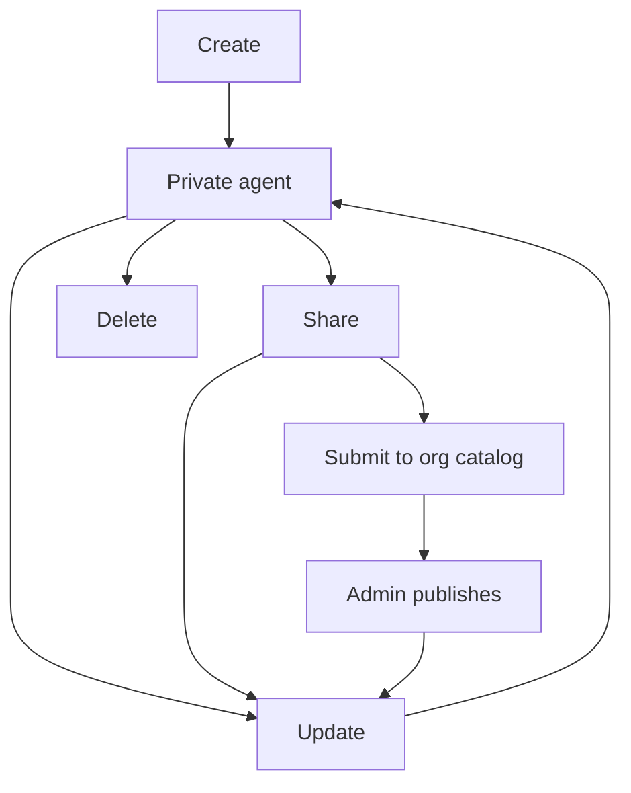
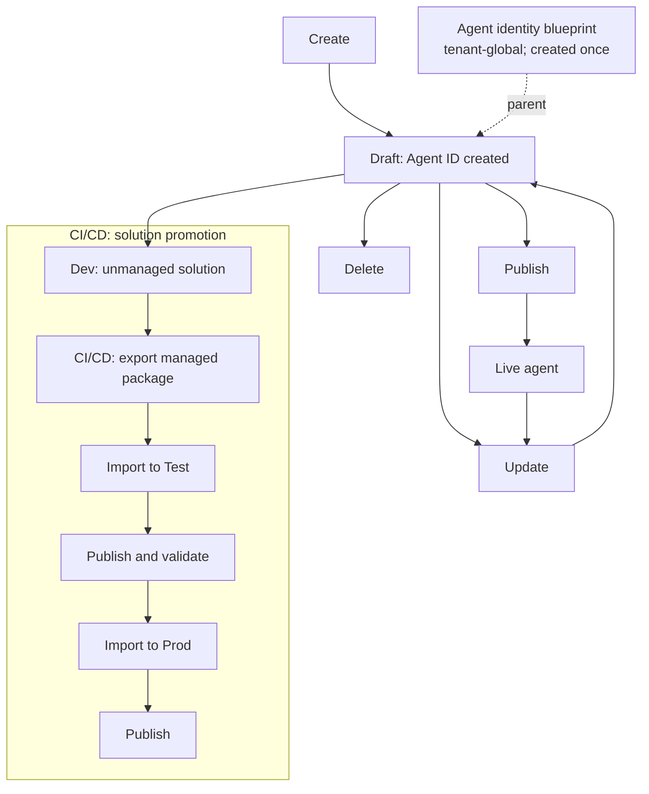

## Agent Builder

## Copilot Studio

Sources:

- [Publish overview for agents](https://learn.microsoft.com/microsoft-copilot-studio/agents-experience/publication-fundamentals-publish-channels)
- [Automatically create Microsoft Entra Agent IDs for Copilot Studio agents](https://learn.microsoft.com/microsoft-copilot-studio/admin-use-entra-agent-identities)
- [Export and import agents using solutions](https://learn.microsoft.com/microsoft-copilot-studio/authoring-solutions-import-export)
- [Establish an application lifecycle management strategy](https://learn.microsoft.com/microsoft-copilot-studio/guidance/alm)
- [Create and delete agents](https://learn.microsoft.com/microsoft-copilot-studio/authoring-first-bot#delete-an-agent)