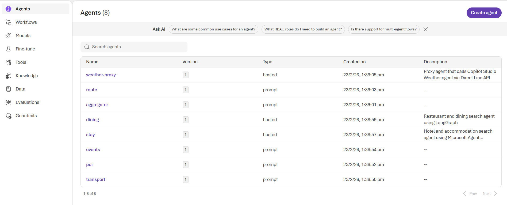
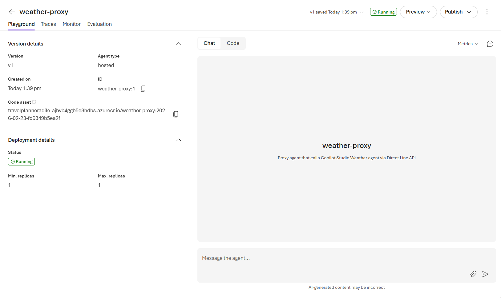
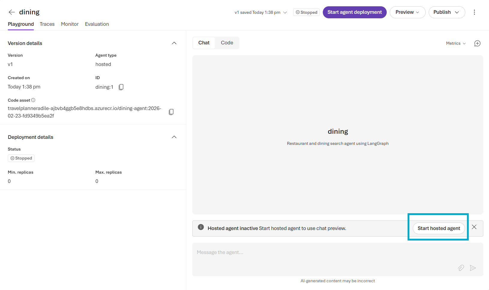
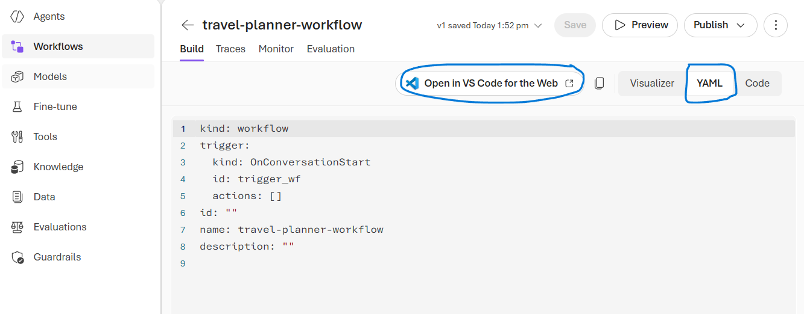
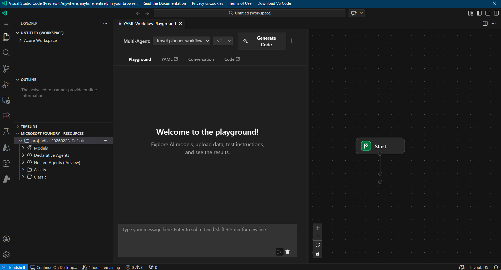
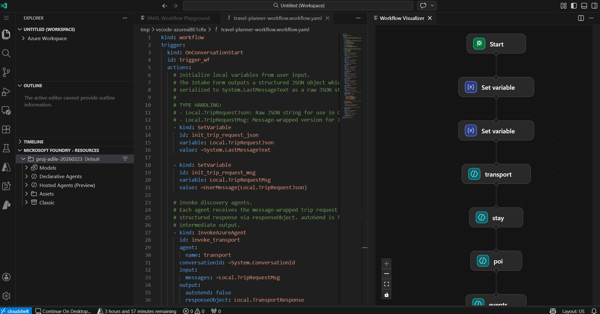
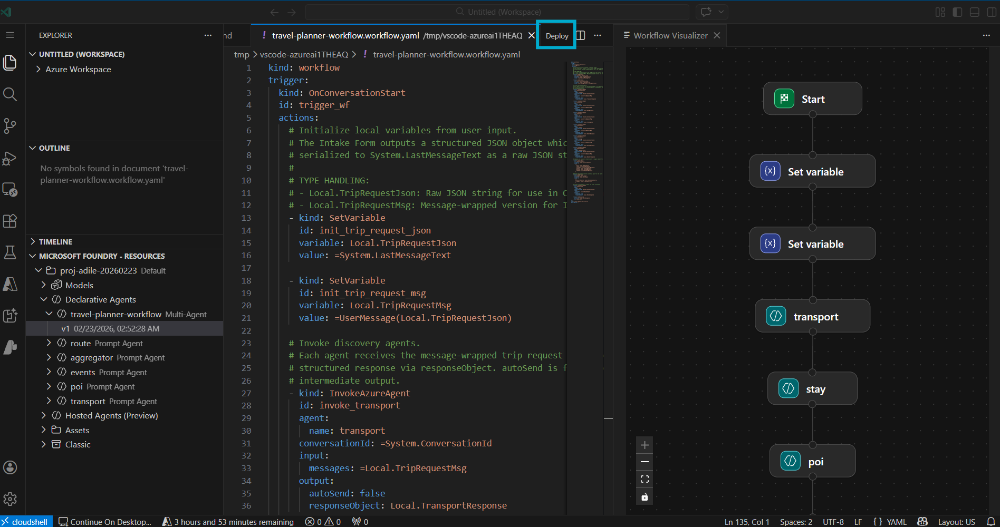
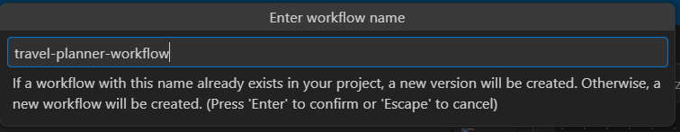
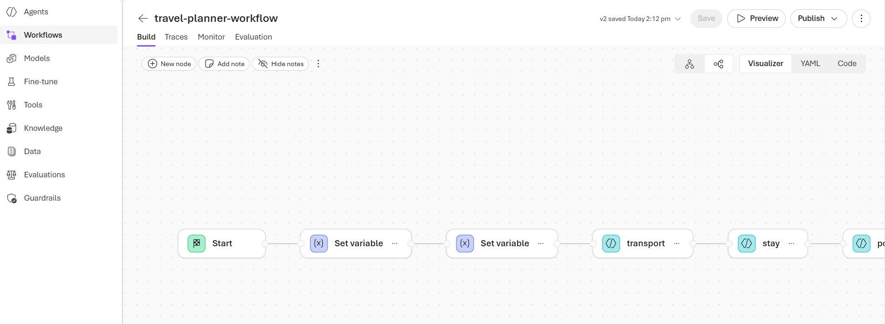
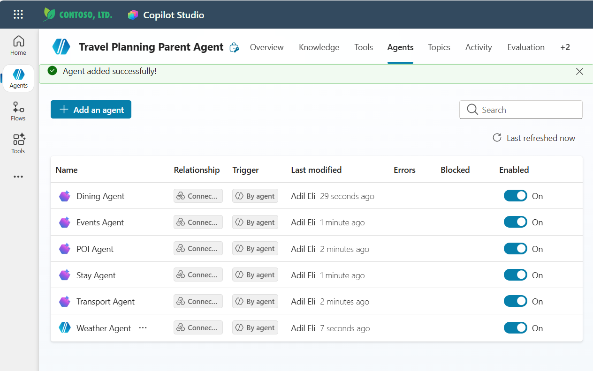

# Interoperability Demo

This directory demonstrates cross-platform agent interoperability across the Microsoft ecosystem — specifically between **Microsoft Foundry**, **Copilot Studio**, and **Pro Code** (custom orchestrator). It reuses agent logic from the A2A travel planning system in [`src/`](../src).

> **Note:** The setup process for this demo is **semi-automated and semi-manual** by nature — some steps use scripts while others require portal configuration. This leaves space for further automation as platform capabilities evolve.

## Agent Service & Framework

| Technology | What it is | Where it's used | Why |
|------------|-----------|-----------------|-----|
| **[Microsoft Foundry New (Foundry v2) — Agent Service](https://learn.microsoft.com/en-us/azure/ai-foundry/agents/overview?view=foundry)** (preview) | Next-generation Foundry platform supporting native and hosted agent deployments | [`foundry/`](foundry) — adaptors that convert the Agent Framework agents into **Foundry v2 native agents** | Enables cross-platform interoperability — the same agent logic deployed as Foundry-native agents can integrate with Copilot Studio and other Microsoft surfaces |

### Relationship to the A2A implementation

The [A2A multi-agent system](../src) builds 11 working agents using the [Microsoft Agent Framework](https://github.com/microsoft/agents) (open-source) and exposes them via the [A2A protocol](https://github.com/google/A2A). This interoperability layer adapts those same Agent Framework agents — without rewriting their core logic — into [Foundry New (v2)](https://learn.microsoft.com/en-us/azure/ai-foundry/agents/overview?view=foundry) native and hosted agents, enabling cross-platform scenarios with [Copilot Studio](https://learn.microsoft.com/en-us/microsoft-copilot-studio/) and other Microsoft surfaces.

Specifically, the [`foundry/`](foundry) directory contains adaptors ([`shared/agent_wrappers/`](shared/agent_wrappers)) that:

- **Extract** agent instructions, tools, and configuration from the A2A agents in [`../src/agents/`](../src/agents)
- **Convert** them into Foundry v2 agent definitions (native agents or hosted agents running in containers)
- **Deploy** them to an Microsoft Foundry project, where they can be orchestrated by Foundry workflows or called from Copilot Studio via the [Add Agents](https://learn.microsoft.com/en-gb/microsoft-copilot-studio/add-agent-foundry-agent) feature

## Overview

The demo showcases how agents built on different Microsoft platforms can work together. Six travel-planning domain agents (Transport, POI, Events, Stay, Dining, Weather) are deployed across Foundry and Copilot Studio, then orchestrated in different ways to demonstrate platform interoperability.

| Agent | Platform | Type |
|-------|----------|------|
| Transport | Microsoft Foundry | Native Agent |
| POI | Microsoft Foundry | Native Agent |
| Events | Microsoft Foundry | Native Agent |
| Stay | Microsoft Foundry | Hosted Agent (Microsoft Agent Framework) |
| Dining | Microsoft Foundry | Hosted Agent (LangGraph) |
| Weather | Copilot Studio | Copilot Studio Agent |

## Demo Flows

### Demo 1: Foundry Workflow with Cross-Platform Agents (Stable)

**Direction:** Microsoft Foundry → Copilot Studio

A Foundry declarative workflow orchestrates all six discovery agents in parallel, including calling the Weather agent hosted in Copilot Studio via a Weather Proxy hosted agent. Results are aggregated and passed to a Route agent that produces a draft itinerary.

**Purpose:** Showcase Microsoft Foundry's multi-agent workflow and hosted agent capabilities.

**Flow:**

```
User → Foundry Intake TripSpec → Discovery Workflow → Draft Itinerary
                                    │
       ┌──────────┬──────────┬──────┼──────┬──────────┐
       ▼          ▼          ▼      ▼      ▼          ▼
 ┌──────────┐┌──────────┐┌───────┐┌─────┐┌────────┐┌─────────┐
 │Transport ││   POI    ││Events ││Stay ││ Dining ││ Weather │
 │ (native) ││ (native) ││(native)││(HA) ││  (HA)  ││  (CS)   │
 └──────────┘└──────────┘└───────┘└─────┘└────────┘└─────────┘
       │          │          │      │      │            │
       └──────────┴──────────┴──────┼──────┴────────────┘
                                    ▼
                       ┌────────────────────────┐
                       │  Aggregator (Foundry)  │
                       │  → Combined results    │
                       └────────────────────────┘
                                    │
                                    ▼
                       ┌────────────────────────┐
                       │   Route Agent (Foundry)│
                       │  → Creates itinerary   │
                       └────────────────────────┘
                                    │
                                    ▼
                            Draft Itinerary
```

### Demo 2: Copilot Studio Routing to Foundry Agents (Stable)

**Direction:** Copilot Studio → Microsoft Foundry

A Travel Planning Parent Agent in Copilot Studio receives natural language travel questions, determines which domain agents are relevant, calls them via the [Add Agents](https://learn.microsoft.com/en-gb/microsoft-copilot-studio/add-agent-foundry-agent) feature, and returns an aggregated answer.

**Purpose:** Show Copilot Studio as the entry point, calling multiple Foundry agents (mix of native and Hosted Agents) as connected agents.

**Flow:**

```
┌───────────────────────────────────────────────────────────┐
│                      COPILOT STUDIO                       │
│                                                           │
│  User Question ───→ Travel Planning Parent Agent          │
│  "What hotels are       │                                 │
│   near the Eiffel       │ (routes to relevant agents)     │
│   Tower with good       ▼                                 │
│   restaurants?"  ┌─────────────────┐                      │
│                  │   Add Agents    │                      │
│                  └─────────────────┘                      │
│                            │                              │
│   ┌────────┬───────┬───────┼─────┬────────┬─────────┐     │
│   ▼        ▼       ▼       ▼     ▼        ▼         ▼     │
│ ┌──────┐┌──────┐┌──────┐┌────┐┌──────┐┌───────┐           │
│ │Trans.││ POI  ││Events││Stay││Dining││Weather│           │
│ │native││native││native││ HA ││  HA  ││  CS   │           │
│ └──────┘└──────┘└──────┘└────┘└──────┘└───────┘           │
│   │        │       │      │      │        │               │
│   └────────┴───────┴──────┼──────┴────────┘               │
│                           ▼                               │
│                  Aggregated Answer                        │
│                  returned to user                         │
└───────────────────────────────────────────────────────────┘
```

### Demo 3: Pro Code Orchestrator Calling Copilot Studio (In Progress)

**Direction:** Pro Code → Copilot Studio

The existing A2A orchestrator calls a Copilot Studio Approval Agent via the M365 Agents SDK for human-in-the-loop itinerary approval. This demo is **not fully implemented yet** and is under active development.

## Setup Guide

Follow these steps in order to set up all resources from scratch. Each step builds on the previous one.

### Prerequisites

#### Azure & Copilot Studio Access

1. You will need access to [Copilot Studio](https://copilotstudio.preview.microsoft.com), [Azure](https://portal.azure.com) and [Microsoft Foundry]()
2. You need access to both **Copilot Studio** and **Microsoft Foundry** under the **same Azure AD tenant**. If you encounter access issues during setup, contact your tenant admin.
3. This demo uses the [new Microsoft Foundry](https://learn.microsoft.com/en-us/azure/ai-foundry/) (not classic Foundry).
4. For Azure, you will need:
   - An Azure `subscription` with the right permissions.
   - Azure RBAC roles:
       - Note these role grants are for demo purpose only and should be narrowed down to honor least privilege in production
       - `Contributor` or `Owner` role at the subscription or resource group level
       - `Role Based Access Control Administrator` role at the subscription or resource group level
       - `Azure AI User` role to manage Foundry project
   - A `Foundry project` created with a configured endpoint.
   - An `Azure OpenAI model` deployment (e.g. gpt-4.1)
   - As you run through this guide, you will create Azure resources such as Azure Container Registry, Bing Grounding Search, Application Insights, etc.
5. For Copilot Studio, you will need:
   - Valid license to create Copilot Studio agent, e.g. `Microsoft Copilot Studio User license`

#### Local Tooling

To execute the setup commands in this README, install:

- Python 3.13+
- `uv` package manager
- Azure CLI (`az`) with active login

### Step 1: Configure Environment Variables

Copy `.env.example` to `.env` at the project root and fill in the values for the **Agent Platform Interoperability** section. The table below lists the required variables — see comments in `.env.example` for where to find each value.

| Variable | Required for | Description |
|----------|-------------|-------------|
| `PROJECT_ENDPOINT` | All demos | Microsoft Foundry project endpoint. Get from Foundry portal > Project > Overview |
| `AZURE_RESOURCE_GROUP` | All demos | Azure resource group containing the Foundry project |
| `AZURE_OPENAI_ENDPOINT` | All demos | Azure OpenAI endpoint (shared with A2A) |
| `AZURE_OPENAI_DEPLOYMENT_NAME` | All demos | Model deployment name, e.g. `gpt-4.1` (shared with A2A) |
| `AZURE_OPENAI_API_VERSION` | All demos | API version, e.g. `2025-01-01-preview` (shared with A2A) |
| `BING_PROJECT_CONNECTION_ID` | All demos | Bing Search project connection used by discovery agents (transport, poi, events) as a grounding tool. Get from Foundry portal > Connected Resources. See [Bing grounding tools setup](https://learn.microsoft.com/en-us/azure/ai-foundry/agents/how-to/tools/bing-tools?view=foundry&pivots=python) |
| `ACR_REGISTRY` | Demo 1, 2 | ACR hostname for hosted agent images, e.g. `myregistry.azurecr.io`. To create one, follow [Create a private container registry](https://learn.microsoft.com/en-us/azure/container-registry/container-registry-get-started-portal) |
| `COPILOTSTUDIOAGENT__DIRECTLINE_SECRET` | Demo 1 | Direct Line secret for weather proxy. Get from Copilot Studio > Weather Agent > Settings > Security > Web channel security. You may leave this empty when configuring `.env` and set it up after creating weather proxy agent in Copilot Studio. See [`weather_proxy_direct_line/README.md`](foundry/agents/weather/weather_proxy_direct_line/README.md) for details |
| `APPLICATIONINSIGHTS_CONNECTION_STRING` | Optional | Azure Monitor connection string for observability |

> **Note:** `STAY_AGENT_IMAGE`, `DINING_AGENT_IMAGE`, and `WEATHER_PROXY_IMAGE` are set automatically by `build_images.py` in Step 4 — you do not need to configure them manually.

<details>
<summary>M365 Agents SDK variables (not currently active)</summary>

If the weather proxy (or other Copilot Studio proxies) switch from Direct Line to the M365 Agents SDK, these additional variables will be needed. Currently blocked by a server-to-server limitation — see [`interoperability/foundry/agents/weather/README.md`](foundry/agents/weather/README.md) for details.

| Variable | Description |
|----------|-------------|
| `COPILOTSTUDIOAGENT__AGENTAPPID` | Azure AD App ID for calling Copilot Studio agents |
| `COPILOTSTUDIOAGENT__AGENTAPPSECRET` | Azure AD App secret |
| `COPILOTSTUDIOAGENT__TENANTID` | Azure AD tenant ID |
| `COPILOTSTUDIOAGENT__ENVIRONMENTID` | Copilot Studio environment ID |
| `COPILOTSTUDIOAGENT__WEATHER__SCHEMANAME` | Copilot Studio weather agent schema name |

</details>

### Step 2: In Copilot Studio, create Weather Agent

Create the Weather Agent in Copilot Studio by following the step-by-step guide:

[`interoperability/copilot_studio/agents/weather/README.md`](copilot_studio/agents/weather/README.md)

This agent provides climate summaries for travel destinations and is called from the Foundry Discovery Workflow (Demo 1) via the Weather Proxy hosted agent.

#### Step 2.1: Set Authentication to be "No authentication"

> "No authentication" is not meant to be production, just for demo usage. Without configuring this, the Foundry side will get "Error code: IntegratedAuthenticationNotSupportedInChannel."

Copilot Studio > Weather Agent > Settings > Security -> "No authentication"

#### Step 2.2: Set COPILOTSTUDIOAGENT__DIRECTLINE_SECRET in `.env`

This variable can be found by Copilot Studio > Weather Agent > Settings > Security > Web channel security > Secret 1

```bash
# In your .env file or Azure Key Vault
COPILOTSTUDIOAGENT__DIRECTLINE_SECRET="your-directline-secret"
```

This secret is required to connect to "weather agent" from Foundry hosted agent "weather proxy".

### Step 3: Build Hosted Agent Images & Deploy Foundry Agents

Deploy all Foundry-managed agents required for Demo 1.

- Discovery agents: `transport`, `poi`, `events`, `stay`, `dining`, `weather-proxy`
- Workflow support agents: `aggregator`, `route`
- Total deployed in Foundry for Demo 1: **8 agents**

1. Ensure you have Azure CLI logged in (`az login`) and the required environment variables set.

2. [Pre-deployment checklist for Hosted Agents](https://learn.microsoft.com/en-us/azure/ai-foundry/agents/concepts/hosted-agents?view=foundry#pre-deployment-checklist). Go through the list and configure them properly.

In particular, make sure:
- You have created the Azure Container Registry
- You have given your Foundry project's managed identity access to pull from the container registry. Otherwise, Foundry won't be able to pull image from Container Registry when running the hosted agents
- You have created capability host. Otherwise, we cannot successfully start deployment for hosted agents

3. Make sure you have access to push docker image to the Azure Container Registry

One way to achieve this is to grant your user below role to the Container Registry:
- `Container Registry Repository Contributor`

If you need to list the Repos, you will also need:
- `Container Registry Repository Catalog Lister`

If you cannot assign role (or role assignment is disabled), you might need `User Access Administrator` or `Role Based Access Control Administrator` at a higher scope level e.g. resource-group level or subscription level.

There are other ways to archieve this as well, see [Azure Container Registry Entra permissions and role assignments overview](https://learn.microsoft.com/en-us/azure/container-registry/container-registry-rbac-built-in-roles-overview?tabs=registries-configured-with-rbac-registry-abac-repository-permissions)

4. **Set the `ACR_REGISTRY` env var** (or add it to `.env`):

   ```bash
   # Bash
   export ACR_REGISTRY=myregistry.azurecr.io
   ```
   ```powershell
   # PowerShell
   $env:ACR_REGISTRY = "myregistry.azurecr.io"
   ```

5. **Build and push hosted agent images** (`stay`, `dining`, `weather-proxy`):

   Open Docker Desktop. Install it first if you have not

   ```bash
   # Log in to ACR first
   az acr login --name <your-acr-name>

   # Preview what will be built
   uv run python interoperability/foundry/build_images.py --dry-run

   # Build, tag, push all hosted agent images and update .env
   uv run python interoperability/foundry/build_images.py
   ```
   ```powershell
   az acr login --name <your-acr-name>
   uv run python -m interoperability.foundry.build_images --dry-run
   uv run python -m interoperability.foundry.build_images
   ```
   This builds Docker images for each hosted agent, pushes them to ACR, and updates
   the `.env` file with the new image references (`STAY_AGENT_IMAGE`, `DINING_AGENT_IMAGE`,
   `WEATHER_PROXY_IMAGE`).

6. Review the deployment configuration:
   ```bash
   uv run python interoperability/foundry/deploy.py --validate
   uv run python interoperability/foundry/deploy.py --dry-run
   ```
   ```powershell
   uv run python -m interoperability.foundry.deploy --validate
   uv run python -m interoperability.foundry.deploy --dry-run
   ```

7. Deploy all the agents:
   ```bash
   uv run python interoperability/foundry/deploy.py --deploy
   ```
   ```powershell
   uv run python -m interoperability.foundry.deploy --deploy
   ```

   Expected output:
   ```
   Deployment Results
   ========================================

   Agents:
   ✓ transport: Successfully deployed agent 'transport' (id=transport:1, version=1)
         Tools: [{'kind': 'bing_grounding'}]
   ✓ poi: Successfully deployed agent 'poi' (id=poi:1, version=1)
         Tools: [{'kind': 'bing_grounding'}]
   ✓ events: Successfully deployed agent 'events' (id=events:1, version=1)
         Tools: [{'kind': 'bing_grounding'}]
   ✓ stay: Successfully deployed hosted agent 'stay' (id=stay:1, version=1)
         Framework: agent_framework
   ✓ dining: Successfully deployed hosted agent 'dining' (id=dining:1, version=1)
         Framework: langgraph
   ✓ aggregator: Successfully deployed agent 'aggregator' (id=aggregator:1, version=1)
         Tools: []
   ✓ route: Successfully deployed agent 'route' (id=route:1, version=1)
         Tools: []
   ✓ weather-proxy: Successfully deployed hosted agent 'weather-proxy' (id=weather-proxy:1, version=1)
         Framework: custom

   Workflows:
   ✗ discovery_declarative: Declarative workflow 'discovery_declarative' deployment requires portal import. Use Foundry portal to import workflow.yaml from interoperability/foundry/workflows/discovery_workflow_declarative.

   Summary:
   Agents: 8 deployed, 0 failed
   Workflows: 0 deployed, 1 failed
   ```
   THe declarative workflow failure is EXPECTED because we will import yaml file to Foundry portal in the next Step.

8. Post deployment, confirm these agents are available in your Froundry:
   - `transport`, `poi`, `events`, `stay`, `dining`, `weather-proxy`, `aggregator`, `route`

   Foundry screenshot:
   

9. Post deployment, check the hosted agents have started deployment:

   Click into the hosted agents (`stay`, `dining`, `weather-proxy`) and see if they are ready to receive message.
   

   If they are pending "Start hosted agent":

   Click on the button to start the deployment.

   Alternatively, follow [start an agent deployment](https://learn.microsoft.com/en-us/azure/ai-foundry/agents/concepts/hosted-agents?view=foundry#start-an-agent-deployment) to start the deployment.

   

10. Play with the hosted agents to make sure they are working as expected.

If not, check [View container Log Stream](https://learn.microsoft.com/en-us/azure/ai-foundry/agents/concepts/hosted-agents?view=foundry#view-container-log-stream) for logging and troubleshooting.

For full details on deployment options (single agent, hosted agent prerequisites, troubleshooting), see [`interoperability/foundry/DEPLOY.md`](foundry/DEPLOY.md).

### Step 4: Create Foundry Declarative Workflow

> **Note:** There is currently no CI/CD pipeline for declarative workflow deployment. This is a manual step.

Create the Discovery Workflow that orchestrates all agents for Demo 1.

For more details of adding delcarative agent workflows in VS Code, refer to [Add declarative agent workflows in Visual Studio Code](https://learn.microsoft.com/en-us/azure/ai-foundry/agents/how-to/vs-code-agents-workflow-low-code?view=foundry).

1. In the Microsoft Foundry portal, create a new empty workflow by Build > Workflows > Create > Blank.

2. Save it by giving it a workflow name e.g. `travel-planner-workflow`.

3. In the right up corner of the Canva, switch `Visualizer` mode to `YAML` mode. Then open it by clicking "Open in VS Code for the Web".

Then you will see interface like this:


4. Replace the workflow definition with the contents of [`interoperability/foundry/workflows/discovery_workflow_declarative/workflow.yaml`](foundry/workflows/discovery_workflow_declarative/workflow.yaml).


5. Deploy by clicking "Deploy".


In the pop-up window, enter the same name for the workflow e.g. `travel-planner-workflow`.


6. Go back to your Foundry portal "Workflows". Refresh and then you should be able to see the workflow updated in the portal as "v2":


### Step 5: In Copilot Studio, Create Travel Planning Parent Agent and Configure Agent-as-tool for Demo 2

Create the Travel Planning Parent Agent for Demo 2 by following the step-by-step guide:

[`interoperability/copilot_studio/agents/travel_planning_parent/README.md`](copilot_studio/agents/travel_planning_parent/README.md)

This involves creating the agent, configuring its instructions, connecting it to the five Foundry agents and the Weather agent, and publishing it.

Post creation, you should have the Travel Planning Parent Agent, and a few agents attached to it:


### Step 6: Test Run Each Demo

**Demo 1: Foundry Workflow with Cross-Platform Agents**

Trigger the Discovery Workflow in the Foundry portal and verify it produces a draft itinerary.

Sample input json:
```
{
  "mode": "plan",
  "destination_city": "Fiji",
  "start_date": "2026-09-25",
  "end_date": "2026-09-30",
  "num_travelers": 2,
  "budget_per_person": 5000,
  "budget_currency": "AUD",
  "origin_city": "Melbourne",
  "interests": [
    "food",
    "snorkeling",
    "staycation"
  ],
  "constraints": [
    "one traveller is a vegetarian"
  ]
}
```

Sample output:

Sample console look:


Sample generated itinerary (json format):
<details>
<summary>Click to expand</summary>

```json
{
  "itinerary": {
    "days": [
      {
        "date": "2026-09-25",
        "slots": [
          {
            "start_time": "08:00",
            "end_time": "12:00",
            "activity": "Flight from Melbourne to Nadi, Fiji (Fiji Airways)",
            "location": "Melbourne Airport to Nadi International Airport",
            "category": "transport",
            "mode": "flight",
            "item_ref": "Fiji Airways",
            "estimated_cost": 520,
            "currency": "AUD",
            "notes": "Direct morning departure. Request vegetarian meal in advance."
          },
          {
            "start_time": "12:30",
            "end_time": "13:00",
            "activity": "Shared shuttle transfer from airport to resort",
            "location": "Nadi Airport to Denarau hotels",
            "category": "transport",
            "mode": "shuttle",
            "item_ref": "Nadi International Airport - Denarau hotels shared shuttle",
            "estimated_cost": 25,
            "currency": "AUD",
            "notes": "Short transfer to Denarau. Alternative is private taxi, but shuttle is budget-friendly."
          },
          {
            "start_time": "13:00",
            "end_time": "14:00",
            "activity": "Check-in and settle at Sheraton Fiji Golf & Beach Resort",
            "location": "Sheraton Fiji Golf & Beach Resort, Denarau",
            "category": "stay",
            "item_ref": "Sheraton Fiji Golf & Beach Resort",
            "estimated_cost": 350,
            "currency": "AUD",
            "notes": "Early check-in subject to availability; store luggage if room not ready."
          },
          {
            "start_time": "14:00",
            "end_time": "15:30",
            "activity": "Lunch at Bulaccino Café (vegetarian friendly)",
            "location": "Nadi",
            "category": "dining",
            "item_ref": "Bulaccino Café",
            "estimated_cost": 20,
            "currency": "AUD"
          },
          {
            "start_time": "16:00",
            "end_time": "18:00",
            "activity": "Resort relaxation: Pool, beach & spa facilities",
            "location": "Sheraton Fiji Golf & Beach Resort",
            "category": "poi",
            "item_ref": "Sheraton Fiji Golf & Beach Resort",
            "estimated_cost": 0,
            "currency": "AUD"
          },
          {
            "start_time": "18:30",
            "end_time": "20:30",
            "activity": "Dinner at Indigo Indian Asian Restaurant & Bar",
            "location": "Port Denarau",
            "category": "dining",
            "item_ref": "Indigo Indian Asian Restaurant & Bar",
            "estimated_cost": 35,
            "currency": "AUD",
            "notes": "Excellent vegetarian options. Reserve a table."
          }
        ],
        "day_summary": "Arrival in Fiji, settle into resort, enjoy local cafe lunch, unwind at the resort, and vegetarian-friendly Indian dinner at the marina."
      },
      {
        "date": "2026-09-26",
        "slots": [
          {
            "start_time": "08:00",
            "end_time": "09:00",
            "activity": "Breakfast at resort (vegetarian options available)",
            "location": "Sheraton Fiji Golf & Beach Resort",
            "category": "dining",
            "item_ref": "Sheraton Fiji Golf & Beach Resort",
            "estimated_cost": 30,
            "currency": "AUD"
          },
          {
            "start_time": "09:30",
            "end_time": "16:30",
            "activity": "Mamanuca Islands Snorkeling Day Cruise",
            "location": "Departs from Port Denarau",
            "category": "event",
            "item_ref": "Mamanuca Islands Snorkeling Day Cruise",
            "estimated_cost": 140,
            "currency": "AUD",
            "notes": "Includes transfers and lunch with vegetarian options. Full-day tour; bring swimwear and sunscreen."
          },
          {
            "start_time": "18:00",
            "end_time": "19:30",
            "activity": "Resort relaxation or explore Denarau Marina",
            "location": "Denarau Island",
            "category": "poi",
            "item_ref": "Denarau Marina",
            "estimated_cost": 0,
            "currency": "AUD"
          },
          {
            "start_time": "19:30",
            "end_time": "21:00",
            "activity": "Dinner at Sunny Pizza",
            "location": "Nadi",
            "category": "dining",
            "item_ref": "Sunny Pizza",
            "estimated_cost": 24,
            "currency": "AUD",
            "notes": "Vegetarian-friendly menu; casual and relaxed atmosphere."
          }
        ],
        "day_summary": "Snorkeling cruise to the Mamanuca Islands with included lunch, then a relaxing evening and casual vegetarian-friendly dinner."
      },
      {
        "date": "2026-09-27",
        "slots": [
          {
            "start_time": "08:00",
            "end_time": "09:00",
            "activity": "Breakfast at resort (vegetarian options available)",
            "location": "Sheraton Fiji Golf & Beach Resort",
            "category": "dining",
            "item_ref": "Sheraton Fiji Golf & Beach Resort",
            "estimated_cost": 30,
            "currency": "AUD"
          },
          {
            "start_time": "10:00",
            "end_time": "16:00",
            "activity": "Seventh Heaven Floating Bar & Snorkeling Experience",
            "location": "Between Denarau and Mamanuca",
            "category": "event",
            "item_ref": "Seventh Heaven Fiji",
            "estimated_cost": 120,
            "currency": "AUD",
            "notes": "Floating bar and lounge, inclusive vegetarian lunch, unlimited snorkeling."
          },
          {
            "start_time": "18:00",
            "end_time": "20:00",
            "activity": "Dinner at resort or Denarau Marina",
            "location": "Sheraton Fiji or Denarau Marina",
            "category": "dining",
            "item_ref": "Denarau Marina",
            "estimated_cost": 40,
            "currency": "AUD",
            "notes": "Choose among the marina's many vegetarian-friendly restaurants."
          }
        ],
        "day_summary": "Indulge in a floating bar experience with food and snorkeling, followed by a marina or resort dinner."
      },
      {
        "date": "2026-09-28",
        "slots": [
          {
            "start_time": "08:00",
            "end_time": "09:00",
            "activity": "Breakfast at resort (vegetarian options available)",
            "location": "Sheraton Fiji Golf & Beach Resort",
            "category": "dining",
            "item_ref": "Sheraton Fiji Golf & Beach Resort",
            "estimated_cost": 30,
            "currency": "AUD"
          },
          {
            "start_time": "10:00",
            "end_time": "15:00",
            "activity": "Day at leisure: Resort staycation (pool, spa, activities)",
            "location": "Sheraton Fiji Golf & Beach Resort",
            "category": "poi",
            "item_ref": "Sheraton Fiji Golf & Beach Resort",
            "estimated_cost": 0,
            "currency": "AUD",
            "notes": "Take advantage of all-inclusive amenities and book spa treatments as desired."
          },
          {
            "start_time": "15:30",
            "end_time": "17:30",
            "activity": "Lunch at Saravana Bhavan (100% vegetarian Indian)",
            "location": "Nadi",
            "category": "dining",
            "item_ref": "Saravana Bhavan",
            "estimated_cost": 18,
            "currency": "AUD"
          },
          {
            "start_time": "18:30",
            "end_time": "20:00",
            "activity": "Dinner at resort or Marina (your choice)",
            "location": "Sheraton Fiji Golf & Beach Resort/Denarau Marina",
            "category": "dining",
            "item_ref": "Denarau Marina",
            "estimated_cost": 40,
            "currency": "AUD"
          }
        ],
        "day_summary": "Chill staycation day with a relaxed spa/pool session, vegetarian Indian lunch in Nadi, and flexible evening dining."
      },
      {
        "date": "2026-09-29",
        "slots": [
          {
            "start_time": "08:00",
            "end_time": "09:00",
            "activity": "Breakfast at resort (vegetarian options available)",
            "location": "Sheraton Fiji Golf & Beach Resort",
            "category": "dining",
            "item_ref": "Sheraton Fiji Golf & Beach Resort",
            "estimated_cost": 30,
            "currency": "AUD"
          },
          {
            "start_time": "10:00",
            "end_time": "15:00",
            "activity": "Resort pool, lagoon, and optional activities (kayak, paddleboard, golf)",
            "location": "Sheraton Fiji Golf & Beach Resort",
            "category": "poi",
            "item_ref": "Sheraton Fiji Golf & Beach Resort",
            "estimated_cost": 0,
            "currency": "AUD"
          },
          {
            "start_time": "15:30",
            "end_time": "17:00",
            "activity": "Lunch at resort or Bulaccino Café",
            "location": "Sheraton Fiji Golf & Beach Resort/Nadi",
            "category": "dining",
            "item_ref": "Bulaccino Café",
            "estimated_cost": 20,
            "currency": "AUD"
          },
          {
            "start_time": "18:30",
            "end_time": "20:00",
            "activity": "Farewell dinner at Indigo Indian Asian Restaurant & Bar",
            "location": "Port Denarau",
            "category": "dining",
            "item_ref": "Indigo Indian Asian Restaurant & Bar",
            "estimated_cost": 35,
            "currency": "AUD"
          }
        ],
        "day_summary": "Final full day for poolside leisure and marina, topped with a repeat of your favourite vegetarian-friendly dinner spot."
      },
      {
        "date": "2026-09-30",
        "slots": [
          {
            "start_time": "08:00",
            "end_time": "09:00",
            "activity": "Breakfast at resort (vegetarian options available)",
            "location": "Sheraton Fiji Golf & Beach Resort",
            "category": "dining",
            "item_ref": "Sheraton Fiji Golf & Beach Resort",
            "estimated_cost": 30,
            "currency": "AUD"
          },
          {
            "start_time": "09:00",
            "end_time": "11:30",
            "activity": "Pack and check out from resort",
            "location": "Sheraton Fiji Golf & Beach Resort",
            "category": "stay",
            "item_ref": "Sheraton Fiji Golf & Beach Resort",
            "estimated_cost": 0,
            "currency": "AUD",
            "notes": "Check-out by noon. Luggage storage available if flight is later."
          },
          {
            "start_time": "12:00",
            "end_time": "12:30",
            "activity": "Shared shuttle transfer to Nadi International Airport",
            "location": "Sheraton Fiji to Nadi International Airport",
            "category": "transport",
            "mode": "shuttle",
            "item_ref": "Nadi International Airport - Denarau hotels shared shuttle",
            "estimated_cost": 25,
            "currency": "AUD"
          },
          {
            "start_time": "14:00",
            "end_time": "18:30",
            "activity": "Direct flight Nadi (Jetstar) to Melbourne",
            "location": "Nadi International Airport to Melbourne Airport",
            "category": "transport",
            "mode": "flight",
            "item_ref": "Jetstar",
            "estimated_cost": 520,
            "currency": "AUD",
            "notes": "Request vegetarian meal in advance."
          }
        ],
        "day_summary": "Departure, morning relaxation and check-out, airport transfer, and return flight."
      }
    ],
    "total_estimated_cost": 2982,
    "currency": "AUD"
  },
  "response": null
}
```
</details>

**Demo 2:** Open the Travel Planning Parent Agent in Copilot Studio's test pane and ask a travel question (e.g., "Plan a trip to Paris").

Example Questions and Routing

| Question | Expected Agent(s) | Routing Type |
|----------|-------------------|--------------|
| "Find me flights from Seattle to Tokyo" | Transport | Single |
| "What hotels are near the Eiffel Tower?" | Stay | Single |
| "Best restaurants in Rome" | Dining | Single |
| "What concerts are happening in London next week?" | Events | Single |
| "Will it rain in Paris next month?" | Weather | Single |
| "Plan a 5-day trip to Barcelona" | Transport + POI + Events + Stay + Dining + Weather | Multi (all) |
| "Where can I eat near the Colosseum?" | Dining | Single |
| "What's the weather like for Tokyo concerts?" | Weather + Events | Multi |
| "Find hotels with good restaurants nearby" | Stay + Dining | Multi |

Note: actual routing might be different from above depending on the capability of LLM, etc.


Sample run in console:
"Plan a 5-day trip to Barcelona"


## Directory Structure

| Directory | Description |
|-----------|-------------|
| `shared/` | Shared agent wrappers and schema references used across platforms |
| `foundry/` | Microsoft Foundry agent definitions, deployment scripts, and workflows |
| `copilot_studio/` | Copilot Studio agent configuration and setup guides |
| `pro_code/` | M365 SDK client for calling Copilot Studio agents (Demo 3) |

## Troubleshooting

### Hosted agent fails with `PermissionDenied` (`agents/write`)

**Symptom**

Container log stream from `stay` or `dining` shows:

```
The principal '<principal-id>' lacks the required data action
'Microsoft.CognitiveServices/accounts/AIServices/agents/write'
to perform `POST /api/projects/{projectName}/assistants`.
```

**Why this happens**

Hosted agents run with the Foundry project's managed identity. During runtime, the agent framework may create or access assistant resources (`/assistants`). If that managed identity does not have Foundry data-plane permissions, requests fail with `agents/write`.

**Fix**

Grant the Foundry project managed identity the `Azure AI User` role at either:
- Foundry project scope (least privilege), or
- Foundry account scope (broader, easier to find in portal)

Current demo example:
- Project managed identity object id: `05ccfdad-de4e-4833-8269-4d2ee8124db9`
- Project scope:
  `/subscriptions/7b687301-2a67-4579-ae2d-b3b1df9ab21b/resourceGroups/rg-foundry-adile/providers/Microsoft.CognitiveServices/accounts/foundry-adile-20260223/projects/proj-adile-20260223`

CLI example:

```powershell
az role assignment create `
  --assignee-object-id 05ccfdad-de4e-4833-8269-4d2ee8124db9 `
  --assignee-principal-type ServicePrincipal `
  --role "Azure AI User" `
  --scope "/subscriptions/7b687301-2a67-4579-ae2d-b3b1df9ab21b/resourceGroups/rg-foundry-adile/providers/Microsoft.CognitiveServices/accounts/foundry-adile-20260223/projects/proj-adile-20260223"
```

Portal path:
- Azure Portal -> target Foundry project (or Foundry account) -> **Access control (IAM)** -> **Add role assignment** -> `Azure AI User` -> select the Foundry project managed identity.

**After assigning role**

1. Wait 2-10 minutes for RBAC propagation.
2. Restart hosted deployments (`stay`, `dining`, `weather-proxy`) if already running.
3. Retest and check container log stream again.

**If behavior is intermittent**

You may see "works sometimes, fails sometimes" right after deployment or role changes due to warm vs cold instances and token/role propagation. This usually stabilizes after propagation and a clean restart.

## Related Documentation

- [Interoperability Design Document](../docs/interoperability-design.md) — full architecture and design decisions
- [Foundry Deployment Guide](foundry/DEPLOY.md) — detailed deployment reference
- [A2A README](../src/README.md) — A2A architecture and runtime details
