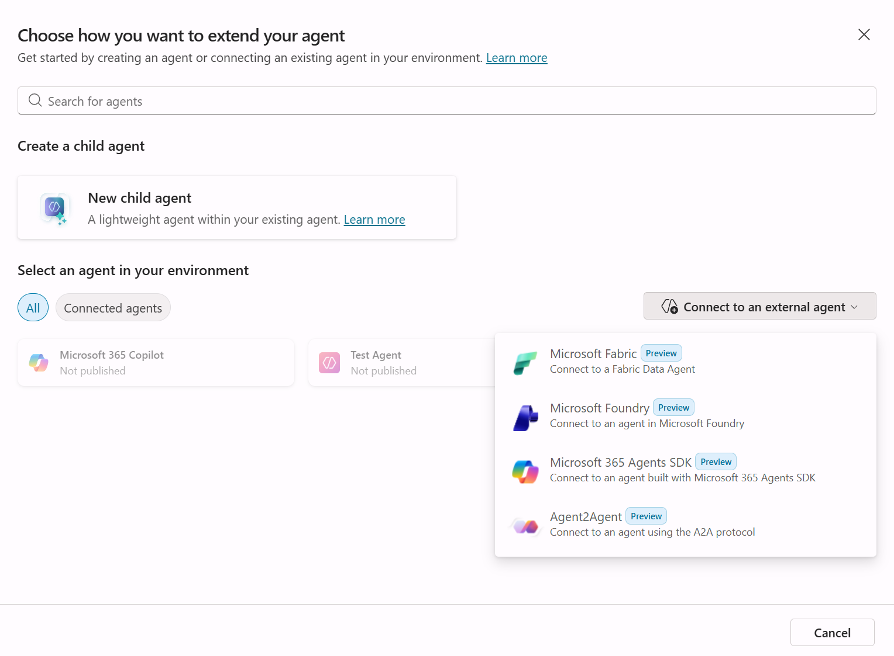
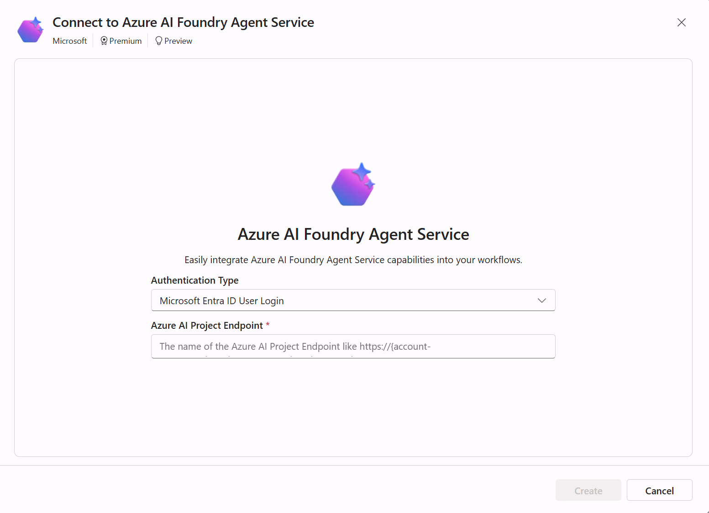
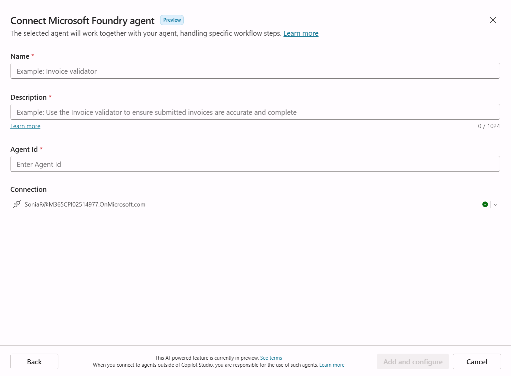
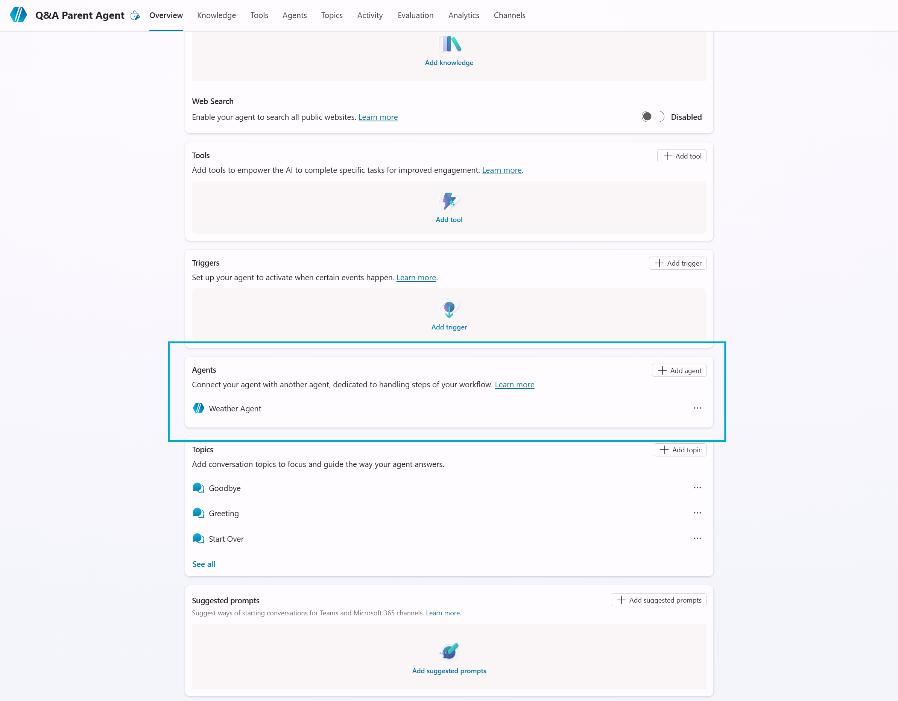

# Travel Planning Parent Agent - Copilot Studio Setup Guide

This guide provides detailed step-by-step instructions for creating the Travel Planning Parent Agent in Microsoft Copilot Studio.

The Travel Planning Parent Agent is the entry point for demo. It receives natural language travel questions from users, determines which domain agents are relevant, calls them via the [Add Agents](https://learn.microsoft.com/en-gb/microsoft-copilot-studio/add-agent-foundry-agent) feature, and returns an aggregated natural language answer.

## Architecture

```
User Question ──→ Travel Planning Parent Agent (Copilot Studio)
"What hotels are       │
 near the Eiffel       │ (routes to relevant
 Tower with good       │  added agents)
 restaurants?"         │
                       ▼
            ┌─────────────────────┐
            │    Added Agents     │
            └─────────────────────┘
                       │
  ┌────────┬───────┬───┼───┬────────┬─────────┐
  ▼        ▼       ▼   ▼   ▼        ▼         ▼
┌──────┐┌─────┐┌──────┐┌────┐┌──────┐┌───────┐
│Trans.││ POI ││Events││Stay││Dining││Weather│
│native││native││native││ HA ││  HA  ││  CS   │
└──────┘└─────┘└──────┘└────┘└──────┘└───────┘
  │        │       │    │      │        │
  └────────┴───────┴────┼──────┴────────┘
                        ▼
               Aggregated Answer
               returned to user
```

> **Note:** 5 agents are hosted in Azure AI Foundry (Transport, POI, Events, Stay, Dining) and 1 is an internal Copilot Studio agent (Weather). The Add Agents feature handles routing and response aggregation natively.

## Prerequisite

- Access to Microsoft Copilot Studio (https://copilotstudio.microsoft.com)
- Azure AD tenant with appropriate permissions
- The signed-in user must have RBAC access to the Azure AI Foundry project (e.g., Contributor or Cognitive Services User role)
- All 6 sub-agents published:
  - Transport, POI, Events agents (Foundry native Agents)
  - Stay agent (Foundry hosted AF)
  - Dining agent (Foundry hosted LC)
  - Weather agent (Copilot Studio)
- Understanding of demo flow (see `interoperability/README.md`)

## Agent Overview

| Property | Value |
|----------|-------|
| **Name** | Travel Planning Parent Agent |
| **Purpose** | Routes travel questions to appropriate domain agents and aggregates responses |
| **Used In** | demo (entry point for Copilot Studio -> Foundry integration) |
| **Input** | Natural language travel questions |
| **Output** | Aggregated natural language answer combining relevant agent responses |

## Step 1: Create the Agent

1. Go to [Copilot Studio](https://copilotstudio.microsoft.com)
2. Click **Create** in the top navigation
3. Select **New agent**
4. Enter the following details:
   - **Name:** `Travel Planning Parent Agent`
   - **Description:** `Routes travel questions to specialized domain agents (transport, hotels, restaurants, attractions, events, weather) and returns aggregated answers. Entry point for demo interoperability showcase.`
   - **Instructions:** See the Agent Instructions section below
5. Click **Create**

## Step 2: Configure Agent Instructions

In the agent settings, set the following instructions (system prompt):

```
You are a Travel Planning Parent Agent that helps travelers get comprehensive answers to travel-related questions.

Your responsibilities:
1. Receive natural language travel questions from users
2. Analyze the question to determine which travel domains are relevant
3. Route the question to the appropriate agent(s)
4. Aggregate the responses into a single coherent natural language answer

Domain Routing Logic:
- Hotels, lodging, accommodation, places to stay → Stay Agent
- Flights, trains, buses, getting there, transportation → Transport Agent
- Restaurants, food, dining, where to eat, cuisine → Dining Agent
- Attractions, sights, landmarks, things to see, museums → POI Agent
- Events, concerts, shows, festivals, activities → Events Agent
- Weather, forecast, temperature, climate, rain → Weather Agent

Multi-Domain Routing:
- Many questions span multiple domains. Route to ALL relevant agents.
- Example: "What hotels near the Eiffel Tower have good restaurants?" → Stay + POI + Dining
- Example: "Plan my trip to Paris" → All agents (Transport + POI + Events + Stay + Dining + Weather)
- Example: "Will it rain during the concerts in London?" → Weather + Events

Response Aggregation:
- Combine responses from all called agents into a single, natural answer
- Organize information logically by topic
- If an agent returns an error or no data, mention it briefly and continue with available data
- Keep the response conversational and helpful
- Include specific details from each agent's response (names, prices, ratings, etc.)

Response Guidelines:
- Be conversational and helpful
- Organize multi-agent responses with clear sections
- Include specific details (hotel names, attraction ratings, flight options, etc.)
- If unsure which agent to route to, route to multiple relevant agents
- Always provide a complete answer, even if some agents return partial data
```

## Step 3: Add Agents

This is the key configuration for demo. The **Agents** section on the agent overview page allows the Q&A Parent to call other agents.

> **Note:** The Copilot Studio interface refers to this feature as **Add Agents** (formerly "Connected Agents"). For full documentation, see [Connect to a Microsoft Foundry agent](https://learn.microsoft.com/en-gb/microsoft-copilot-studio/add-agent-foundry-agent).

### 3.1: Create Azure AI Foundry Connection

Before adding individual Foundry agents, you need to set up a connection to the Azure AI Foundry Agent Service. This only needs to be done once — the same connection is reused for all Foundry agents.

1. In the Travel Planning Parent Agent **Overview** page, find the **Agents** section and click **+ Add agent**
2. In the "Choose how you want to extend your agent" dialog, click **Connect to an external agent** and select **Microsoft Foundry**

   

3. You will be prompted to configure a connection to Azure AI Foundry Agent Service:
   - **Authentication Type:** Select `Microsoft Entra ID User Login`
   - **Azure AI Project Endpoint:** Enter `https://<your-foundry-resource>.services.ai.azure.com`
   - Click **Create**

   

4. Once the connection is created, you will proceed to the agent configuration dialog (see Step 3.2)

### 3.2: Add Foundry Agents

After the connection is established, configure each Foundry agent. For the first agent this follows directly from Step 3.1. For subsequent agents, repeat from the **+ Add agent** button (the existing connection will be available for reuse).

In the "Connect Microsoft Foundry agent" dialog:



1. **Name:** Enter the agent name (e.g., `Transport Agent`)
2. **Description:** Enter a description that explains when this agent should be used (see table below)
3. **Agent Id:** Paste the agent's name exactly as it appears in the Foundry project's agent list (see callout below)
4. **Connection:** Verify the connection created in Step 3.1 is shown
5. Click **Add and configure**
6. Repeat for all 5 Foundry agents (Transport, POI, Events, Stay, Dining)

### Agent Configuration Reference

Use the values below when filling in the "Connect Microsoft Foundry agent" dialog fields. The **Description** is especially important — it tells the Travel Planning Parent Agent when to invoke each sub-agent (see [writing effective metadata](https://learn.microsoft.com/en-gb/microsoft-copilot-studio/advanced-generative-actions#best-practices)).

> **Finding the Agent Id:** Paste in the Foundry agent's name exactly as it appears in the Foundry project's agent list. For example, if your Foundry project agent is called `ReturnPolicies`, that exact string becomes the Agent Id. This is **not** an Azure Entra object ID, tenant ID, Foundry project endpoint URL, version tag (e.g., `agent-name:version`), or the Copilot Studio agent's GUID.

| Name | Agent Id (Foundry agent name) | Description |
|------|-------------------------------|-------------|
| Transport Agent | *Your Foundry agent name for transport e.g. "transport"* | Use this agent when the user asks about flights, trains, buses, getting there, or any transportation options to or within a destination. |
| POI Agent | *Your Foundry agent name for POI e.g. "poi"* | Use this agent when the user asks about attractions, sights, landmarks, museums, things to see, or points of interest at a destination. |
| Events Agent | *Your Foundry agent name for events e.g. "events"* | Use this agent when the user asks about concerts, shows, festivals, activities, or events happening at a destination. |
| Stay Agent | *Your Foundry agent name for stay e.g. "stay"* | Use this agent when the user asks about hotels, lodging, accommodation, or places to stay at a destination. |
| Dining Agent | *Your Foundry agent name for dining e.g. "dining"* | Use this agent when the user asks about restaurants, food, cuisine, dining options, or where to eat at a destination. |
| Weather Agent | N/A (internal CS agent) | Use this agent when the user asks about weather, forecasts, temperature, climate, or rain at a destination. |

### 3.3: Add Weather Agent as Internal Agent

1. In the Travel Planning Parent Agent **Overview** page, find the **Agents** section and click **+ Add agent**
2. In the "Choose how you want to extend your agent" dialog, under **Select an agent in your environment**, search for and select the **Weather Agent** created in INTEROP-010
3. The internal CS-to-CS connection does not require additional connection configuration

   

## Step 4: Publish the Agent

1. Click **Publish** in the top right corner
2. Review the changes summary
3. Click **Publish** to make the agent live

### After Publishing

1. Go to **Settings** > **Agent details**
2. Note these values for environment configuration:
   - **Environment ID**: Found in the URL (`/environments/{id}/...`)
   - **Schema Name**: Listed in agent details

## Example Questions and Expected Routing

| Question | Expected Agent(s) | Routing Type |
|----------|-------------------|--------------|
| "Find me flights from Seattle to Tokyo" | Transport | Single |
| "What hotels are near the Eiffel Tower?" | Stay + POI | Multi |
| "Best restaurants in Rome" | Dining | Single |
| "What concerts are happening in London next week?" | Events | Single |
| "Will it rain in Paris next month?" | Weather | Single |
| "Plan a 5-day trip to Barcelona" | Transport + POI + Events + Stay + Dining + Weather | Multi (all) |
| "Where can I eat near the Colosseum?" | Dining + POI | Multi |
| "What's the weather like for Tokyo concerts?" | Weather + Events | Multi |
| "Find hotels with good restaurants nearby" | Stay + Dining | Multi |

## Testing

### Manual Testing in Portal

1. In Copilot Studio, click **Test** to open the test pane
2. Test with questions like:
   - `Find me flights from Seattle to Tokyo` (single agent: Transport)
   - `What hotels are near the Eiffel Tower with good restaurants?` (multi: Stay + POI + Dining)
   - `What's the weather in Paris next week?` (single agent: Weather)
   - `Plan a trip to Barcelona` (all agents)
3. Verify the agent routes to the correct added agent(s)
4. Verify the response aggregates data from all relevant agents
5. Test error handling by asking about domains with no data

### Programmatic Testing

Use the verification script:

```bash
# From project root
uv run python interoperability/copilot_studio/verify.py --verbose
```

## Troubleshooting

### Agent Not Routing to Added Agents

1. Verify all agents are listed in the **Agents** section on the agent overview page
2. Check that the Azure AI Foundry connection is active and the project endpoint is correct
3. Verify each Foundry agent's **Agent Id** matches the agent's name exactly as it appears in the Foundry project's agent list
4. Ensure the connection authentication type is set to `Microsoft Entra ID User Login`

### Foundry Agent Returns Error

1. Verify the signed-in user has RBAC access to the Azure AI Foundry project
2. Verify the agent is published and responding (use smoke test)
3. Check the Agent Id matches the agent's name exactly as it appears in the Foundry project's agent list

### Weather Agent Not Responding

1. Verify the Weather Agent is published in Copilot Studio
2. Check that it's added as an internal agent (CS-to-CS) via the **Agents** section
3. Test the Weather Agent individually first

### Response Aggregation Issues

1. If responses are incomplete, check which agents failed
2. Review individual agent responses in the test pane logs
3. Ensure the system prompt includes aggregation guidelines

## Related Files

- Main setup guide: `interoperability/copilot_studio/SETUP.md`
- Verification script: `interoperability/copilot_studio/verify.py`
- Weather Agent: `interoperability/copilot_studio/agents/weather/`
- Approval Agent: `interoperability/copilot_studio/agents/approval/`
- Foundry agents: `interoperability/foundry/agents/`
- Design doc: `interoperability/README.md`
