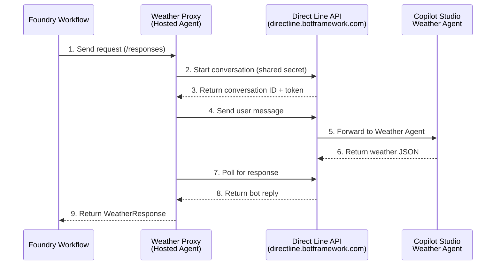
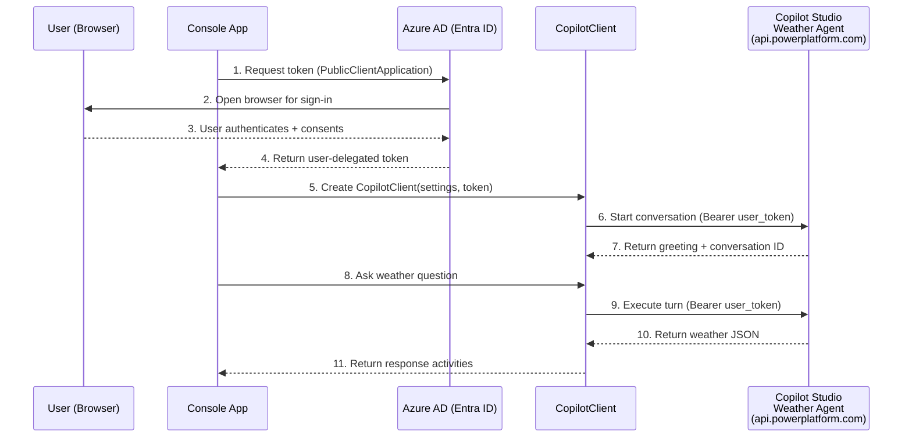
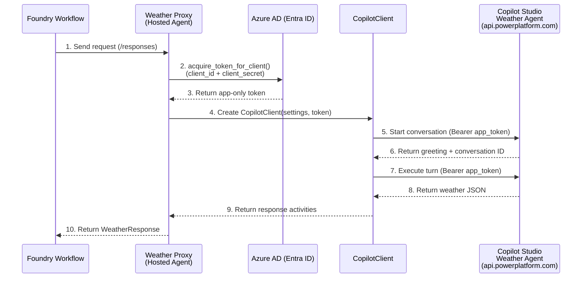

# Weather Proxy - Copilot Studio Integration

The Weather Proxy is a hosted agent that bridges Azure AI Foundry workflows to the Copilot Studio Weather Agent. This folder explores three approaches to integrate with Copilot Studio programmatically.

## Background

From [Integrate with web or native apps using Microsoft 365 Agents SDK](https://learn.microsoft.com/en-us/microsoft-copilot-studio/publication-integrate-web-or-native-app-m365-agents-sdk?tabs=python#methods-to-integrate-your-copilot-studio-agent):

> **Methods to Integrate your Copilot Studio agent**
>
> - **Copilot Studio client (using the Agents SDK)**: This method is the preferred way to integrate with Copilot Studio.
> - **DirectLine**: DirectLine is the legacy way to integrate with Copilot Studio and should be used where there's no support for your use case with Copilot Studio client.

We explored both methods. For the `CopilotClient` (Agents SDK) path, the key question is how to acquire the token — interactively (user sign-in) or via client credentials (app-only). This gives us three approaches in total:

## Approaches

### 1. Direct Line API - `weather_proxy_direct_line/`

**Status: In use for Foundry hosted agent deployment.**

Uses the [Direct Line REST API](https://learn.microsoft.com/en-us/azure/bot-service/rest-api/bot-framework-rest-direct-line-3-0-concepts) with a shared secret from Copilot Studio's Web channel security. No user identity or token acquisition required.

**Steps:**
1. Foundry workflow sends a weather request to the Weather Proxy via `/responses` protocol
2. Weather Proxy starts a Direct Line conversation using the shared secret as `Bearer` token
3. Direct Line returns a conversation ID and conversation token
4. Weather Proxy sends the user message to the conversation
5. Direct Line forwards the message to the Copilot Studio Weather Agent
6. Weather Agent processes the request and returns weather data as JSON
7. Weather Proxy polls the Direct Line conversation for the bot's reply
8. Direct Line returns the bot's response
9. Weather Proxy parses the JSON and returns a structured `WeatherResponse`

| | |
|---|---|
| **Auth** | Shared secret (long-lived, from Copilot Studio) |
| **SDK** | None (raw REST calls to `directline.botframework.com`) |
| **User interaction** | None |
| **Foundry compatible** | Yes |

### 2. CopilotClient + User Interactive Flow - `weather_proxy_m365_agent_sdk_interactive_flow/`

Uses `CopilotClient` with MSAL `PublicClientApplication`. Acquires a user-delegated token via interactive browser sign-in.

**Steps:**
1. Console app calls MSAL `PublicClientApplication` to acquire a token (tries silent/cached first)
2. If no cached token, MSAL opens a browser window for interactive sign-in
3. User authenticates with Azure AD and consents to the `CopilotStudio.Copilots.Invoke` delegated permission
4. Azure AD returns a user-delegated access token
5. App creates a `CopilotClient` instance with the token
6. `CopilotClient` calls the Direct-to-Engine API to start a conversation
7. Copilot Studio returns a greeting and conversation ID
8. User enters a weather question in the console
9. `CopilotClient` sends the question as a new turn in the conversation
10. Weather Agent processes the request and returns weather data
11. `CopilotClient` yields response activities back to the app

| | |
|---|---|
| **Auth** | User-delegated OAuth (`CopilotStudio.Copilots.Invoke` Delegated permission) |
| **SDK** | `microsoft-agents-copilotstudio-client` (`CopilotClient`) |
| **User interaction** | Yes (browser sign-in required) |
| **Foundry compatible** | No — hosted agents run without a user session |

### 3. CopilotClient + Client Credentials Flow - `weather_proxy_m365_agent_sdk_client_credentials_flow/`

Uses `CopilotClient` with MSAL `ConfidentialClientApplication`. Acquires an app-only token via client credentials — no user interaction needed.

**Steps 1-4: Working today** — token acquisition:

1. Foundry workflow sends a weather request to the Weather Proxy via `/responses` protocol
2. Weather Proxy calls MSAL `ConfidentialClientApplication.acquire_token_for_client()` with `client_id` + `client_secret`
3. Azure AD returns an app-only access token (granted via `CopilotStudio.Copilots.Invoke` Application permission with admin consent)
4. Weather Proxy creates a `CopilotClient` instance with the app-only token

**Steps 5-10: Blocked — waiting for S2S support** — calling Copilot Studio:

5. `CopilotClient` calls the Direct-to-Engine API to start a conversation — **currently returns 405 (S2S not supported yet)**
6. _(Once S2S is enabled)_ Copilot Studio returns a greeting and conversation ID
7. `CopilotClient` sends the weather question as a new turn
8. Weather Agent processes the request and returns weather data
9. `CopilotClient` yields response activities back to the Weather Proxy
10. Weather Proxy parses the JSON and returns a structured `WeatherResponse`

| | |
|---|---|
| **Auth** | App-only (`CopilotStudio.Copilots.Invoke` Application permission + admin consent) |
| **SDK** | `microsoft-agents-copilotstudio-client` (`CopilotClient`) |
| **User interaction** | None |
| **Foundry compatible** | Should be, once S2S is supported (see below) |

## S2S Limitation

> **S2S (Server-to-Server) is NOT currently supported by Copilot Studio's Direct-to-Engine API.**
>
> As of 2026-02-20, the Azure AD Application permission `CopilotStudio.Copilots.Invoke` can be granted and MSAL client credentials token acquisition succeeds, but the **Copilot Studio backend returns 405 (Method Not Allowed)** when the `CopilotClient` calls the `/copilotstudio/.../authenticated/...` endpoint with an app-only token. The endpoint only accepts user-delegated tokens today.
>
> Microsoft states S2S is "in active development" ([source](https://github.com/microsoft/Agents/tree/main/samples/python/copilotstudio-client)). Once enabled server-side, the Client Credentials Flow implementation should work without code changes.

This is why we use Direct Line today despite it being the "legacy" method — it is the only approach that works for headless backend services.

## Comparison

| Aspect | Direct Line | CopilotClient User Interactive | CopilotClient Client Credentials |
|--------|-------------|-------------------------------|----------------------------------|
| **Integration method** | Legacy | Preferred | Preferred |
| **Status** | **In use** | Testing only | Blocked (S2S not ready) |
| **Auth type** | Shared secret | User-delegated (OAuth) | App-only (client credentials) |
| **MSAL client** | N/A | `PublicClientApplication` | `ConfidentialClientApplication` |
| **User sign-in** | No | Yes (browser) | No |
| **SDK** | REST API | `CopilotClient` | `CopilotClient` |
| **Foundry hosted agent** | Yes | No | Yes (once S2S enabled) |
| **Config complexity** | Simple (1 secret) | Medium (app reg + delegated perm) | Medium (app reg + app perm + admin consent) |

## Recommendation

- **Today**: Use **Direct Line** ([`weather_proxy_direct_line/`](weather_proxy_direct_line/)) for the Foundry hosted agent.
- **Future**: Once Microsoft enables S2S, switch to **Client Credentials Flow** ([`weather_proxy_m365_agent_sdk_client_credentials_flow/`](weather_proxy_m365_agent_sdk_client_credentials_flow/)) for the richer `CopilotClient` SDK.
